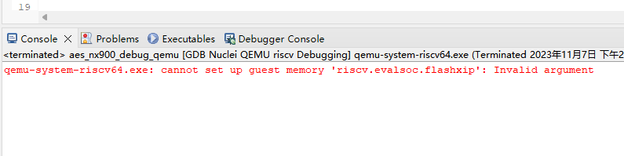

# Failure to Start QEMU in Nuclei Studio Due to Insufficient Memory

## Problem Description

During actual development, it has been observed that when many processes are running on the computer at the same time, or when the computer's system memory is insufficient, the following error may occur when debugging a program with QEMU in Nuclei Studio:

```
qemu-system-riscv64.exe: cannot set up quest memory 'riscv.evalsoc.flashxip' Invalid argument
```



## Solution

In general, this problem can be resolved by closing some applications to free up memory for QEMU to use.
