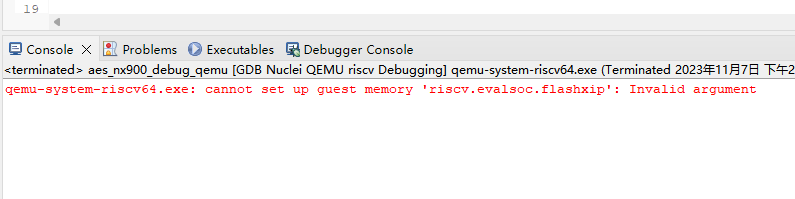

# 因内存不足，导致在Nuclei Studio中使用qemu失败
在实际生产中发现，因电脑同时运行了很多的进程或者电脑本身的系统内存不足，致使在Nuclei Studio中，使用qemu进行程序调试时，出现报错:
```
gemu-system-riscv64.exe: cannot set up quest memory 'riscv.evalsoc.flashxip' Invalid argument
```

一般可以通过关闭某些应用，释放一部分内存以供qemu使用，即可解决些问题。