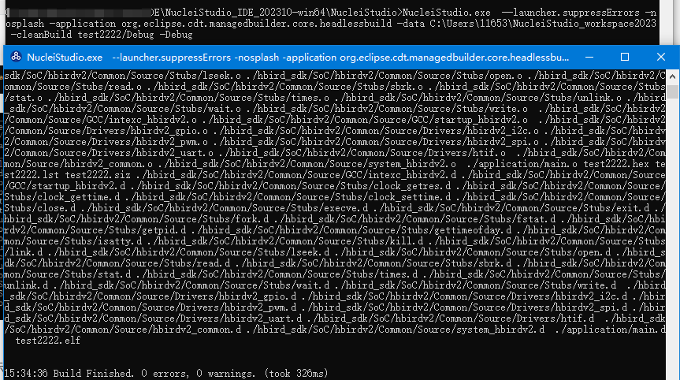

# Compiling Projects from the Command Line in Nuclei Studio

## Problem Description

Many customers ask how to use the IDE's headless mode in Nuclei Studio to build and compile projects.

## Solution

> When running any command line that starts with ``NucleiStudio.exe``, a pop-up window appears showing the execution log. To suppress this pop-up, change the command to ``eclipsec.exe``

> The following documentation was tested with the **2024.06** version of the IDE and is provided as supplementary information.

Because NucleiStudio 2024.06 runs on a Java 21 environment, and many users do not have a Java 21 environment installed locally, running the command may fail with an error because the corresponding JRE cannot be found. To resolve this issue, you can either install a Java 21 environment on your local machine (users can search for relevant installation tutorials themselves), or use the `-vm` parameter on the command line to specify the path of the JRE bundled with NucleiStudio 2024.06.

~~~shell
NucleiStudio.exe -vm "<user_nucleistudio_path>/plugins/org.eclipse.justj.openjdk.hotspot.jre.full.win32.x86_64_21.0.3.v20240426-1530/jre/bin" --launcher.suppressErrors -nosplash -application org.eclipse.cdt.managedbuilder.core.headlessbuild -data C:\NucleiStudio_workspace -cleanBuild test/Debug -Debug
~~~

The following is a set of commands for batch importing and batch building projects

Create a workspace and batch import projects

~~~shell
NucleiStudio.exe -vm "<user_nucleistudio_path>/plugins/org.eclipse.justj.openjdk.hotspot.jre.full.win32.x86_64_21.0.3.v20240426-1530/jre/bin"  --launcher.suppressErrors -noSplash -application org.eclipse.cdt.managedbuilder.core.headlessbuild -data $CI_PROJECT_DIR -importAll $CI_PROJECT_DIR
~~~

Build the imported projects

~~~shell
NucleiStudio.exe -vm "<user_nucleistudio_path>/plugins/org.eclipse.justj.openjdk.hotspot.jre.full.win32.x86_64_21.0.3.v20240426-1530/jre/bin" --launcher.suppressErrors -noSplash -application org.eclipse.cdt.managedbuilder.core.headlessbuild -data $CI_PROJECT_DIR -build ${TARGET_PHASE}_Project/Debug
~~~

> The following documentation was tested with the **2023.10** version of the IDE; other versions may require some adjustments to work properly.

Nuclei Studio is a graphical (GUI) code editing tool, but in certain scenarios users need to build projects quickly from the command line.
In Nuclei Studio, this can be done with a single command. After downloading Nuclei Studio, make sure the project `test` to be built has already been created in the Nuclei Studio workspace,
**and that Nuclei Studio is not running**, then execute the following command to build the project.

> **Note**: Make sure the NucleiStudio PATH has been added to the system, so that `NucleiStudio.exe`/`NucleiStudio` can be executed.
 
> **The following example uses Windows**

~~~shell
NucleiStudio.exe --launcher.suppressErrors -nosplash -application org.eclipse.cdt.managedbuilder.core.headlessbuild -data C:\NucleiStudio_workspace -cleanBuild test/Debug -Debug
~~~

> `--launcher.suppressErrors` is used to suppress the Eclipse error pop-up window when a build error occurs.

If you need to use the **2022.12 version** of the IDE, you must first add the paths of `gcc/bin` and `build-tools/bin` under the toolchain directory to the system PATH, and then replace `NucleiStudio.exe` with `eclipsec.exe`

For the **2022.12 version**, the example commands are as follows:

~~~shell
# Change this to your own IDE path
set NSIDE=D:\NucleiStudio_IDE_202212-win64\NucleiStudio
# The system PATH must be set correctly
set PATH=%NSIDE%\toolchain\gcc\bin;%NSIDE%\toolchain\build-tools\bin;%PATH%
# Note that NucleiStudio.exe is replaced with eclipsec.exe
%NSIDE%\eclipsec.exe --launcher.suppressErrors -nosplash -application org.eclipse.cdt.managedbuilder.core.headlessbuild -data C:\NucleiStudio_workspace -cleanBuild test/Debug
~~~

> The example command for the **2023.10** version opens an additional command-line window for output.

- `NucleiStudio.exe`: This is the Nuclei Studio launcher application, located in the Nuclei Studio installation directory.
- `--launcher.suppressErrors`: This parameter is used to suppress error messages when Nuclei Studio starts.
- `-nosplash`: This parameter disables the splash screen at startup. This means no brief loading screen is displayed when Eclipse starts.
- `-application`: This parameter specifies the application to run. Here, `org.eclipse.cdt.managedbuilder.core.headlessbuild`
   refers to the headless build application. This application performs build operations without a graphical user interface (GUI).
- `-data`: This parameter specifies the workspace path. It tells Nuclei Studio where to store data, such as workspaces, projects, and files.
- `-build`: This parameter specifies the project to build; `test/Debug` means building the Debug configuration of the test project;
   projects created by Nuclei Studio generally have two configurations, Debug and Release. If no configuration is specified, both Debug and Release are built by default,
   and you can see the Debug and Release directories under the project directory after the build.

~~~
    ├─.settings
    ├─application
    ├─Debug
    │  ├─application
    │  └─nuclei_sdk
    ├─nuclei_sdk
    └─Release
        ├─application
        └─nuclei_sdk
~~~

- `-cleanBuild`: This parameter is similar to `-build`, except that it cleans the workspace before building. Using `-cleanBuild` is recommended.
- `-Debug`: This parameter specifies that the build process runs in Debug mode, outputting detailed build logs during compilation. Without this parameter, the command runs silently with no output.

**The following is the output of the example command above, for reference**

~~~
17:00:17 **** Clean-only build of configuration Debug for project test ****
make -j8 clean
rm -rf ./nuclei_sdk/SoC/evalsoc/Common/Source/Stubs/newlib/chown.o ./nuclei_sdk/SoC/evalsoc/Common/Source/Stubs/newlib/clock_getres.o ./nuclei_sdk/SoC/evalsoc/Common/Source/Stubs/newlib/clock_gettime.o ./nuclei_sdk/SoC/evalsoc/Common/Source/Stubs/newlib/clock_settime.o ./nuclei_sdk/SoC/evalsoc/Common/Source/Stubs/newlib/close.o ./nuclei_sdk/SoC/evalsoc/Common/Source/Stubs/newlib/environ.o ./nuclei_sdk/SoC/evalsoc/Common/Source/Stubs/newlib/errno.o ./nuclei_sdk/SoC/evalsoc/Common/Source/Stubs/newlib/execve.o ./nuclei_sdk/SoC/evalsoc/Common/Source/Stubs/newlib/exit.o ./nuclei_sdk/SoC/evalsoc/Common/Source/Stubs/newlib/fork.o ./nuclei_sdk/SoC/evalsoc/Common/Source/Stubs/newlib/fstat.o ./nuclei_sdk/SoC/evalsoc/Common/Source/Stubs/newlib/getpid.o ./nuclei_sdk/SoC/evalsoc/Common/Source/Stubs/newlib/gettimeofday.o ./nuclei_sdk/SoC/evalsoc/Common/Source/Stubs/newlib/isatty.o ./nuclei_sdk/SoC/evalsoc/Common/Source/Stubs/newlib/kill.o ./nuclei_sdk/SoC/evalsoc/Common/Source/Stubs/newlib/link.o ./nuclei_sdk/SoC/evalsoc/Common/Source/Stubs/newlib/lseek.o ./nuclei_sdk/SoC/evalsoc/Common/Source/Stubs/newlib/open.o ./nuclei_sdk/SoC/evalsoc/Common/Source/Stubs/newlib/read.o ./nuclei_sdk/SoC/evalsoc/Common/Source/Stubs/newlib/readlink.o ./nuclei_sdk/SoC/evalsoc/Common/Source/Stubs/newlib/sbrk.o ./nuclei_sdk/SoC/evalsoc/Common/Source/Stubs/newlib/stat.o ./nuclei_sdk/SoC/evalsoc/Common/Source/Stubs/newlib/symlink.o ./nuclei_sdk/SoC/evalsoc/Common/Source/Stubs/newlib/times.o ./nuclei_sdk/SoC/evalsoc/Common/Source/Stubs/newlib/unlink.o ./nuclei_sdk/SoC/evalsoc/Common/Source/Stubs/newlib/wait.o ./nuclei_sdk/SoC/evalsoc/Common/Source/Stubs/newlib/write.o  ./nuclei_sdk/SoC/evalsoc/Common/Source/GCC/intexc_evalsoc.o ./nuclei_sdk/SoC/evalsoc/Common/Source/GCC/intexc_evalsoc_s.o ./nuclei_sdk/SoC/evalsoc/Common/Source/GCC/startup_evalsoc.o  ./nuclei_sdk/SoC/evalsoc/Common/Source/Drivers/evalsoc_uart.o  ./nuclei_sdk/SoC/evalsoc/Common/Source/evalsoc_common.o ./nuclei_sdk/SoC/evalsoc/Common/Source/system_evalsoc.o  ./application/main.o test.hex test.lst test.siz ./nuclei_sdk/SoC/evalsoc/Common/Source/GCC/intexc_evalsoc.d ./nuclei_sdk/SoC/evalsoc/Common/Source/GCC/intexc_evalsoc_s.d ./nuclei_sdk/SoC/evalsoc/Common/Source/GCC/startup_evalsoc.d ./nuclei_sdk/SoC/evalsoc/Common/Source/Stubs/newlib/chown.d ./nuclei_sdk/SoC/evalsoc/Common/Source/Stubs/newlib/clock_getres.d ./nuclei_sdk/SoC/evalsoc/Common/Source/Stubs/newlib/clock_gettime.d ./nuclei_sdk/SoC/evalsoc/Common/Source/Stubs/newlib/clock_settime.d ./nuclei_sdk/SoC/evalsoc/Common/Source/Stubs/newlib/close.d ./nuclei_sdk/SoC/evalsoc/Common/Source/Stubs/newlib/environ.d ./nuclei_sdk/SoC/evalsoc/Common/Source/Stubs/newlib/errno.d ./nuclei_sdk/SoC/evalsoc/Common/Source/Stubs/newlib/execve.d ./nuclei_sdk/SoC/evalsoc/Common/Source/Stubs/newlib/exit.d ./nuclei_sdk/SoC/evalsoc/Common/Source/Stubs/newlib/fork.d ./nuclei_sdk/SoC/evalsoc/Common/Source/Stubs/newlib/fstat.d ./nuclei_sdk/SoC/evalsoc/Common/Source/Stubs/newlib/getpid.d ./nuclei_sdk/SoC/evalsoc/Common/Source/Stubs/newlib/gettimeofday.d ./nuclei_sdk/SoC/evalsoc/Common/Source/Stubs/newlib/isatty.d ./nuclei_sdk/SoC/evalsoc/Common/Source/Stubs/newlib/kill.d ./nuclei_sdk/SoC/evalsoc/Common/Source/Stubs/newlib/link.d ./nuclei_sdk/SoC/evalsoc/Common/Source/Stubs/newlib/lseek.d ./nuclei_sdk/SoC/evalsoc/Common/Source/Stubs/newlib/open.d ./nuclei_sdk/SoC/evalsoc/Common/Source/Stubs/newlib/read.d ./nuclei_sdk/SoC/evalsoc/Common/Source/Stubs/newlib/readlink.d ./nuclei_sdk/SoC/evalsoc/Common/Source/Stubs/newlib/sbrk.d ./nuclei_sdk/SoC/evalsoc/Common/Source/Stubs/newlib/stat.d ./nuclei_sdk/SoC/evalsoc/Common/Source/Stubs/newlib/symlink.d ./nuclei_sdk/SoC/evalsoc/Common/Source/Stubs/newlib/times.d ./nuclei_sdk/SoC/evalsoc/Common/Source/Stubs/newlib/unlink.d ./nuclei_sdk/SoC/evalsoc/Common/Source/Stubs/newlib/wait.d ./nuclei_sdk/SoC/evalsoc/Common/Source/Stubs/newlib/write.d  ./nuclei_sdk/SoC/evalsoc/Common/Source/Drivers/evalsoc_uart.d  ./nuclei_sdk/SoC/evalsoc/Common/Source/evalsoc_common.d ./nuclei_sdk/SoC/evalsoc/Common/Source/system_evalsoc.d  ./application/main.d  test.elf

17:00:17 Build Finished. 0 errors, 0 warnings. (took 371ms)

17:00:18 **** Build of configuration Debug for project test ****
make -j8 all
Building file: ../nuclei_sdk/SoC/evalsoc/Common/Source/Stubs/newlib/chown.c
Building file: ../nuclei_sdk/SoC/evalsoc/Common/Source/Stubs/newlib/clock_getres.c
Building file: ../nuclei_sdk/SoC/evalsoc/Common/Source/Stubs/newlib/clock_gettime.c
Invoking: GNU RISC-V Cross C Compiler
Invoking: GNU RISC-V Cross C Compiler
riscv64-unknown-elf-gcc -march=rv32imafdc -mabi=ilp32d -mtune=nuclei-300-series -mcmodel=medlow -msave-restore -isystem=/include/newlib-nano -O2 -ffunction-sections -fdata-sections -fno-common -g -D__IDE_RV_CORE=n307fd -DBOOT_HARTID=0 -DRUNMODE_IC_EN=0 -DRUNMODE_DC_EN=0 -DRUNMODE_CCM_EN=0 -DDOWNLOAD_MODE=DOWNLOAD_MODE_ILM -DDOWNLOAD_MODE_STRING=\"ILM\" -I"C:\NucleiStudio_workspace\test\nuclei_sdk\NMSIS\Core\Include" -I"C:\NucleiStudio_workspace\test\nuclei_sdk\SoC\evalsoc\Common\Include" -I"C:\NucleiStudio_workspace\test\nuclei_sdk\SoC\evalsoc\Board\nuclei_fpga_eval\Include" -I"C:\NucleiStudio_workspace\test\application" -std=gnu11 -MMD -MP -MF"nuclei_sdk/SoC/evalsoc/Common/Source/Stubs/newlib/chown.d" -MT"nuclei_sdk/SoC/evalsoc/Common/Source/Stubs/newlib/chown.o" -c -o "nuclei_sdk/SoC/evalsoc/Common/Source/Stubs/newlib/chown.o" "../nuclei_sdk/SoC/evalsoc/Common/Source/Stubs/newlib/chown.c"
Building file: ../nuclei_sdk/SoC/evalsoc/Common/Source/Stubs/newlib/clock_settime.c
riscv64-unknown-elf-gcc -march=rv32imafdc -mabi=ilp32d -mtune=nuclei-300-series -mcmodel=medlow -msave-restore -isystem=/include/newlib-nano -O2 -ffunction-sections -fdata-sections -fno-common -g -D__IDE_RV_CORE=n307fd -DBOOT_HARTID=0 -DRUNMODE_IC_EN=0 -DRUNMODE_DC_EN=0 -DRUNMODE_CCM_EN=0 -DDOWNLOAD_MODE=DOWNLOAD_MODE_ILM -DDOWNLOAD_MODE_STRING=\"ILM\" -I"C:\NucleiStudio_workspace\test\nuclei_sdk\NMSIS\Core\Include" -I"C:\NucleiStudio_workspace\test\nuclei_sdk\SoC\evalsoc\Common\Include" -I"C:\NucleiStudio_workspace\test\nuclei_sdk\SoC\evalsoc\Board\nuclei_fpga_eval\Include" -I"C:\NucleiStudio_workspace\test\application" -std=gnu11 -MMD -MP -MF"nuclei_sdk/SoC/evalsoc/Common/Source/Stubs/newlib/clock_getres.d" -MT"nuclei_sdk/SoC/evalsoc/Common/Source/Stubs/newlib/clock_getres.o" -c -o "nuclei_sdk/SoC/evalsoc/Common/Source/Stubs/newlib/clock_getres.o" "../nuclei_sdk/SoC/evalsoc/Common/Source/Stubs/newlib/clock_getres.c"
Invoking: GNU RISC-V Cross C Compiler
riscv64-unknown-elf-gcc -march=rv32imafdc -mabi=ilp32d -mtune=nuclei-300-series -mcmodel=medlow -msave-restore -isystem=/include/newlib-nano -O2 -ffunction-sections -fdata-sections -fno-common -g -D__IDE_RV_CORE=n307fd -DBOOT_HARTID=0 -DRUNMODE_IC_EN=0 -DRUNMODE_DC_EN=0 -DRUNMODE_CCM_EN=0 -DDOWNLOAD_MODE=DOWNLOAD_MODE_ILM -DDOWNLOAD_MODE_STRING=\"ILM\" -I"C:\NucleiStudio_workspace\test\nuclei_sdk\NMSIS\Core\Include" -I"C:\NucleiStudio_workspace\test\nuclei_sdk\SoC\evalsoc\Common\Include" -I"C:\NucleiStudio_workspace\test\nuclei_sdk\SoC\evalsoc\Board\nuclei_fpga_eval\Include" -I"C:\NucleiStudio_workspace\test\application" -std=gnu11 -MMD -MP -MF"nuclei_sdk/SoC/evalsoc/Common/Source/Stubs/newlib/clock_gettime.d" -MT"nuclei_sdk/SoC/evalsoc/Common/Source/Stubs/newlib/clock_gettime.o" -c -o "nuclei_sdk/SoC/evalsoc/Common/Source/Stubs/newlib/clock_gettime.o" "../nuclei_sdk/SoC/evalsoc/Common/Source/Stubs/newlib/clock_gettime.c"
Invoking: GNU RISC-V Cross C Compiler
riscv64-unknown-elf-gcc -march=rv32imafdc -mabi=ilp32d -mtune=nuclei-300-series -mcmodel=medlow -msave-restore -isystem=/include/newlib-nano -O2 -ffunction-sections -fdata-sections -fno-common -g -D__IDE_RV_CORE=n307fd -DBOOT_HARTID=0 -DRUNMODE_IC_EN=0 -DRUNMODE_DC_EN=0 -DRUNMODE_CCM_EN=0 -DDOWNLOAD_MODE=DOWNLOAD_MODE_ILM -DDOWNLOAD_MODE_STRING=\"ILM\" -I"C:\NucleiStudio_workspace\test\nuclei_sdk\NMSIS\Core\Include" -I"C:\NucleiStudio_workspace\test\nuclei_sdk\SoC\evalsoc\Common\Include" -I"C:\NucleiStudio_workspace\test\nuclei_sdk\SoC\evalsoc\Board\nuclei_fpga_eval\Include" -I"C:\NucleiStudio_workspace\test\application" -std=gnu11 -MMD -MP -MF"nuclei_sdk/SoC/evalsoc/Common/Source/Stubs/newlib/clock_settime.d" -MT"nuclei_sdk/SoC/evalsoc/Common/Source/Stubs/newlib/clock_settime.o" -c -o "nuclei_sdk/SoC/evalsoc/Common/Source/Stubs/newlib/clock_settime.o" "../nuclei_sdk/SoC/evalsoc/Common/Source/Stubs/newlib/clock_settime.c"
Building file: ../nuclei_sdk/SoC/evalsoc/Common/Source/Stubs/newlib/close.c
Building file: ../nuclei_sdk/SoC/evalsoc/Common/Source/Stubs/newlib/environ.c
Invoking: GNU RISC-V Cross C Compiler
Building file: ../nuclei_sdk/SoC/evalsoc/Common/Source/Stubs/newlib/errno.c
Building file: ../nuclei_sdk/SoC/evalsoc/Common/Source/Stubs/newlib/execve.c
riscv64-unknown-elf-gcc -march=rv32imafdc -mabi=ilp32d -mtune=nuclei-300-series -mcmodel=medlow -msave-restore -isystem=/include/newlib-nano -O2 -ffunction-sections -fdata-sections -fno-common -g -D__IDE_RV_CORE=n307fd -DBOOT_HARTID=0 -DRUNMODE_IC_EN=0 -DRUNMODE_DC_EN=0 -DRUNMODE_CCM_EN=0 -DDOWNLOAD_MODE=DOWNLOAD_MODE_ILM -DDOWNLOAD_MODE_STRING=\"ILM\" -I"C:\NucleiStudio_workspace\test\nuclei_sdk\NMSIS\Core\Include" -I"C:\NucleiStudio_workspace\test\nuclei_sdk\SoC\evalsoc\Common\Include" -I"C:\NucleiStudio_workspace\test\nuclei_sdk\SoC\evalsoc\Board\nuclei_fpga_eval\Include" -I"C:\NucleiStudio_workspace\test\application" -std=gnu11 -MMD -MP -MF"nuclei_sdk/SoC/evalsoc/Common/Source/Stubs/newlib/close.d" -MT"nuclei_sdk/SoC/evalsoc/Common/Source/Stubs/newlib/close.o" -c -o "nuclei_sdk/SoC/evalsoc/Common/Source/Stubs/newlib/close.o" "../nuclei_sdk/SoC/evalsoc/Common/Source/Stubs/newlib/close.c"
Invoking: GNU RISC-V Cross C Compiler
riscv64-unknown-elf-gcc -march=rv32imafdc -mabi=ilp32d -mtune=nuclei-300-series -mcmodel=medlow -msave-restore -isystem=/include/newlib-nano -O2 -ffunction-sections -fdata-sections -fno-common -g -D__IDE_RV_CORE=n307fd -DBOOT_HARTID=0 -DRUNMODE_IC_EN=0 -DRUNMODE_DC_EN=0 -DRUNMODE_CCM_EN=0 -DDOWNLOAD_MODE=DOWNLOAD_MODE_ILM -DDOWNLOAD_MODE_STRING=\"ILM\" -I"C:\NucleiStudio_workspace\test\nuclei_sdk\NMSIS\Core\Include" -I"C:\NucleiStudio_workspace\test\nuclei_sdk\SoC\evalsoc\Common\Include" -I"C:\NucleiStudio_workspace\test\nuclei_sdk\SoC\evalsoc\Board\nuclei_fpga_eval\Include" -I"C:\NucleiStudio_workspace\test\application" -std=gnu11 -MMD -MP -MF"nuclei_sdk/SoC/evalsoc/Common/Source/Stubs/newlib/environ.d" -MT"nuclei_sdk/SoC/evalsoc/Common/Source/Stubs/newlib/environ.o" -c -o "nuclei_sdk/SoC/evalsoc/Common/Source/Stubs/newlib/environ.o" "../nuclei_sdk/SoC/evalsoc/Common/Source/Stubs/newlib/environ.c"
Invoking: GNU RISC-V Cross C Compiler
riscv64-unknown-elf-gcc -march=rv32imafdc -mabi=ilp32d -mtune=nuclei-300-series -mcmodel=medlow -msave-restore -isystem=/include/newlib-nano -O2 -ffunction-sections -fdata-sections -fno-common -g -D__IDE_RV_CORE=n307fd -DBOOT_HARTID=0 -DRUNMODE_IC_EN=0 -DRUNMODE_DC_EN=0 -DRUNMODE_CCM_EN=0 -DDOWNLOAD_MODE=DOWNLOAD_MODE_ILM -DDOWNLOAD_MODE_STRING=\"ILM\" -I"C:\NucleiStudio_workspace\test\nuclei_sdk\NMSIS\Core\Include" -I"C:\NucleiStudio_workspace\test\nuclei_sdk\SoC\evalsoc\Common\Include" -I"C:\NucleiStudio_workspace\test\nuclei_sdk\SoC\evalsoc\Board\nuclei_fpga_eval\Include" -I"C:\NucleiStudio_workspace\test\application" -std=gnu11 -MMD -MP -MF"nuclei_sdk/SoC/evalsoc/Common/Source/Stubs/newlib/errno.d" -MT"nuclei_sdk/SoC/evalsoc/Common/Source/Stubs/newlib/errno.o" -c -o "nuclei_sdk/SoC/evalsoc/Common/Source/Stubs/newlib/errno.o" "../nuclei_sdk/SoC/evalsoc/Common/Source/Stubs/newlib/errno.c"
Invoking: GNU RISC-V Cross C Compiler
riscv64-unknown-elf-gcc -march=rv32imafdc -mabi=ilp32d -mtune=nuclei-300-series -mcmodel=medlow -msave-restore -isystem=/include/newlib-nano -O2 -ffunction-sections -fdata-sections -fno-common -g -D__IDE_RV_CORE=n307fd -DBOOT_HARTID=0 -DRUNMODE_IC_EN=0 -DRUNMODE_DC_EN=0 -DRUNMODE_CCM_EN=0 -DDOWNLOAD_MODE=DOWNLOAD_MODE_ILM -DDOWNLOAD_MODE_STRING=\"ILM\" -I"C:\NucleiStudio_workspace\test\nuclei_sdk\NMSIS\Core\Include" -I"C:\NucleiStudio_workspace\test\nuclei_sdk\SoC\evalsoc\Common\Include" -I"C:\NucleiStudio_workspace\test\nuclei_sdk\SoC\evalsoc\Board\nuclei_fpga_eval\Include" -I"C:\NucleiStudio_workspace\test\application" -std=gnu11 -MMD -MP -MF"nuclei_sdk/SoC/evalsoc/Common/Source/Stubs/newlib/execve.d" -MT"nuclei_sdk/SoC/evalsoc/Common/Source/Stubs/newlib/execve.o" -c -o "nuclei_sdk/SoC/evalsoc/Common/Source/Stubs/newlib/execve.o" "../nuclei_sdk/SoC/evalsoc/Common/Source/Stubs/newlib/execve.c"
Finished building: ../nuclei_sdk/SoC/evalsoc/Common/Source/Stubs/newlib/environ.c
Finished building: ../nuclei_sdk/SoC/evalsoc/Common/Source/Stubs/newlib/chown.c
Finished building: ../nuclei_sdk/SoC/evalsoc/Common/Source/Stubs/newlib/clock_getres.c
Finished building: ../nuclei_sdk/SoC/evalsoc/Common/Source/Stubs/newlib/clock_settime.c
Finished building: ../nuclei_sdk/SoC/evalsoc/Common/Source/Stubs/newlib/close.c
Finished building: ../nuclei_sdk/SoC/evalsoc/Common/Source/Stubs/newlib/clock_gettime.c
Building file: ../nuclei_sdk/SoC/evalsoc/Common/Source/Stubs/newlib/exit.c
Building file: ../nuclei_sdk/SoC/evalsoc/Common/Source/Stubs/newlib/fork.c
Building file: ../nuclei_sdk/SoC/evalsoc/Common/Source/Stubs/newlib/fstat.c
Invoking: GNU RISC-V Cross C Compiler
Invoking: GNU RISC-V Cross C Compiler
riscv64-unknown-elf-gcc -march=rv32imafdc -mabi=ilp32d -mtune=nuclei-300-series -mcmodel=medlow -msave-restore -isystem=/include/newlib-nano -O2 -ffunction-sections -fdata-sections -fno-common -g -D__IDE_RV_CORE=n307fd -DBOOT_HARTID=0 -DRUNMODE_IC_EN=0 -DRUNMODE_DC_EN=0 -DRUNMODE_CCM_EN=0 -DDOWNLOAD_MODE=DOWNLOAD_MODE_ILM -DDOWNLOAD_MODE_STRING=\"ILM\" -I"C:\NucleiStudio_workspace\test\nuclei_sdk\NMSIS\Core\Include" -I"C:\NucleiStudio_workspace\test\nuclei_sdk\SoC\evalsoc\Common\Include" -I"C:\NucleiStudio_workspace\test\nuclei_sdk\SoC\evalsoc\Board\nuclei_fpga_eval\Include" -I"C:\NucleiStudio_workspace\test\application" -std=gnu11 -MMD -MP -MF"nuclei_sdk/SoC/evalsoc/Common/Source/Stubs/newlib/exit.d" -MT"nuclei_sdk/SoC/evalsoc/Common/Source/Stubs/newlib/exit.o" -c -o "nuclei_sdk/SoC/evalsoc/Common/Source/Stubs/newlib/exit.o" "../nuclei_sdk/SoC/evalsoc/Common/Source/Stubs/newlib/exit.c"
Building file: ../nuclei_sdk/SoC/evalsoc/Common/Source/Stubs/newlib/getpid.c
Invoking: GNU RISC-V Cross C Compiler
riscv64-unknown-elf-gcc -march=rv32imafdc -mabi=ilp32d -mtune=nuclei-300-series -mcmodel=medlow -msave-restore -isystem=/include/newlib-nano -O2 -ffunction-sections -fdata-sections -fno-common -g -D__IDE_RV_CORE=n307fd -DBOOT_HARTID=0 -DRUNMODE_IC_EN=0 -DRUNMODE_DC_EN=0 -DRUNMODE_CCM_EN=0 -DDOWNLOAD_MODE=DOWNLOAD_MODE_ILM -DDOWNLOAD_MODE_STRING=\"ILM\" -I"C:\NucleiStudio_workspace\test\nuclei_sdk\NMSIS\Core\Include" -I"C:\NucleiStudio_workspace\test\nuclei_sdk\SoC\evalsoc\Common\Include" -I"C:\NucleiStudio_workspace\test\nuclei_sdk\SoC\evalsoc\Board\nuclei_fpga_eval\Include" -I"C:\NucleiStudio_workspace\test\application" -std=gnu11 -MMD -MP -MF"nuclei_sdk/SoC/evalsoc/Common/Source/Stubs/newlib/fork.d" -MT"nuclei_sdk/SoC/evalsoc/Common/Source/Stubs/newlib/fork.o" -c -o "nuclei_sdk/SoC/evalsoc/Common/Source/Stubs/newlib/fork.o" "../nuclei_sdk/SoC/evalsoc/Common/Source/Stubs/newlib/fork.c"
Finished building: ../nuclei_sdk/SoC/evalsoc/Common/Source/Stubs/newlib/execve.c
riscv64-unknown-elf-gcc -march=rv32imafdc -mabi=ilp32d -mtune=nuclei-300-series -mcmodel=medlow -msave-restore -isystem=/include/newlib-nano -O2 -ffunction-sections -fdata-sections -fno-common -g -D__IDE_RV_CORE=n307fd -DBOOT_HARTID=0 -DRUNMODE_IC_EN=0 -DRUNMODE_DC_EN=0 -DRUNMODE_CCM_EN=0 -DDOWNLOAD_MODE=DOWNLOAD_MODE_ILM -DDOWNLOAD_MODE_STRING=\"ILM\" -I"C:\NucleiStudio_workspace\test\nuclei_sdk\NMSIS\Core\Include" -I"C:\NucleiStudio_workspace\test\nuclei_sdk\SoC\evalsoc\Common\Include" -I"C:\NucleiStudio_workspace\test\nuclei_sdk\SoC\evalsoc\Board\nuclei_fpga_eval\Include" -I"C:\NucleiStudio_workspace\test\application" -std=gnu11 -MMD -MP -MF"nuclei_sdk/SoC/evalsoc/Common/Source/Stubs/newlib/fstat.d" -MT"nuclei_sdk/SoC/evalsoc/Common/Source/Stubs/newlib/fstat.o" -c -o "nuclei_sdk/SoC/evalsoc/Common/Source/Stubs/newlib/fstat.o" "../nuclei_sdk/SoC/evalsoc/Common/Source/Stubs/newlib/fstat.c"
Invoking: GNU RISC-V Cross C Compiler

riscv64-unknown-elf-gcc -march=rv32imafdc -mabi=ilp32d -mtune=nuclei-300-series -mcmodel=medlow -msave-restore -isystem=/include/newlib-nano -O2 -ffunction-sections -fdata-sections -fno-common -g -D__IDE_RV_CORE=n307fd -DBOOT_HARTID=0 -DRUNMODE_IC_EN=0 -DRUNMODE_DC_EN=0 -DRUNMODE_CCM_EN=0 -DDOWNLOAD_MODE=DOWNLOAD_MODE_ILM -DDOWNLOAD_MODE_STRING=\"ILM\" -I"C:\NucleiStudio_workspace\test\nuclei_sdk\NMSIS\Core\Include" -I"C:\NucleiStudio_workspace\test\nuclei_sdk\SoC\evalsoc\Common\Include" -I"C:\NucleiStudio_workspace\test\nuclei_sdk\SoC\evalsoc\Board\nuclei_fpga_eval\Include" -I"C:\NucleiStudio_workspace\test\application" -std=gnu11 -MMD -MP -MF"nuclei_sdk/SoC/evalsoc/Common/Source/Stubs/newlib/getpid.d" -MT"nuclei_sdk/SoC/evalsoc/Common/Source/Stubs/newlib/getpid.o" -c -o "nuclei_sdk/SoC/evalsoc/Common/Source/Stubs/newlib/getpid.o" "../nuclei_sdk/SoC/evalsoc/Common/Source/Stubs/newlib/getpid.c"
Building file: ../nuclei_sdk/SoC/evalsoc/Common/Source/Stubs/newlib/gettimeofday.c
Building file: ../nuclei_sdk/SoC/evalsoc/Common/Source/Stubs/newlib/isatty.c
Invoking: GNU RISC-V Cross C Compiler
Building file: ../nuclei_sdk/SoC/evalsoc/Common/Source/Stubs/newlib/kill.c
riscv64-unknown-elf-gcc -march=rv32imafdc -mabi=ilp32d -mtune=nuclei-300-series -mcmodel=medlow -msave-restore -isystem=/include/newlib-nano -O2 -ffunction-sections -fdata-sections -fno-common -g -D__IDE_RV_CORE=n307fd -DBOOT_HARTID=0 -DRUNMODE_IC_EN=0 -DRUNMODE_DC_EN=0 -DRUNMODE_CCM_EN=0 -DDOWNLOAD_MODE=DOWNLOAD_MODE_ILM -DDOWNLOAD_MODE_STRING=\"ILM\" -I"C:\NucleiStudio_workspace\test\nuclei_sdk\NMSIS\Core\Include" -I"C:\NucleiStudio_workspace\test\nuclei_sdk\SoC\evalsoc\Common\Include" -I"C:\NucleiStudio_workspace\test\nuclei_sdk\SoC\evalsoc\Board\nuclei_fpga_eval\Include" -I"C:\NucleiStudio_workspace\test\application" -std=gnu11 -MMD -MP -MF"nuclei_sdk/SoC/evalsoc/Common/Source/Stubs/newlib/gettimeofday.d" -MT"nuclei_sdk/SoC/evalsoc/Common/Source/Stubs/newlib/gettimeofday.o" -c -o "nuclei_sdk/SoC/evalsoc/Common/Source/Stubs/newlib/gettimeofday.o" "../nuclei_sdk/SoC/evalsoc/Common/Source/Stubs/newlib/gettimeofday.c"
Invoking: GNU RISC-V Cross C Compiler
riscv64-unknown-elf-gcc -march=rv32imafdc -mabi=ilp32d -mtune=nuclei-300-series -mcmodel=medlow -msave-restore -isystem=/include/newlib-nano -O2 -ffunction-sections -fdata-sections -fno-common -g -D__IDE_RV_CORE=n307fd -DBOOT_HARTID=0 -DRUNMODE_IC_EN=0 -DRUNMODE_DC_EN=0 -DRUNMODE_CCM_EN=0 -DDOWNLOAD_MODE=DOWNLOAD_MODE_ILM -DDOWNLOAD_MODE_STRING=\"ILM\" -I"C:\NucleiStudio_workspace\test\nuclei_sdk\NMSIS\Core\Include" -I"C:\NucleiStudio_workspace\test\nuclei_sdk\SoC\evalsoc\Common\Include" -I"C:\NucleiStudio_workspace\test\nuclei_sdk\SoC\evalsoc\Board\nuclei_fpga_eval\Include" -I"C:\NucleiStudio_workspace\test\application" -std=gnu11 -MMD -MP -MF"nuclei_sdk/SoC/evalsoc/Common/Source/Stubs/newlib/isatty.d" -MT"nuclei_sdk/SoC/evalsoc/Common/Source/Stubs/newlib/isatty.o" -c -o "nuclei_sdk/SoC/evalsoc/Common/Source/Stubs/newlib/isatty.o" "../nuclei_sdk/SoC/evalsoc/Common/Source/Stubs/newlib/isatty.c"
Invoking: GNU RISC-V Cross C Compiler
riscv64-unknown-elf-gcc -march=rv32imafdc -mabi=ilp32d -mtune=nuclei-300-series -mcmodel=medlow -msave-restore -isystem=/include/newlib-nano -O2 -ffunction-sections -fdata-sections -fno-common -g -D__IDE_RV_CORE=n307fd -DBOOT_HARTID=0 -DRUNMODE_IC_EN=0 -DRUNMODE_DC_EN=0 -DRUNMODE_CCM_EN=0 -DDOWNLOAD_MODE=DOWNLOAD_MODE_ILM -DDOWNLOAD_MODE_STRING=\"ILM\" -I"C:\NucleiStudio_workspace\test\nuclei_sdk\NMSIS\Core\Include" -I"C:\NucleiStudio_workspace\test\nuclei_sdk\SoC\evalsoc\Common\Include" -I"C:\NucleiStudio_workspace\test\nuclei_sdk\SoC\evalsoc\Board\nuclei_fpga_eval\Include" -I"C:\NucleiStudio_workspace\test\application" -std=gnu11 -MMD -MP -MF"nuclei_sdk/SoC/evalsoc/Common/Source/Stubs/newlib/kill.d" -MT"nuclei_sdk/SoC/evalsoc/Common/Source/Stubs/newlib/kill.o" -c -o "nuclei_sdk/SoC/evalsoc/Common/Source/Stubs/newlib/kill.o" "../nuclei_sdk/SoC/evalsoc/Common/Source/Stubs/newlib/kill.c"
Finished building: ../nuclei_sdk/SoC/evalsoc/Common/Source/Stubs/newlib/exit.c

Finished building: ../nuclei_sdk/SoC/evalsoc/Common/Source/Stubs/newlib/errno.c
Finished building: ../nuclei_sdk/SoC/evalsoc/Common/Source/Stubs/newlib/fork.c
Building file: ../nuclei_sdk/SoC/evalsoc/Common/Source/Stubs/newlib/link.c

Building file: ../nuclei_sdk/SoC/evalsoc/Common/Source/Stubs/newlib/lseek.c
Invoking: GNU RISC-V Cross C Compiler
Finished building: ../nuclei_sdk/SoC/evalsoc/Common/Source/Stubs/newlib/gettimeofday.c
riscv64-unknown-elf-gcc -march=rv32imafdc -mabi=ilp32d -mtune=nuclei-300-series -mcmodel=medlow -msave-restore -isystem=/include/newlib-nano -O2 -ffunction-sections -fdata-sections -fno-common -g -D__IDE_RV_CORE=n307fd -DBOOT_HARTID=0 -DRUNMODE_IC_EN=0 -DRUNMODE_DC_EN=0 -DRUNMODE_CCM_EN=0 -DDOWNLOAD_MODE=DOWNLOAD_MODE_ILM -DDOWNLOAD_MODE_STRING=\"ILM\" -I"C:\NucleiStudio_workspace\test\nuclei_sdk\NMSIS\Core\Include" -I"C:\NucleiStudio_workspace\test\nuclei_sdk\SoC\evalsoc\Common\Include" -I"C:\NucleiStudio_workspace\test\nuclei_sdk\SoC\evalsoc\Board\nuclei_fpga_eval\Include" -I"C:\NucleiStudio_workspace\test\application" -std=gnu11 -MMD -MP -MF"nuclei_sdk/SoC/evalsoc/Common/Source/Stubs/newlib/link.d" -MT"nuclei_sdk/SoC/evalsoc/Common/Source/Stubs/newlib/link.o" -c -o "nuclei_sdk/SoC/evalsoc/Common/Source/Stubs/newlib/link.o" "../nuclei_sdk/SoC/evalsoc/Common/Source/Stubs/newlib/link.c"
Building file: ../nuclei_sdk/SoC/evalsoc/Common/Source/Stubs/newlib/open.c
Invoking: GNU RISC-V Cross C Compiler
riscv64-unknown-elf-gcc -march=rv32imafdc -mabi=ilp32d -mtune=nuclei-300-series -mcmodel=medlow -msave-restore -isystem=/include/newlib-nano -O2 -ffunction-sections -fdata-sections -fno-common -g -D__IDE_RV_CORE=n307fd -DBOOT_HARTID=0 -DRUNMODE_IC_EN=0 -DRUNMODE_DC_EN=0 -DRUNMODE_CCM_EN=0 -DDOWNLOAD_MODE=DOWNLOAD_MODE_ILM -DDOWNLOAD_MODE_STRING=\"ILM\" -I"C:\NucleiStudio_workspace\test\nuclei_sdk\NMSIS\Core\Include" -I"C:\NucleiStudio_workspace\test\nuclei_sdk\SoC\evalsoc\Common\Include" -I"C:\NucleiStudio_workspace\test\nuclei_sdk\SoC\evalsoc\Board\nuclei_fpga_eval\Include" -I"C:\NucleiStudio_workspace\test\application" -std=gnu11 -MMD -MP -MF"nuclei_sdk/SoC/evalsoc/Common/Source/Stubs/newlib/lseek.d" -MT"nuclei_sdk/SoC/evalsoc/Common/Source/Stubs/newlib/lseek.o" -c -o "nuclei_sdk/SoC/evalsoc/Common/Source/Stubs/newlib/lseek.o" "../nuclei_sdk/SoC/evalsoc/Common/Source/Stubs/newlib/lseek.c"

Invoking: GNU RISC-V Cross C Compiler
riscv64-unknown-elf-gcc -march=rv32imafdc -mabi=ilp32d -mtune=nuclei-300-series -mcmodel=medlow -msave-restore -isystem=/include/newlib-nano -O2 -ffunction-sections -fdata-sections -fno-common -g -D__IDE_RV_CORE=n307fd -DBOOT_HARTID=0 -DRUNMODE_IC_EN=0 -DRUNMODE_DC_EN=0 -DRUNMODE_CCM_EN=0 -DDOWNLOAD_MODE=DOWNLOAD_MODE_ILM -DDOWNLOAD_MODE_STRING=\"ILM\" -I"C:\NucleiStudio_workspace\test\nuclei_sdk\NMSIS\Core\Include" -I"C:\NucleiStudio_workspace\test\nuclei_sdk\SoC\evalsoc\Common\Include" -I"C:\NucleiStudio_workspace\test\nuclei_sdk\SoC\evalsoc\Board\nuclei_fpga_eval\Include" -I"C:\NucleiStudio_workspace\test\application" -std=gnu11 -MMD -MP -MF"nuclei_sdk/SoC/evalsoc/Common/Source/Stubs/newlib/open.d" -MT"nuclei_sdk/SoC/evalsoc/Common/Source/Stubs/newlib/open.o" -c -o "nuclei_sdk/SoC/evalsoc/Common/Source/Stubs/newlib/open.o" "../nuclei_sdk/SoC/evalsoc/Common/Source/Stubs/newlib/open.c"
Building file: ../nuclei_sdk/SoC/evalsoc/Common/Source/Stubs/newlib/read.c
Finished building: ../nuclei_sdk/SoC/evalsoc/Common/Source/Stubs/newlib/kill.c
Finished building: ../nuclei_sdk/SoC/evalsoc/Common/Source/Stubs/newlib/getpid.c
Invoking: GNU RISC-V Cross C Compiler
riscv64-unknown-elf-gcc -march=rv32imafdc -mabi=ilp32d -mtune=nuclei-300-series -mcmodel=medlow -msave-restore -isystem=/include/newlib-nano -O2 -ffunction-sections -fdata-sections -fno-common -g -D__IDE_RV_CORE=n307fd -DBOOT_HARTID=0 -DRUNMODE_IC_EN=0 -DRUNMODE_DC_EN=0 -DRUNMODE_CCM_EN=0 -DDOWNLOAD_MODE=DOWNLOAD_MODE_ILM -DDOWNLOAD_MODE_STRING=\"ILM\" -I"C:\NucleiStudio_workspace\test\nuclei_sdk\NMSIS\Core\Include" -I"C:\NucleiStudio_workspace\test\nuclei_sdk\SoC\evalsoc\Common\Include" -I"C:\NucleiStudio_workspace\test\nuclei_sdk\SoC\evalsoc\Board\nuclei_fpga_eval\Include" -I"C:\NucleiStudio_workspace\test\application" -std=gnu11 -MMD -MP -MF"nuclei_sdk/SoC/evalsoc/Common/Source/Stubs/newlib/read.d" -MT"nuclei_sdk/SoC/evalsoc/Common/Source/Stubs/newlib/read.o" -c -o "nuclei_sdk/SoC/evalsoc/Common/Source/Stubs/newlib/read.o" "../nuclei_sdk/SoC/evalsoc/Common/Source/Stubs/newlib/read.c"

Building file: ../nuclei_sdk/SoC/evalsoc/Common/Source/Stubs/newlib/readlink.c
Building file: ../nuclei_sdk/SoC/evalsoc/Common/Source/Stubs/newlib/sbrk.c
Invoking: GNU RISC-V Cross C Compiler
riscv64-unknown-elf-gcc -march=rv32imafdc -mabi=ilp32d -mtune=nuclei-300-series -mcmodel=medlow -msave-restore -isystem=/include/newlib-nano -O2 -ffunction-sections -fdata-sections -fno-common -g -D__IDE_RV_CORE=n307fd -DBOOT_HARTID=0 -DRUNMODE_IC_EN=0 -DRUNMODE_DC_EN=0 -DRUNMODE_CCM_EN=0 -DDOWNLOAD_MODE=DOWNLOAD_MODE_ILM -DDOWNLOAD_MODE_STRING=\"ILM\" -I"C:\NucleiStudio_workspace\test\nuclei_sdk\NMSIS\Core\Include" -I"C:\NucleiStudio_workspace\test\nuclei_sdk\SoC\evalsoc\Common\Include" -I"C:\NucleiStudio_workspace\test\nuclei_sdk\SoC\evalsoc\Board\nuclei_fpga_eval\Include" -I"C:\NucleiStudio_workspace\test\application" -std=gnu11 -MMD -MP -MF"nuclei_sdk/SoC/evalsoc/Common/Source/Stubs/newlib/readlink.d" -MT"nuclei_sdk/SoC/evalsoc/Common/Source/Stubs/newlib/readlink.o" -c -o "nuclei_sdk/SoC/evalsoc/Common/Source/Stubs/newlib/readlink.o" "../nuclei_sdk/SoC/evalsoc/Common/Source/Stubs/newlib/readlink.c"
Invoking: GNU RISC-V Cross C Compiler
riscv64-unknown-elf-gcc -march=rv32imafdc -mabi=ilp32d -mtune=nuclei-300-series -mcmodel=medlow -msave-restore -isystem=/include/newlib-nano -O2 -ffunction-sections -fdata-sections -fno-common -g -D__IDE_RV_CORE=n307fd -DBOOT_HARTID=0 -DRUNMODE_IC_EN=0 -DRUNMODE_DC_EN=0 -DRUNMODE_CCM_EN=0 -DDOWNLOAD_MODE=DOWNLOAD_MODE_ILM -DDOWNLOAD_MODE_STRING=\"ILM\" -I"C:\NucleiStudio_workspace\test\nuclei_sdk\NMSIS\Core\Include" -I"C:\NucleiStudio_workspace\test\nuclei_sdk\SoC\evalsoc\Common\Include" -I"C:\NucleiStudio_workspace\test\nuclei_sdk\SoC\evalsoc\Board\nuclei_fpga_eval\Include" -I"C:\NucleiStudio_workspace\test\application" -std=gnu11 -MMD -MP -MF"nuclei_sdk/SoC/evalsoc/Common/Source/Stubs/newlib/sbrk.d" -MT"nuclei_sdk/SoC/evalsoc/Common/Source/Stubs/newlib/sbrk.o" -c -o "nuclei_sdk/SoC/evalsoc/Common/Source/Stubs/newlib/sbrk.o" "../nuclei_sdk/SoC/evalsoc/Common/Source/Stubs/newlib/sbrk.c"
Finished building: ../nuclei_sdk/SoC/evalsoc/Common/Source/Stubs/newlib/isatty.c

Finished building: ../nuclei_sdk/SoC/evalsoc/Common/Source/Stubs/newlib/fstat.c
Finished building: ../nuclei_sdk/SoC/evalsoc/Common/Source/Stubs/newlib/link.c
Finished building: ../nuclei_sdk/SoC/evalsoc/Common/Source/Stubs/newlib/lseek.c
Finished building: ../nuclei_sdk/SoC/evalsoc/Common/Source/Stubs/newlib/read.c

Building file: ../nuclei_sdk/SoC/evalsoc/Common/Source/Stubs/newlib/stat.c

Building file: ../nuclei_sdk/SoC/evalsoc/Common/Source/Stubs/newlib/symlink.c
Building file: ../nuclei_sdk/SoC/evalsoc/Common/Source/Stubs/newlib/times.c
Invoking: GNU RISC-V Cross C Compiler
Building file: ../nuclei_sdk/SoC/evalsoc/Common/Source/Stubs/newlib/unlink.c
riscv64-unknown-elf-gcc -march=rv32imafdc -mabi=ilp32d -mtune=nuclei-300-series -mcmodel=medlow -msave-restore -isystem=/include/newlib-nano -O2 -ffunction-sections -fdata-sections -fno-common -g -D__IDE_RV_CORE=n307fd -DBOOT_HARTID=0 -DRUNMODE_IC_EN=0 -DRUNMODE_DC_EN=0 -DRUNMODE_CCM_EN=0 -DDOWNLOAD_MODE=DOWNLOAD_MODE_ILM -DDOWNLOAD_MODE_STRING=\"ILM\" -I"C:\NucleiStudio_workspace\test\nuclei_sdk\NMSIS\Core\Include" -I"C:\NucleiStudio_workspace\test\nuclei_sdk\SoC\evalsoc\Common\Include" -I"C:\NucleiStudio_workspace\test\nuclei_sdk\SoC\evalsoc\Board\nuclei_fpga_eval\Include" -I"C:\NucleiStudio_workspace\test\application" -std=gnu11 -MMD -MP -MF"nuclei_sdk/SoC/evalsoc/Common/Source/Stubs/newlib/stat.d" -MT"nuclei_sdk/SoC/evalsoc/Common/Source/Stubs/newlib/stat.o" -c -o "nuclei_sdk/SoC/evalsoc/Common/Source/Stubs/newlib/stat.o" "../nuclei_sdk/SoC/evalsoc/Common/Source/Stubs/newlib/stat.c"
Finished building: ../nuclei_sdk/SoC/evalsoc/Common/Source/Stubs/newlib/readlink.c
Invoking: GNU RISC-V Cross C Compiler
Invoking: GNU RISC-V Cross C Compiler
riscv64-unknown-elf-gcc -march=rv32imafdc -mabi=ilp32d -mtune=nuclei-300-series -mcmodel=medlow -msave-restore -isystem=/include/newlib-nano -O2 -ffunction-sections -fdata-sections -fno-common -g -D__IDE_RV_CORE=n307fd -DBOOT_HARTID=0 -DRUNMODE_IC_EN=0 -DRUNMODE_DC_EN=0 -DRUNMODE_CCM_EN=0 -DDOWNLOAD_MODE=DOWNLOAD_MODE_ILM -DDOWNLOAD_MODE_STRING=\"ILM\" -I"C:\NucleiStudio_workspace\test\nuclei_sdk\NMSIS\Core\Include" -I"C:\NucleiStudio_workspace\test\nuclei_sdk\SoC\evalsoc\Common\Include" -I"C:\NucleiStudio_workspace\test\nuclei_sdk\SoC\evalsoc\Board\nuclei_fpga_eval\Include" -I"C:\NucleiStudio_workspace\test\application" -std=gnu11 -MMD -MP -MF"nuclei_sdk/SoC/evalsoc/Common/Source/Stubs/newlib/symlink.d" -MT"nuclei_sdk/SoC/evalsoc/Common/Source/Stubs/newlib/symlink.o" -c -o "nuclei_sdk/SoC/evalsoc/Common/Source/Stubs/newlib/symlink.o" "../nuclei_sdk/SoC/evalsoc/Common/Source/Stubs/newlib/symlink.c"
Invoking: GNU RISC-V Cross C Compiler
riscv64-unknown-elf-gcc -march=rv32imafdc -mabi=ilp32d -mtune=nuclei-300-series -mcmodel=medlow -msave-restore -isystem=/include/newlib-nano -O2 -ffunction-sections -fdata-sections -fno-common -g -D__IDE_RV_CORE=n307fd -DBOOT_HARTID=0 -DRUNMODE_IC_EN=0 -DRUNMODE_DC_EN=0 -DRUNMODE_CCM_EN=0 -DDOWNLOAD_MODE=DOWNLOAD_MODE_ILM -DDOWNLOAD_MODE_STRING=\"ILM\" -I"C:\NucleiStudio_workspace\test\nuclei_sdk\NMSIS\Core\Include" -I"C:\NucleiStudio_workspace\test\nuclei_sdk\SoC\evalsoc\Common\Include" -I"C:\NucleiStudio_workspace\test\nuclei_sdk\SoC\evalsoc\Board\nuclei_fpga_eval\Include" -I"C:\NucleiStudio_workspace\test\application" -std=gnu11 -MMD -MP -MF"nuclei_sdk/SoC/evalsoc/Common/Source/Stubs/newlib/times.d" -MT"nuclei_sdk/SoC/evalsoc/Common/Source/Stubs/newlib/times.o" -c -o "nuclei_sdk/SoC/evalsoc/Common/Source/Stubs/newlib/times.o" "../nuclei_sdk/SoC/evalsoc/Common/Source/Stubs/newlib/times.c"
riscv64-unknown-elf-gcc -march=rv32imafdc -mabi=ilp32d -mtune=nuclei-300-series -mcmodel=medlow -msave-restore -isystem=/include/newlib-nano -O2 -ffunction-sections -fdata-sections -fno-common -g -D__IDE_RV_CORE=n307fd -DBOOT_HARTID=0 -DRUNMODE_IC_EN=0 -DRUNMODE_DC_EN=0 -DRUNMODE_CCM_EN=0 -DDOWNLOAD_MODE=DOWNLOAD_MODE_ILM -DDOWNLOAD_MODE_STRING=\"ILM\" -I"C:\NucleiStudio_workspace\test\nuclei_sdk\NMSIS\Core\Include" -I"C:\NucleiStudio_workspace\test\nuclei_sdk\SoC\evalsoc\Common\Include" -I"C:\NucleiStudio_workspace\test\nuclei_sdk\SoC\evalsoc\Board\nuclei_fpga_eval\Include" -I"C:\NucleiStudio_workspace\test\application" -std=gnu11 -MMD -MP -MF"nuclei_sdk/SoC/evalsoc/Common/Source/Stubs/newlib/unlink.d" -MT"nuclei_sdk/SoC/evalsoc/Common/Source/Stubs/newlib/unlink.o" -c -o "nuclei_sdk/SoC/evalsoc/Common/Source/Stubs/newlib/unlink.o" "../nuclei_sdk/SoC/evalsoc/Common/Source/Stubs/newlib/unlink.c"

Building file: ../nuclei_sdk/SoC/evalsoc/Common/Source/Stubs/newlib/wait.c
Building file: ../nuclei_sdk/SoC/evalsoc/Common/Source/Stubs/newlib/write.c
Finished building: ../nuclei_sdk/SoC/evalsoc/Common/Source/Stubs/newlib/sbrk.c
Invoking: GNU RISC-V Cross C Compiler
Invoking: GNU RISC-V Cross C Compiler

riscv64-unknown-elf-gcc -march=rv32imafdc -mabi=ilp32d -mtune=nuclei-300-series -mcmodel=medlow -msave-restore -isystem=/include/newlib-nano -O2 -ffunction-sections -fdata-sections -fno-common -g -D__IDE_RV_CORE=n307fd -DBOOT_HARTID=0 -DRUNMODE_IC_EN=0 -DRUNMODE_DC_EN=0 -DRUNMODE_CCM_EN=0 -DDOWNLOAD_MODE=DOWNLOAD_MODE_ILM -DDOWNLOAD_MODE_STRING=\"ILM\" -I"C:\NucleiStudio_workspace\test\nuclei_sdk\NMSIS\Core\Include" -I"C:\NucleiStudio_workspace\test\nuclei_sdk\SoC\evalsoc\Common\Include" -I"C:\NucleiStudio_workspace\test\nuclei_sdk\SoC\evalsoc\Board\nuclei_fpga_eval\Include" -I"C:\NucleiStudio_workspace\test\application" -std=gnu11 -MMD -MP -MF"nuclei_sdk/SoC/evalsoc/Common/Source/Stubs/newlib/wait.d" -MT"nuclei_sdk/SoC/evalsoc/Common/Source/Stubs/newlib/wait.o" -c -o "nuclei_sdk/SoC/evalsoc/Common/Source/Stubs/newlib/wait.o" "../nuclei_sdk/SoC/evalsoc/Common/Source/Stubs/newlib/wait.c"
riscv64-unknown-elf-gcc -march=rv32imafdc -mabi=ilp32d -mtune=nuclei-300-series -mcmodel=medlow -msave-restore -isystem=/include/newlib-nano -O2 -ffunction-sections -fdata-sections -fno-common -g -D__IDE_RV_CORE=n307fd -DBOOT_HARTID=0 -DRUNMODE_IC_EN=0 -DRUNMODE_DC_EN=0 -DRUNMODE_CCM_EN=0 -DDOWNLOAD_MODE=DOWNLOAD_MODE_ILM -DDOWNLOAD_MODE_STRING=\"ILM\" -I"C:\NucleiStudio_workspace\test\nuclei_sdk\NMSIS\Core\Include" -I"C:\NucleiStudio_workspace\test\nuclei_sdk\SoC\evalsoc\Common\Include" -I"C:\NucleiStudio_workspace\test\nuclei_sdk\SoC\evalsoc\Board\nuclei_fpga_eval\Include" -I"C:\NucleiStudio_workspace\test\application" -std=gnu11 -MMD -MP -MF"nuclei_sdk/SoC/evalsoc/Common/Source/Stubs/newlib/write.d" -MT"nuclei_sdk/SoC/evalsoc/Common/Source/Stubs/newlib/write.o" -c -o "nuclei_sdk/SoC/evalsoc/Common/Source/Stubs/newlib/write.o" "../nuclei_sdk/SoC/evalsoc/Common/Source/Stubs/newlib/write.c"
Building file: ../nuclei_sdk/SoC/evalsoc/Common/Source/GCC/intexc_evalsoc.S
Invoking: GNU RISC-V Cross Assembler
riscv64-unknown-elf-gcc -march=rv32imafdc -mabi=ilp32d -mtune=nuclei-300-series -mcmodel=medlow -msave-restore -isystem=/include/newlib-nano -O2 -ffunction-sections -fdata-sections -fno-common -g -x assembler-with-cpp -D__IDE_RV_CORE=n307fd -DBOOT_HARTID=0 -DRUNMODE_IC_EN=0 -DRUNMODE_DC_EN=0 -DRUNMODE_CCM_EN=0 -DDOWNLOAD_MODE=DOWNLOAD_MODE_ILM -DDOWNLOAD_MODE_STRING=\"ILM\" -I"C:\NucleiStudio_workspace\test\nuclei_sdk\NMSIS\Core\Include" -I"C:\NucleiStudio_workspace\test\nuclei_sdk\SoC\evalsoc\Common\Include" -I"C:\NucleiStudio_workspace\test\nuclei_sdk\SoC\evalsoc\Board\nuclei_fpga_eval\Include" -I"C:\NucleiStudio_workspace\test\application" -MMD -MP -MF"nuclei_sdk/SoC/evalsoc/Common/Source/GCC/intexc_evalsoc.d" -MT"nuclei_sdk/SoC/evalsoc/Common/Source/GCC/intexc_evalsoc.o" -c -o "nuclei_sdk/SoC/evalsoc/Common/Source/GCC/intexc_evalsoc.o" "../nuclei_sdk/SoC/evalsoc/Common/Source/GCC/intexc_evalsoc.S"
Finished building: ../nuclei_sdk/SoC/evalsoc/Common/Source/Stubs/newlib/unlink.c

Finished building: ../nuclei_sdk/SoC/evalsoc/Common/Source/Stubs/newlib/symlink.c
Building file: ../nuclei_sdk/SoC/evalsoc/Common/Source/GCC/intexc_evalsoc_s.S

Invoking: GNU RISC-V Cross Assembler
Building file: ../nuclei_sdk/SoC/evalsoc/Common/Source/GCC/startup_evalsoc.S
Finished building: ../nuclei_sdk/SoC/evalsoc/Common/Source/GCC/intexc_evalsoc.S
riscv64-unknown-elf-gcc -march=rv32imafdc -mabi=ilp32d -mtune=nuclei-300-series -mcmodel=medlow -msave-restore -isystem=/include/newlib-nano -O2 -ffunction-sections -fdata-sections -fno-common -g -x assembler-with-cpp -D__IDE_RV_CORE=n307fd -DBOOT_HARTID=0 -DRUNMODE_IC_EN=0 -DRUNMODE_DC_EN=0 -DRUNMODE_CCM_EN=0 -DDOWNLOAD_MODE=DOWNLOAD_MODE_ILM -DDOWNLOAD_MODE_STRING=\"ILM\" -I"C:\NucleiStudio_workspace\test\nuclei_sdk\NMSIS\Core\Include" -I"C:\NucleiStudio_workspace\test\nuclei_sdk\SoC\evalsoc\Common\Include" -I"C:\NucleiStudio_workspace\test\nuclei_sdk\SoC\evalsoc\Board\nuclei_fpga_eval\Include" -I"C:\NucleiStudio_workspace\test\application" -MMD -MP -MF"nuclei_sdk/SoC/evalsoc/Common/Source/GCC/intexc_evalsoc_s.d" -MT"nuclei_sdk/SoC/evalsoc/Common/Source/GCC/intexc_evalsoc_s.o" -c -o "nuclei_sdk/SoC/evalsoc/Common/Source/GCC/intexc_evalsoc_s.o" "../nuclei_sdk/SoC/evalsoc/Common/Source/GCC/intexc_evalsoc_s.S"
Finished building: ../nuclei_sdk/SoC/evalsoc/Common/Source/Stubs/newlib/open.c
Finished building: ../nuclei_sdk/SoC/evalsoc/Common/Source/Stubs/newlib/wait.c
Invoking: GNU RISC-V Cross Assembler

riscv64-unknown-elf-gcc -march=rv32imafdc -mabi=ilp32d -mtune=nuclei-300-series -mcmodel=medlow -msave-restore -isystem=/include/newlib-nano -O2 -ffunction-sections -fdata-sections -fno-common -g -x assembler-with-cpp -D__IDE_RV_CORE=n307fd -DBOOT_HARTID=0 -DRUNMODE_IC_EN=0 -DRUNMODE_DC_EN=0 -DRUNMODE_CCM_EN=0 -DDOWNLOAD_MODE=DOWNLOAD_MODE_ILM -DDOWNLOAD_MODE_STRING=\"ILM\" -I"C:\NucleiStudio_workspace\test\nuclei_sdk\NMSIS\Core\Include" -I"C:\NucleiStudio_workspace\test\nuclei_sdk\SoC\evalsoc\Common\Include" -I"C:\NucleiStudio_workspace\test\nuclei_sdk\SoC\evalsoc\Board\nuclei_fpga_eval\Include" -I"C:\NucleiStudio_workspace\test\application" -MMD -MP -MF"nuclei_sdk/SoC/evalsoc/Common/Source/GCC/startup_evalsoc.d" -MT"nuclei_sdk/SoC/evalsoc/Common/Source/GCC/startup_evalsoc.o" -c -o "nuclei_sdk/SoC/evalsoc/Common/Source/GCC/startup_evalsoc.o" "../nuclei_sdk/SoC/evalsoc/Common/Source/GCC/startup_evalsoc.S"
Building file: ../nuclei_sdk/SoC/evalsoc/Common/Source/Drivers/evalsoc_uart.c
Invoking: GNU RISC-V Cross C Compiler
Building file: ../nuclei_sdk/SoC/evalsoc/Common/Source/evalsoc_common.c
Building file: ../nuclei_sdk/SoC/evalsoc/Common/Source/system_evalsoc.c
riscv64-unknown-elf-gcc -march=rv32imafdc -mabi=ilp32d -mtune=nuclei-300-series -mcmodel=medlow -msave-restore -isystem=/include/newlib-nano -O2 -ffunction-sections -fdata-sections -fno-common -g -D__IDE_RV_CORE=n307fd -DBOOT_HARTID=0 -DRUNMODE_IC_EN=0 -DRUNMODE_DC_EN=0 -DRUNMODE_CCM_EN=0 -DDOWNLOAD_MODE=DOWNLOAD_MODE_ILM -DDOWNLOAD_MODE_STRING=\"ILM\" -I"C:\NucleiStudio_workspace\test\nuclei_sdk\NMSIS\Core\Include" -I"C:\NucleiStudio_workspace\test\nuclei_sdk\SoC\evalsoc\Common\Include" -I"C:\NucleiStudio_workspace\test\nuclei_sdk\SoC\evalsoc\Board\nuclei_fpga_eval\Include" -I"C:\NucleiStudio_workspace\test\application" -std=gnu11 -MMD -MP -MF"nuclei_sdk/SoC/evalsoc/Common/Source/Drivers/evalsoc_uart.d" -MT"nuclei_sdk/SoC/evalsoc/Common/Source/Drivers/evalsoc_uart.o" -c -o "nuclei_sdk/SoC/evalsoc/Common/Source/Drivers/evalsoc_uart.o" "../nuclei_sdk/SoC/evalsoc/Common/Source/Drivers/evalsoc_uart.c"
Invoking: GNU RISC-V Cross C Compiler
riscv64-unknown-elf-gcc -march=rv32imafdc -mabi=ilp32d -mtune=nuclei-300-series -mcmodel=medlow -msave-restore -isystem=/include/newlib-nano -O2 -ffunction-sections -fdata-sections -fno-common -g -D__IDE_RV_CORE=n307fd -DBOOT_HARTID=0 -DRUNMODE_IC_EN=0 -DRUNMODE_DC_EN=0 -DRUNMODE_CCM_EN=0 -DDOWNLOAD_MODE=DOWNLOAD_MODE_ILM -DDOWNLOAD_MODE_STRING=\"ILM\" -I"C:\NucleiStudio_workspace\test\nuclei_sdk\NMSIS\Core\Include" -I"C:\NucleiStudio_workspace\test\nuclei_sdk\SoC\evalsoc\Common\Include" -I"C:\NucleiStudio_workspace\test\nuclei_sdk\SoC\evalsoc\Board\nuclei_fpga_eval\Include" -I"C:\NucleiStudio_workspace\test\application" -std=gnu11 -MMD -MP -MF"nuclei_sdk/SoC/evalsoc/Common/Source/evalsoc_common.d" -MT"nuclei_sdk/SoC/evalsoc/Common/Source/evalsoc_common.o" -c -o "nuclei_sdk/SoC/evalsoc/Common/Source/evalsoc_common.o" "../nuclei_sdk/SoC/evalsoc/Common/Source/evalsoc_common.c"
Invoking: GNU RISC-V Cross C Compiler
riscv64-unknown-elf-gcc -march=rv32imafdc -mabi=ilp32d -mtune=nuclei-300-series -mcmodel=medlow -msave-restore -isystem=/include/newlib-nano -O2 -ffunction-sections -fdata-sections -fno-common -g -D__IDE_RV_CORE=n307fd -DBOOT_HARTID=0 -DRUNMODE_IC_EN=0 -DRUNMODE_DC_EN=0 -DRUNMODE_CCM_EN=0 -DDOWNLOAD_MODE=DOWNLOAD_MODE_ILM -DDOWNLOAD_MODE_STRING=\"ILM\" -I"C:\NucleiStudio_workspace\test\nuclei_sdk\NMSIS\Core\Include" -I"C:\NucleiStudio_workspace\test\nuclei_sdk\SoC\evalsoc\Common\Include" -I"C:\NucleiStudio_workspace\test\nuclei_sdk\SoC\evalsoc\Board\nuclei_fpga_eval\Include" -I"C:\NucleiStudio_workspace\test\application" -std=gnu11 -MMD -MP -MF"nuclei_sdk/SoC/evalsoc/Common/Source/system_evalsoc.d" -MT"nuclei_sdk/SoC/evalsoc/Common/Source/system_evalsoc.o" -c -o "nuclei_sdk/SoC/evalsoc/Common/Source/system_evalsoc.o" "../nuclei_sdk/SoC/evalsoc/Common/Source/system_evalsoc.c"
Finished building: ../nuclei_sdk/SoC/evalsoc/Common/Source/Stubs/newlib/stat.c
Finished building: ../nuclei_sdk/SoC/evalsoc/Common/Source/Stubs/newlib/write.c

Building file: ../application/main.c
Invoking: GNU RISC-V Cross C Compiler
riscv64-unknown-elf-gcc -march=rv32imafdc -mabi=ilp32d -mtune=nuclei-300-series -mcmodel=medlow -msave-restore -isystem=/include/newlib-nano -O2 -ffunction-sections -fdata-sections -fno-common -g -D__IDE_RV_CORE=n307fd -DBOOT_HARTID=0 -DRUNMODE_IC_EN=0 -DRUNMODE_DC_EN=0 -DRUNMODE_CCM_EN=0 -DDOWNLOAD_MODE=DOWNLOAD_MODE_ILM -DDOWNLOAD_MODE_STRING=\"ILM\" -I"C:\NucleiStudio_workspace\test\nuclei_sdk\NMSIS\Core\Include" -I"C:\NucleiStudio_workspace\test\nuclei_sdk\SoC\evalsoc\Common\Include" -I"C:\NucleiStudio_workspace\test\nuclei_sdk\SoC\evalsoc\Board\nuclei_fpga_eval\Include" -I"C:\NucleiStudio_workspace\test\application" -std=gnu11 -MMD -MP -MF"application/main.d" -MT"application/main.o" -c -o "application/main.o" "../application/main.c"
Finished building: ../nuclei_sdk/SoC/evalsoc/Common/Source/GCC/startup_evalsoc.S

Finished building: ../nuclei_sdk/SoC/evalsoc/Common/Source/Stubs/newlib/times.c

Finished building: ../nuclei_sdk/SoC/evalsoc/Common/Source/GCC/intexc_evalsoc_s.S

Finished building: ../nuclei_sdk/SoC/evalsoc/Common/Source/Drivers/evalsoc_uart.c

Finished building: ../nuclei_sdk/SoC/evalsoc/Common/Source/evalsoc_common.c

Finished building: ../nuclei_sdk/SoC/evalsoc/Common/Source/system_evalsoc.c

Finished building: ../application/main.c

Building target: test.elf
Invoking: GNU RISC-V Cross C++ Linker
riscv64-unknown-elf-g++ -march=rv32imafdc -mabi=ilp32d -mtune=nuclei-300-series -mcmodel=medlow -msave-restore -isystem=/include/newlib-nano -O2 -ffunction-sections -fdata-sections -fno-common -g -T "C:\NucleiStudio_workspace\test\nuclei_sdk\SoC\evalsoc\Board\nuclei_fpga_eval\Source\GCC\gcc_evalsoc_ilm.ld" -nostartfiles -nodefaultlibs -Xlinker --gc-sections -Wl,-Map,"test.map" -Wl,--check-sections -Wl,--no-warn-rwx-segments -u _isatty -u _write -u _sbrk -u _read -u _close -u _fstat -u _lseek -u errno -o "test.elf" ./nuclei_sdk/SoC/evalsoc/Common/Source/Stubs/newlib/chown.o ./nuclei_sdk/SoC/evalsoc/Common/Source/Stubs/newlib/clock_getres.o ./nuclei_sdk/SoC/evalsoc/Common/Source/Stubs/newlib/clock_gettime.o ./nuclei_sdk/SoC/evalsoc/Common/Source/Stubs/newlib/clock_settime.o ./nuclei_sdk/SoC/evalsoc/Common/Source/Stubs/newlib/close.o ./nuclei_sdk/SoC/evalsoc/Common/Source/Stubs/newlib/environ.o ./nuclei_sdk/SoC/evalsoc/Common/Source/Stubs/newlib/errno.o ./nuclei_sdk/SoC/evalsoc/Common/Source/Stubs/newlib/execve.o ./nuclei_sdk/SoC/evalsoc/Common/Source/Stubs/newlib/exit.o ./nuclei_sdk/SoC/evalsoc/Common/Source/Stubs/newlib/fork.o ./nuclei_sdk/SoC/evalsoc/Common/Source/Stubs/newlib/fstat.o ./nuclei_sdk/SoC/evalsoc/Common/Source/Stubs/newlib/getpid.o ./nuclei_sdk/SoC/evalsoc/Common/Source/Stubs/newlib/gettimeofday.o ./nuclei_sdk/SoC/evalsoc/Common/Source/Stubs/newlib/isatty.o ./nuclei_sdk/SoC/evalsoc/Common/Source/Stubs/newlib/kill.o ./nuclei_sdk/SoC/evalsoc/Common/Source/Stubs/newlib/link.o ./nuclei_sdk/SoC/evalsoc/Common/Source/Stubs/newlib/lseek.o ./nuclei_sdk/SoC/evalsoc/Common/Source/Stubs/newlib/open.o ./nuclei_sdk/SoC/evalsoc/Common/Source/Stubs/newlib/read.o ./nuclei_sdk/SoC/evalsoc/Common/Source/Stubs/newlib/readlink.o ./nuclei_sdk/SoC/evalsoc/Common/Source/Stubs/newlib/sbrk.o ./nuclei_sdk/SoC/evalsoc/Common/Source/Stubs/newlib/stat.o ./nuclei_sdk/SoC/evalsoc/Common/Source/Stubs/newlib/symlink.o ./nuclei_sdk/SoC/evalsoc/Common/Source/Stubs/newlib/times.o ./nuclei_sdk/SoC/evalsoc/Common/Source/Stubs/newlib/unlink.o ./nuclei_sdk/SoC/evalsoc/Common/Source/Stubs/newlib/wait.o ./nuclei_sdk/SoC/evalsoc/Common/Source/Stubs/newlib/write.o  ./nuclei_sdk/SoC/evalsoc/Common/Source/GCC/intexc_evalsoc.o ./nuclei_sdk/SoC/evalsoc/Common/Source/GCC/intexc_evalsoc_s.o ./nuclei_sdk/SoC/evalsoc/Common/Source/GCC/startup_evalsoc.o  ./nuclei_sdk/SoC/evalsoc/Common/Source/Drivers/evalsoc_uart.o  ./nuclei_sdk/SoC/evalsoc/Common/Source/evalsoc_common.o ./nuclei_sdk/SoC/evalsoc/Common/Source/system_evalsoc.o  ./application/main.o   -lstdc++ -lc_nano -lgcc
Finished building target: test.elf

Invoking: GNU RISC-V Cross Create Flash Image
riscv64-unknown-elf-objcopy -O ihex "test.elf"  "test.hex"
Invoking: GNU RISC-V Cross Create Listing
riscv64-unknown-elf-objdump --source --all-headers --demangle --line-numbers --wide "test.elf" > "test.lst"
Invoking: GNU RISC-V Cross Print Size
riscv64-unknown-elf-size --format=berkeley "test.elf"
   text	   data	    bss	    dec	    hex	filename
   8824	   1272	   4592	  14688	   3960	test.elf
Finished building: test.siz
Finished building: test.hex

Finished building: test.lst

17:00:23 Build Finished. 0 errors, 0 warnings. (took 5s.75ms)
~~~

The following are the parameters provided by `org.eclipse.cdt.managedbuilder.core.headlessbuild`, for reference.

~~~
   -data       {/path/to/workspace}
   -remove     {[uri:/]/path/to/project}
   -removeAll  {[uri:/]/path/to/projectTreeURI} Remove all projects under URI
   -import     {[uri:/]/path/to/project}
   -importAll  {[uri:/]/path/to/projectTreeURI} Import all projects under URI
   -build      {project_name_reg_ex{/config_reg_ex} | all}
   -cleanBuild {project_name_reg_ex{/config_reg_ex} | all}
   -markerType Marker types to fail build on {all | cdt | marker_id}
   -no-indexer Disable indexer
   -verbose    Verbose progress monitor updates
   -printErrorMarkers Print all error markers
   -I          {include_path} additional include_path to add to tools
   -include    {include_file} additional include_file to pass to tools
   -D          {prepoc_define} addition preprocessor defines to pass to the tools
   -E          {var=value} replace/add value to environment variable when running all tools
   -Ea         {var=value} append value to environment variable when running all tools
   -Ep         {var=value} prepend value to environment variable when running all tools
   -Er         {var} remove/unset the given environment variable
   -T          {toolid} {optionid=value} replace a tool option value in each configuration built
   -Ta         {toolid} {optionid=value} append to a tool option value in each configuration built
   -Tp         {toolid} {optionid=value} prepend to a tool option value in each configuration built
   -Tr         {toolid} {optionid=value} remove a tool option value in each configuration built
               Tool option values are parsed as a string, comma separated list of strings or a boolean based on the options type
~~~
