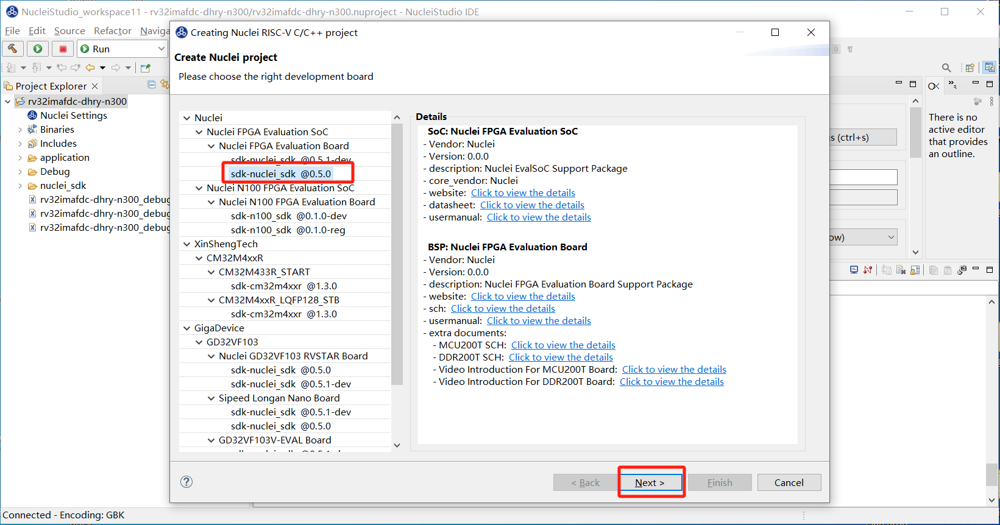
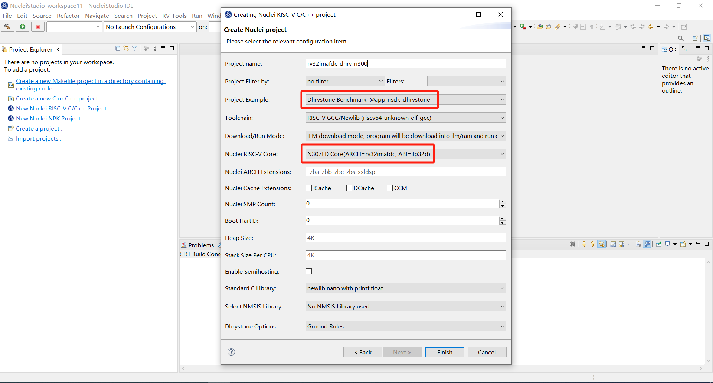
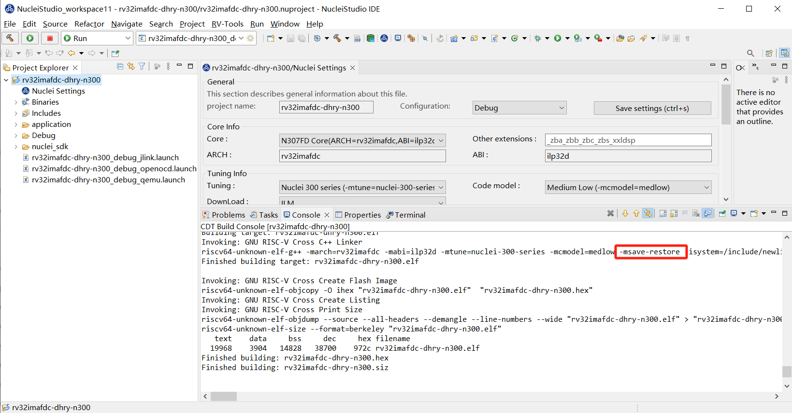
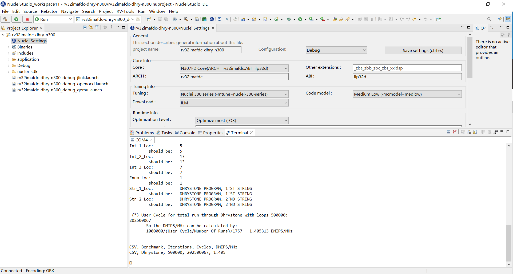
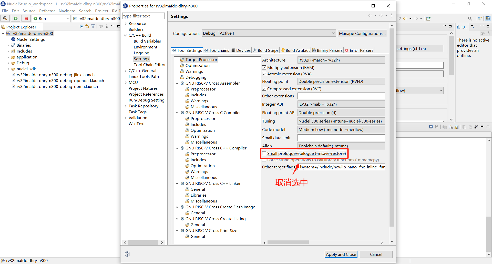
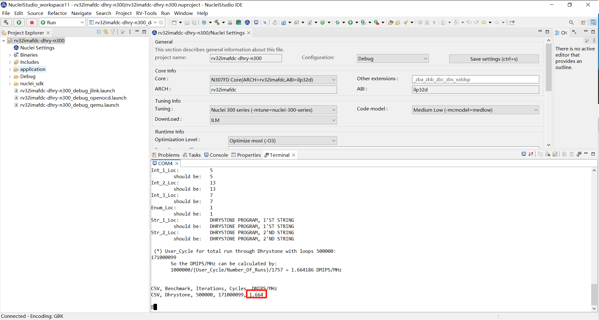

# 关于dhrystone在IDE上跑分和NSDK 0.5.0命令行跑分不一致的问题

## 问题说明

在0.5.0版本的sdk-nuclei_sdk中，为了IDE上使用libncrt库的时候编译有些程序不报错，设置了会默认带上`-msave-restore`。
但在创建dhrystone用例工程时，选择使用newlib库后，该选项会导致跑分降低，不符合CPU的真实跑分。

## 解决方案

在跑分的时候，需要在对应项目的`Properties -> C/C++ Build -> Settings`中，取消对`Small prologue/epilogue(-msave-restore)`的选中。
具体流程和示例图如下：

1. 下载**sdk-nuclei_sdk 0.5.0** NPK组件包。

2. 新建一个**Nuclei RISCV-V C/C++ project**。

3. 在新建项目的过程中，选中**Dhrystone Benchmark**和**N307FD Core**,其他选项默认设置即可。此时直接编译运行，跑分为**1.405**。

4. 但实际需要跑分时，要先取消选中`-msave-restore`选项，该跑分结果为**1.664**。

