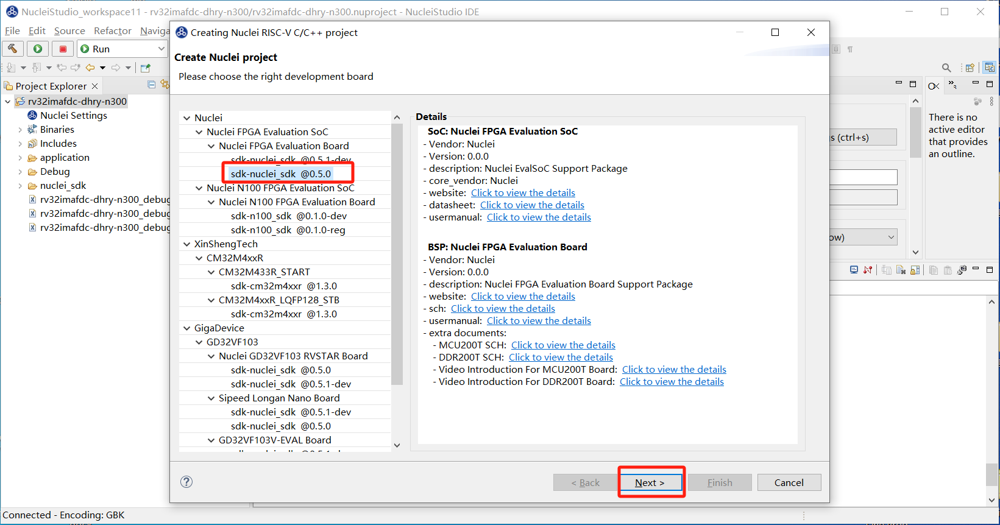
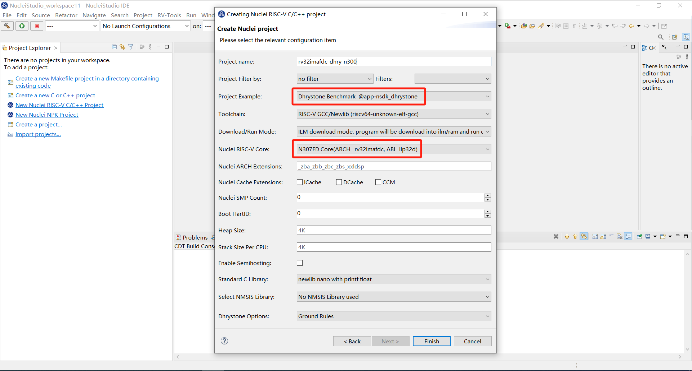
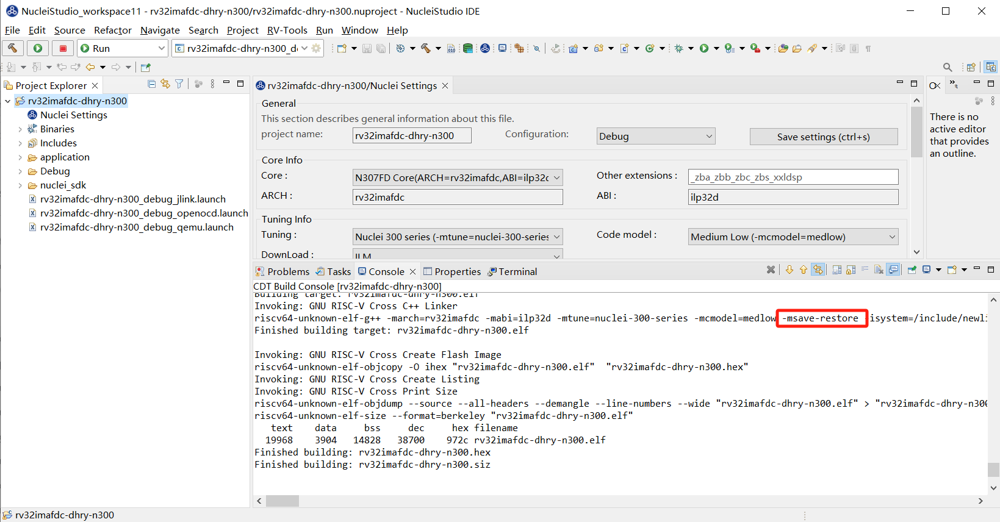
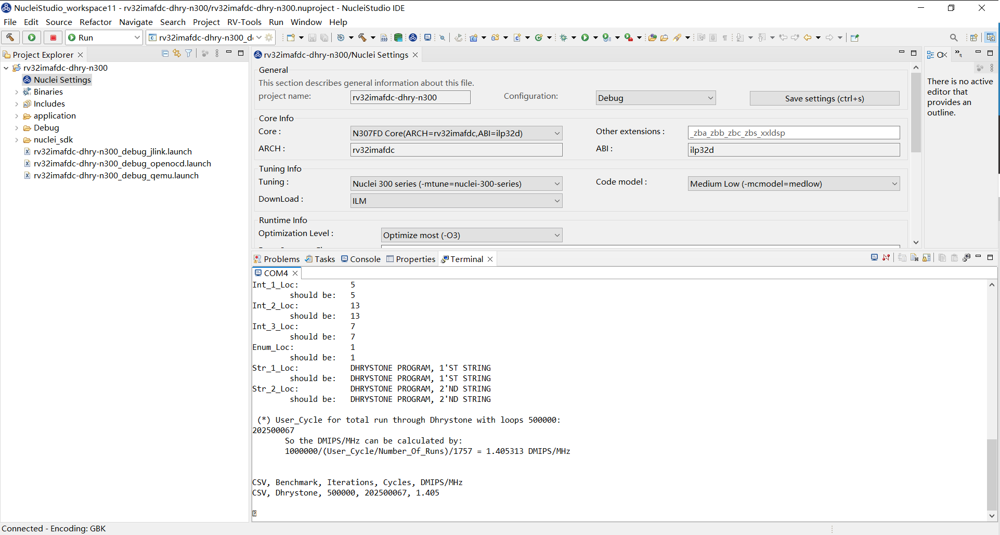
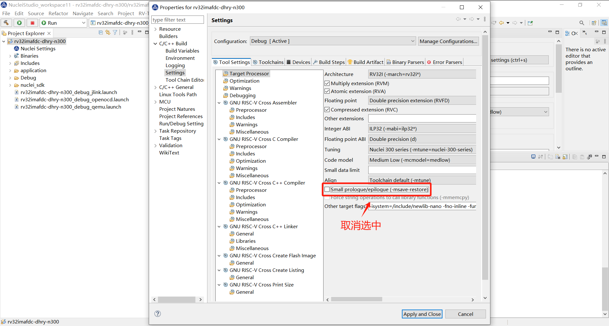
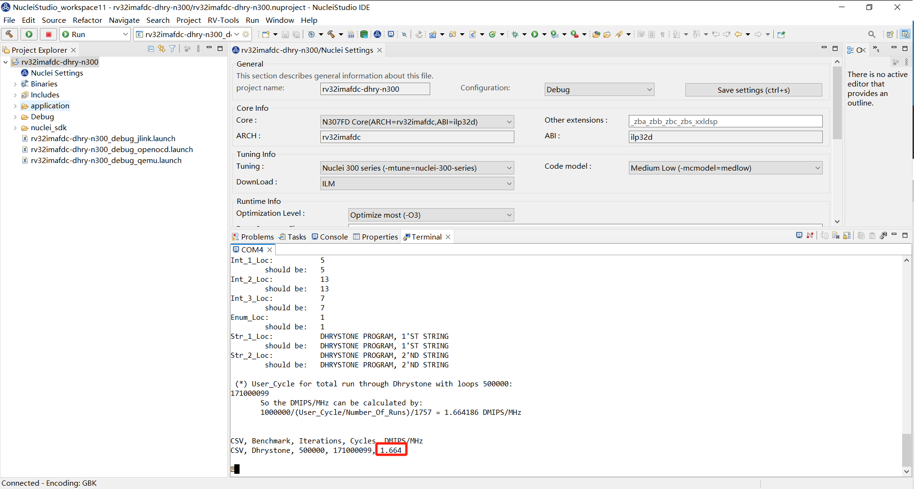

# About the Inconsistency Between Dhrystone Benchmark Scores in the IDE and NSDK 0.5.0 Command-Line Scores

## Problem Description

In version 0.5.0 of sdk-nuclei_sdk, the `-msave-restore` option is enabled by default so that some programs can compile without errors when using the libncrt library in the IDE.
However, when creating a Dhrystone example project with the newlib library selected, this option causes the benchmark score to drop, and the result does not reflect the CPU's true performance.

## Solution

When running the benchmark, you need to go to the corresponding project's `Properties -> C/C++ Build -> Settings` and deselect `Small prologue/epilogue(-msave-restore)`.
The detailed steps and screenshots are as follows:

1. Download the **sdk-nuclei_sdk 0.5.0** NPK component package.

2. Create a new **Nuclei RISCV-V C/C++ project**.

3. During project creation, select **Dhrystone Benchmark** and **N307FD Core**, and keep the default settings for the other options. If you build and run it directly at this point, the benchmark score is **1.405**.

4. However, for actual benchmarking, you must first deselect the `-msave-restore` option; the resulting benchmark score is **1.664**.

