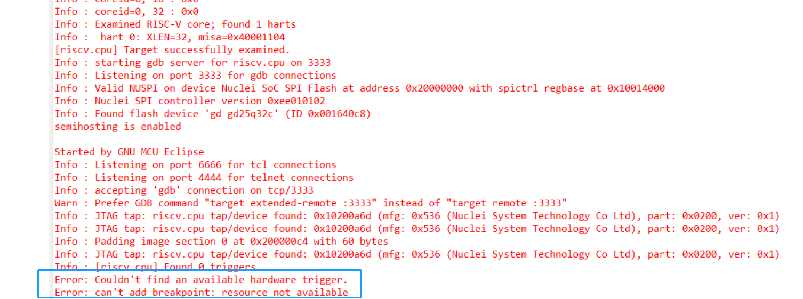
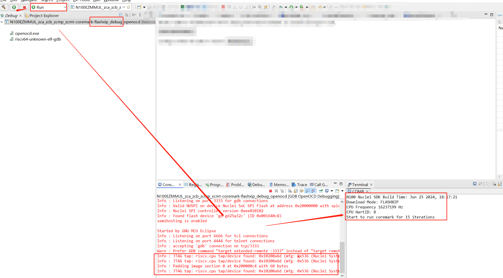

# Error: Couldn't find an available hardware trigger / Error: can't add breakpoint: resource not available

## 问题说明

在NucleiStudio中使用OpenOCD调试hbird/hbirdv2处理器（不支持硬件断点）或者 Nuclei 100 系列的处理器时，当程序运行在Flash/FlashXip下时，会报Error。
```
Error: Couldn't find an available hardware trigger.
Error: can't add breakpoint: resource not available
```





是因为所运行的CPU不支持硬件断点，导致程序运行在Flash上的时候，IDE调试功能无法正常工作，这个是IDE会需要打一个临时断点的缘故导致的。如果需要下载并运行程序，切换到Run运行模式可以正常运行程序。

## 解决方案

当在调试此类型处理器时，如果需要调试的话，就需要将程序编译运行在RAM上。
