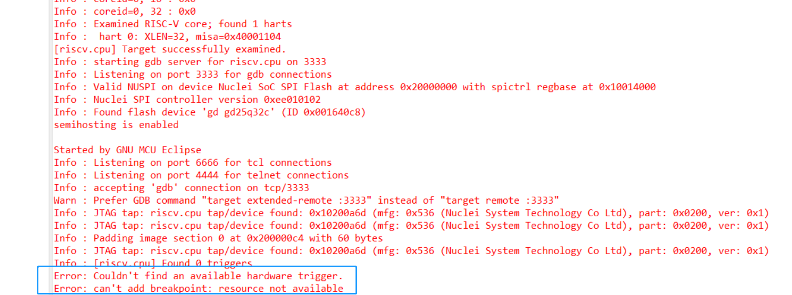
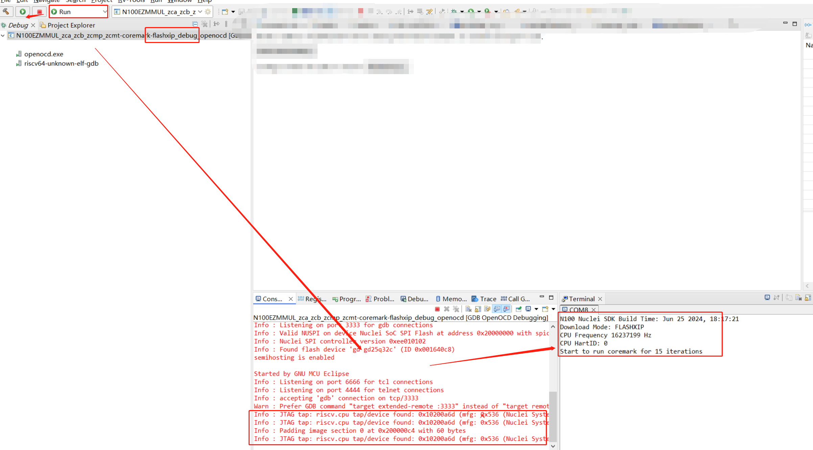

# Error: Couldn't find an available hardware trigger / Error: can't add breakpoint: resource not available

## Problem Description

When using OpenOCD in NucleiStudio to debug hbird/hbirdv2 processors (which do not support hardware breakpoints) or the Nuclei 100 series processors, an Error is reported when the program runs from Flash/FlashXip.
```
Error: Couldn't find an available hardware trigger.
Error: can't add breakpoint: resource not available
```





This happens because the CPU being run does not support hardware breakpoints, which prevents the IDE's debug functionality from working properly when the program runs from Flash — the IDE needs to set a temporary breakpoint. If you only need to download and run the program, switch to Run mode and the program will run normally.

## Solution

When debugging this type of processor, if debugging is required, the program must be compiled to run from RAM.
