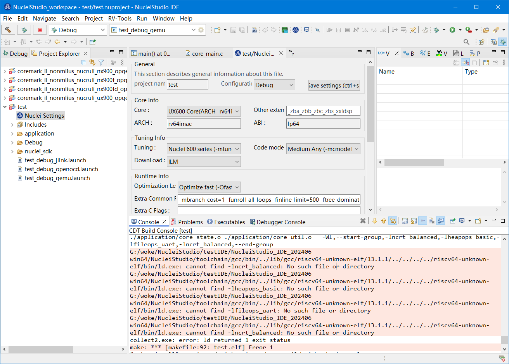
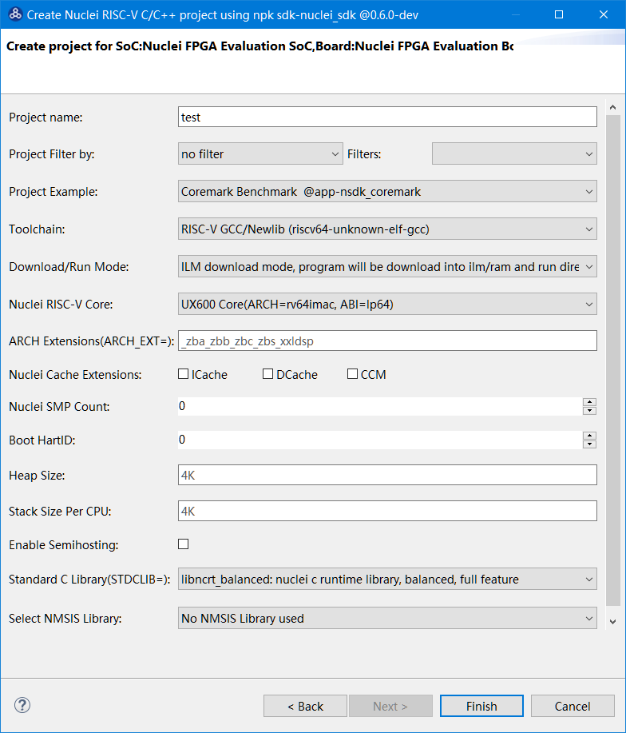

# cannot find -lncrt_balanced: No such file or directory

## Problem Description

When building a project in Nuclei Studio, the following error messages are reported:

```
G:/NucleiStudio/toolchain/gcc/bin/../lib/gcc/riscv64-unknown-elf/13.1.1/../../../../riscv64-unknown-elf/bin/ld.exe: cannot find -lncrt_balanced: No such file or directory
G:/NucleiStudio/toolchain/gcc/bin/../lib/gcc/riscv64-unknown-elf/13.1.1/../../../../riscv64-unknown-elf/bin/ld.exe: cannot find -lheapops_basic: No such file or directory
G:/NucleiStudio/toolchain/gcc/bin/../lib/gcc/riscv64-unknown-elf/13.1.1/../../../../riscv64-unknown-elf/bin/ld.exe: cannot find -lfileops_uart: No such file or directory
G:/NucleiStudio/toolchain/gcc/bin/../lib/gcc/riscv64-unknown-elf/13.1.1/../../../../riscv64-unknown-elf/bin/ld.exe: cannot find -lncrt_balanced: No such file or directory
```



This happens because when creating the project, we created a 64-bit project, and in the Standard C Library settings, extensions with `-lncrt_balanced` and `-lfileops_uart` were selected. However, these extensions do not support 64-bit, which causes the build to fail.



## Solution

`-lncrt_balanced` and `-lfileops_uart` do not support 64-bit processors. When creating a project for such processors, avoid using the libncrt library.
