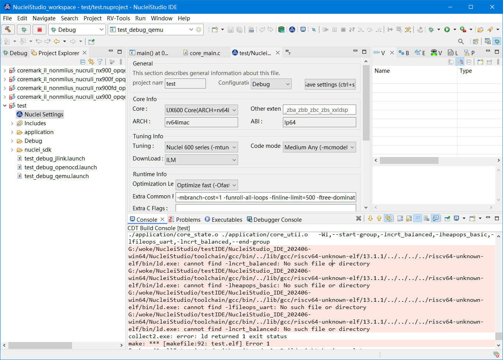
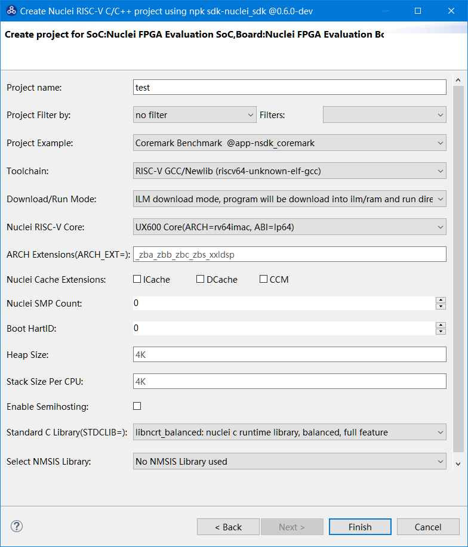

# cannot find -lncrt_balanced: No such file or directory

## 问题说明

在NucleiStudio中使用编译工程时有报错信息如下：

```
G:/NucleiStudio/toolchain/gcc/bin/../lib/gcc/riscv64-unknown-elf/13.1.1/../../../../riscv64-unknown-elf/bin/ld.exe: cannot find -lncrt_balanced: No such file or directory
G:/NucleiStudio/toolchain/gcc/bin/../lib/gcc/riscv64-unknown-elf/13.1.1/../../../../riscv64-unknown-elf/bin/ld.exe: cannot find -lheapops_basic: No such file or directory
G:/NucleiStudio/toolchain/gcc/bin/../lib/gcc/riscv64-unknown-elf/13.1.1/../../../../riscv64-unknown-elf/bin/ld.exe: cannot find -lfileops_uart: No such file or directory
G:/NucleiStudio/toolchain/gcc/bin/../lib/gcc/riscv64-unknown-elf/13.1.1/../../../../riscv64-unknown-elf/bin/ld.exe: cannot find -lncrt_balanced: No such file or directory
```



是因为在创建工程时，我们创建了一个64位的工程，同时在Standard C Library时，选择了带`-lncrt_balanced`、`-lfileops_uart`的扩展，而此类扩展又不支持64位，导致编译不通过。



## 解决方案

`-lncrt_balanced`、`-lfileops_uart`不支持64位处理器，在创建此类处理器工程时，避免使用libncrt库。
