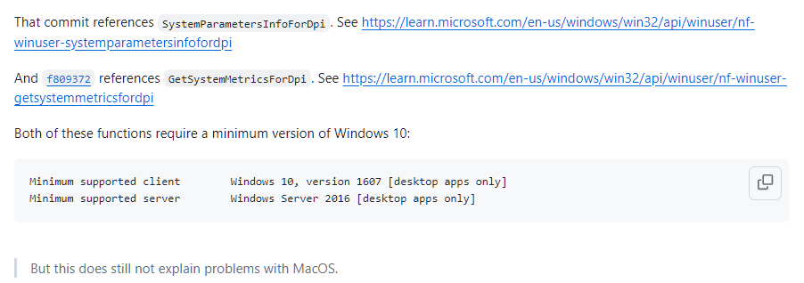
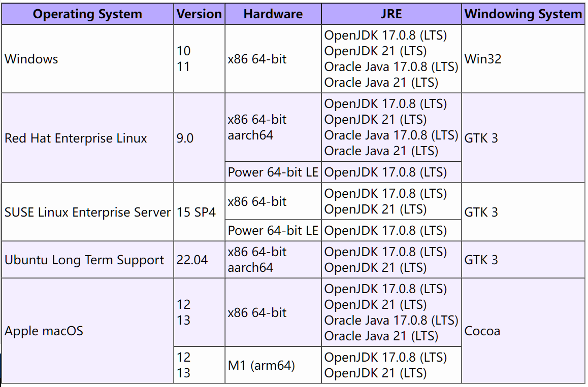

# UnsatisfiedLinkError of swt-win32-4965r8.dll on Windows 7

## Problem Description

When using NucleiStudio 2024.06 on Windows 7 or Windows 8, users find that it fails to start. The following error can be seen in the log files under the `NucleiStudio\configuration` directory:

```
!ENTRY org.eclipse.osgi 4 0 2024-07-16 10:41:57.010
!MESSAGE Application error
!STACK 1
java.lang.UnsatisfiedLinkError: Could not load SWT library. Reasons: 
	C:\NucleiStudio\configuration\org.eclipse.osgi\492\0\.cp\swt-win32-4965r11.dll: 找不到指定的程序。
	no swt-win32 in java.library.path: C:\NucleiStudio;C:\Windows\Sun\Java\bin;C:\Windows\system32;C:\Windows;C:/NucleiStudio//plugins/org.eclipse.justj.openjdk.hotspot.jre.full.win32.x86_64_21.0.3.v20240426-1530/jre/bin/server;C:/NucleiStudio//plugins/org.eclipse.justj.openjdk.hotspot.jre.full.win32.x86_64_21.0.3.v20240426-1530/jre/bin;C:\Java\JCDK3.0.4_ClassicEdition\bin;C:\Java\jdk1.6.0_26\bin;C:\Java\jdk1.6.0_26\lib;C:\Windows\system32;C:\Windows;C:\Windows\System32\Wbem;C:\Windows\System32\WindowsPowerShell\v1.0\;C:\Program Files\TortoiseSVN\bin;C:\Program Files (x86)\Microsoft SQL Server\90\Tools\binn\;D:\Python25;C:\NucleiStudio;;.
	no swt in java.library.path: C:\NucleiStudio;C:\Windows\Sun\Java\bin;C:\Windows\system32;C:\Windows;C:/NucleiStudio//plugins/org.eclipse.justj.openjdk.hotspot.jre.full.win32.x86_64_21.0.3.v20240426-1530/jre/bin/server;C:/NucleiStudio//plugins/org.eclipse.justj.openjdk.hotspot.jre.full.win32.x86_64_21.0.3.v20240426-1530/jre/bin;C:\Java\JCDK3.0.4_ClassicEdition\bin;C:\Java\jdk1.6.0_26\bin;C:\Java\jdk1.6.0_26\lib;C:\Windows\system32;C:\Windows;C:\Windows\System32\Wbem;C:\Windows\System32\WindowsPowerShell\v1.0\;C:\Program Files\TortoiseSVN\bin;C:\Program Files (x86)\Microsoft SQL Server\90\Tools\binn\;D:\Python25;C:\NucleiStudio;;.
	C:\Users\username\.swt\lib\win32\x86_64\swt-win32-4965r11.dll: 找不到指定的程序。
	Can't load library: C:\Users\username\.swt\lib\win32\x86_64\swt-win32.dll
	Can't load library: C:\Users\username\.swt\lib\win32\x86_64\swt.dll
	C:\Users\username\.swt\lib\win32\x86_64\swt-win32-4965r11.dll: 找不到指定的程序。

	at org.eclipse.swt.internal.Library.loadLibrary(Library.java:345)
	at org.eclipse.swt.internal.Library.loadLibrary(Library.java:254)
	at org.eclipse.swt.internal.C.<clinit>(C.java:19)
	at org.eclipse.swt.internal.win32.STARTUPINFO.<clinit>(STARTUPINFO.java:42)
	at org.eclipse.swt.widgets.Display.<clinit>(Display.java:149)
	at org.eclipse.ui.internal.Workbench.createDisplay(Workbench.java:721)
	at org.eclipse.ui.PlatformUI.createDisplay(PlatformUI.java:185)
	at org.eclipse.ui.internal.ide.application.IDEApplication.createDisplay(IDEApplication.java:182)
	at org.eclipse.ui.internal.ide.application.IDEApplication.start(IDEApplication.java:125)
	at org.eclipse.equinox.internal.app.EclipseAppHandle.run(EclipseAppHandle.java:208)
	at org.eclipse.core.runtime.internal.adaptor.EclipseAppLauncher.runApplication(EclipseAppLauncher.java:143)
	at org.eclipse.core.runtime.internal.adaptor.EclipseAppLauncher.start(EclipseAppLauncher.java:109)
	at org.eclipse.core.runtime.adaptor.EclipseStarter.run(EclipseStarter.java:439)
	at org.eclipse.core.runtime.adaptor.EclipseStarter.run(EclipseStarter.java:271)
	at java.base/jdk.internal.reflect.DirectMethodHandleAccessor.invoke(DirectMethodHandleAccessor.java:103)
	at java.base/java.lang.reflect.Method.invoke(Method.java:580)
	at org.eclipse.equinox.launcher.Main.invokeFramework(Main.java:668)
	at org.eclipse.equinox.launcher.Main.basicRun(Main.java:605)
	at org.eclipse.equinox.launcher.Main.run(Main.java:1481)
	
```

This is because Eclipse 2024.06 uses certain features that have specific operating system requirements. For details, refer to https://github.com/eclipse-platform/eclipse.platform.swt/issues/1252



In addition, the official Eclipse documentation states that the operating systems against which Eclipse is tested no longer include compatibility for certain OS versions. For details, refer to https://eclipse.dev/eclipse/development/plans/eclipse_project_plan_4_32.xml#target_environments



Since NucleiStudio 2024.06 is based on Eclipse 2024.06, it is affected by the same type of issue.

## Solution

Please use NucleiStudio 2024.06 on Windows 10 or later.

If you want to use NucleiStudio on older operating systems such as Windows 7 or Windows 8, consider using NucleiStudio 2024.02 or an earlier version.
