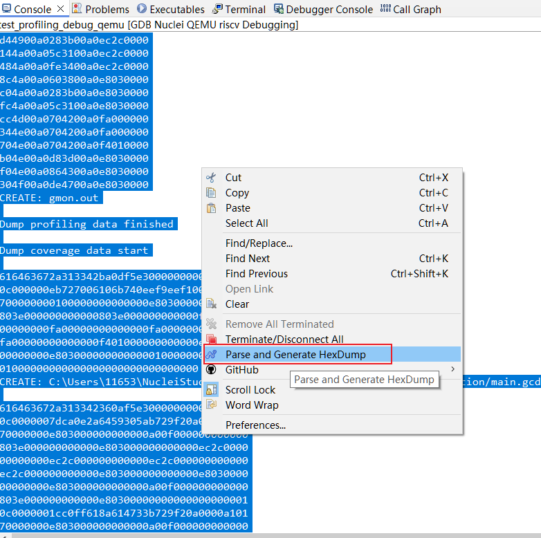
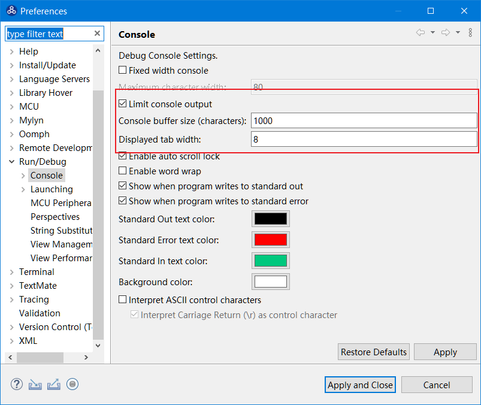
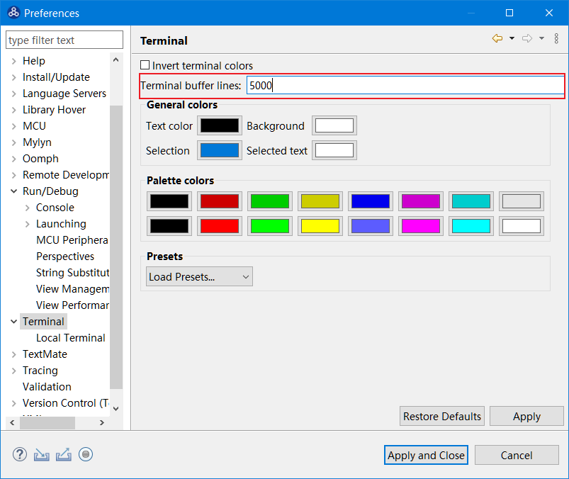
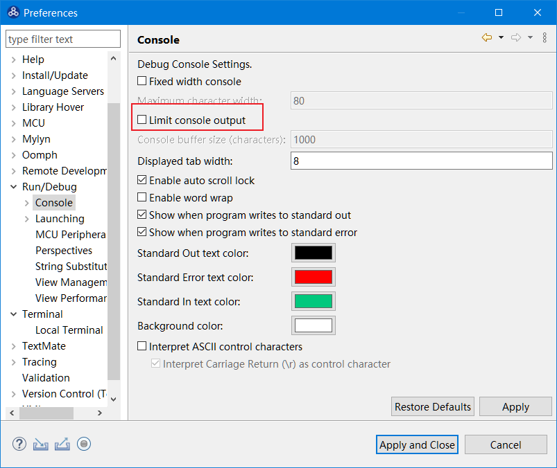
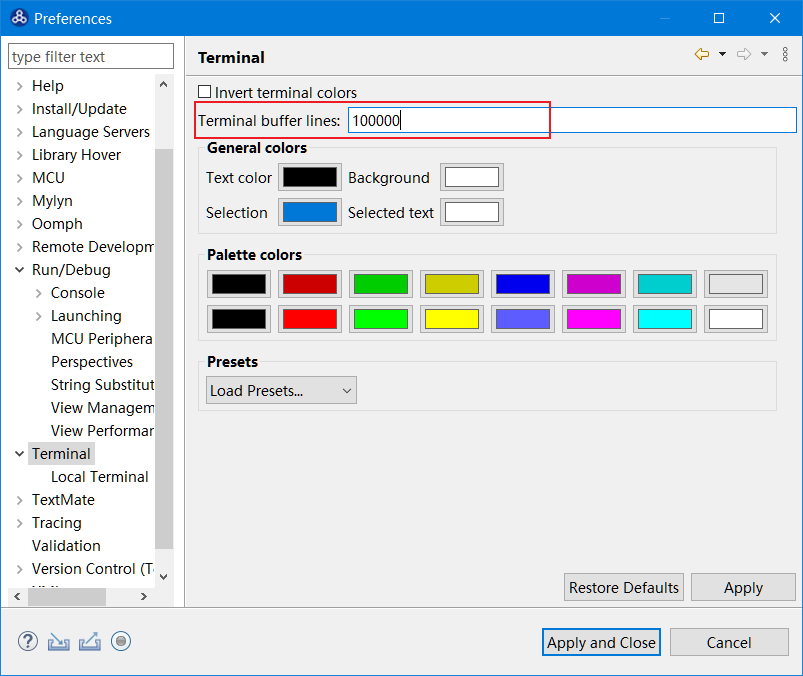

# 使用Profiling功能时数据输出不完整

## 问题说明

在NucleiStudio 2024.06中，当选择使用串口输出的方式使用Profiling功能时，可能存在最终结果不及预期。

在使用`Parse and Generate Hexdump`时没有生成对应的`gmon.out`文件或者`*.gcno`文件,是因为在Console或者Terminal中，对输出的内容条数有限制，当输出的内容长度超过限制时，前面的内容会丢失。

## 解决方案

为了更方便的使用Profiling功能，可以将Console和Terminal中对输出内容的上限做修改。

建议将Console中输出内容条限修改为不受限制。

建议将Terminal中输出内容条限修改为一个较大的值。

