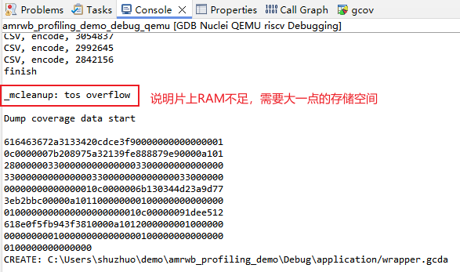
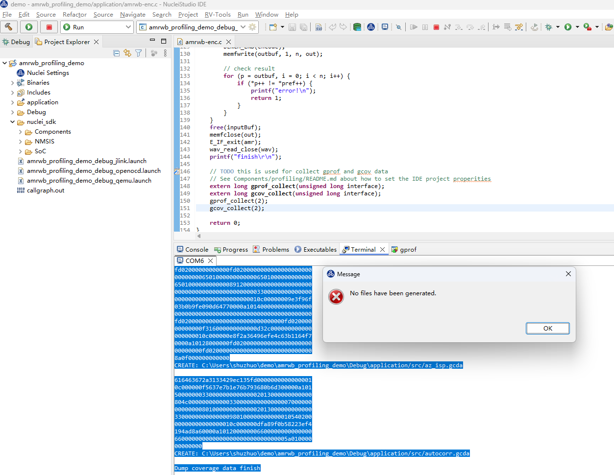
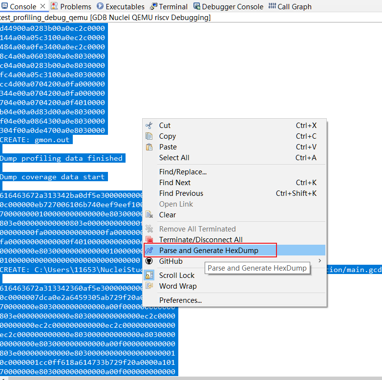
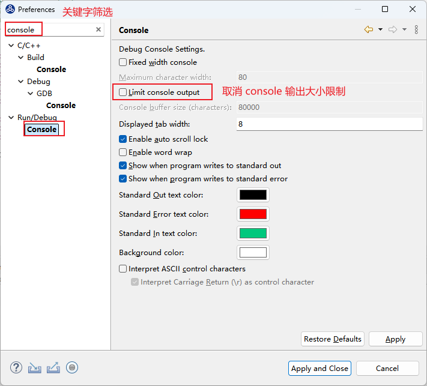
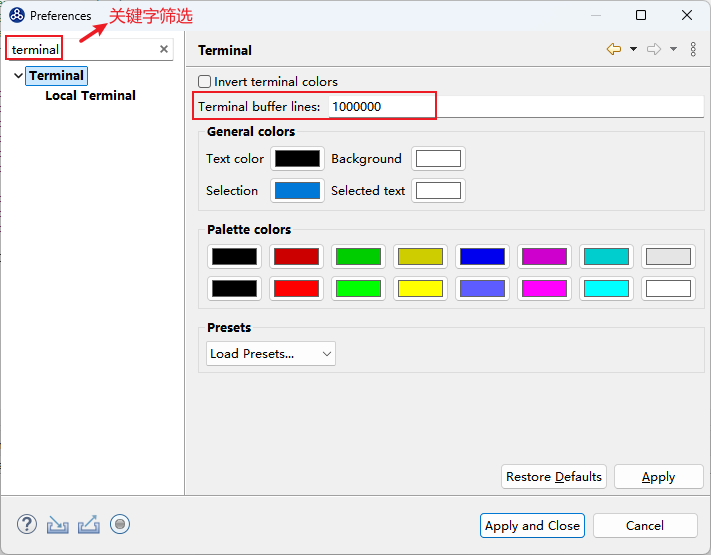
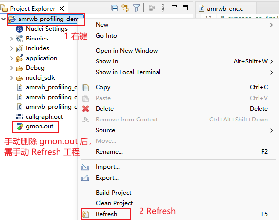
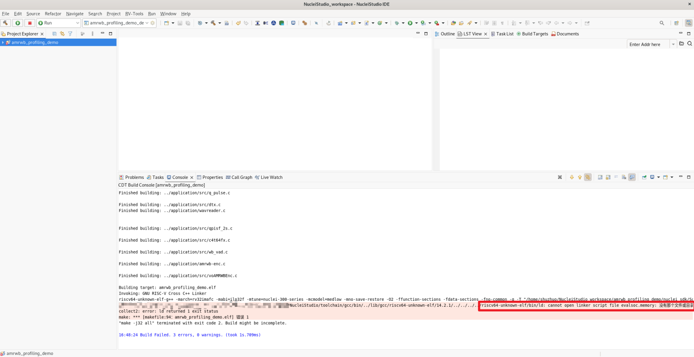
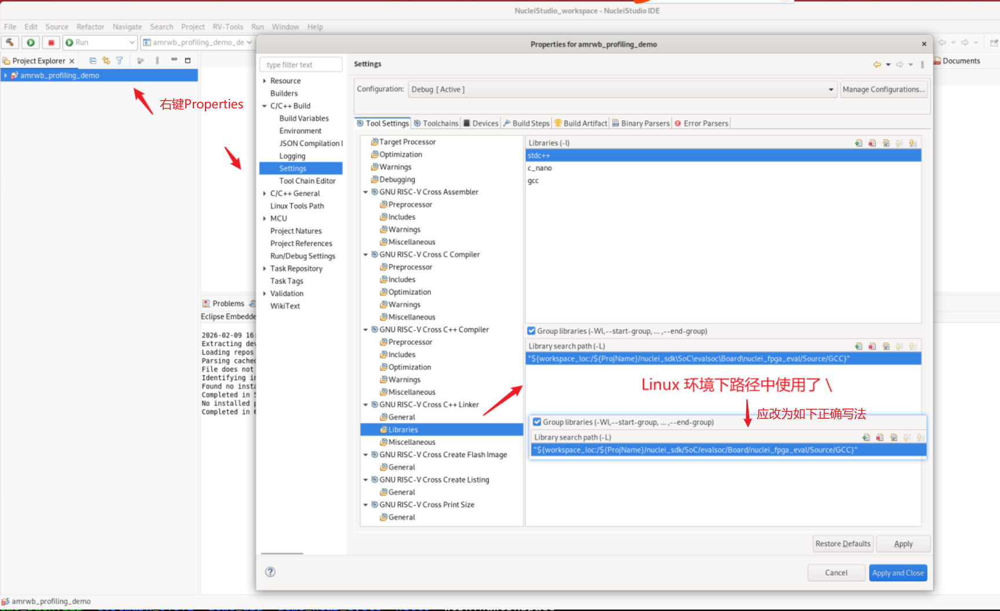

# Issues You May Encounter When Using the Profiling Feature

You may encounter some issues when using the Profiling feature. They are documented below:

* **Issue 1**: The log output reports insufficient on-chip memory, meaning there is not enough memory to store gprof/gcov data
* **Issue 2**: When collecting data via serial port output, the printed output is overwritten/truncated, so the data collected in the Console or Terminal is incomplete, causing data parsing to fail and a `No files have been generated` error dialog to pop up  
* **Issue 3**: After deleting the `gmon.out` file, parsing again triggers a `No files have been generated` error dialog

## Issue 1: The log output reports insufficient on-chip memory, meaning there is not enough memory to store gprof/gcov data

gprof/gcov data needs to be stored in on-chip memory. The amount of memory required depends on the size of the use case (ranging from tens to hundreds of KB), so make sure the on-chip memory is large enough.

### Solution

First, make sure the memory size configured in the software matches the actual hardware size (ilm/sram/flash/ddr/). Otherwise, you need to adapt the memory layout in the software linker script:   
For example, if downloading in `DOWNLOAD=ilm` mode, you can adapt it according to the actual ilm and dlm sizes of the hardware.
For `nuclei sdk 0.6.0`, the file to modify is `nuclei-sdk/SoC/evalsoc/Board/nuclei_fpga_eval/Source/GCC/gcc_evalsoc_ilm.ld`

~~~c
INCLUDE evalsoc.memory

MEMORY
{
  ilm (rxa!w) : ORIGIN = ILM_MEMORY_BASE,   LENGTH = ILM_MEMORY_SIZE
  ram (wxa!r) : ORIGIN = DLM_MEMORY_BASE,   LENGTH = DLM_MEMORY_SIZE
}
~~~

If `DOWNLOAD=ilm` mode does not provide enough memory, you can use a download mode with more memory (such as `DOWNLOAD=ddr`).

## Issue 2: Data parsing fails because the data collected in the Console or Terminal is incomplete

In NucleiStudio 2024.06, when using the Profiling feature with serial port output, parsing the data with `Parse and Generate Hexdump` may
pop up a `No files have been generated` error dialog, and the corresponding `gmon.out` file or `*.gcno` file is not generated in the end. This may be because the serial port data was overwritten/truncated, resulting in incomplete data and parsing failure.

**How to confirm:** 

Make sure the initial output printed at the start of the serial port session has not been overwritten/truncated. Refer to [An Example Demonstrating Performance Tuning with the Profiling Feature in Nuclei Studio](17-an_example_to_demonstrate_the_use_of_profiling_and_code_coverage.md)

### Solution

The Console and Terminal limit the number of output lines. When the output length exceeds the limit, the earlier content is overwritten/truncated, making the content incomplete and causing parsing to fail.

You need to increase the output size limit of the Console or Terminal to ensure that data is not overwritten/truncated.    

* It is recommended to set the Console output limit to unlimited.

Go to `Window->Preference` to open the following interface:

* It is recommended to set the Terminal output limit to a larger value.

Go to `Window->Preference` to open the following interface:

## Issue 3: After deleting the gmon.out file, parsing again pops up a No files have been generated error dialog

After manually deleting the gmon.out file in the project folder, parsing again shows a `No files have been generated` error dialog.

### Solution

After manually deleting the gmon.out file, you need to manually refresh the project.  

## Issue 4: Compilation error when importing amrwb_profiling_demo.zip in Nuclei Studio on Linux

The use case created in the document "[Issues You May Encounter When Using the Profiling Feature](https://doc.nucleisys.com/nuclei_studio_supply/16-incomplete_data_output_when_using_profiling_function/)" has a problem, causing a compilation error when importing amrwb_profiling_demo.zip into Nuclei Studio on Linux.   
The specific error is: evalsoc.memory: No such file or directory    

**Cause:** Windows path separators were mixed into the Linux environment    

**Solution:**    
You can use either of the following two methods:       
Method 1. The zip package in the document has already been fixed; simply download the new use case package      
Method 2. As shown in the figure below, change the ``\`` in the path to ``/``    

