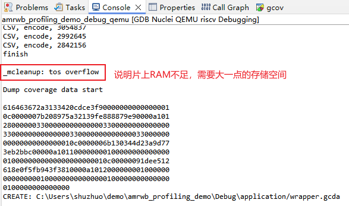
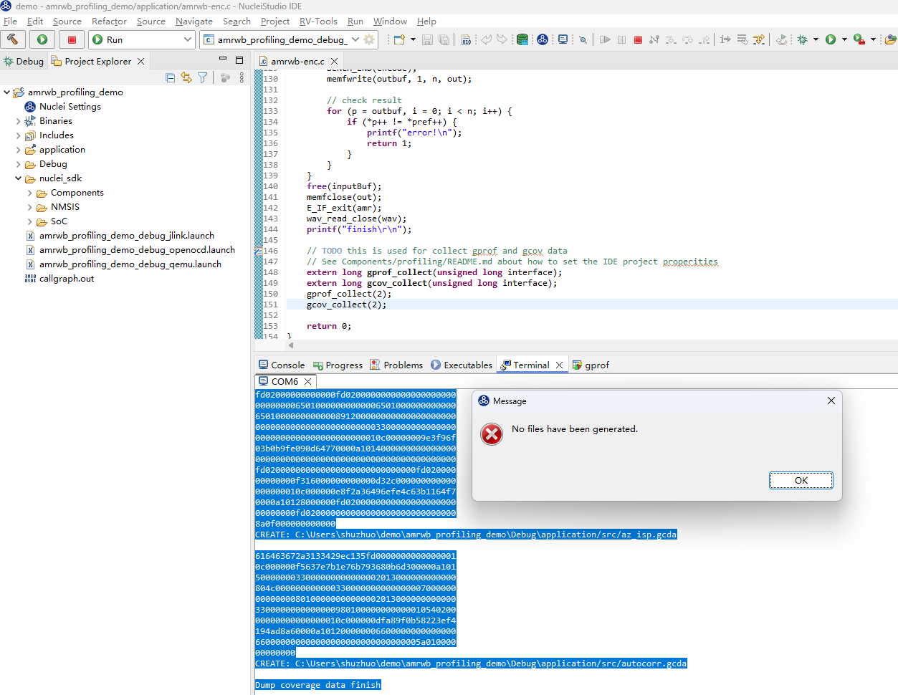
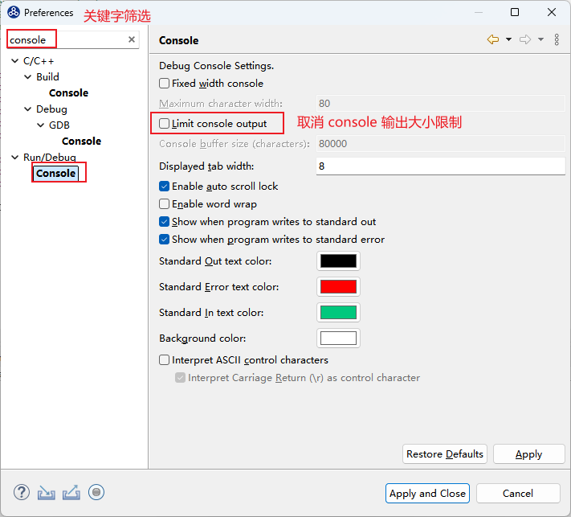
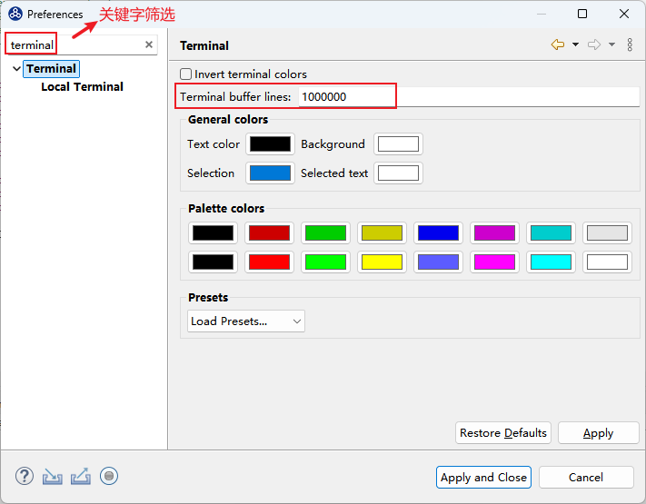
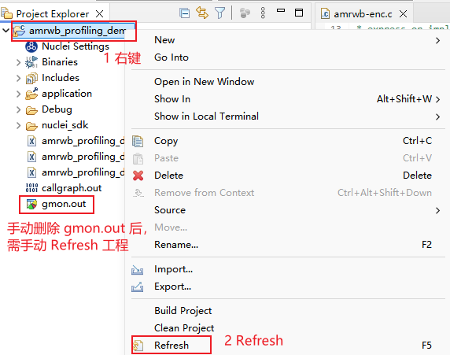

# 使用 Profiling 功能时可能遇到的一些问题

目前使用 Profiling 功能可能遇到一些问题，记录如下:

* **问题1**：日志打印中报片上内存不足，没有充足内存来存放 gprof/gcov 数据
* **问题2**：采用串口输出的方式收集数据，打印被冲掉，Console 或 Terminal 收集的数据不全，导致数据解析失败，弹出 `No files have been generated` 错误弹框  
* **问题3**：删掉 `gmon.out` 文件，再次解析时，弹出 `No files have been generated` 错误弹框

## 问题1：日志打印中报片上内存不足，没有充足内存来存放 gprof/gcov 数据

gprof/gcov data 需要存到片上内存上，占用内存的大小与用例规模有关(几十到几百KB不等)，需要确保片上内存足够大。

### 解决方案

首先需要确认软件配置的内存大小与硬件实际大小相匹配（ilm/sram/flash/ddr/），否则需要适配软件链接脚本内存布局：   
比如，如果是 `DOWNLOAD=ilm` 模式下载，可以按硬件的 ilm 与 dlm 大小适配。
对于 `nuclei sdk 0.6.0` 版本，修改的文件为`nuclei-sdk/SoC/evalsoc/Board/nuclei_fpga_eval/Source/GCC/gcc_evalsoc_ilm.ld`

~~~c
INCLUDE evalsoc.memory

MEMORY
{
  ilm (rxa!w) : ORIGIN = ILM_MEMORY_BASE,   LENGTH = ILM_MEMORY_SIZE
  ram (wxa!r) : ORIGIN = DLM_MEMORY_BASE,   LENGTH = DLM_MEMORY_SIZE
}
~~~

如果 `DOWNLOAD=ilm` 模式内存不足，可以使用内存大一点的下载方式（如 `DOWNLOAD=ddr`）。

## 问题2：Console 或 Terminal 收集的数据不全导致数据解析时失败

在 NucleiStudio 2024.06 中，当选择使用串口输出的方式使用 Profiling 功能时，可能使用 `Parse and Generate Hexdump` 解析数据时
弹出 `No files have been generated` 错误弹框，最后没有生成对应的 `gmon.out` 文件或者 `*.gcno` 文件。这可能是因为串口数据被冲掉，导致数据不完整从而解析失败

**确认方法：** 

需确保串口开始时的打印没有被冲掉，参考[Nuclei Studio使用Profiling功能进行性能调优举例](17-an_example_to_demonstrate_the_use_of_profiling_and_code_coverage.md)

### 解决方案

因为在Console或者Terminal中，对输出的内容条数有限制，当输出的内容长度超过限制时，前面的内容会被冲掉，导致内容不完整，这样会解析失败。

需要调节 Console 或 Terminal 输出大小限制，确保数据没有被冲掉。    

* 建议将Console中输出内容条限修改为不受限制。

`Window->Preference` 进入如下界面：

* 建议将Terminal中输出内容条限修改为一个较大的值。

`Window->Preference` 进入如下界面：

## 问题3：删掉 gmon.out 文件，再次解析，弹出 No files have been generated 错误弹框

手动删掉工程文件夹下的 gmon.out 文件，再次解析时出现 `No files have been generated` 的错误弹框

### 解决方案

手动删掉 gmon.out 文件后，需要手动刷新一下工程。  

## 问题4：Linux 环境中使用 Nuclei studio导入amrwb_profiling_demo.zip 编译报错

文档《[使用 Profiling 功能时可能遇到的一些问题](https://doc.nucleisys.com/nuclei_studio_supply/16-incomplete_data_output_when_using_profiling_function/) 》中制作的用例有问题，导致使用Linux Nuclei studio导入amrwb_profiling_demo.zip 编译时报错   
具体错误如下：evalsoc.memory: 没有那个文件或目录    

**原因：** 是因为Linux环境中混入了Windows路径分隔符    

**解决方法： **    
可采取如下两种方法：       
方法1. 文档中的zip包已经修复这个问题，下载新的用例包即可      
方法2. 按照下图示意，将路径中的``\`` 改为``/``    

