# Nuclei Studio使用Profiling功能进行性能调优举例

> 文档是基于 Nuclei Studio 的 **2024.06** Windows/Linux 版本实测。

## 问题说明

Nuclei Studio 2024.06 提供 Profiling 功能、Call Graph 功能 以及 Code coverage 功能，方便用户使用。 简单描述如下：  

* **Profiling 功能**：基于 binutils gprof 工具，可用于分析函数调用关系、调用次数、以及运行时间；通过 Profiling 抓取热点函数可以用来分析程序的瓶颈，以便进行性能优化。
* **Call Graph 功能**：基于 Profiling 功能，将函数调用关系、调用次数、以及运行时间用图展示出来，方便开发人员分析。
* **Code coverage 功能**：基于 gcc 编译器提供 gcov 工具，可用来查看源码文件的代码覆盖率，帮助开发人员确定测试用例是否足够充分，是否覆盖了被测代码的所有分支和路径。

在 [NucleiStudio_User_Guide.pdf](https://download.nucleisys.com/upload/files/doc/nucleistudio/Nuclei_Studio_User_Guide.202406.pdf) 相关章节对这几个功能已经有较详细的描述，这篇文档以一个例子来展示它们的实际应用。

## 解决方案

### 1 环境准备

**所需材料：**  

* Nuclei Studio：[NucleiStudio 2024.06](https://download.nucleisys.com/upload/files/nucleistudio/NucleiStudio_IDE_202406-win64.zip)，以 Windows 版本为例
* 用例： 以 [AMR-WB-enc](https://sourceforge.net/projects/opencore-amr/files/vo-amrwbenc/vo-amrwbenc-0.1.3.tar.gz/download) 即自适应多速率宽带编码音频算法为例，用户可以移植自己的用例

**基于 nuclei-sdk v0.6.0 移植 amrwbenc 裸机用例：**

打开 Nuclei Studio 建立 amrwbenc 工程，然后移植 amrwbenc 源码，最终用例可正常运行。用户可以移植自己的用例，不同用例移植的细节各不相同，这一步不是这篇文档的重点，略过。

### 2 Profiling 功能

Nuclei studio 中 Profiling 功能基于 binutils gprof 工具。编译时需带特定的编译选项 `-pg` 来编译指定源码文件，编译成功后得到 ELF 文件，
然后在实际开发板上运行并收集需要的 gmon.out 文件，最终在 IDE 上以图形化的方式展示。所以还需要在用例末尾添加 gprof 数据收集代码，有两种方式：

* 方式1：移植 gprof 数据收集代码到自己的工程中，代码可以参考 [Profiling README](https://github.com/Nuclei-Software/nuclei-sdk/tree/master/Components/profiling#readme)
* 方式2：基于 Nuclei Studio 中的 Profiling demo 进行改造，即用自己的用例替换掉 Profiling demo 工程的的用例部分

下面示例采用后一种方法进行演示：

**step1：新建 Profiling demo 工程**

`File->New->New Nuclei RISC-V C/C++ Project`，选择 `Nuclei FPGA Evalution Board->sdk-nuclei_sdk @0.6.0`

**注意：** Nuclei SDK 需选择 0.6.0 及以后版本才支持 Profiling 与 Code coverage 功能

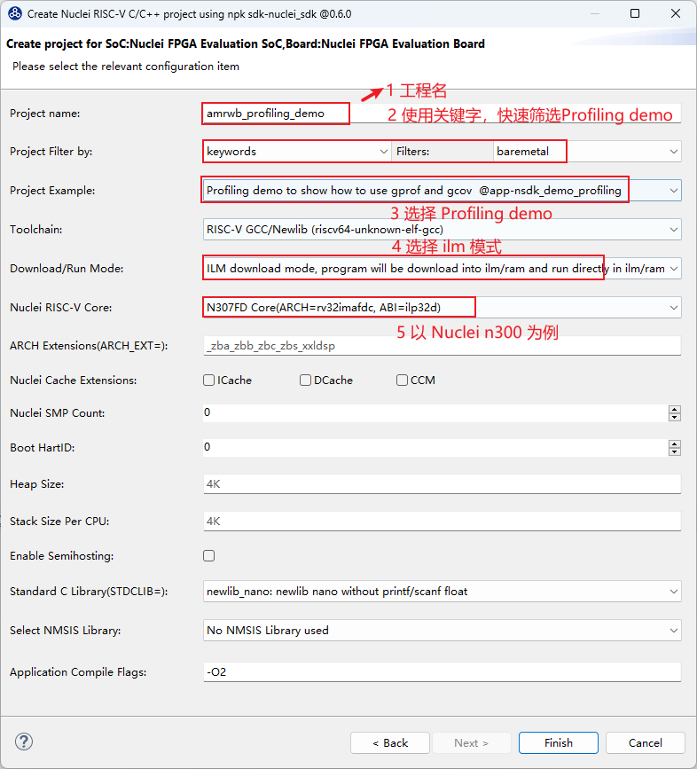

**step2：基于 Profiling demo 工程移植 amrwbenc 裸机用例**

删掉 Profiling demo 工程中 application 中的原始用例，替换成 amrwbenc 用例，形成如下目录结构，并确保能编译成功。 

这里提供本示例使用的工程，有兴趣可以下载使用：  
[优化前的工程下载链接](https://drive.weixin.qq.com/s?k=ABcAKgdSAFcaVG02T9)

下载 zip 包后，可以直接导入到 Nuclei Studio 中运行(导入步骤：`File->Import->Existing Projects into Workspace->Next->Select archive file->选择zip压缩包->next`即可)

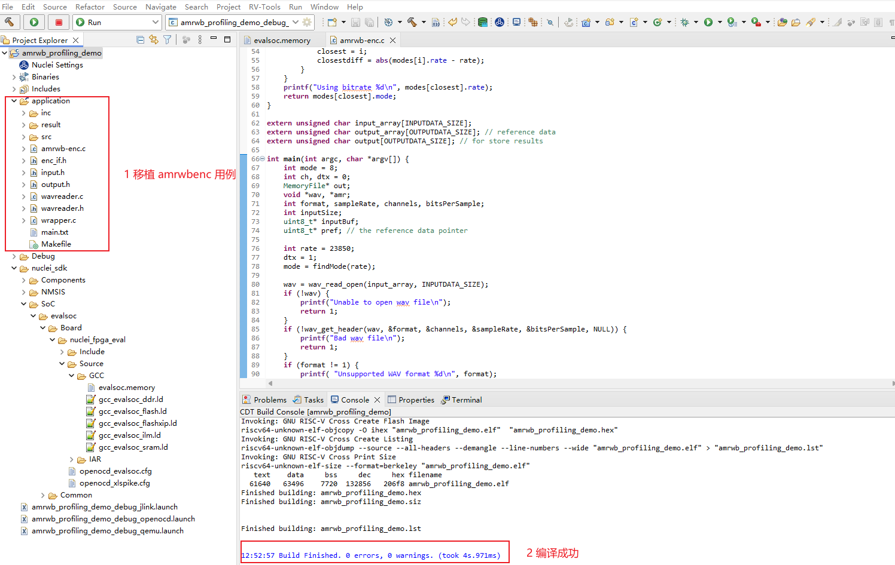

**注意：** 在Linux环境中使用 nuclei studio 导入旧的用例包可能会出现报错（找不到 evalsoc.memory），这是因为Linux环境混入Windows路径分隔符导致的，2026-02-09日修复了这个问题，此文档用例链接已经更新，可以重新下载新用例包，或者直接修改错误路径，具体可参考 [Profiling与 Code coverage 功能可能遇到的问题](16-incomplete_data_output_when_using_profiling_function.md) 问题4

**step3：在用例结尾处添加 grof 数据收集代码，并添加 -pg 编译选项，重新编译代码**

在 main 函数的结尾处添加 gprof 数据收集代码：

~~~c
int main(int argc, char *argv[]) {
    /*
     * 代码省略
     */

    /*
     * 在main函数的结尾处添加gprof数据收集代码
     */
    // TODO this is used for collect gprof and gcov data
    // See Components/profiling/README.md about how to set the IDE project properities
    extern long gprof_collect(unsigned long interface);
    gprof_collect(2);

    return 0;
}
~~~

收集 gprof data 有三种方式，通过入参不同进行区分：

* gprof_collect(0)：在缓冲区中收集 gprof 或 gcov 数据，在调试程序时可以使用 GDB 脚本转储 gcov 或 gprof 二进制文件
* gprof_collect(1)：使用 semihost 直接将 gprof 或 gcov 数据写入文件中
* gprof_collect(2)：直接在 Console 或 Serial Terminal 中打印 gcov 或 gprof 数据，然后可以通过IDE中 `Parse and Generate HexDump` 功能进行解析数据并保存到PC上

详情可参考 [Profiling README](https://github.com/Nuclei-Software/nuclei-sdk/tree/master/Components/profiling#readme)，这里以将 gprof data 打印到串口（Console 或 Serial Terminal）为例。

对需要进行profiling的代码添加 `-pg` 编译选项，重新编译代码：

**注意：** 选择 application, 对关键代码添加 `-pg` 编译选项，这个用例只有 C 代码，只对 C 代码添加 `-pg` 编译选项即可

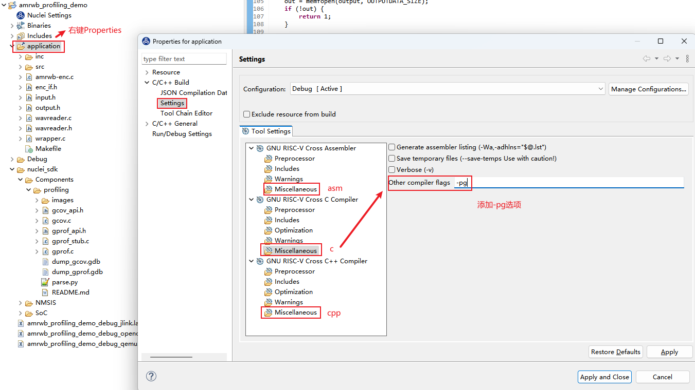

**step4：运行程序**

有几种方式可以运行程序：

* qemu 模拟器（不需要硬件，简单跑一下流程，测试结果不准确）
* 上板测试 （基于定时器采集数据）
* 基于 xl_cpumodel (Nuclei Near Cycle Model)，参考: [通过Profiling展示Nuclei Model NICE/VNICE指令加速](18-demonstrate_NICE_VNICE_acceleration_of_the_Nuclei_Model_through_profiling.md)

这一篇文章只介绍 qemu 仿真与上板测试两种方式，qemu 收集的数据打印到 Console 口，上板实际运行输出到 Nuclei Studio 的 Serial Terminal 口。

**step5：解析 gprof 数据**

开始解析 gprof 数据。**注意：** 这一步可能遇到一些问题，解决方法可参考 [Profiling与 Code coverage 功能可能遇到的问题](16-incomplete_data_output_when_using_profiling_function.md)

* 在 qemu 上测试, log 打印到 Console 口

**注意**: qemu 仅用来模拟展示，如果希望得到准确的热点函数，需要上板测试。
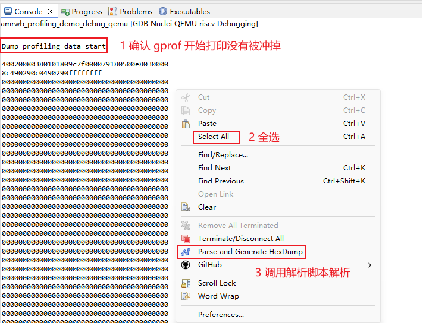   
解析完成后，会在当前工程目录下生成 gmon.out，双击打开展示：  
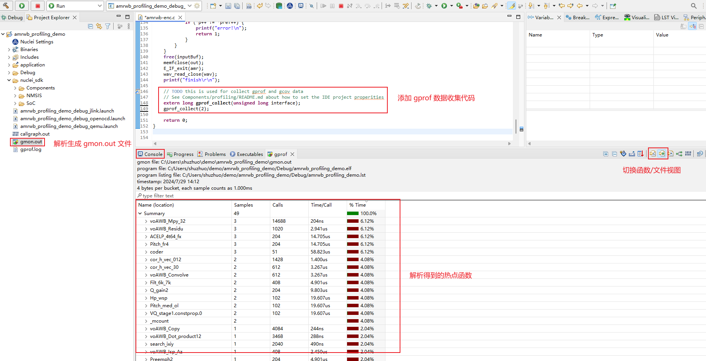   

* 上板测试

上板测试的步骤与 qemu 类似，唯一不同的是 gprof 数据输出到 Serial Terminal 上。  

配置 Serial Terminal:

**注意**:如果串口工具已经打开，确保每次运行 gprof 前，清除掉串口打印（鼠标右键-> Clear Terminal），避免对数据解析产生影响。  

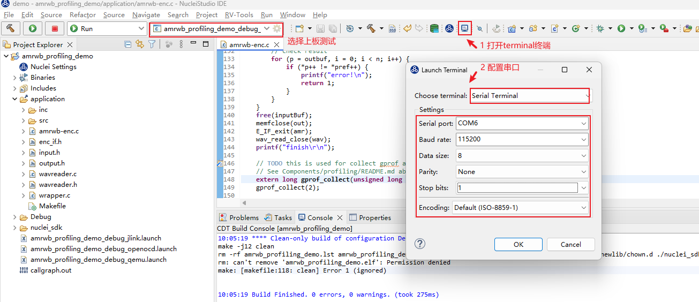  

同样, 全选 log，右键选择`Parse and Generate HexDump` 功能，就会在工程文件夹下生成 gmon.out 文件，
刷新工程后，就可以双击打开这个gmon.out 文件。

如下图是在**板子上实际运行**得到的 gprof 数据：  

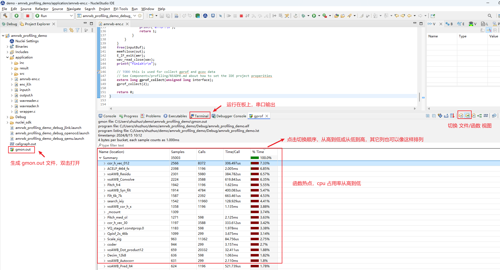

从而得到 TOP5 热点函数为（实际上板测试）：

~~~c
cor_h_vec_012
ACELP_4t64_fx
voAWB_Residu
voAWB_Convolve
voAWB_Syn_filt
~~~

获得热点函数后，可以从热点函数入手开始优化，优化 TOP 函数往往可以事半功倍。

**step6：优化热点函数**

有如下几种方法优化热点函数：

* 调节编译器参数，针对整个工程或单独算子使用 O2/O3/Ofast 等优化等级，开启 `-finline-functions` `-funroll-all-loops` 等优化选项
* 针对算法进行优化，使用更好的算法实现热点函数
* 使用 RISC-V 扩展指令（ RVP/RVV 扩展等）优化

这里以 RVP 扩展为例，按照热点函数从高到低，用 RVP 扩展来优化。需要确定所用硬件支持 RVP 扩展。

**举例如下：**

TOP1 热点函数为 `cor_h_vec_012`，分析函数，尝试使用 RVP 扩展优化：

如下以 `#if defined __riscv_xxldspn3x` 隔开的代码表示使用 Nuclei N3 P 扩展指令优化的代码。
其中`__RV_DSMALDA` 是一条 Nuclei N3 P扩展指令，实现了 一次完成 4 笔 int16 相乘，最后累加，结果存放到 int64 变量中。

这些指令Intrinsic API可参考 [Nuclei P 扩展指令Intrinsic API](https://github.com/Nuclei-Software/nuclei-sdk/blob/master/NMSIS/Core/Include/core_feature_dsp.h)

具体的RVP指令手册，请联系芯来科技获取。

优化后的工程如下，可以与优化之前的工程做对比，只优化了`cor_h_vec_012` 算子:

[优化后的工程下载链接](https://drive.weixin.qq.com/s?k=ABcAKgdSAFc0ussmf0)

使用 Nuclei N3 P 扩展指令优化的代码片段如下：

~~~c
void cor_h_vec_012(
		Word16 h[],                           /* (i) scaled impulse response                 */
		Word16 vec[],                         /* (i) scaled vector (/8) to correlate with h[] */
		Word16 track,                         /* (i) track to use                            */
		Word16 sign[],                        /* (i) sign vector                             */
		Word16 rrixix[][NB_POS],              /* (i) correlation of h[x] with h[x]      */
		Word16 cor_1[],                       /* (o) result of correlation (NB_POS elements) */
		Word16 cor_2[]                        /* (o) result of correlation (NB_POS elements) */
		)
{
	Word32 i, j, pos, corr;
	Word16 *p0, *p1, *p2,*p3,*cor_x,*cor_y;
	Word32 L_sum1,L_sum2;
	cor_x = cor_1;
	cor_y = cor_2;
	p0 = rrixix[track];
	p3 = rrixix[track+1];
	pos = track;

	for (i = 0; i < NB_POS; i+=2)
	{
		p1 = h;
		p2 = &vec[pos];
#if defined __riscv_xxldspn3x
		Word32 tmp1, tmp2;
		int64_t sum64_1, sum64_2;
		int64_t p64_1, p64_2;
		sum64_1 = 0;
		sum64_2 = 0;
		for (j=62-pos ;(j - 4) >= 0; j -= 4)
		{
			p64_1 = *__SIMD64(p1)++;
			tmp1 = __RV_PKBB16(*(p2 + 1), *p2);
			tmp2 = __RV_PKBB16(*(p2 + 3), *(p2 + 2));
			p64_2 = __RV_DPACK32(tmp2, tmp1);
			sum64_1 = __RV_DSMALDA(sum64_1, p64_1, p64_2);

			tmp1 = __RV_PKBB16(*(p2 + 2), *(p2 + 1));
			tmp2 = __RV_PKBB16(*(p2 + 4), *(p2 + 3));
			p64_2 = __RV_DPACK32(tmp2, tmp1);
			sum64_2 = __RV_DSMALDA(sum64_2, p64_1, p64_2);
			p2 += 4;
		}
		L_sum1 = (Word32)sum64_1;
		L_sum2 = (Word32)sum64_2;
		for ( ;j >= 0; j--)
		{
			L_sum1 += *p1 * *p2++;
			L_sum2 += *p1++ * *p2;
		}
#endif
		L_sum1 += *p1 * *p2;
		L_sum1 = (L_sum1 << 2);
		L_sum2 = (L_sum2 << 2);

		corr = (L_sum1 + 0x8000) >> 16;
		cor_x[i] = vo_mult(corr, sign[pos]) + (*p0++);
		corr = (L_sum2 + 0x8000) >> 16;
		cor_y[i] = vo_mult(corr, sign[pos + 1]) + (*p3++);
		pos += STEP;

		p1 = h;
		p2 = &vec[pos];
#if defined __riscv_xxldspn3x
		sum64_1 = 0;
		sum64_2 = 0;
		for (j=62-pos ;(j - 4) >= 0; j -= 4)
		{
			p64_1 = *__SIMD64(p1)++;
			tmp1 = __RV_PKBB16(*(p2 + 1), *p2);
			tmp2 = __RV_PKBB16(*(p2 + 3), *(p2 + 2));
			p64_2 = __RV_DPACK32(tmp2, tmp1);
			sum64_1 = __RV_DSMALDA(sum64_1, p64_1, p64_2);

			tmp1 = __RV_PKBB16(*(p2 + 2), *(p2 + 1));
			tmp2 = __RV_PKBB16(*(p2 + 4), *(p2 + 3));
			p64_2 = __RV_DPACK32(tmp2, tmp1);
			sum64_2 = __RV_DSMALDA(sum64_2, p64_1, p64_2);
			p2 += 4;
		}
		L_sum1 = (Word32)sum64_1;
		L_sum2 = (Word32)sum64_2;
		for ( ;j >= 0; j--)
		{
			L_sum1 += *p1 * *p2++;
			L_sum2 += *p1++ * *p2;
		}
#endif
		L_sum1 += *p1 * *p2;
		L_sum1 = (L_sum1 << 2);
		L_sum2 = (L_sum2 << 2);

		corr = (L_sum1 + 0x8000) >> 16;
		cor_x[i+1] = vo_mult(corr, sign[pos]) + (*p0++);
		corr = (L_sum2 + 0x8000) >> 16;
		cor_y[i+1] = vo_mult(corr, sign[pos + 1]) + (*p3++);
		pos += STEP;
	}
	return;
}

~~~

这个算子进行 P 扩展优化后，**编译时务必带上** dsp 扩展选项进行编译，如下图所示：

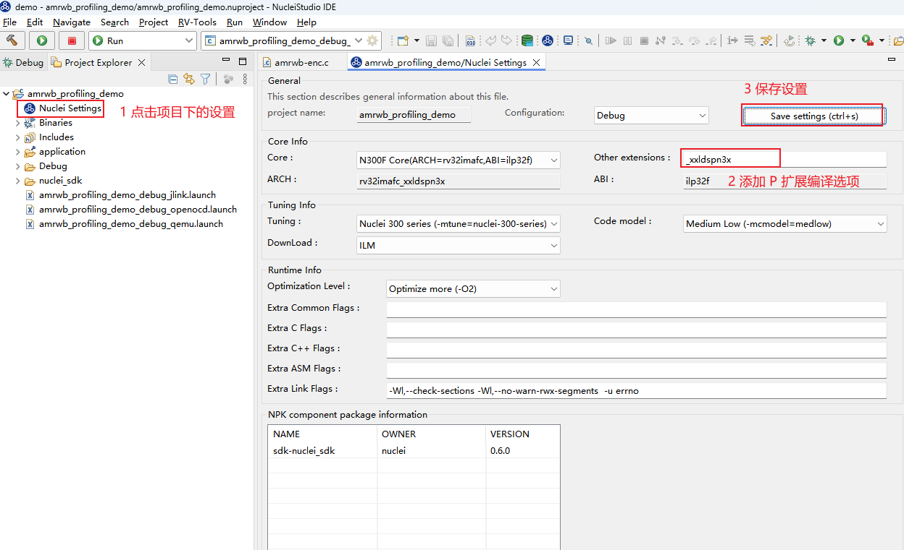

CLean Project 并重新编译，重新跑一次profiling，可以看到优化效果，`cor_h_vec_012` 函数占用率有所下降，函数调用时间也有所减少。

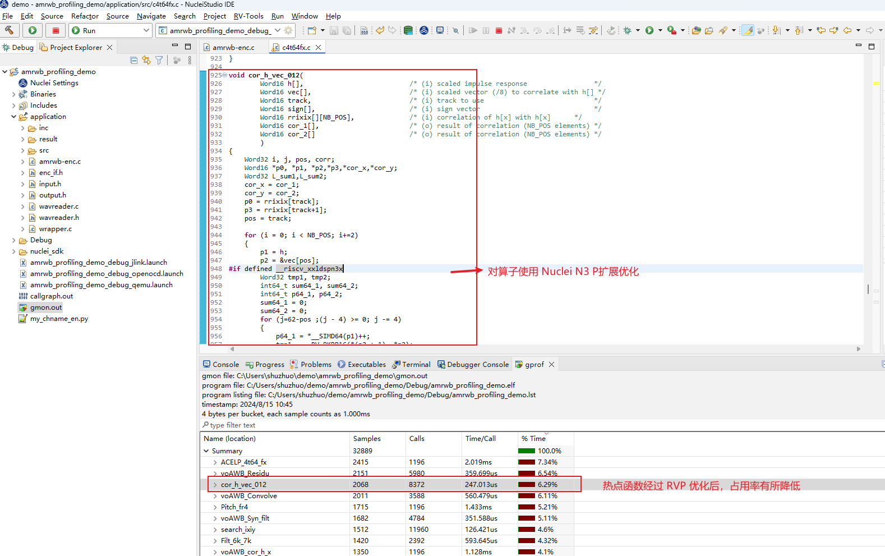

**注意：** 上述仅提供简单的示例，用户可以依次对热点函数进行分析并优化，运行过程中由于采样等原因，
导致 TOP 函数分布有所波动，这是正常的，最终精确的分析需要统计最终的总 cycle 数，然后计算提升比。

### 2 Call Graph 功能

Nuclei Studio 中 Call Graph 主要是通过分析 Profiling 的数据来获取到程序中函数的调用关系。

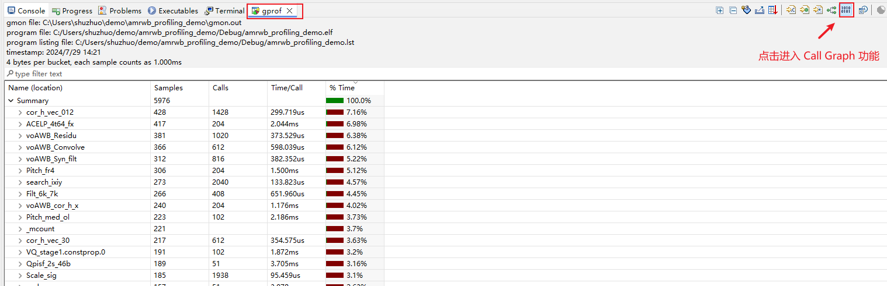

Call Graph 功能包括如下几种视图：

* Radial View

本视图中展示了程序的调用关系。

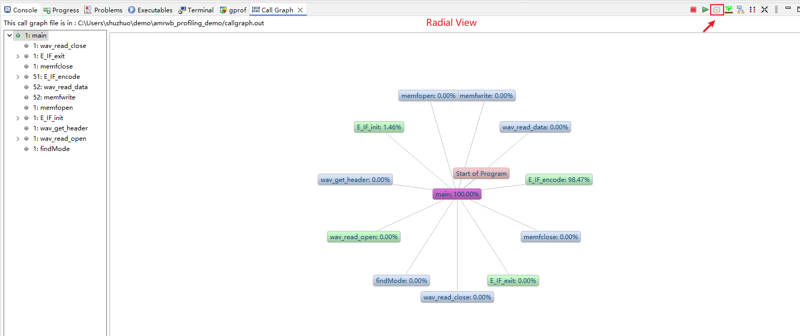

* Tree View

展示了 Radial View 中所选中的程序的调用关系、耗时所占比率、调用次数等信息；选中某一个函数，可以查看到它的父节点以及子节点等信息。

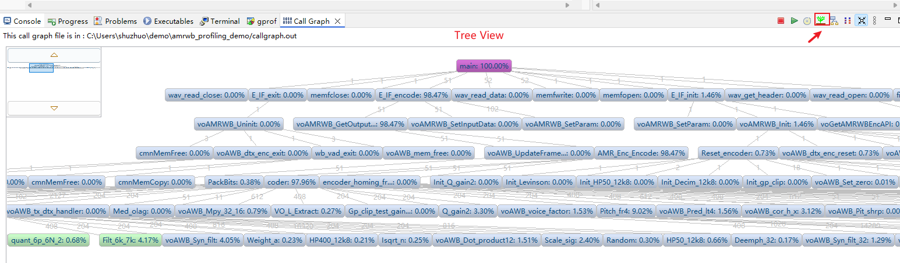

* Level View

与 Tree View 有点类似，展示了程序的调用关系以及调用次数。

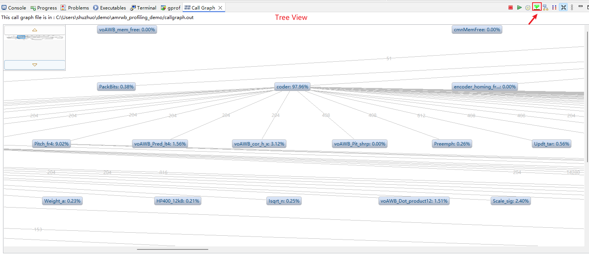

* Aggregate View

以方图的方式，非常直观的展示了程序的耗时关系。

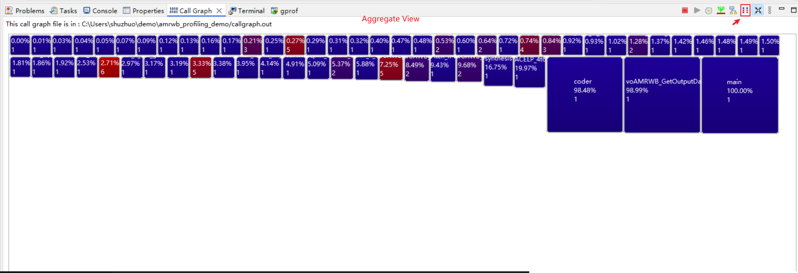

### 3 Code coverage 功能

Nuclei studio 中 Code coverage 功能基于 gcc 编译器提供的 gcov 工具，编译时需带特定的编译选项 `-coverage` 来编译指定源码文件，编译成功后得到 ELF 文件，然后在实际开发板上运行并收集需要的 coverage 文件(gcda/gcno 文件)，最终在 IDE 上以图形化的方式展示。

使用方法与 Profiling 功能类似，这里仅对不同的地方进行说明：

**step1：新建 Profiling demo 工程**  
**step2：基于 Profiling demo 工程移植 amrwbenc 裸机用例**  
**step3：添加 gcov 数据收集代码，并添加 -coverage 编译选项，重新编译代码**  

在main函数的结尾处添加gprof数据收集代码：

~~~c
int main(int argc, char *argv[]) {
    /*
     * 代码省略
     */

    /*
     * 在main函数的结尾处添加 gcov 数据收集代码
     */
    // TODO this is used for collect gprof and gcov data
    // See Components/profiling/README.md about how to set the IDE project properities
    extern long gcov_collect(unsigned long interface);
    gcov_collect(2);

    return 0;
}
~~~

添加`-coverage`编译选项，重新编译代码：

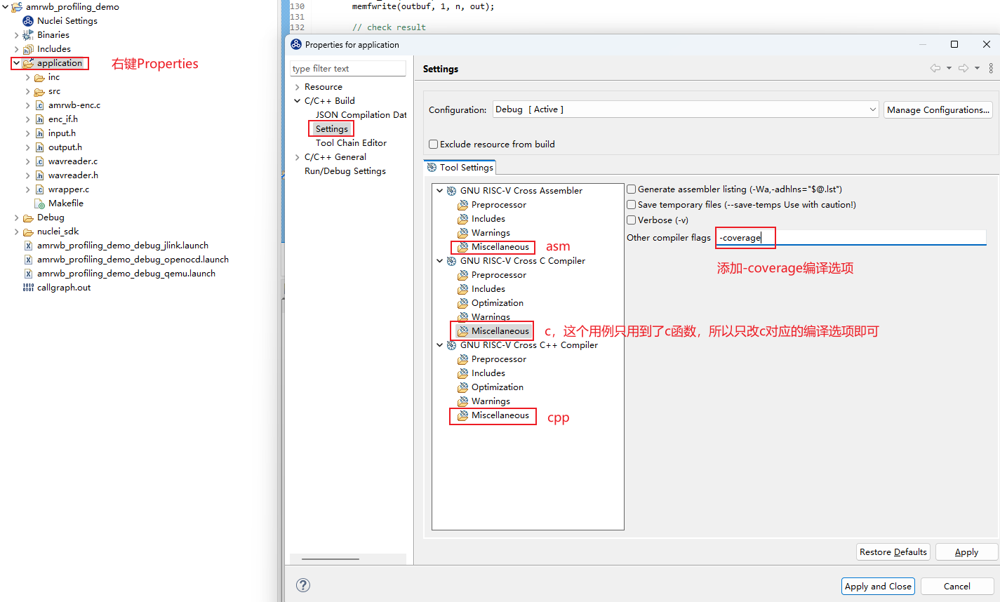

**step4：运行程序**  

可以在qemu中模拟运行，或者上板实际运行都可以（统计覆盖率，不涉及到性能分析，所以使用 qemu 或者上板测试都可以）。  

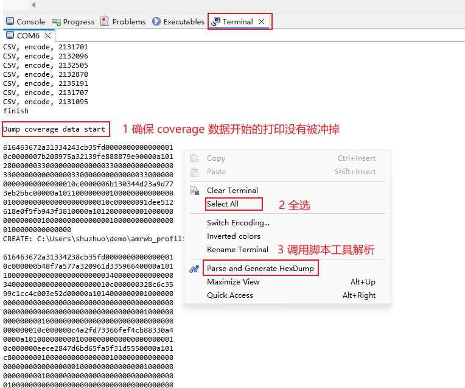  

解析之后，在Debug->application文件夹下生成了 gcda 与 gcno 文件，双击打开即可  

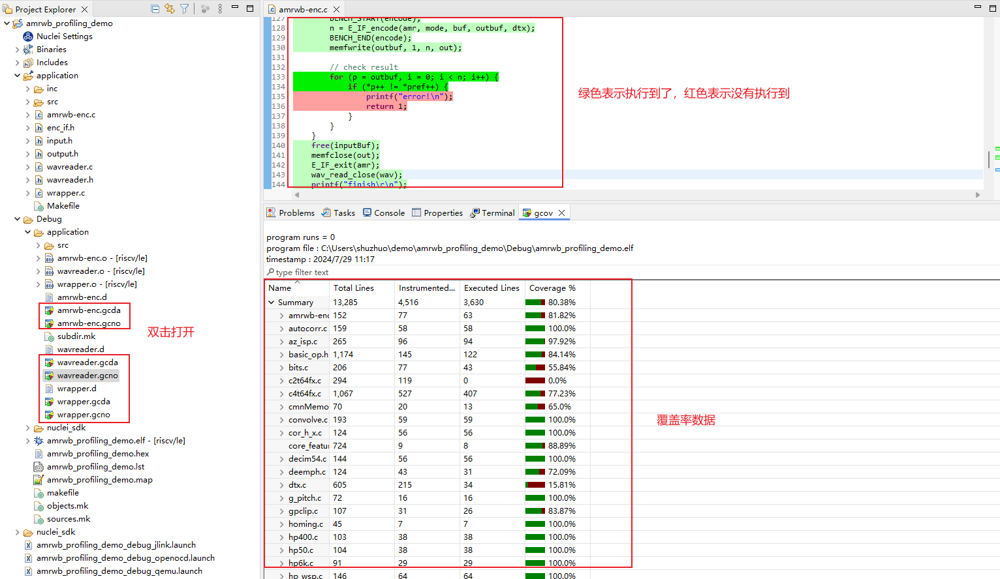  

### 4 补充

1. Profiling 与 Code coverage 功能可以同时打开，只需添加一起收集 Profiling 数据与 Code coverage 数据的代码，并在编译时添加 `-pg -coverage` 编译选项。

~~~c
    // TODO this is used for collect gprof and gcov data
    // See Components/profiling/README.md about how to set the IDE project properities
	extern long gprof_collect(unsigned long interface);
	extern long gcov_collect(unsigned long interface);
	gprof_collect(2);
	gcov_collect(2);
~~~

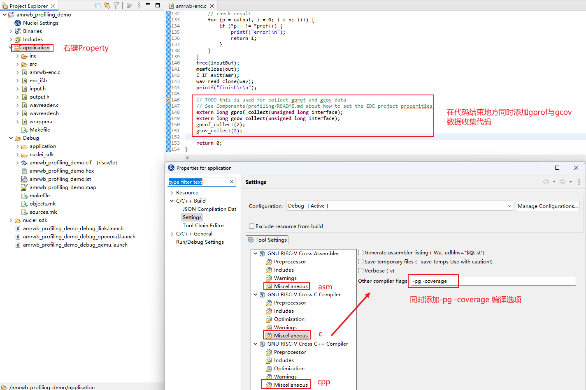

2. 使用Profiling可能遇见的问题：

* 片上内存不足，打印日志中有错误打印，gprof/gcov data 需要占用一定大小空间
* Console 或 Terminal 收集的数据不全导致解析数据不正确，需确认数据没有被冲掉，需要调节 Console 或 Terminal 输出大小限制
* 手动删掉 gmon.out 文件，再次解析，弹出 No files have been generated 错误弹框

上述具体解决方法可参考 [Profiling与 Code coverage 功能可能遇到的问题](16-incomplete_data_output_when_using_profiling_function.md)

