# An Example of Using the Profiling Feature in Nuclei Studio for Performance Tuning

> This document is based on hands-on testing with the **2024.06** Windows/Linux version of Nuclei Studio.

## Problem Description

Nuclei Studio 2024.06 provides the Profiling feature, the Call Graph feature, and the Code coverage feature for user convenience. A brief description is as follows:  

* **Profiling feature**: Based on the binutils gprof tool, it can be used to analyze function call relationships, call counts, and execution time. Hotspot functions captured through Profiling can be used to analyze program bottlenecks for performance optimization.
* **Call Graph feature**: Based on the Profiling feature, it displays function call relationships, call counts, and execution time in graph form, making analysis easier for developers.
* **Code coverage feature**: Based on the gcov tool provided by the gcc compiler, it can be used to view the code coverage of source files, helping developers determine whether test cases are sufficient and whether they cover all branches and paths of the code under test.

The relevant chapters of [NucleiStudio_User_Guide.pdf](https://download.nucleisys.com/upload/files/doc/nucleistudio/Nuclei_Studio_User_Guide.202406.pdf) already describe these features in detail. This document demonstrates their practical application through an example.

## Solution

### 1 Environment Preparation

**Required materials:**  

* Nuclei Studio: [NucleiStudio 2024.06](https://download.nucleisys.com/upload/files/nucleistudio/NucleiStudio_IDE_202406-win64.zip); the Windows version is used as an example
* Use case: [AMR-WB-enc](https://sourceforge.net/projects/opencore-amr/files/vo-amrwbenc/vo-amrwbenc-0.1.3.tar.gz/download), i.e., the Adaptive Multi-Rate Wideband encoding audio algorithm, is used as an example; users may port their own use cases

**Porting the amrwbenc bare-metal use case based on nuclei-sdk v0.6.0:**

Open Nuclei Studio and create an amrwbenc project, then port the amrwbenc source code so that the final use case runs correctly. Users may port their own use cases; the porting details differ from case to case, and this step is not the focus of this document, so it is skipped.

### 2 Profiling Feature

The Profiling feature in Nuclei Studio is based on the binutils gprof tool. During compilation, the specified source files must be compiled with the specific compiler option `-pg`. After a successful build, an ELF file is obtained,
which is then run on the actual development board to collect the required gmon.out file, and finally the results are displayed graphically in the IDE. Therefore, gprof data collection code also needs to be added at the end of the use case. There are two ways to do this:

* Method 1: Port the gprof data collection code into your own project. The code can refer to [Profiling README](https://github.com/Nuclei-Software/nuclei-sdk/tree/master/Components/profiling#readme)
* Method 2: Modify the Profiling demo in Nuclei Studio, i.e., replace the use case portion of the Profiling demo project with your own use case

The following example demonstrates the latter method:

**Step 1: Create a new Profiling demo project**

`File->New->New Nuclei RISC-V C/C++ Project`, select `Nuclei FPGA Evaluation Board->sdk-nuclei_sdk @0.6.0`

**Note:** Nuclei SDK version 0.6.0 or later must be selected to support the Profiling and Code coverage features

You can choose different toolchains according to your needs:

1. `RISC-V GCC/Newlib(riscv-unknown-elf-gcc)`
2. `RISC-V Clang/Newlib(riscv-unknown-elf-clang)`
3. `Terapines ZCC(zcc)`

**Note:** Nuclei SDK version 0.7.1 or later must be selected to support the `Terapines ZCC(zcc)` toolchain. If you select the `Terapines ZCC(zcc)` toolchain to use the profiling feature, please also change the `Standard C  Library(STDCLIB=)` option to `newlib_small`
**Note:** For the `RISC-V Clang` and `Terapines ZCC` toolchains, the latest SDK (0.8.1) and earlier versions currently only support the profiling feature; the `Code coverage` feature is not yet supported

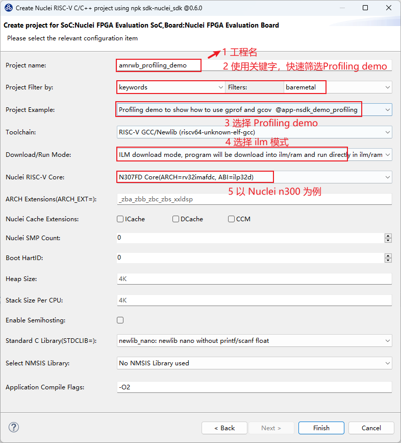

**Step 2: Port the amrwbenc bare-metal use case based on the Profiling demo project**

Delete the original use case in the application folder of the Profiling demo project and replace it with the amrwbenc use case, forming the following directory structure, and make sure it compiles successfully. 

The project used in this example is provided here; feel free to download and use it:  
[Download link for the project before optimization](https://drive.weixin.qq.com/s?k=ABcAKgdSAFcaVG02T9)

After downloading the zip package, you can import it directly into Nuclei Studio and run it (import steps: `File->Import->Existing Projects into Workspace->Next->Select archive file->select the zip archive->next`)

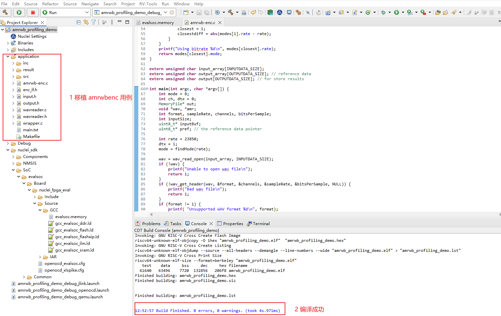

**Note:** When using Nuclei Studio in a Linux environment to import an old use case package, an error may occur (evalsoc.memory not found). This is caused by Windows path separators mixed into the Linux environment. This issue was fixed on 2026-02-09. The use case link in this document has been updated; you can re-download the new use case package, or directly fix the incorrect path. For details, refer to [Possible Issues with the Profiling and Code coverage Features](16-incomplete_data_output_when_using_profiling_function.md), Issue 4

**Step 3: Add gprof data collection code at the end of the use case, add the -pg compiler option, and recompile the code**

Add the gprof data collection code at the end of the main function:

~~~c
int main(int argc, char *argv[]) {
    /*
     * Code omitted
     */

    /*
     * Add gprof data collection code at the end of the main function
     */
    // TODO this is used for collect gprof and gcov data
    // See Components/profiling/README.md about how to set the IDE project properities
    extern long gprof_collect(unsigned long interface);
    gprof_collect(2);

    return 0;
}
~~~

There are three ways to collect gprof data, distinguished by different input parameters:

* gprof_collect(0): Collects gprof or gcov data in a buffer; while debugging the program, a GDB script can be used to dump the gcov or gprof binary file
* gprof_collect(1): Uses semihost to write the gprof or gcov data directly into a file
* gprof_collect(2): Prints the gcov or gprof data directly to the Console or Serial Terminal; the data can then be parsed and saved to the PC using the `Parse and Generate HexDump` feature in the IDE

For details, refer to [Profiling README](https://github.com/Nuclei-Software/nuclei-sdk/tree/master/Components/profiling#readme). Here, printing the gprof data to the serial port (Console or Serial Terminal) is used as an example.

Add the `-pg` compiler option to the code that needs profiling, then recompile the code:

**Note:** Select application and add the `-pg` compiler option to the key code. This use case contains only C code, so the `-pg` compiler option only needs to be added to the C code

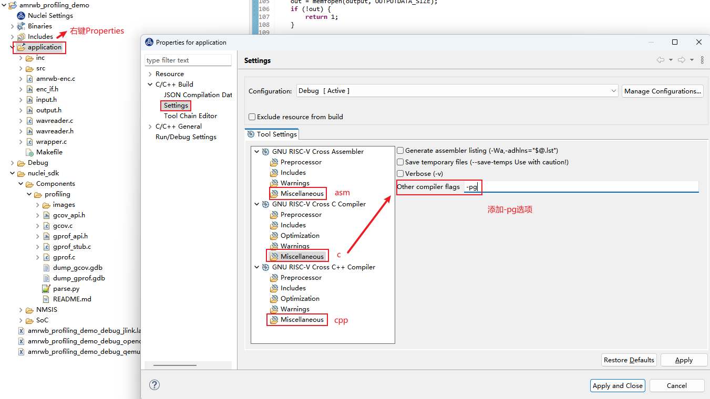

**Step 4: Run the program**

There are several ways to run the program:

* qemu emulator (no hardware required; a quick run-through of the flow, but the test results are not accurate)
* On-board testing (data collected based on a timer)
* Based on xl_cpumodel (Nuclei Near Cycle Model), see: [Demonstrating Nuclei Model NICE/VNICE Instruction Acceleration Through Profiling](18-demonstrate_NICE_VNICE_acceleration_of_the_Nuclei_Model_through_profiling.md)

This article only covers two methods: qemu simulation and on-board testing. The data collected by qemu is printed to the Console, while the actual on-board run outputs to the Serial Terminal of Nuclei Studio.

**Step 5: Parse the gprof data**

Start parsing the gprof data. **Note:** Some issues may be encountered in this step; for solutions, refer to [Possible Issues with the Profiling and Code coverage Features](16-incomplete_data_output_when_using_profiling_function.md)

* Testing on qemu, with logs printed to the Console

**Note**: qemu is only used for demonstration purposes. If accurate hotspot functions are desired, on-board testing is required.
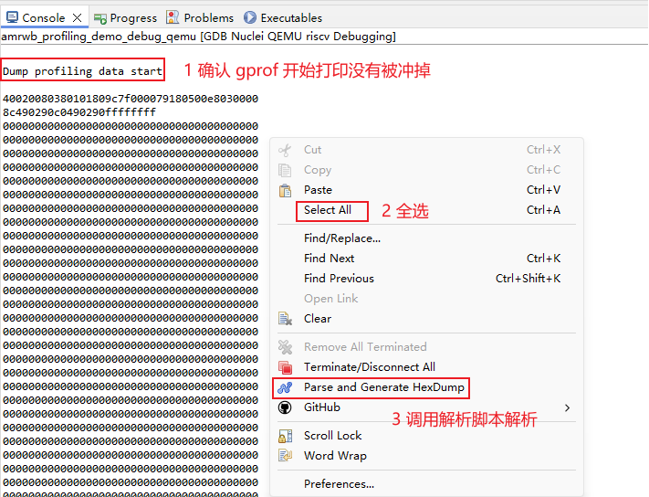   
After parsing is complete, a gmon.out file is generated in the current project directory. Double-click to open it:  
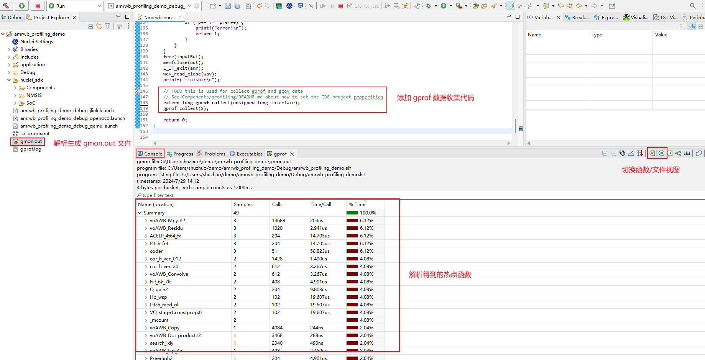   

* On-board testing

The steps for on-board testing are similar to those for qemu; the only difference is that the gprof data is output to the Serial Terminal.  

Configure the Serial Terminal:

**Note**: If the serial terminal tool is already open, make sure to clear the serial output before each gprof run (right-click -> Clear Terminal) to avoid affecting data parsing.  

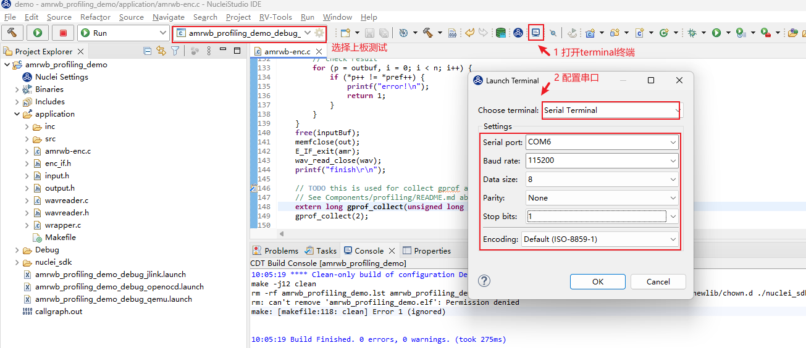  

Similarly, select all the logs, right-click and choose the `Parse and Generate HexDump` feature, and a gmon.out file will be generated in the project folder.
After refreshing the project, you can double-click to open this gmon.out file.

The figure below shows the gprof data obtained from an **actual run on the board**:  

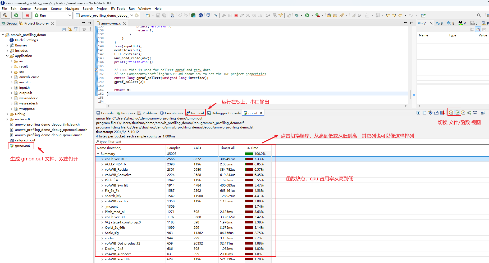

The TOP5 hotspot functions thus obtained are (actual on-board test):

~~~c
cor_h_vec_012
ACELP_4t64_fx
voAWB_Residu
voAWB_Convolve
voAWB_Syn_filt
~~~

Once the hotspot functions are identified, optimization can begin from them; optimizing the TOP functions often achieves twice the result with half the effort.

**Step 6: Optimize the hotspot functions**

There are several methods for optimizing hotspot functions:

* Adjust compiler parameters: use optimization levels such as O2/O3/Ofast for the entire project or for individual operators, and enable optimization options such as `-finline-functions` and `-funroll-all-loops`
* Optimize at the algorithm level: implement the hotspot functions with better algorithms
* Optimize using RISC-V extension instructions (RVP/RVV extensions, etc.)

Here, the RVP extension is used as an example. The hotspot functions are optimized with the RVP extension in descending order of hotness. Make sure the hardware in use supports the RVP extension.

**Example:**

The TOP1 hotspot function is `cor_h_vec_012`. Analyze the function and try to optimize it using the RVP extension:

In the code below, the sections delimited by `#if defined __riscv_xxldspn3x` represent code optimized with Nuclei N3 P extension instructions.
`__RV_DSMALDA` is a Nuclei N3 P extension instruction that performs 4 int16 multiplications in one pass, accumulates the results, and stores the result in an int64 variable.

For the Intrinsic APIs of these instructions, refer to [Nuclei P Extension Instruction Intrinsic API](https://github.com/Nuclei-Software/nuclei-sdk/blob/master/NMSIS/Core/Include/core_feature_dsp.h)

For the detailed RVP instruction manual, please contact Nuclei System Technology.

The optimized project is shown below. Compared with the project before optimization, only the `cor_h_vec_012` operator was optimized:

[Download link for the optimized project](https://drive.weixin.qq.com/s?k=ABcAKgdSAFc0ussmf0)

The code snippet optimized with Nuclei N3 P extension instructions is as follows:

~~~c
void cor_h_vec_012(
		Word16 h[],                           /* (i) scaled impulse response                 */
		Word16 vec[],                         /* (i) scaled vector (/8) to correlate with h[] */
		Word16 track,                         /* (i) track to use                            */
		Word16 sign[],                        /* (i) sign vector                             */
		Word16 rrixix[][NB_POS],              /* (i) correlation of h[x] with h[x]      */
		Word16 cor_1[],                       /* (o) result of correlation (NB_POS elements) */
		Word16 cor_2[]                        /* (o) result of correlation (NB_POS elements) */
		)
{
	Word32 i, j, pos, corr;
	Word16 *p0, *p1, *p2,*p3,*cor_x,*cor_y;
	Word32 L_sum1,L_sum2;
	cor_x = cor_1;
	cor_y = cor_2;
	p0 = rrixix[track];
	p3 = rrixix[track+1];
	pos = track;

	for (i = 0; i < NB_POS; i+=2)
	{
		p1 = h;
		p2 = &vec[pos];
#if defined __riscv_xxldspn3x
		Word32 tmp1, tmp2;
		int64_t sum64_1, sum64_2;
		int64_t p64_1, p64_2;
		sum64_1 = 0;
		sum64_2 = 0;
		for (j=62-pos ;(j - 4) >= 0; j -= 4)
		{
			p64_1 = *__SIMD64(p1)++;
			tmp1 = __RV_PKBB16(*(p2 + 1), *p2);
			tmp2 = __RV_PKBB16(*(p2 + 3), *(p2 + 2));
			p64_2 = __RV_DPACK32(tmp2, tmp1);
			sum64_1 = __RV_DSMALDA(sum64_1, p64_1, p64_2);

			tmp1 = __RV_PKBB16(*(p2 + 2), *(p2 + 1));
			tmp2 = __RV_PKBB16(*(p2 + 4), *(p2 + 3));
			p64_2 = __RV_DPACK32(tmp2, tmp1);
			sum64_2 = __RV_DSMALDA(sum64_2, p64_1, p64_2);
			p2 += 4;
		}
		L_sum1 = (Word32)sum64_1;
		L_sum2 = (Word32)sum64_2;
		for ( ;j >= 0; j--)
		{
			L_sum1 += *p1 * *p2++;
			L_sum2 += *p1++ * *p2;
		}
#endif
		L_sum1 += *p1 * *p2;
		L_sum1 = (L_sum1 << 2);
		L_sum2 = (L_sum2 << 2);

		corr = (L_sum1 + 0x8000) >> 16;
		cor_x[i] = vo_mult(corr, sign[pos]) + (*p0++);
		corr = (L_sum2 + 0x8000) >> 16;
		cor_y[i] = vo_mult(corr, sign[pos + 1]) + (*p3++);
		pos += STEP;

		p1 = h;
		p2 = &vec[pos];
#if defined __riscv_xxldspn3x
		sum64_1 = 0;
		sum64_2 = 0;
		for (j=62-pos ;(j - 4) >= 0; j -= 4)
		{
			p64_1 = *__SIMD64(p1)++;
			tmp1 = __RV_PKBB16(*(p2 + 1), *p2);
			tmp2 = __RV_PKBB16(*(p2 + 3), *(p2 + 2));
			p64_2 = __RV_DPACK32(tmp2, tmp1);
			sum64_1 = __RV_DSMALDA(sum64_1, p64_1, p64_2);

			tmp1 = __RV_PKBB16(*(p2 + 2), *(p2 + 1));
			tmp2 = __RV_PKBB16(*(p2 + 4), *(p2 + 3));
			p64_2 = __RV_DPACK32(tmp2, tmp1);
			sum64_2 = __RV_DSMALDA(sum64_2, p64_1, p64_2);
			p2 += 4;
		}
		L_sum1 = (Word32)sum64_1;
		L_sum2 = (Word32)sum64_2;
		for ( ;j >= 0; j--)
		{
			L_sum1 += *p1 * *p2++;
			L_sum2 += *p1++ * *p2;
		}
#endif
		L_sum1 += *p1 * *p2;
		L_sum1 = (L_sum1 << 2);
		L_sum2 = (L_sum2 << 2);

		corr = (L_sum1 + 0x8000) >> 16;
		cor_x[i+1] = vo_mult(corr, sign[pos]) + (*p0++);
		corr = (L_sum2 + 0x8000) >> 16;
		cor_y[i+1] = vo_mult(corr, sign[pos + 1]) + (*p3++);
		pos += STEP;
	}
	return;
}

~~~

After optimizing this operator with the P extension, **make sure to compile with** the dsp extension option enabled, as shown in the figure below:

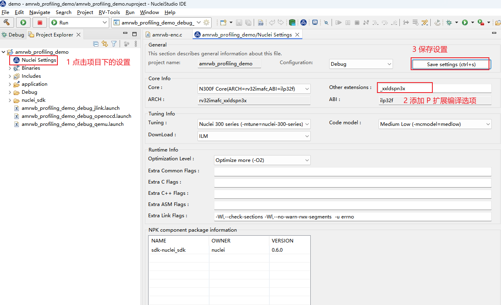

Clean the project and recompile, then run profiling again. You can see the optimization effect: the occupancy of the `cor_h_vec_012` function has decreased, and the function execution time has also been reduced.

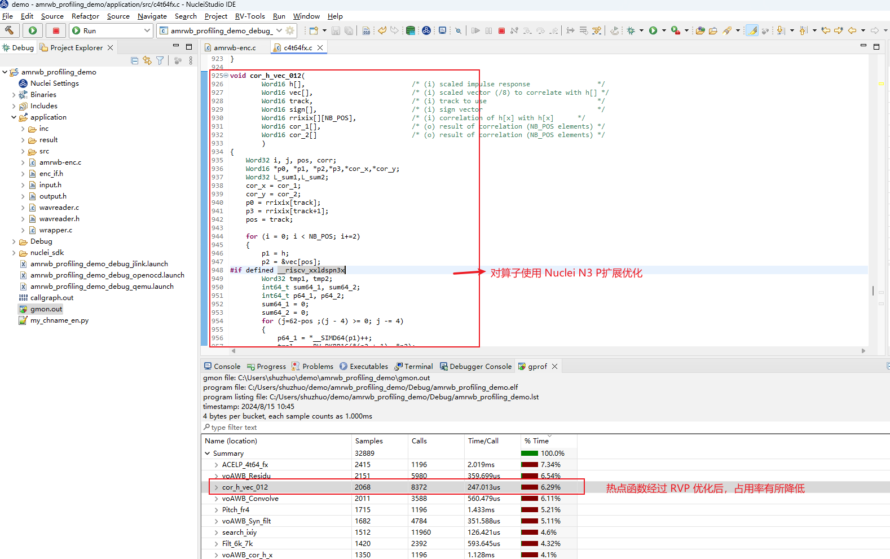

**Note:** The above is only a simple example. Users can analyze and optimize the hotspot functions one by one. Due to sampling and other factors during execution,
the distribution of TOP functions may fluctuate, which is normal. The final precise analysis requires counting the total number of cycles and then calculating the improvement ratio.

### 3 Call Graph Feature

The Call Graph in Nuclei Studio mainly obtains the function call relationships in the program by analyzing Profiling data.

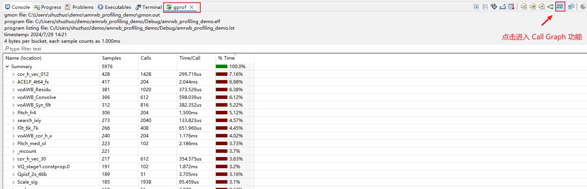

The Call Graph feature includes the following views:

* Radial View

This view displays the call relationships of the program.

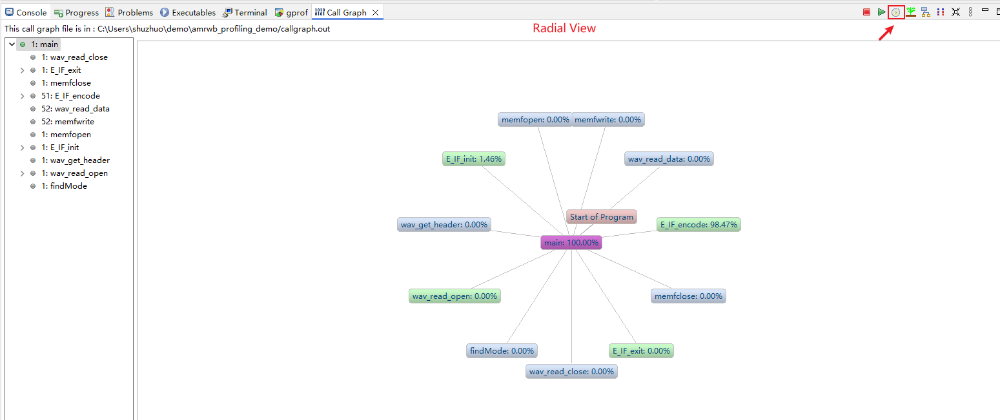

* Tree View

It displays the call relationships, time consumption ratios, call counts, and other information of the program selected in the Radial View. Selecting a function allows you to view its parent nodes, child nodes, and other information.

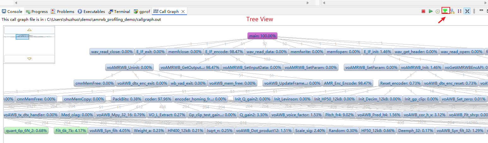

* Level View

Similar to the Tree View, it displays the call relationships and call counts of the program.

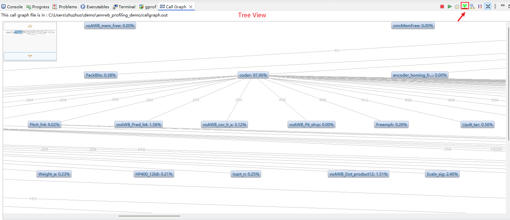

* Aggregate View

It presents the program's time consumption relationships very intuitively in the form of a block diagram.

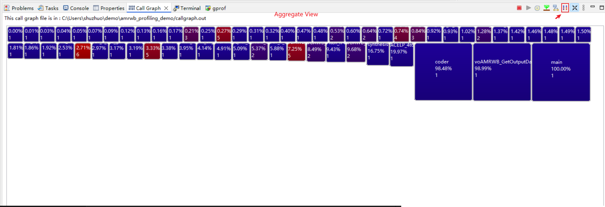

### 4 Code coverage Feature

The Code coverage feature in Nuclei Studio is based on the gcov tool provided by the gcc compiler. During compilation, the specified source files must be compiled with the specific compiler option `-coverage`. After a successful build, an ELF file is obtained, which is then run on the actual development board to collect the required coverage files (gcda/gcno files), and finally the results are displayed graphically in the IDE.

The usage is similar to the Profiling feature; only the differences are explained here:

**Step 1: Create a new Profiling demo project**  
**Step 2: Port the amrwbenc bare-metal use case based on the Profiling demo project**  
**Step 3: Add gcov data collection code, add the -coverage compiler option, and recompile the code**  

Add the gcov data collection code at the end of the main function:

~~~c
int main(int argc, char *argv[]) {
    /*
     * Code omitted
     */

    /*
     * Add gcov data collection code at the end of the main function
     */
    // TODO this is used for collect gprof and gcov data
    // See Components/profiling/README.md about how to set the IDE project properities
    extern long gcov_collect(unsigned long interface);
    gcov_collect(2);

    return 0;
}
~~~

Add the `-coverage` compiler option and recompile the code:

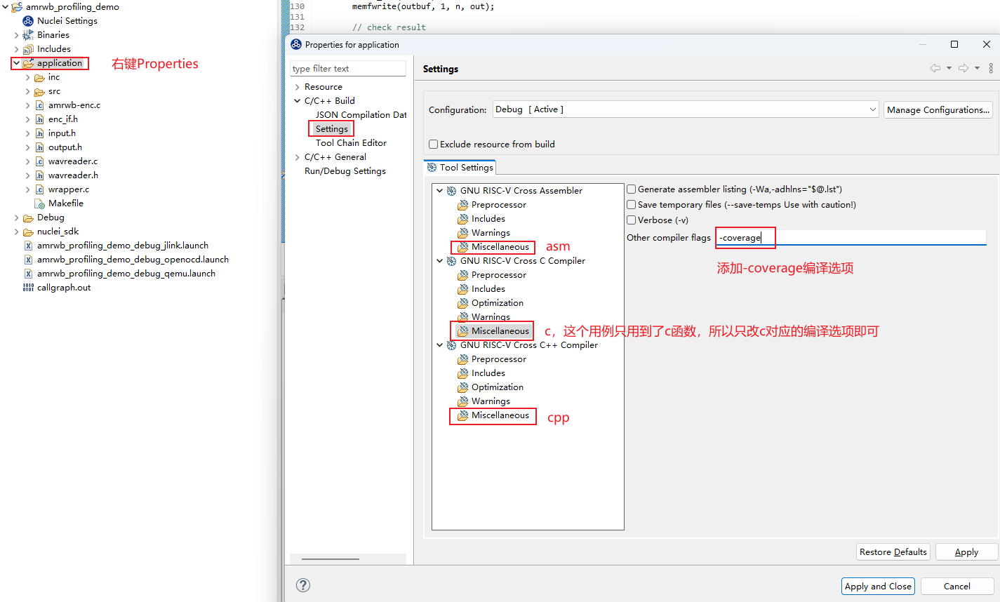

**Step 4: Run the program**  

You can run it in the qemu simulator or on the actual board (coverage statistics do not involve performance analysis, so either qemu or on-board testing works).  

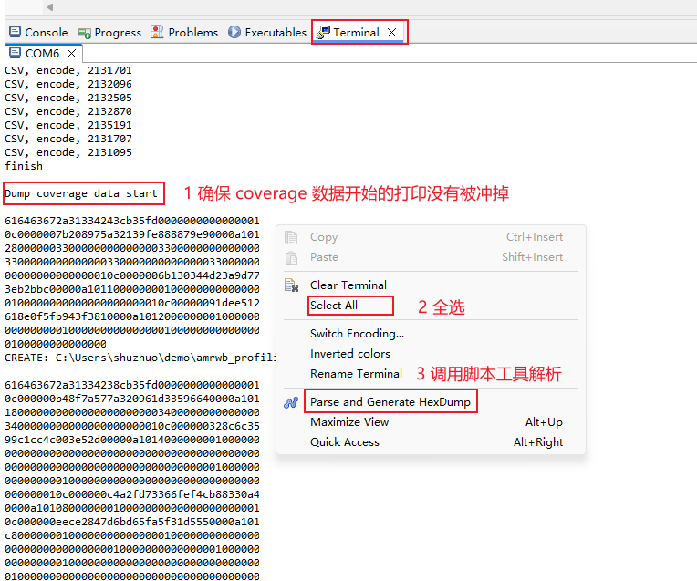  

After parsing, gcda and gcno files are generated in the Debug->application folder; double-click to open them  

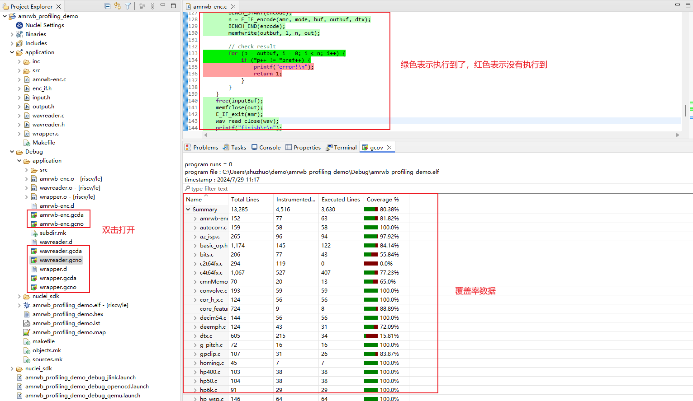  

### 5 Additional Notes

1. The Profiling and Code coverage features can be enabled at the same time. Simply add code that collects both Profiling data and Code coverage data, and add the `-pg -coverage` compiler options when compiling.

~~~c
    // TODO this is used for collect gprof and gcov data
    // See Components/profiling/README.md about how to set the IDE project properities
	extern long gprof_collect(unsigned long interface);
	extern long gcov_collect(unsigned long interface);
	gprof_collect(2);
	gcov_collect(2);
~~~

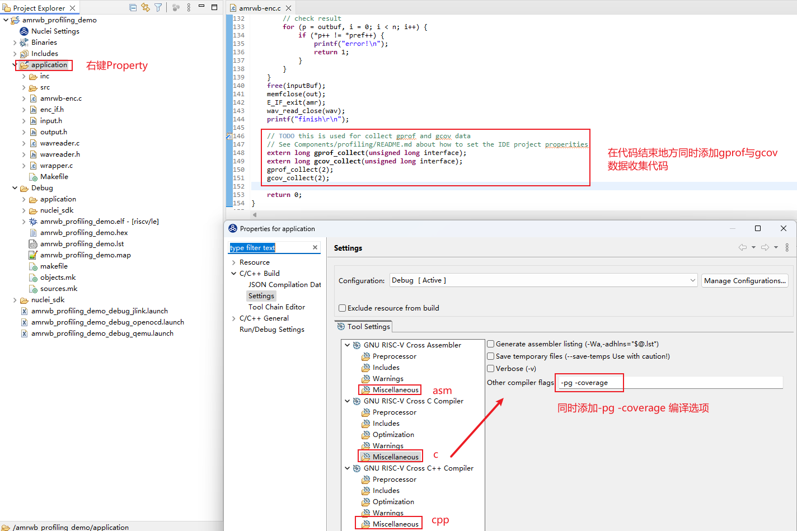

2. Issues that may be encountered when using Profiling:

* Insufficient on-chip memory, with error messages in the printed logs; gprof/gcov data requires a certain amount of space
* Incomplete data collected from the Console or Terminal leads to incorrect parsing; make sure the data has not been overwritten, and adjust the output size limit of the Console or Terminal
* After manually deleting the gmon.out file and parsing again, a "No files have been generated" error dialog pops up

For detailed solutions to the above issues, refer to [Possible Issues with the Profiling and Code coverage Features](16-incomplete_data_output_when_using_profiling_function.md)
