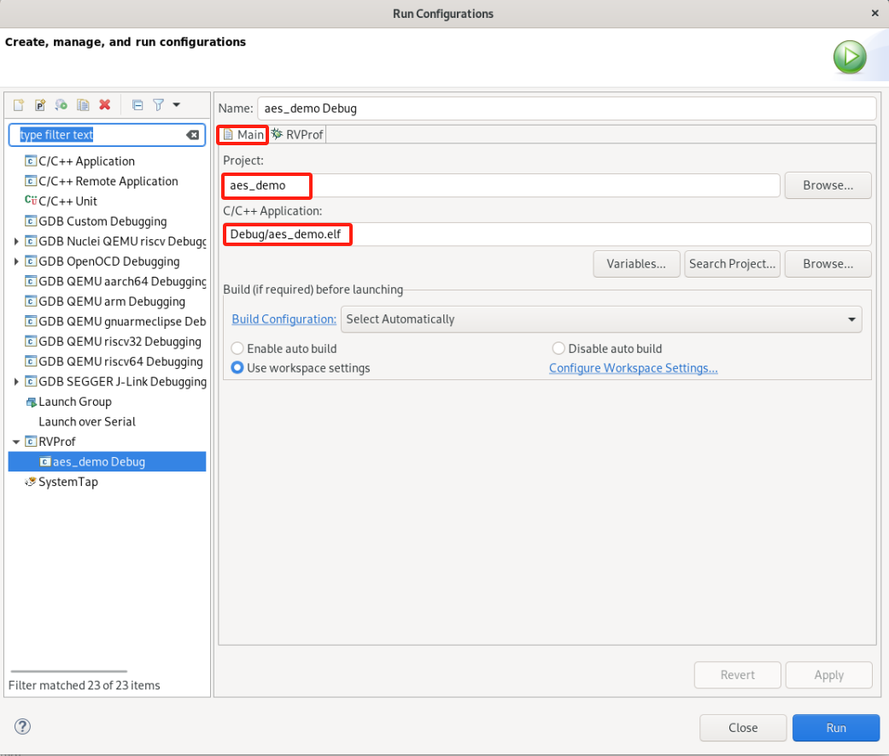
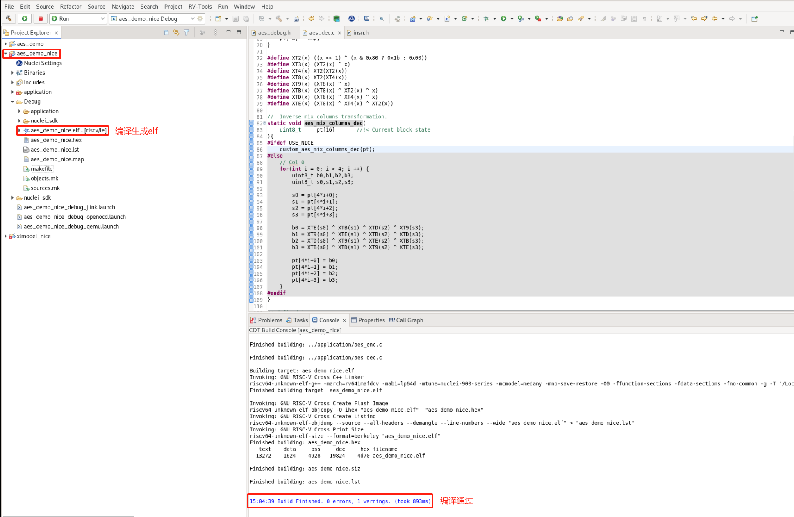
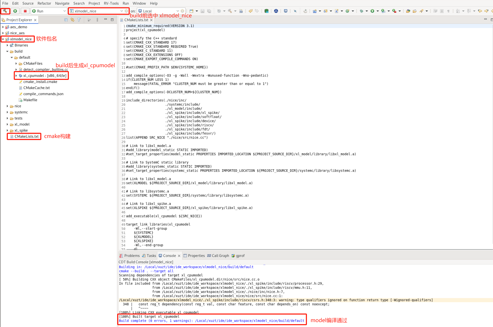
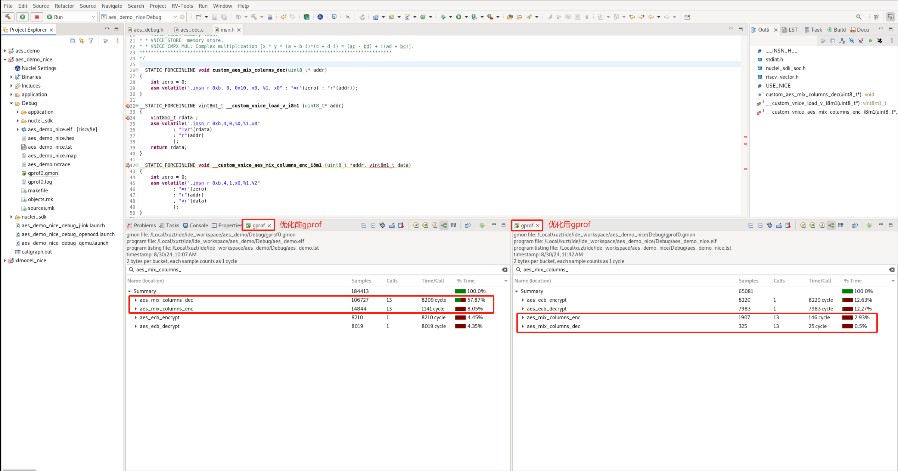

# 通过Profiling展示Nuclei Model NICE/VNICE指令加速

> 由于 Nuclei Model 仅支持Linux版本，所以此文档的测试都是基于 Nuclei Studio 的 Linux版本完成的。

## 背景描述

### Nuclei Model Profiling

在[一个例子用来展示 Profiling 以及 Code coverage 功能](https://nuclei-software.github.io/nuclei-studio/17-an_example_to_demonstrate_the_use_of_profiling_and_code_coverage/)中已经通过 qemu 以及上板测试两种运行方式展示了
如何在IDE中导入特定程序进行 Profiling，此文档中的一部分将介绍如何针对 Nuclei Model 完成 Profiling。

Nuclei Model Profiling 的优势：
- 无需使用开发板等硬件
- model 中内建了 gprof 功能，无需 Profiling 库和 `gcc -pg` 选项就可以产生 Profiling 文件
- 采取了指令级别的采样，可以进行指令级别的 Profiling 分析

在[NucleiStudio_User_Guide.pdf](https://download.nucleisys.com/upload/files/doc/nucleistudio/Nuclei_Studio_User_Guide.202406.pdf)相关章节对 Nuclei Model 如何仿真性能分析已经有较详细的描述，此文档以一个例子来展示其实际应用。

### NICE/VNICE 自定义指令加速

**NICE/VNICE**使得用户可以结合自己的应用扩展自定义指令，将芯来的标准处理器核扩展成为面向领域专用的处理器，**NICE** 具体编码规则可以参考 `Nuclei_RISC-V_ISA_Spec.pdf` 中的 `NICE Introduction`。**NICE** 适用于无需使用 RISCV Vector 的自定义指令，**VNICE** 适用于需要使用 RISCV Vector 的自定义指令。

[demo_nice](https://doc.nucleisys.com/nuclei_sdk/design/app.html#demo-nice)/[demo_vnice](https://doc.nucleisys.com/nuclei_sdk/design/app.html#demo-vnice)介绍了 Nuclei 针对 **NICE/VNICE** 的 demo 应用
是如何编译运行的，此文档将通过改造一个更为常见的 AES 加解密的例子，重点说明该如何使用 **NICE/VNICE** 指令替换热点函数以及如何在 model 里实现 **NICE/VNICE** 指令，然后通过 Nuclei Studio 的 Profiling 功能分析替换前后的程序性能。

## 解决方案

### 环境准备

由于 Nuclei Model 针对 AES 加解密程序 **NICE/VNICE** 指令做了新的实现，所以不能直接使用Linux 版的 Nuclei Studio，提供了实现 AES 加解密程序 **NICE/VNICE** 指令 model 的可执行程序 xl_cpumodel(https://drive.weixin.qq.com/s?k=ABcAKgdSAFc03skCLp)，用户需要替换到 Linux 版 Nuclei Studio 2024.06 `NucleiStudio/toolchain/nucleimodel/bin/xl_cpumodel`中使用。

Nuclei Studio：[NucleiStudio 2024.06 Linux](https://download.nucleisys.com/upload/files/nucleistudio/NucleiStudio_IDE_202406-lin64.tgz)

AES加解密demo：[优化前工程链接下载](https://drive.weixin.qq.com/s?k=ABcAKgdSAFcR7Ti53K)

### model Profiling

工程创建方式有两种：

- 方式1：用户可以使用 Nuclei Studio 中的 `demo_nice` 或 `demo_vnice` 模板来移植改造自己的 **NICE/VNICE** 程序
- 方式2：用户导入自己的工程到 Nuclei Studio 中，然后再添加NICE 内嵌汇编头文件、NICE CSR 使能等代码

此文档将采取前一种方式创建工程，由于此 demo 会用到 VNICE 指令，故创建 `demo_vnice` 工程，然后将 AES 加解密程序移植替换到其中。

#### step1：新建 demo_vnice 工程

File->New->New Nuclei RISC-V C/C++ Project，选择Nuclei FPGA Evalution Board->sdk-nuclei_sdk @0.6.0

**注意：** Nuclei SDK 需选择 0.6.0 及以后版本

#### step2：基于 demo_vnice 工程移植 aes_demo 裸机用例

移植 aes_demo 时，需要保留 `demo_vnice` 中的 `insn.h` 内嵌汇编头文件框架，方便后续添加自定义的 **NICE/VNICE** 指令，在 `main.c` 中需要保留 **NICE/VNICE** 指令执行前的 CSR 使能代码：

~~~c
__RV_CSR_SET(CSR_MSTATUS, MSTATUS_XS);
~~~

其余 `demo_vnice` 工程中 application 原始用例可删除，替换成 aes_demo 用例，形成如下目录结构，并确保能够编译通过。

#### step3：model 仿真程序

Nuclei Model 仿真程序需要配置 Nuclei Studio 中的 RVProf 运行配置，打开 Nuclei Studio 的 `Run Configurations` 后，先在 `Main` 选项卡中选择编译好的 elf 文件路径，然后在 `RVProf` 选项卡
的 `Config options` 中完成 model 运行配置 `--trace=1 --gprof=1 --logdir=Debug`，`--trace=1` 表示开启 rvtrace，`--gprof=1` 表示开启 gprof 功能生成 `*.gmon` 文件，`--logdir=Debug` 则表示最终生成的 `*.rvtrace` 文件、`*.gmon` 文件存存放的路径为当前工程下的 Debug 目录，取消勾选 `Start RVProf locally`，然后点击 `Apply` 和 `Run`，model 就开始运行程序了。

在 Console 中会看到 `Total elapsed time` 说明 model 已经完成仿真了：

#### step4：解析 gprof 数据

model 仿真程序完成后，双击打开生成的 `gprof*.gmon` 文件，切换到函数视图，点击 `% Time`从高到低排列函数 CPU 占用率，由于model采用了指令级别的采样，`Time/Call`显示的是每个函数的cycle数：

从而得到 CPU 占用率最高的 **TOP5**热点函数为：

~~~
aes_mix_columns_dec
aes_mix_columns_enc
aes_key_schedule
aes_ecb_decrypt
aes_ecb_encrypt
~~~

#### step5：NICE/VNICE 指令替换

获取热点函数后，用户可以通过研究热点函数算法特点，将其替换为 **NICE/VNICE** 指令，从而提升整体程序性能。

TOP1 热点函数为 `aes_mix_columns_dec`，实现了 AES 算法解密的逆混合列，输入一个状态矩阵，经过计算后原地址输出一个计算后的状态矩阵，实现了 Load 数据、逆混合运算以及 Store 数据，代码如下：

~~~c
static void aes_mix_columns_dec(
    uint8_t     pt[16]       //!< Current block state
){
    // Col 0
    for(int i = 0; i < 4; i ++) {
        uint8_t b0,b1,b2,b3;
        uint8_t s0,s1,s2,s3;
        
        s0 = pt[4*i+0];
        s1 = pt[4*i+1];
        s2 = pt[4*i+2];
        s3 = pt[4*i+3];

        b0 = XTE(s0) ^ XTB(s1) ^ XTD(s2) ^ XT9(s3);
        b1 = XT9(s0) ^ XTE(s1) ^ XTB(s2) ^ XTD(s3);
        b2 = XTD(s0) ^ XT9(s1) ^ XTE(s2) ^ XTB(s3);
        b3 = XTB(s0) ^ XTD(s1) ^ XT9(s2) ^ XTE(s3);

        pt[4*i+0] = b0;
        pt[4*i+1] = b1;
        pt[4*i+2] = b2;
        pt[4*i+3] = b3;
    }
}
~~~

由于输入输出地址一样，可以考虑用一条 **NICE** 指令替换，指令的 `opcode`、`funct3` 和 `funct7` 都可以在编码位域中自定义，该指令设置 `opcode` 为 `Custom-0`，`funct3` 设置为0，`funct7` 设置为0x10，寄存器只使用到 `rs1` 描述入参地址，不需要使用 `rd` 和 `rs2`，指令内嵌汇编如下：

~~~c
__STATIC_FORCEINLINE void custom_aes_mix_columns_dec(uint8_t* addr)
{
    int zero = 0;
    asm volatile(".insn r 0xb, 0, 0x10, x0, %1, x0" : "=r"(zero) : "r"(addr));
}
~~~

用户可以定义一个 `USE_NICE` 的宏选择是否使用 **NICE** ，改写 `aes_mix_columns_dec` 如下 ：

~~~c
static void aes_mix_columns_dec(
    uint8_t     pt[16]       //!< Current block state
){

#ifdef USE_NICE
    custom_aes_mix_columns_dec(pt);
#else
    // Col 0
    for(int i = 0; i < 4; i ++) {
        uint8_t b0,b1,b2,b3;
        uint8_t s0,s1,s2,s3;
        
        s0 = pt[4*i+0];
        s1 = pt[4*i+1];
        s2 = pt[4*i+2];
        s3 = pt[4*i+3];

        b0 = XTE(s0) ^ XTB(s1) ^ XTD(s2) ^ XT9(s3);
        b1 = XT9(s0) ^ XTE(s1) ^ XTB(s2) ^ XTD(s3);
        b2 = XTD(s0) ^ XT9(s1) ^ XTE(s2) ^ XTB(s3);
        b3 = XTB(s0) ^ XTD(s1) ^ XT9(s2) ^ XTE(s3);

        pt[4*i+0] = b0;
        pt[4*i+1] = b1;
        pt[4*i+2] = b2;
        pt[4*i+3] = b3;
    }
#endif
}
~~~

TOP2 热点函数为 `aes_mix_columns_enc`，和 TOP1 类似，实现的是 AES 加密的逆混合列，同样也是输入一个状态矩阵，经过计算后原地址输出一个计算后的状态矩阵：

~~~c
static void aes_mix_columns_enc(
    uint8_t     ct [16]       //!< Current block state
){
    for(int i = 0; i < 4; i ++) {
        uint8_t b0,b1,b2,b3;
        uint8_t s0,s1,s2,s3;
        
        s0 = ct[4*i+0];
        s1 = ct[4*i+1];
        s2 = ct[4*i+2];
        s3 = ct[4*i+3];

        b0 = XT2(s0) ^ XT3(s1) ^    (s2) ^    (s3);
        b1 =    (s0) ^ XT2(s1) ^ XT3(s2) ^    (s3);
        b2 =    (s0) ^    (s1) ^ XT2(s2) ^ XT3(s3);
        b3 = XT3(s0) ^    (s1) ^    (s2) ^ XT2(s3);

        ct[4*i+0] = b0;
        ct[4*i+1] = b1;
        ct[4*i+2] = b2;
        ct[4*i+3] = b3;
    }
}
~~~

考虑到指令实现可能无法只用1条指令完成，可使用2条 **VNICE** 指令替换此算法，第一条 load 16 byte 数据到 Vector 寄存器，第二条再完成计算以及 store。

指令的 `opcode`、`funct3` 和 `funct7` 仍然可以在编码位域中自定义，第一条指令使用 `rd` 描述 Vector 寄存器，`rs1` 描述入参地址，第二条指令使用 `rs1` 描述入参地址，`rs1` 描述入参 Vector 寄存器，
两条 **VNICE** 指令的内嵌汇编如下：

~~~c
__STATIC_FORCEINLINE vint8m1_t __custom_vnice_load_v_i8m1 (uint8_t* addr)
{
	vint8m1_t rdata ;
    asm volatile(".insn r 0xb,4,0,%0,%1,x0"
            : "=vr"(rdata)
            : "r"(addr)
            );
    return rdata;
}

__STATIC_FORCEINLINE void __custom_vnice_aes_mix_columns_enc_i8m1 (uint8_t *addr, vint8m1_t data)
{
	int zero = 0;
    asm volatile(".insn r 0xb,4,1,x0,%1,%2"
            : "=r"(zero)
            : "r"(addr)
            , "vr"(data)
            );
}
~~~

用户通过定义 Vector 寄存器以及使用上定义好的 VNICE 指令内嵌汇编改写 `aes_mix_columns_enc` 如下：

~~~c
static void aes_mix_columns_enc(
    uint8_t     ct [16]       //!< Current block state
){
#ifdef USE_VNICE
    uint32_t blkCnt = 16;
    size_t l;
    vint8m1_t vin;
    for (; (l = __riscv_vsetvl_e8m1(blkCnt)) > 0; blkCnt -= l) {
    	vin = __custom_vnice_load_v_i8m1(ct);
        __custom_vnice_aes_mix_columns_enc_i8m1(ct, vin);
    }
#else
    for(int i = 0; i < 4; i ++) {
        uint8_t b0,b1,b2,b3;
        uint8_t s0,s1,s2,s3;
        
        s0 = ct[4*i+0];
        s1 = ct[4*i+1];
        s2 = ct[4*i+2];
        s3 = ct[4*i+3];

        b0 = XT2(s0) ^ XT3(s1) ^    (s2) ^    (s3);
        b1 =    (s0) ^ XT2(s1) ^ XT3(s2) ^    (s3);
        b2 =    (s0) ^    (s1) ^ XT2(s2) ^ XT3(s3);
        b3 = XT3(s0) ^    (s1) ^    (s2) ^ XT2(s3);

        ct[4*i+0] = b0;
        ct[4*i+1] = b1;
        ct[4*i+2] = b2;
        ct[4*i+3] = b3;
    }
#endif
}
~~~

修改后的程序代码编译通过：

#### step6：在 Nuclei Model 中实现 NICE/VNICE 指令

首先需要下载支持用户配置自定义 **NICE/VNICE** 指令的原始 Nuclei Model 软件包[原始model软件包下载](https://drive.weixin.qq.com/s?k=ABcAKgdSAFccHEiAsM)，解压软件包为 `xlmodel_nice`，然后将其导入 Nuclei Studio。

导入步骤：File->Import->Projects from Folder or Archive->Next->Directory->选择 `xlmodel_nice`->Finish即可

如何使用 Nuclei Model 以及查看 `xlmodel_nice` 软件包的目录结构可以参考[Nuclei Model介绍](https://doc.nucleisys.com/nuclei_tools/xlmodel/)，`xlmodel_nice` 是由CMake构建的，用户无需修改即可编译，在
编译前选择 Nuclei Studio 的 launch bar 的 `xlmodel_nice`，然后点击编译，确保软件包本身编译通过，编译生成的 elf 文件所在路径为 `build/default/xl_cpumodel`：

打开 `nice.cc` 文件，用户需要用该文件的 `do_nice` 函数实现所有自定义的 **NICE/VNICE** 指令，当前 `do_nice` 里包含了针对 `demo_nice` 或 `demo_vnice` 的 Nuclei定义的 **NICE/VNICE** 指令，
用户可以参考其中注释完成自己的自定义指令。

**注意：** 当用户编写自定义 **NICE/VNICE** 指令时，需要关掉 `NUCLEI_NICE_SCALAR` 和 `NUCLEI_NICE_VECTOR`宏，以免和自定义的指令编码相冲突。

AES demo 中定义的 **NICE/VNICE** 指令实现如下图，通过指令的 `opcode`、`funct3` 和 `funct7` 编写条件判断语句指定该条指令，然后在其中实现指令行为以及指令 cycle 数添加。

**NICE** 指令实现可以参考 `nice/inc/decode_macros.h` 和 `xlspike/include/riscv` 中的头文件，**VNICE** 指令实现可以参考 `xlspike/include/riscv/v_ext_macros.h`，在指令实现完后，将自定义指令需要的 cycle 数 n 直接标定：`STATE.mcycle->bump(n);` 即可。

实现 AES demo 的 **NICE/VNICE** 指令的 Nuclei model 软件包[添加AES NICE指令model软件包下载](https://drive.weixin.qq.com/s?k=ABcAKgdSAFc1wrUKu1)，用户通过此软件包编译运行得到的 model 可执行程序和[环境准备](#环境准备)中的model可执行程序 `xl_cpumodel`一样，同样需要替换到 Linux 版 Nuclei Studio 2024.06 `NucleiStudio/toolchain/nucleimodel/bin/xl_cpumodel` 才可以使用生效。

#### step7：热点函数再分析

重新完成 step4：解析 gprof 数据，双击 `gprof0.gmon` 可以看到 CPU 占用率较高的热点函数已经没有 `aes_mix_columns_enc` 和 `aes_mix_columns_dec` 了：

搜索 `aes_mix_columns_enc` 和 `aes_mix_columns_dec` ，CPU 占用率 `aes_mix_columns_enc` 从8.05%降到了2.93%，`aes_mix_columns_dec` 从57.87%降到了0.42%，函数消耗 cycle 数 `aes_mix_columns_enc` 从1141 cycle 降到了146 cycle，`aes_mix_columns_dec` 从8209 cycle 降到了 21 cycle，说明了 **NICE/VNICE** 指令可以大幅的提高程序算法性能。

AES加解密 NICE/VNICE demo：[优化后工程链接下载](https://drive.weixin.qq.com/s?k=ABcAKgdSAFc5f6zPQW)

