# Demonstrate NICE/VNICE Instruction Acceleration of the Nuclei Model through Profiling

> Nuclei Model is supported on both Windows and Linux. All tests in this document were performed with the Windows version of Nuclei Studio (>= 2025.10).

## Background

### Nuclei Model Profiling

In [An Example to Demonstrate the Use of Profiling and Code Coverage in Nuclei Studio](https://nuclei-software.github.io/nuclei-studio/17-an_example_to_demonstrate_the_use_of_profiling_and_code_coverage/), two run modes — qemu and on-board testing — were used to show
how to import a specific program into the IDE for Profiling. Part of this document introduces how to perform Profiling on the Nuclei Model.

Advantages of Nuclei Model Profiling:  

- No development board or other hardware is required
- The model has a built-in gprof feature, so Profiling files can be generated without a Profiling library or the `gcc -pg` option
- It uses instruction-level sampling, enabling instruction-level Profiling analysis

The relevant chapters of [NucleiStudio_User_Guide.pdf](https://download.nucleisys.com/upload/files/doc/nucleistudio/Nuclei_Studio_User_Guide.202510.pdf) already describe in detail how to configure simulation performance analysis for the Nuclei Model. This document demonstrates its practical application with an example.

### NICE/VNICE Custom Instruction Acceleration

**NICE/VNICE** allows users to extend custom instructions based on their own applications, extending Nuclei's standard processor cores into domain-specific processors. For the detailed encoding rules of **NICE**, refer to the `NICE Introduction` section in `Nuclei_RISC-V_ISA_Spec.pdf`. **NICE** is suitable for custom instructions that do not use RISC-V Vector, while **VNICE** is suitable for custom instructions that do use RISC-V Vector.

[demo_nice](https://doc.nucleisys.com/nuclei_sdk/design/app.html#demo-nice)/[demo_vnice](https://doc.nucleisys.com/nuclei_sdk/design/app.html#demo-vnice) introduce how Nuclei's **NICE/VNICE** demo applications
are compiled and run. This document will adapt a more common AES encryption/decryption example, focusing on how to replace hotspot functions with **NICE/VNICE** instructions and how to implement **NICE/VNICE** instructions in the model, and then use Nuclei Studio's Profiling feature to analyze program performance before and after the replacement.

## Solution

### Environment Preparation

Nuclei Studio: [NucleiStudio 2025.10 Windows](https://download.nucleisys.com/upload/files/nucleistudio/NucleiStudio_IDE_202510-win64.zip)

### Model Profiling

There are two ways to create a project:

- Method 1: Use the `demo_nice` or `demo_vnice` template in Nuclei Studio to port and adapt your own **NICE/VNICE** program
- Method 2: Import your own project into Nuclei Studio, then add code such as the NICE inline assembly header file and NICE CSR enabling

This document uses the first method to create the project. Since this demo uses VNICE instructions, a `demo_vnice` project is created, and then the AES encryption/decryption program is ported into it.

#### step1: Create a new demo_vnice project

File->New->New Nuclei RISC-V C/C++ Project, select Nuclei FPGA Evalution Board->sdk-nuclei_sdk @0.6.0

**Note:** Nuclei SDK version 0.6.0 or later is required

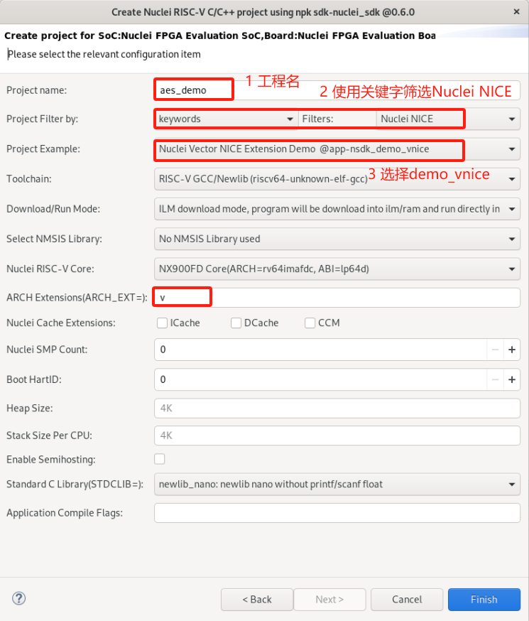

#### step2: Port the aes_demo bare-metal test case based on the demo_vnice project

When porting aes_demo, keep the `insn.h` inline assembly header file framework from `demo_vnice` so that custom **NICE/VNICE** instructions can be added later, and keep the CSR enabling code in `main.c` that runs before **NICE/VNICE** instructions are executed:

~~~c
__RV_CSR_SET(CSR_MSTATUS, MSTATUS_XS);
~~~

The remaining original application test cases in the `demo_vnice` project can be deleted and replaced with the aes_demo test case, resulting in the following directory structure. Make sure it compiles successfully.

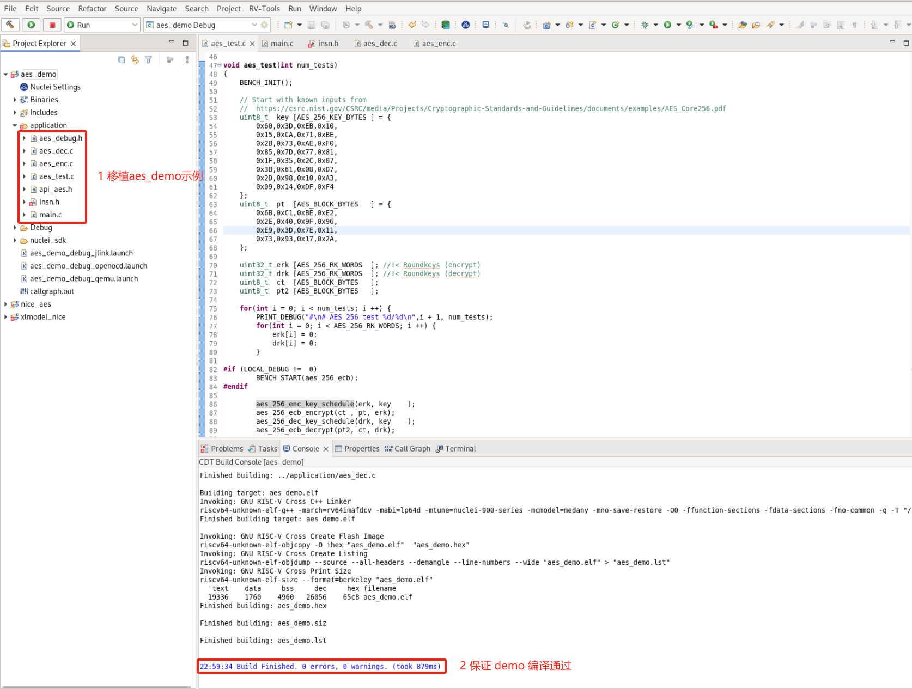

You can download our pre-ported AES encryption/decryption demo: [Download link for the AES project before optimization](https://drive.weixin.qq.com/s?k=ABcAKgdSAFcR7Ti53K)

After downloading the zip package, you can import it directly into Nuclei Studio and run it (import steps: `File->Import->Existing Projects into Workspace->Next->Select archive file->select the zip archive->next`).

#### step3: Simulate the program with the model

First, enable `LOCAL_DEBUG` in `aes_debug.h` to prepare for measuring the overall cycle count of the AES algorithm.

To simulate the program with the Model, configure the `GDB Nuclei Model riscv Debugging` configuration in Nuclei Studio as follows:

1. Open `Run Configurations` from the `Run` option in the Nuclei Studio main menu bar
2. Select the `GDB Nuclei Model riscv Debugging` configuration, right-click and select `New Configuration`; a Model configuration page named after the project is automatically generated, and the launch bar is updated accordingly
3. In the `Main` tab on the right, click `Search Project...` and select the compiled elf file
4. In the `Debugger` tab on the right, select `Browse` and locate the default path of the Nuclei Model executable: `NucleiStudio/toolchain/nucleimodel/bin/xl_cpumodel.exe`
5. In the `Debugger` tab on the right, complete the model run configuration under `Nuclei Setup`: `Nuclei RISC-V Core` and `Other Extensions` must be consistent with the `Core` and `Other extensions` settings in `Nuclei Settings`. When `Other Extensions` is empty, this parameter is not passed. `Enable Nuclei Model RVTrace` means rvtrace is generated at runtime. Add `--gprof=1` to `More options` to enable the Profiling feature. Then click `Apply` and `Run`, and the model starts running the program.

    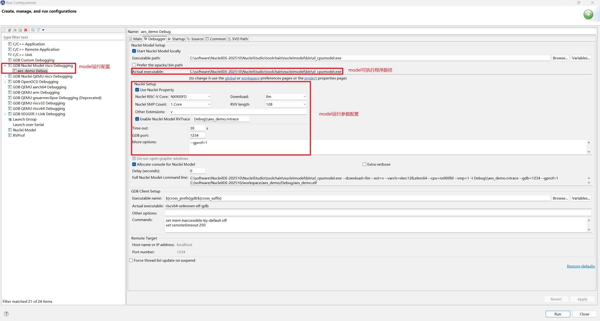

> Nuclei Studio (< 2025.10) can only configure the model using `Nuclei Model` in `Run Configurations`; for Nuclei Studio (>= 2025.10), it is recommended to switch to `GDB Nuclei Model riscv Debugging` for configuration

When `Total elapsed real time` appears in the Console, the model has finished the simulation, showing that the AES algorithm consumes 161108 cycles in total.

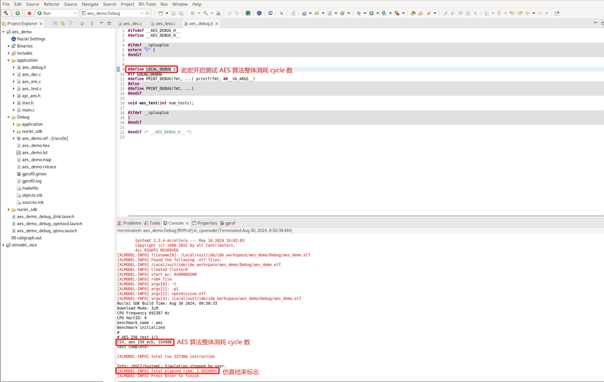

Disable `LOCAL_DEBUG` in `aes_debug.h` to remove program printouts. To measure Profiling data accurately, make sure the Nuclei Studio launch bar is set to `aes_demo Debug`, then Run the model again. After the run finishes, a Profiling file is generated:

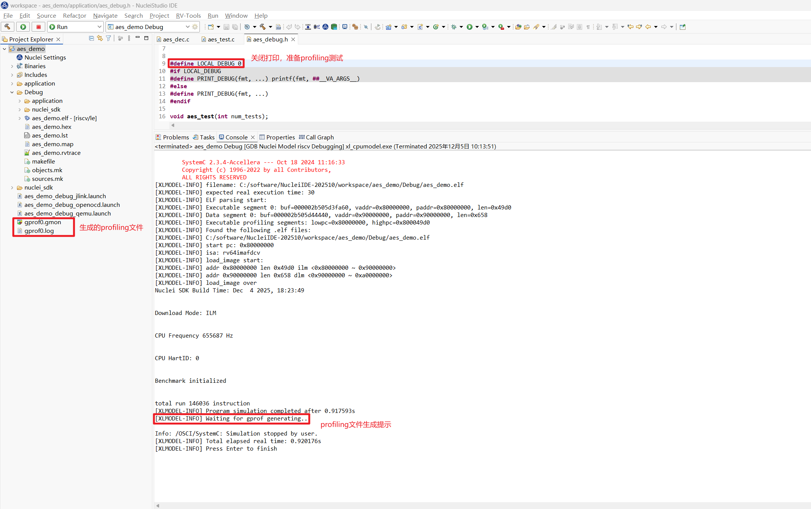

#### step4: Parse the gprof data

After the model simulation completes, double-click the generated `gprof*.gmon` file to open it, switch to the function view, and click `% Time` to sort functions by CPU usage from high to low.

**Note:** `Time/Call` shows the cycle count of each function's own body in the text section, not the cycle count of the entire function; cycles consumed by its child functions are not included.

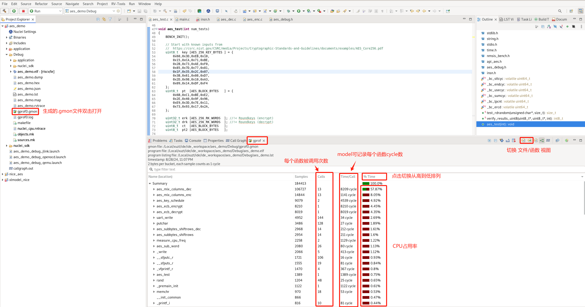

The **TOP5** hotspot functions with the highest CPU usage are:

~~~
aes_mix_columns_dec
aes_mix_columns_enc
aes_key_schedule
aes_ecb_decrypt
aes_ecb_encrypt
~~~

**Note:** At this point, back up the current `aes_demo` project and rename the copy to `aes_demo_nice`. This way, both projects can be opened in Nuclei Studio at the same time, making it easy to compare the Profiling results of the project optimized with **NICE/VNICE** instructions against the original `aes_demo` project.

#### step5: Replace hotspot functions with NICE/VNICE instructions

In the backed-up `aes_demo_nice` project, the user needs to study the algorithmic characteristics of the hotspot functions and replace them with **NICE/VNICE** instructions to improve overall program performance.

Add `#include "insn.h"` to the two C files `aes_dec.c` and `aes_dec.c`, which contain the **TOP5** hotspot functions of AES encryption/decryption, so that **NICE/VNICE** instruction replacements can be added.

The **TOP1** hotspot function is `aes_mix_columns_dec`, which implements the inverse MixColumns of AES decryption. It takes a state matrix as input, performs the computation, and outputs the computed state matrix to the same address. It implements Load data, the inverse mix computation, and Store data. The code is as follows:

~~~c
static void aes_mix_columns_dec(
    uint8_t     pt[16]       //!< Current block state
){
    // Col 0
    for(int i = 0; i < 4; i ++) {
        uint8_t b0,b1,b2,b3;
        uint8_t s0,s1,s2,s3;
        
        s0 = pt[4*i+0];
        s1 = pt[4*i+1];
        s2 = pt[4*i+2];
        s3 = pt[4*i+3];

        b0 = XTE(s0) ^ XTB(s1) ^ XTD(s2) ^ XT9(s3);
        b1 = XT9(s0) ^ XTE(s1) ^ XTB(s2) ^ XTD(s3);
        b2 = XTD(s0) ^ XT9(s1) ^ XTE(s2) ^ XTB(s3);
        b3 = XTB(s0) ^ XTD(s1) ^ XT9(s2) ^ XTE(s3);

        pt[4*i+0] = b0;
        pt[4*i+1] = b1;
        pt[4*i+2] = b2;
        pt[4*i+3] = b3;
    }
}
~~~

Since the input and output addresses are the same, consider replacing it with a single **NICE** instruction. The `opcode`, `funct3`, and `funct7` of the instruction can all be customized within the encoding fields. This instruction sets `opcode` to `Custom-0`, `funct3` to 0, and `funct7` to 0x10. Only the `rs1` register is used to describe the input parameter address; `rd` and `rs2` are not needed. The instruction is written into `insn.h` with the following inline assembly:

~~~c
__STATIC_FORCEINLINE void custom_aes_mix_columns_dec(uint8_t* addr)
{
    int zero = 0;
    asm volatile(".insn r 0xb, 0, 0x10, x0, %1, x0" : "=r"(zero) : "r"(addr));
}
~~~

The user can define a `USE_NICE` macro in `insn.h` to select whether to use **NICE**, and rewrite `aes_mix_columns_dec` in `aes_dec.c` as follows:

~~~c
static void aes_mix_columns_dec(
    uint8_t     pt[16]       //!< Current block state
){

#ifdef USE_NICE
    custom_aes_mix_columns_dec(pt);
#else
    // Col 0
    for(int i = 0; i < 4; i ++) {
        uint8_t b0,b1,b2,b3;
        uint8_t s0,s1,s2,s3;
        
        s0 = pt[4*i+0];
        s1 = pt[4*i+1];
        s2 = pt[4*i+2];
        s3 = pt[4*i+3];

        b0 = XTE(s0) ^ XTB(s1) ^ XTD(s2) ^ XT9(s3);
        b1 = XT9(s0) ^ XTE(s1) ^ XTB(s2) ^ XTD(s3);
        b2 = XTD(s0) ^ XT9(s1) ^ XTE(s2) ^ XTB(s3);
        b3 = XTB(s0) ^ XTD(s1) ^ XT9(s2) ^ XTE(s3);

        pt[4*i+0] = b0;
        pt[4*i+1] = b1;
        pt[4*i+2] = b2;
        pt[4*i+3] = b3;
    }
#endif
}
~~~

The **TOP2** hotspot function is `aes_mix_columns_enc`, which, similar to TOP1, implements the inverse MixColumns of AES encryption. It likewise takes a state matrix as input, performs the computation, and outputs the computed state matrix to the same address:

~~~c
static void aes_mix_columns_enc(
    uint8_t     ct [16]       //!< Current block state
){
    for(int i = 0; i < 4; i ++) {
        uint8_t b0,b1,b2,b3;
        uint8_t s0,s1,s2,s3;
        
        s0 = ct[4*i+0];
        s1 = ct[4*i+1];
        s2 = ct[4*i+2];
        s3 = ct[4*i+3];

        b0 = XT2(s0) ^ XT3(s1) ^    (s2) ^    (s3);
        b1 =    (s0) ^ XT2(s1) ^ XT3(s2) ^    (s3);
        b2 =    (s0) ^    (s1) ^ XT2(s2) ^ XT3(s3);
        b3 = XT3(s0) ^    (s1) ^    (s2) ^ XT2(s3);

        ct[4*i+0] = b0;
        ct[4*i+1] = b1;
        ct[4*i+2] = b2;
        ct[4*i+3] = b3;
    }
}
~~~

Considering that the instruction implementation may not be achievable with a single instruction, two **VNICE** instructions can be used to replace this algorithm: the first one loads 16 bytes of data into a Vector register, and the second one performs the computation and the store.

The `opcode`, `funct3`, and `funct7` of the instructions can still be customized within the encoding fields. The first instruction uses `rd` to describe the Vector register and `rs1` to describe the input parameter address; the second instruction uses `rs1` to describe the input parameter address and `rs1` to describe the input Vector register. The inline assembly for the two **VNICE** instructions is written into `insn.h` and defined as follows:

~~~c
__STATIC_FORCEINLINE vint8m1_t __custom_vnice_load_v_i8m1 (uint8_t* addr)
{
	vint8m1_t rdata ;
    asm volatile(".insn r 0xb,4,0,%0,%1,x0"
            : "=vr"(rdata)
            : "r"(addr)
            );
    return rdata;
}

__STATIC_FORCEINLINE void __custom_vnice_aes_mix_columns_enc_i8m1 (uint8_t *addr, vint8m1_t data)
{
	int zero = 0;
    asm volatile(".insn r 0xb,4,1,x0,%1,%2"
            : "=r"(zero)
            : "r"(addr)
            , "vr"(data)
            );
}
~~~

The user rewrites `aes_mix_columns_enc` in `aes_enc.c` by defining a Vector register and using the VNICE instruction inline assembly defined above, as follows:

~~~c
static void aes_mix_columns_enc(
    uint8_t     ct [16]       //!< Current block state
){
#ifdef USE_NICE
    uint32_t blkCnt = 16;
    size_t l;
    vint8m1_t vin;
    for (; (l = __riscv_vsetvl_e8m1(blkCnt)) > 0; blkCnt -= l) {
    	vin = __custom_vnice_load_v_i8m1(ct);
        __custom_vnice_aes_mix_columns_enc_i8m1(ct, vin);
    }
#else
    for(int i = 0; i < 4; i ++) {
        uint8_t b0,b1,b2,b3;
        uint8_t s0,s1,s2,s3;
        
        s0 = ct[4*i+0];
        s1 = ct[4*i+1];
        s2 = ct[4*i+2];
        s3 = ct[4*i+3];

        b0 = XT2(s0) ^ XT3(s1) ^    (s2) ^    (s3);
        b1 =    (s0) ^ XT2(s1) ^ XT3(s2) ^    (s3);
        b2 =    (s0) ^    (s1) ^ XT2(s2) ^ XT3(s3);
        b3 = XT3(s0) ^    (s1) ^    (s2) ^ XT2(s3);

        ct[4*i+0] = b0;
        ct[4*i+1] = b1;
        ct[4*i+2] = b2;
        ct[4*i+3] = b3;
    }
#endif
}
~~~

The modified program code compiles successfully: (`aes_demo_nice` project)

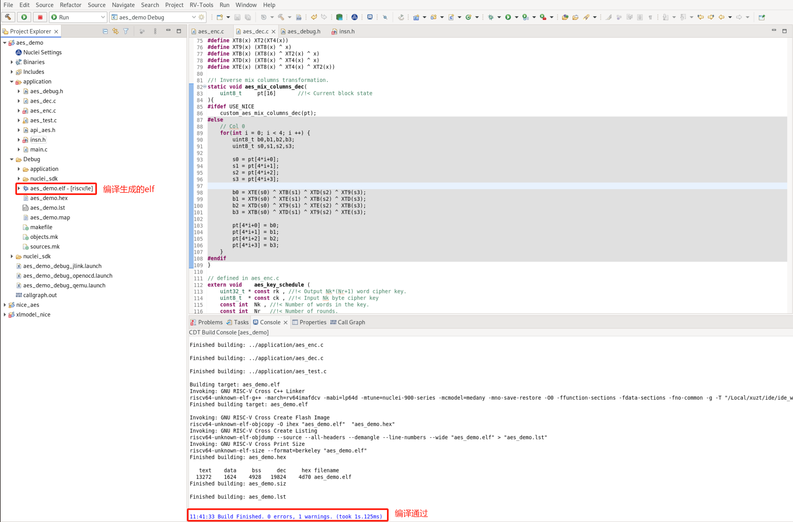

#### step6: Implement NICE/VNICE instructions in the Nuclei Model

First, download the original Nuclei Model software package that supports user-configured custom **NICE/VNICE** instructions: [Download the original model package](https://drive.weixin.qq.com/s?k=ABcAKgdSAFcCirwEWY). Extract the package as `xlmodel_nice`, then import it into Nuclei Studio.

Import steps: File->Import->Projects from Folder or Archive->Next->Directory->select `xlmodel_nice`->Finish

For how to use the Nuclei Model and the directory structure of the `xlmodel_nice` package, refer to the [Nuclei Model Introduction](https://doc.nucleisys.com/nuclei_tools/xlmodel/). `xlmodel_nice` is built with CMake and can be compiled without any modification. Before
compiling, select `xlmodel_nice` in the Nuclei Studio launch bar, then click Build, and make sure the package itself compiles successfully:

> For Nuclei Studio (< 2025.10), the generated elf file is located at `build/default/xl_cpumodel`

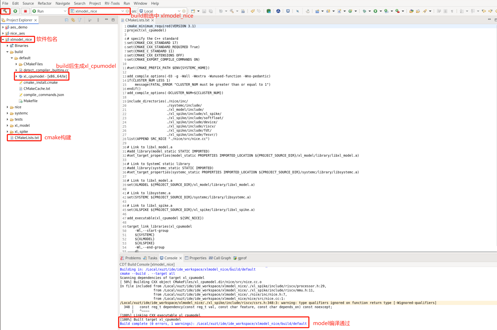

Open the `nice.cc` file. The user needs to implement all custom **NICE/VNICE** instructions in the `do_nice` function of this file. Currently, `do_nice` contains the **NICE/VNICE** instructions defined by Nuclei for `demo_nice` or `demo_vnice`;
the user can refer to the comments in it to complete their own custom instructions.

**Note:** When writing custom **NICE/VNICE** instructions, the user needs to disable the `NUCLEI_NICE_SCALAR`/`NUCLEI_NICE_VECTOR` macros corresponding to Nuclei's `demo_nice`/`demo_vnice`, so that they do not conflict with the encoding of the user's custom instructions.

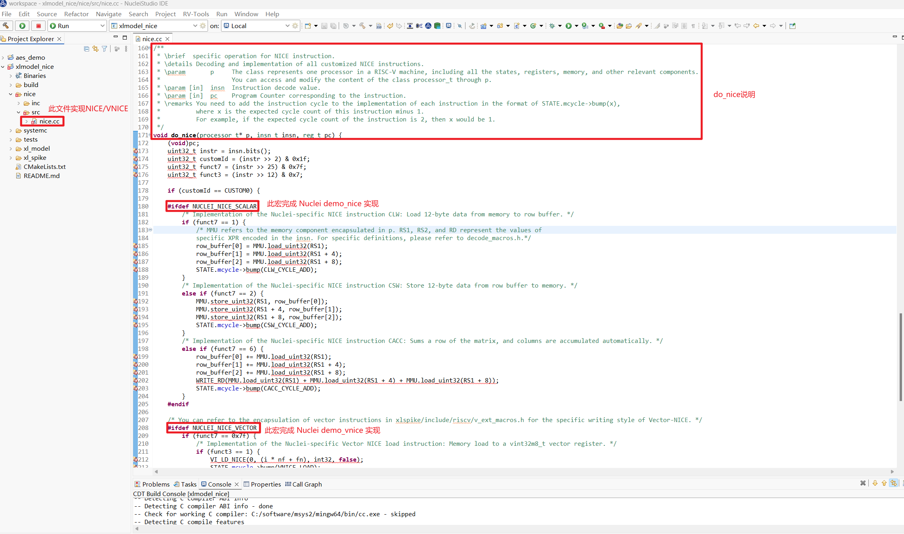

The implementation of the **NICE/VNICE** instructions defined in the AES demo is shown in the figure below. Conditional statements written against the instruction's `opcode`, `funct3`, and `funct7` identify each instruction, within which the instruction behavior and the instruction cycle count are implemented.

In the **NICE** instruction implementation, the `MMU` macro represents memory access: use `MMU.load_uint<n>` to load memory and `MMU.store_uint<n>` to store memory. The `RD`, `RS1`, `RS2`, and `RS3` macros represent the values in their corresponding scalar registers, and the `FRS1`, `FRS2`, and `FRS3` macros represent the values in their corresponding floating-point registers. For the usage of these macros, refer to `nice/inc/decode_macros.h`.

In the **VNICE** instruction implementation, memory is still accessed with the `MMU` macro, but Vector register data is stored in the `P.VU.elt` class. The user can refer to `xlspike/include/riscv/v_ext_macros.h` to write the related code.

After implementing the instructions, directly specify the cycle count n required by the custom instruction: `STATE.mcycle->bump(n);`. Here, based on the theoretical values of implementing this algorithm in hardware with **NICE/VNICE**, `custom_aes_mix_columns_dec` is specified as 7 cycles, `__custom_vnice_load_v_i8m1` as 1 cycle, and `__custom_vnice_aes_mix_columns_enc_i8m1` as 2 cycles.

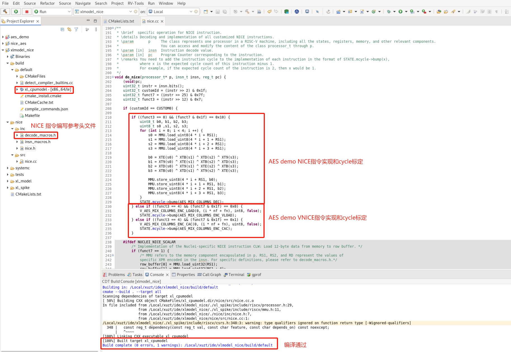

The above describes how the user adds custom **NICE/VNICE** instructions from the original Nuclei Model package. Next, the newly compiled model executable needs to be imported into Nuclei Studio. To avoid confusion with the name of Nuclei Studio's original model, the model can be imported into a created path such as `NucleiStudio/toolchain/nucleimodel/bin_aes/`. We provide two ways to obtain the model executable:  

1. The Nuclei model software package that implements the AES demo **NICE/VNICE** instructions: [Model package with AES NICE instructions added](https://drive.weixin.qq.com/s?k=ABcAKgdSAFcrcrb4T6). After compiling it, import the `xl_cpumodel` executable into the above path.
2. A pre-compiled model executable: [xl_cpumodel](https://drive.weixin.qq.com/s?k=ABcAKgdSAFcB1NbrL1). Import it directly into the above path.

#### step7: Re-analyze the hotspot functions

**Note:** You must complete the model import described in step6 — the model implementing the **NICE/VNICE** instructions — into Nuclei Studio before you can use the model to Run the `aes_demo_nice` project.

First, open `Run Configurations` from the `Run` option in the Nuclei Studio main menu bar. A new `GDB Nuclei Model riscv Debugging` run configuration `aes_demo_nice Debug` needs to be added for the model configuration. In the `Main` tab, select `aes_demo_nice.elf`:

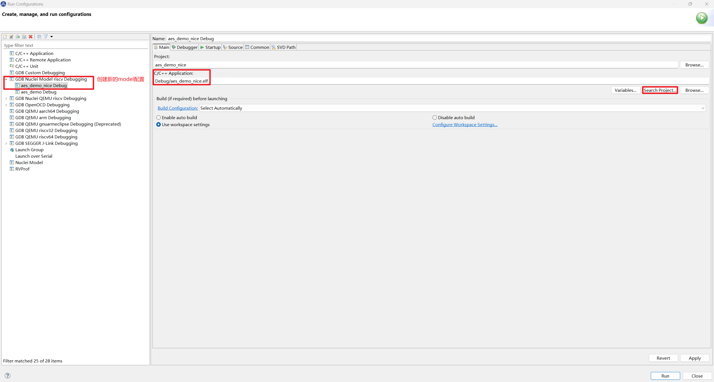

Then, in the `Debugger` tab, change the model `Executable path` to the executable path of the model newly modified in step6: `.../NucleiStudio/toolchain/nucleimodel/bin_aes/xl_cpumodel`:

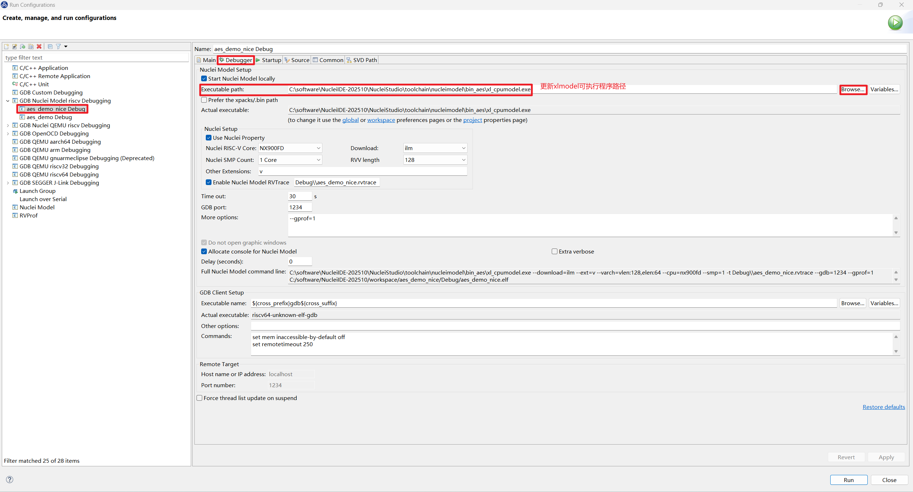

Before running, enable `LOCAL_DEBUG` in `aes_debug.h` to measure the overall cycle count of the optimized AES algorithm. Select `aes_demo_nice Debug` in the Nuclei Studio launch bar and Run the model. The result shows that the total cycle count of the optimized AES algorithm dropped from 161108 before optimization to 42066 cycles.

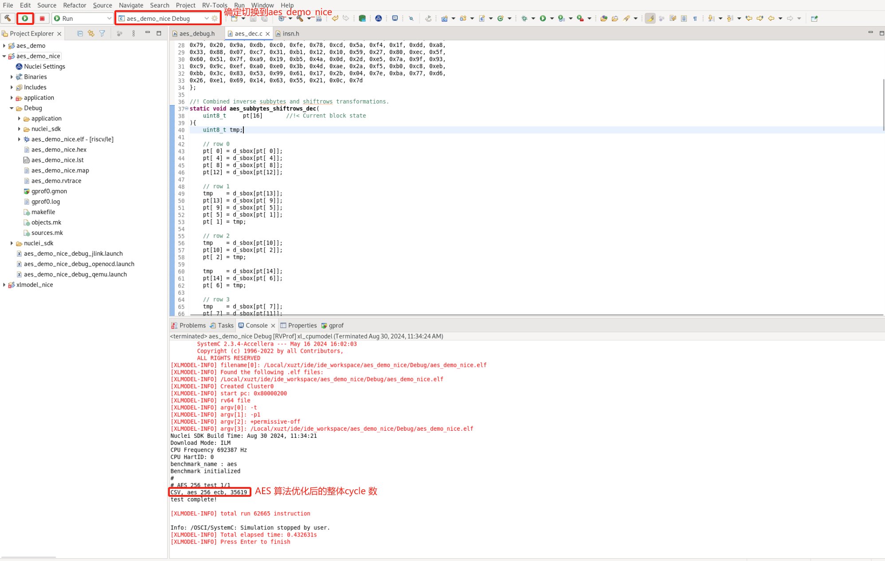

Disable `LOCAL_DEBUG` in `aes_debug.h` and Run the model again to measure Profiling data. Double-click `gprof0.gmon`, and you can see that `aes_mix_columns_enc` and `aes_mix_columns_dec` are no longer among the hotspot functions with high CPU usage:

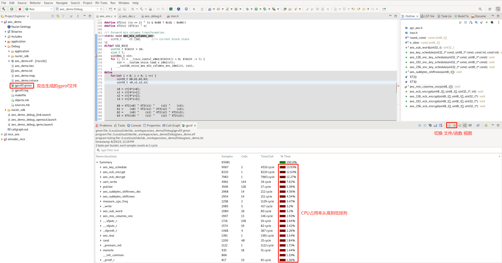

Searching for `aes_mix_columns_enc` and `aes_mix_columns_dec`, the CPU usage of `aes_mix_columns_enc` dropped from 8.05% to 2.93%, and that of `aes_mix_columns_dec` dropped from 57.87% to 0.5%. The Time per Call cycle consumption of `aes_mix_columns_enc` dropped from 1141 cycles to 146 cycles, and that of `aes_mix_columns_dec` dropped from 8209 cycles to 25 cycles. This demonstrates that replacing hotspot functions with **NICE/VNICE** instructions can greatly improve program algorithm performance.

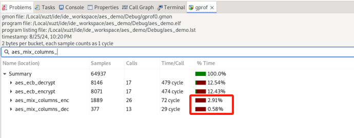

The data statistics are as follows: (`enc`: `aes_mix_columns_enc`, `dec`: `aes_mix_columns_dec`)

| Function                    | Before Optimization | NICE/VNICE Optimization  |
|-----------------------------|---------------------|--------------------------|
| CPU Usage `%` (`enc`)       | 8.05                | 2.93                     |
| CPU Usage `%` (`dec`)       | 57.87               | 0.5                      |
| Time per Call Cycles (`enc`)| 1,141               | 146                      |
| Time per Call Cycles (`dec`)| 8,209               | 25                       |

| AES Program Total           | Before Optimization | NICE/VNICE Optimization  |
|-----------------------------|---------------------|--------------------------|
| Cycles                      | 161,108             | 42,066                   |

AES encryption/decryption NICE/VNICE demo: [Download link for the AES project after optimization](https://drive.weixin.qq.com/s?k=ABcAKgdSAFc5f6zPQW)
