# Rapid Verification of NICE/VNICE Instruction Acceleration with Nuclei Model and NICE Wizard

> Nuclei Model is available for both Windows and Linux. All tests in this document were performed on the Windows version of Nuclei Studio (>= 2025.10).

## Background

### xlmodel_nice

Nuclei Model continuously updates the `xlmodel_nice` software package, which allows users to customize their own `NICE/VNICE` implementations. Users implement the specific instruction behavior in `xlmodel_nice/nice/src/nice.cc` and build a new Nuclei Model that applications can be configured to call.

### Nuclei NICE Wizard

Nuclei NICE Wizard is a `NICE/VNICE` instruction generation tool provided in Nuclei Studio. After configuring custom instructions, the user can automatically generate two files:

1. `insn.h`: the instruction inline assembly header file. The user needs to add the instruction inline assembly from this file into the application header file.
2. `nice.cc`: the instruction implementation file. The user needs to add the instruction decode framework from this file into `xlmodel_nice/nice/src/nice.cc`.

### test code

In batch matrix operations common in AI and deep learning, there are scenarios where small matrix blocks need to be processed repeatedly. In this test, an algorithm function that performs multiplication and accumulation on multiple scalar 4x4 matrices is used as the `golden_case`. Then NICE Wizard is used to generate `NICE/VNICE` acceleration instructions, which are added to the test application and the `xlmodel_nice` software package project respectively and recompiled. Finally, Nuclei Model is run to observe the instruction count and cycle count of the optimized algorithm function, so as to evaluate the `NICE/VNICE` acceleration effect.

## Solution

### Environment Preparation

> The NICE Wizard related features integrated in Nuclei Studio IDE must be used together with the Nuclei CPU Model - NICE Support (xlmodel_nice) software package.

**Nuclei Studio**:

- [NucleiStudio 202510 Windows](https://download.nucleisys.com/upload/files/nucleistudio/NucleiStudio_IDE_202510-win64.zip)
- [NucleiStudio 202510 Linux](https://download.nucleisys.com/upload/files/nucleistudio/NucleiStudio_IDE_202510-lin64.tgz)

**xlmodel_nice**:

- [Original `xlmodel_nice` package Windows](https://drive.weixin.qq.com/s?k=ABcAKgdSAFcCirwEWY)
- [Original `xlmodel_nice` package Linux](https://drive.weixin.qq.com/s?k=ABcAKgdSAFcTgr1Dbv)

### Running the Original Program on Nuclei Model

**Step 1: Import the original Nuclei SDK project**

[Download link for the project before optimization](https://drive.weixin.qq.com/s?k=ABcAKgdSAFcbbXAjde)

After downloading the zip package, you can import it directly into Nuclei Studio and run it (import steps: `File->Import->Existing Projects into Workspace->Select archive file->select the zip archive->Finish`).

**Step 2: Build the original Nuclei SDK project**

Build the original project, and make sure the build succeeds and the generated elf file can be found under Debug:

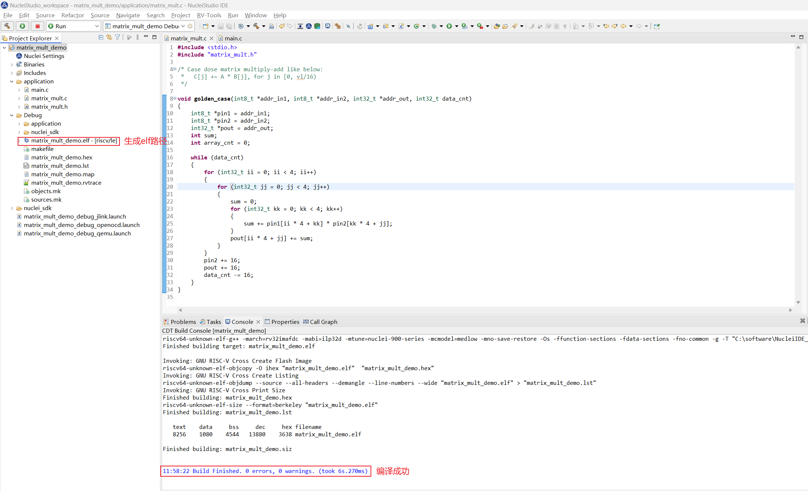

**Step 3: Run the original Nuclei SDK project**

Before running the program on Nuclei Model, you first need to confirm the `Core` configuration and the `Other extensions` configuration in the project's `Nuclei Settings`, as these configurations need to be passed to the Model. The `Core` currently used is `n900fd`, and `Other extensions` is not configured.

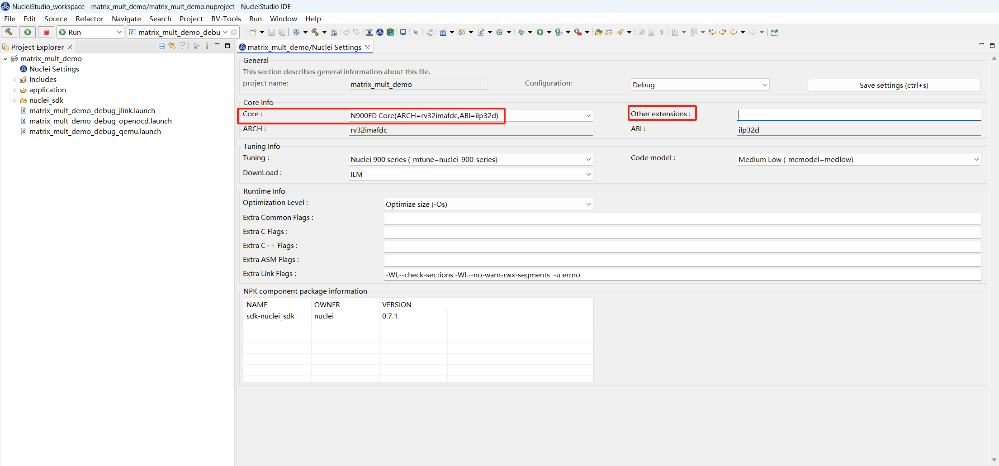

Model simulation requires configuring the `GDB Nuclei Model riscv Debugging` configuration in Nuclei Studio. The steps are as follows:

1. Open `Run Configurations` from the `Run` option in the Nuclei Studio main menu bar.
2. Select the `GDB Nuclei Model riscv Debugging` configuration, right-click and choose `New Configuration`. A Model configuration page named after the project will be automatically generated, and the launch bar will be updated accordingly.
3. In the `Main` tab on the right, click `Search Project...` and select the built elf file.
4. In the `Debugger` tab on the right, select `Browse` and locate the default path of the Nuclei Model executable: `NucleiStudio/toolchain/nucleimodel/bin/xl_cpumodel.exe`.
5. In the `Nuclei Setup` section of the `Debugger` tab on the right, complete the model run configuration. The selected `Nuclei RISC-V Core` and `Other Extensions` must be consistent with the `Core` and `Other extensions` configured in `Nuclei Settings`. When `Other Extensions` is empty, this parameter is not passed. `Enable Nuclei Model RVTrace` means that rvtrace is generated at runtime. Then click `Apply` and `Run`, and the model starts running the program.

    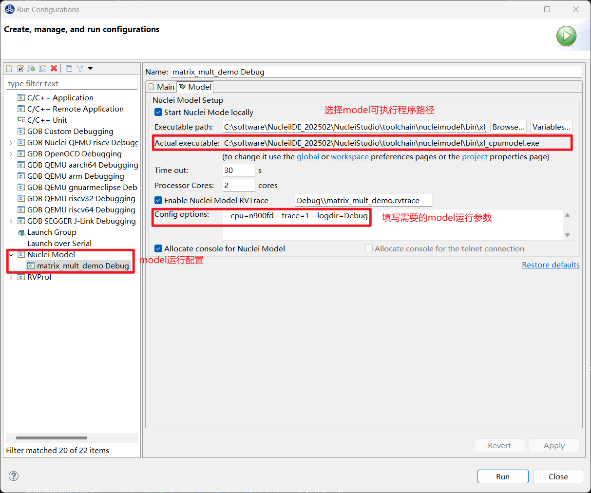

> Nuclei Studio (< 2025.10) can only use `Nuclei Model` in `Run Configurations` to configure the model. For Nuclei Studio (>= 2025.10), it is recommended to switch to `GDB Nuclei Model riscv Debugging`.

When `Total elapsed real time` appears in the Console, it means the model has finished the simulation. The program extracts the instruction count and cycle count of the scalar matrix multiplication algorithm function `golden_case` as follows:

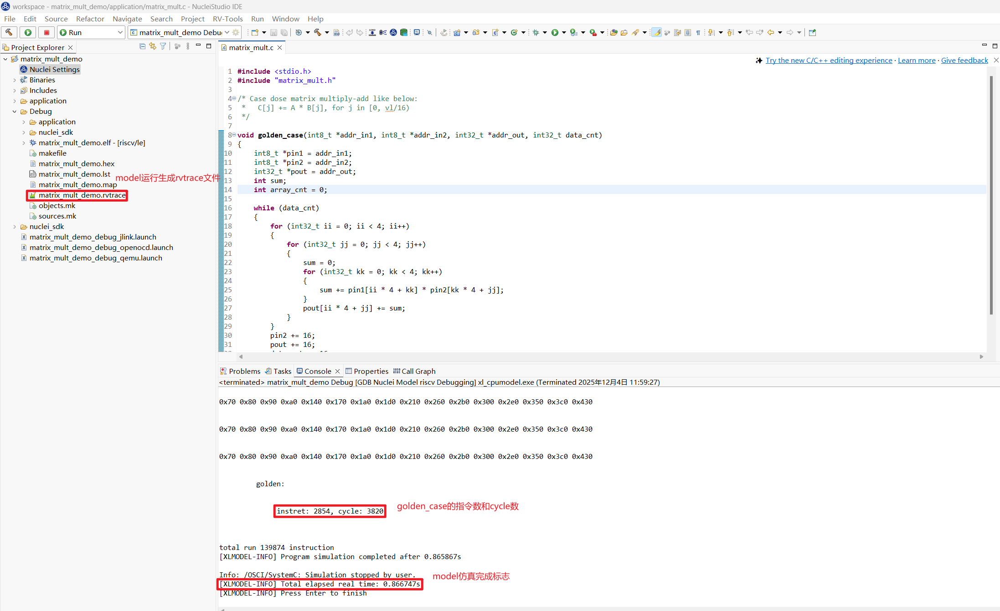

### NICE Instruction Replacement

**Step 1: Build the xlmodel_nice package**

After downloading and unzipping the `xlmodel_nice` zip package, you can import it directly into Nuclei Studio and run it (import steps: `File->Import->Projects from Folder or Archive->Next->Directory->select the xlmodel_nice folder->Finish`).

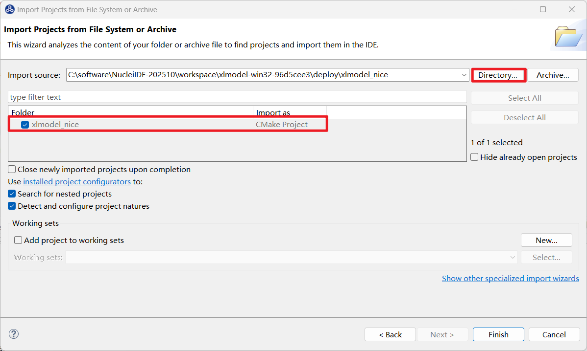

Before building `xlmodel_nice`, you need to configure the xlmodel build environment first ([xlmodel_nice build environment configuration](https://doc.nucleisys.com/nuclei_tools/xlmodel/intro.html#nice-build)). Then build to make sure the original package can be successfully compiled to generate the model executable:

> For Nuclei Studio (< 2025.10), the generated elf file is located at `build/default/xl_cpumodel`.

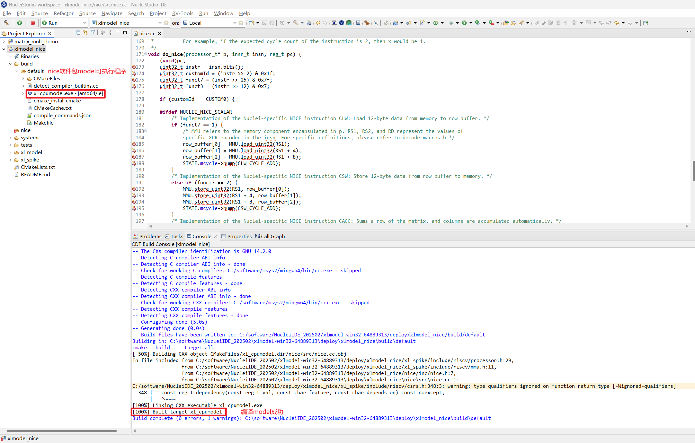

**Step 2: Use NICE Wizard to generate NICE instruction replacement**

Hotspot functions of the application can be located with Nuclei Model Profiling first. For details, refer to [Demonstrate NICE/VNICE Instruction Acceleration of Nuclei Model Through Profiling](https://nuclei-software.github.io/nuclei-studio/18-demonstrate_NICE_VNICE_acceleration_of_the_Nuclei_Model_through_profiling/), which will not be repeated here.

The hotspot function in this use case is known to be matrix multiply-accumulate. The computation of one row of matrix A * one column of matrix B is as follows:

~~~c
for (int32_t kk = 0; kk < 4; kk++)
{
    sum += pin1[ii * 4 + kk] * pin2[kk * 4 + jj];
}
~~~

This algorithm can be completely replaced by a single `NICE` instruction, with the sum value, the pin1 address, and the pin2 address as inputs, and the sum as the output.

Next, use NICE Wizard to generate the envisioned `NICE` instruction. The user can create a file named `aicc.nice` in the root directory of the `xlmodel_nice` project in Nuclei Studio. Once this file is created, the NICE Wizard instruction generation window will pop up. The steps to configure and generate the `NICE` instruction are as follows:

1. Select `Add` to add a `NICE` instruction. The instruction format is shown in `NICE instruction format` in the upper-left corner. First, fill in the `Instruction name` field with `matrix_row_col_multiply_asm` to indicate a matrix row-column multiply-accumulate operation.
2. Fill in `opcode`, `funct3`, and `funct7` in sequence.
3. `params` configures the return value and input parameters of the instruction inline assembly. The envisioned `NICE` instruction returns an `int32_t` and has 3 input parameters: `int32_t t`, `int8_t* a`, and `int8_t* b`. Set them respectively in `params`.

    **Note:** In the `Edit Type` settings interface for the input parameters, the parameters are configured in the order a->b->t:

    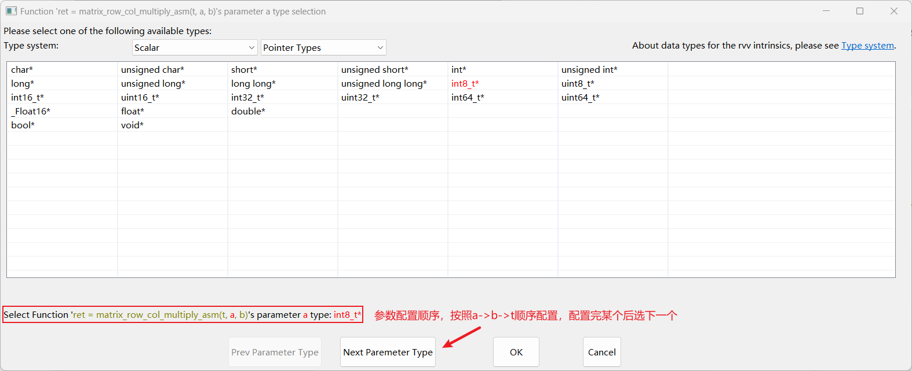

4. Preview in `Function full preview` whether the instruction inline assembly format is correct. After confirming there are no issues, click `save`. Once saved, the generated custom instruction can be seen in the instruction panel on the left.
5. Click `Save and Generate File` at the bottom. `insn.h` and `nice.cc` will be generated in the same path as `aicc.nice`.

    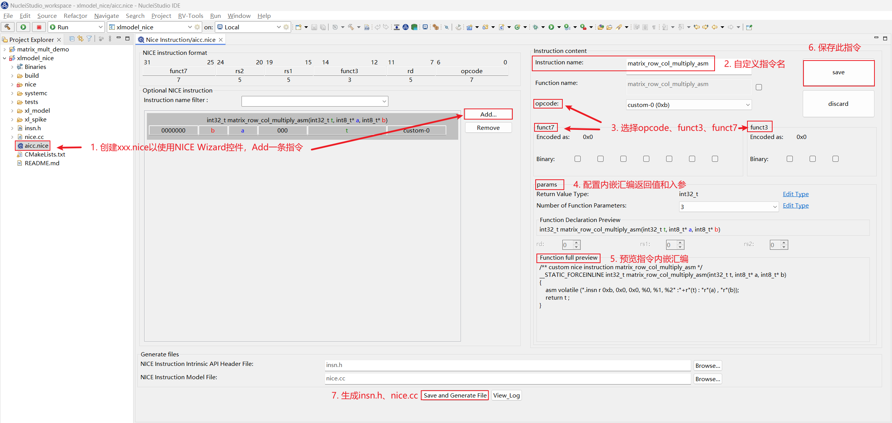

6. Copy the `NICE` instruction inline assembly from the generated `insn.h` into the application header file, and replace `xlmodel_nice/nice/src/nice.cc` directly with the generated `nice.cc`.

    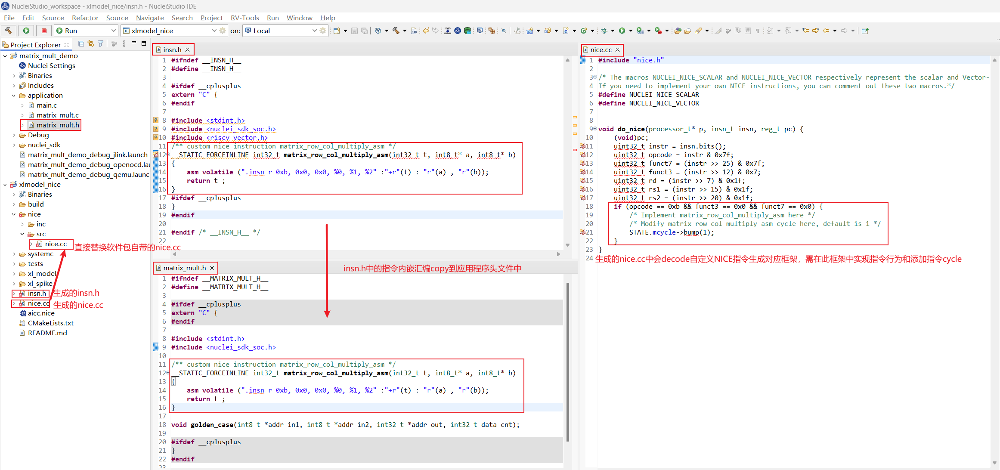

    Alternatively, `insn.h` can be generated directly into the application project path for reference, which saves the manual copying of file contents each time.

**Step 3: Implement the NICE instruction in xlmodel_nice**

Open the `xlmodel_nice/nice/src/nice.cc` file and use the macros defined in spike to implement the `NICE` instruction: the `MMU` macro represents memory access; use `MMU.load_xxx<n>` for load memory and `MMU.store_xxx<n>` for store memory; the `RD`, `RS1`, `RS2`, and `RS3` macros represent the values in their corresponding scalar registers; use `WRITE_RD` to write the destination register. The usage of these macros can be found in `nice/inc/decode_macros.h`.

After implementing the instruction, directly specify the number of additional cycles n required by the custom instruction: `STATE.mcycle->bump(n);`. Here, this `NICE` instruction is specified to require 1 additional cycle. Since an instruction takes 1 cycle by default, this `NICE` instruction consumes 2 cycles in total.

The implemented `NICE` instruction and its cycle specification are as follows:

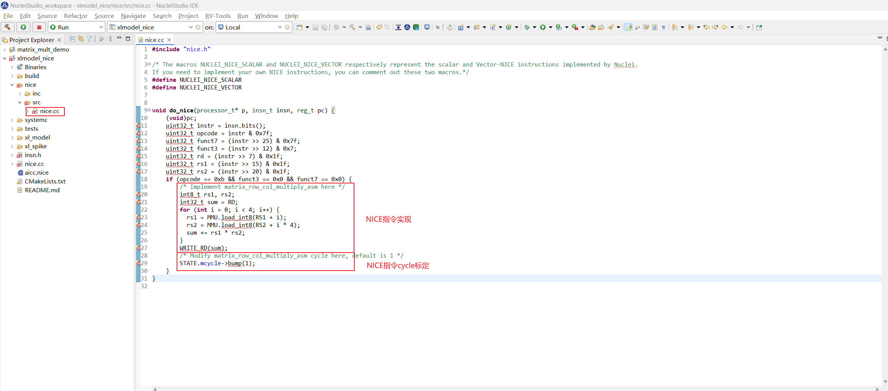

Rebuild `xlmodel_nice` and make sure the build passes.

**Step 4: Rerun the program on Nuclei Model**

First, write an algorithm function `nice_case` with `NICE` instruction inline assembly for comparison with `golden_case`, add a comparison of the function output results, and then rebuild the application project:

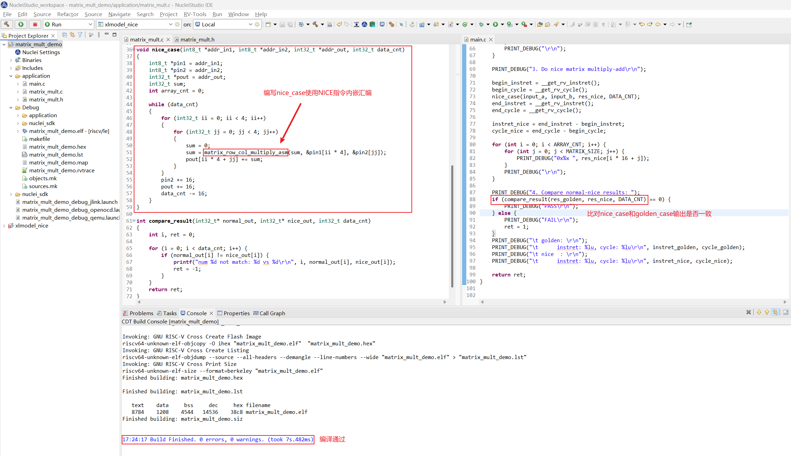

Since the model has been rebuilt with `xlmodel_nice` into a new executable, you need to reconfigure the model executable path in the Nuclei Studio `Nuclei Model` configuration to `xlmodel_nice/build/default/xl_cpumodel.exe`. The rest of the configuration remains unchanged:

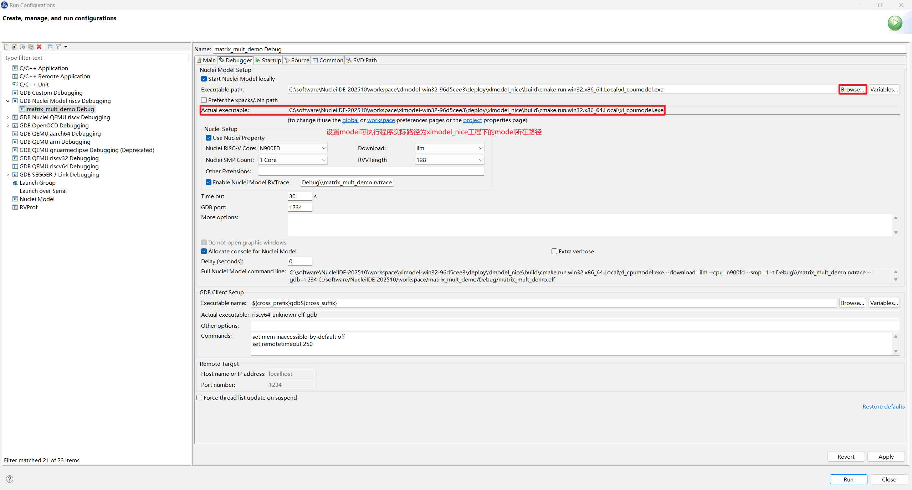

After `Apply`, `Run` the application again. You can find that the output results of `nice_case` and `golden_case` are identical, while the instruction count and cycle count of `nice_case` have dropped significantly. The envisioned `NICE` instruction is implemented correctly and has optimized the original scalar algorithm.

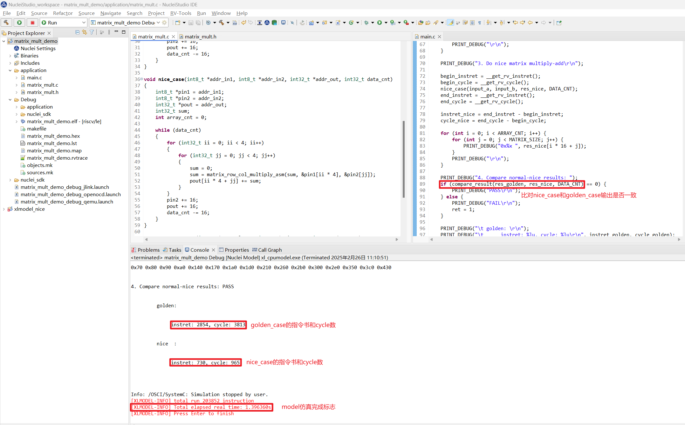

### VNICE Instruction Replacement

**Step 1: Use NICE Wizard to generate VNICE instruction replacement**

When computing with a `NICE` instruction, only one element of the output matrix is obtained each time, which is not efficient enough. If one instruction operation could process multiple matrix elements in parallel, the efficiency should be further improved. It is natural to think of using Vector instructions to process matrix data with higher parallelism.

The idea is to condense the complete 4 * 4 matrix multiply-accumulate operation into a single Vector instruction. A `VNICE` instruction can be used to implement this behavior, with three 4 * 4 input matrices as inputs and a 4 * 4 output matrix as the return value.

Double-click `aicc.nice` to use NICE Wizard again to configure the envisioned instruction. The steps to generate the instruction are similar to those for generating the `NICE` instruction above. The differences are: configure the `Instruction name` field as `matrix_multiply_4x4_asm` to indicate the multiplication of two 4*4 matrices; configure `funct3` as 1 to avoid the same encoding as the previous `NICE` instruction; and to match the vector data type inputs and outputs corresponding to the scalar `golden_case`, set the return value to `vin32m8_t`, the number of input parameters to 3, namely `vin32m8_t`, `vint8m1_t`, and `vint8m2_t`. The configuration interface after clicking `save` is as follows:

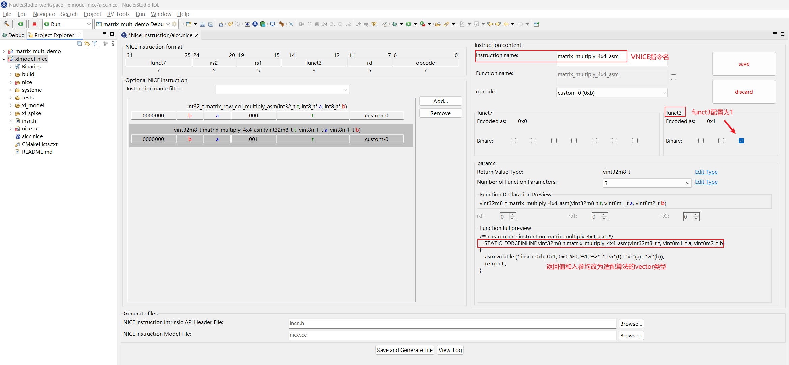

Click `Save and Generate File` at the bottom to overwrite the previously generated `insn.h` and `nice.cc`. At this point, `insn.h.bak` and `nice.cc.bak` will also appear in the same path. These two files are backups of the previously saved `insn.h` and `nice.cc` and will not be used. Again, copy the `NICE` instruction inline assembly from the generated `insn.h` into the application header file, and copy the new instruction decode framework from the generated `nice.cc` into `xlmodel_nice/nice/src/nice.cc`:

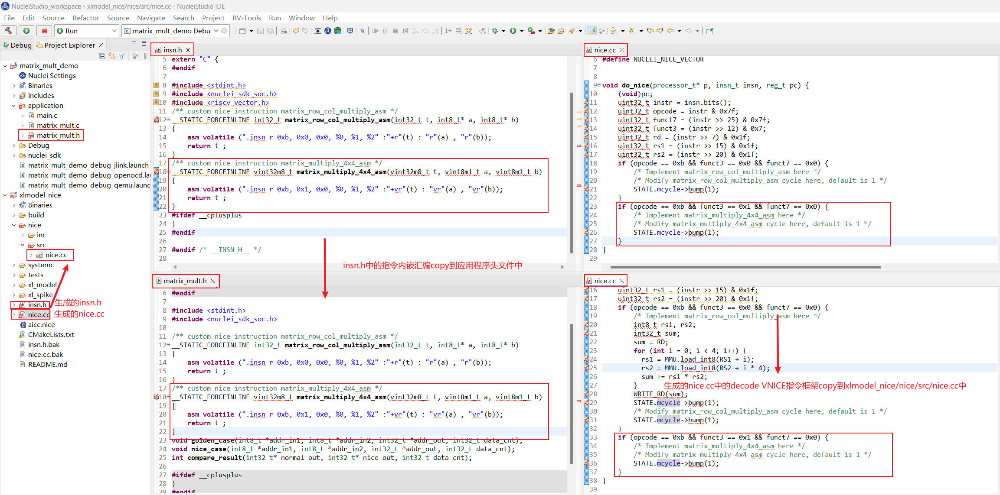

**Step 2: Implement the VNICE instruction in xlmodel_nice**

Implement the `VNICE` instruction in `xlmodel_nice/nice/src/nice.cc`: `V_MATRIX_ST` stores the vector registers input to the instruction into a custom buffer, `V_MATRIX_LD` loads the instruction output results into the RD register, and `V_MATRIX_CALC` implements the two-matrix multiply-accumulate operation. The `VNICE` instruction implementation can refer to the vector instruction implementation in spike: `xlmodel_nice/xl_spike/include/riscv/v_ext_macros.h`.

Specify that this `VNICE` instruction requires 2 cycles, i.e., it actually consumes 3 cycles. The implemented `VNICE` instruction and its cycle specification are as follows:

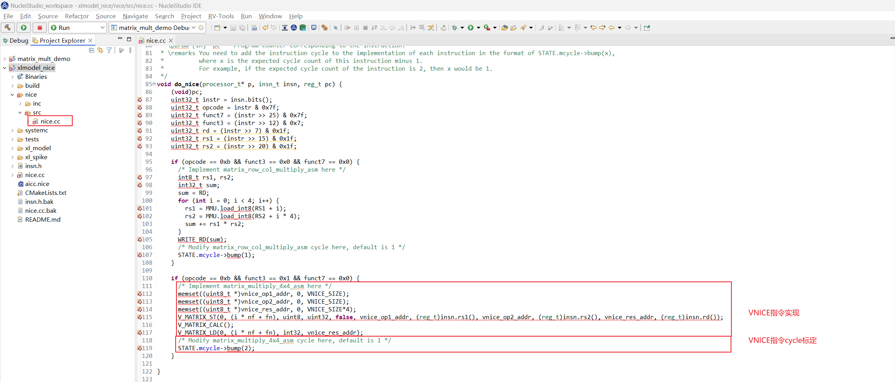

Rebuild `xlmodel_nice` again and make sure the build passes.

**Step 3: Rerun the program on Nuclei Model**

Since the inputs and outputs of the `VNICE` instruction are all vector registers, you need to configure the application's `Nuclei Settings` to enable the vector extension of the corresponding ARCH. Here, the `_zve32f` extension is added for `rv32imafdc`:

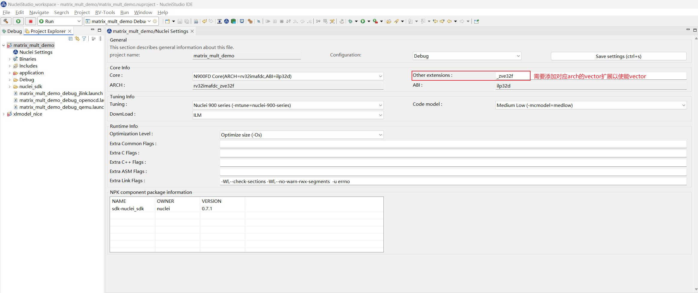

The corresponding `Nuclei Model` configuration also needs to add `--ext=_zve32f` to enable the model's vector functionality, then click `Apply`:

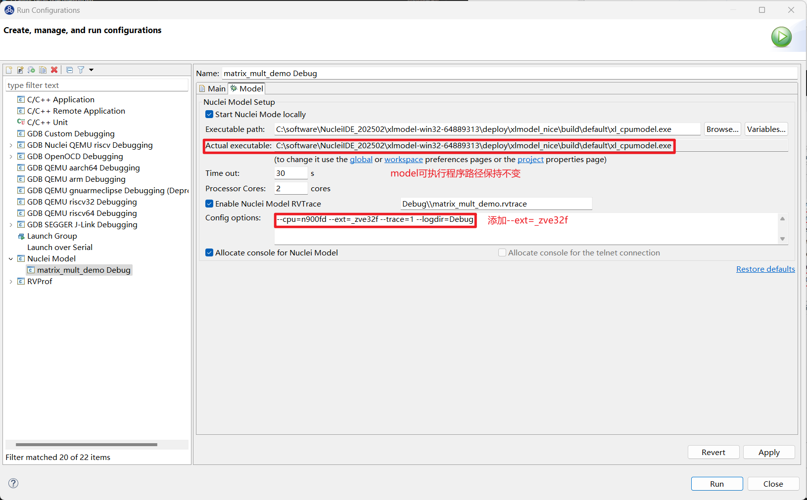

You need to write an algorithm function `vnice_case` with `VNICE` instruction inline assembly. The inputs and outputs required by the `VNICE` inline assembly need to be constructed with the corresponding vector intrinsic API. Then add a result comparison with `golden_case` and rebuild the application project.

**Note:** You need to add `#include <riscv_vector.h>` to the application header file to enable the vector intrinsic API.

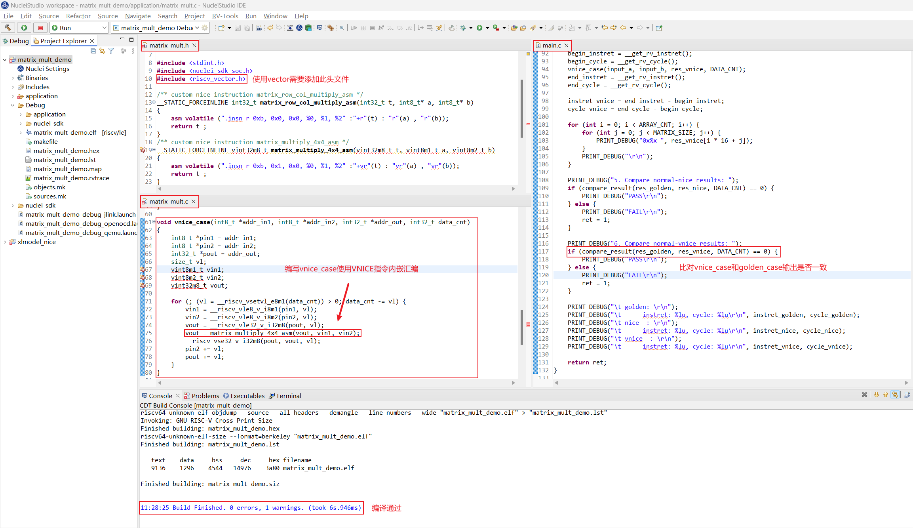

`Run` the application again. You can find that the output results of `vnice_case` and `golden_case` are identical, and its instruction count and cycle count have dropped further significantly compared to `nice_case`. The envisioned `VNICE` instruction is implemented correctly and has accelerated the matrix multiply-accumulate algorithm by taking advantage of the high parallelism of vector.

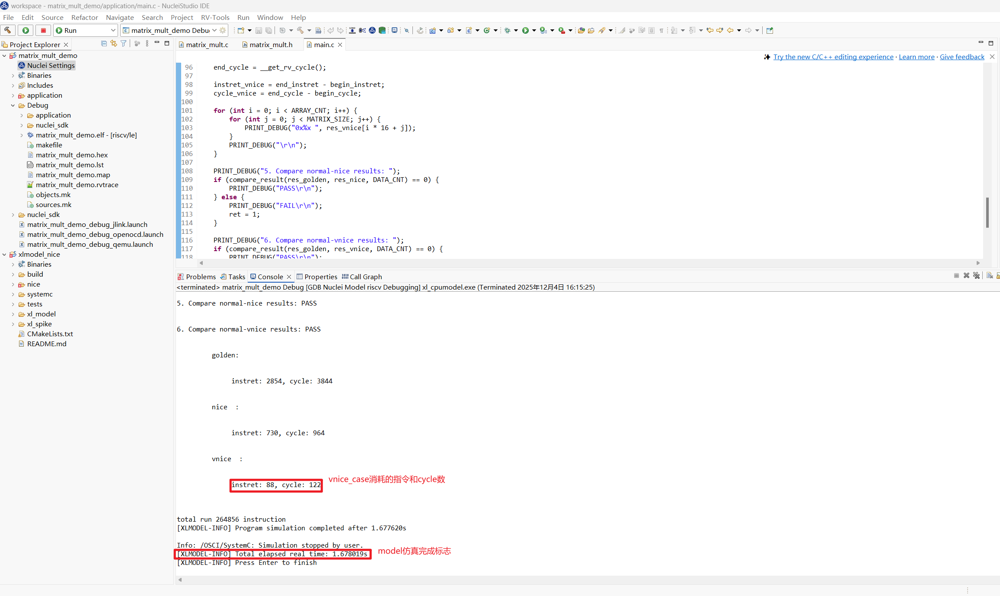

## Summary

The table below shows the instret/cycle statistics after implementing the `NICE/VNICE` instructions to optimize the algorithm. Compared with `golden_case`, the performance of `nice_case` after optimization is improved by about 4 times, and the performance of `vnice_case` after optimization is improved by more than 30 times.

| instret/cycle               | golden_case         | nice_case                | vnice_case                | golden / nice             | golden / vnice            | nice / vnice              |
|-----------------------------|---------------------|--------------------------|---------------------------|---------------------------|---------------------------|---------------------------|
| instret                     | 2854                | 730                      | 88                        | 3.91                      | 32.43                     | 8.30                      |
| cycle                       | 3844                | 964                      | 122                       | 3.99                      | 31.51                     | 7.90                      |

By studying the optimization strategy of an existing algorithm, the user can quickly generate the corresponding `NICE/VNICE` instructions with NICE Wizard, then import the `xlmodel_nice` package into Nuclei Studio to implement the instructions, and write an application instruction-optimization case. This way, the algorithm optimization effect can be quickly verified with Nuclei Model. The entire testing process can be completed using only Nuclei Studio.

[Download link for the optimized project](https://drive.weixin.qq.com/s?k=ABcAKgdSAFc0dskAJG)

[Optimized `xlmodel_nice` package](https://drive.weixin.qq.com/s?k=ABcAKgdSAFcbA9mEgt)
