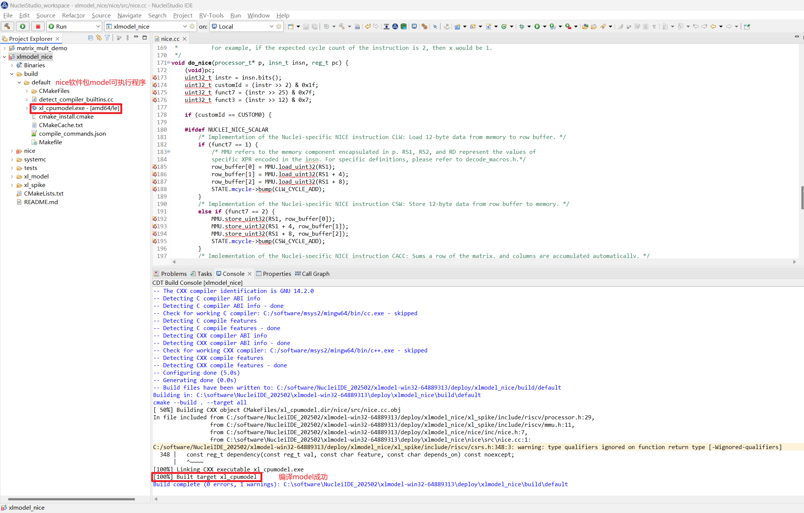
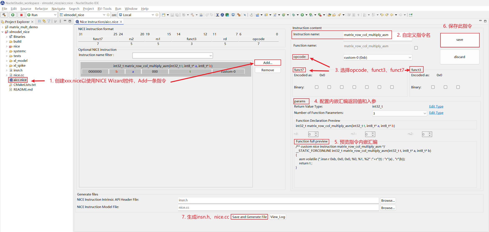
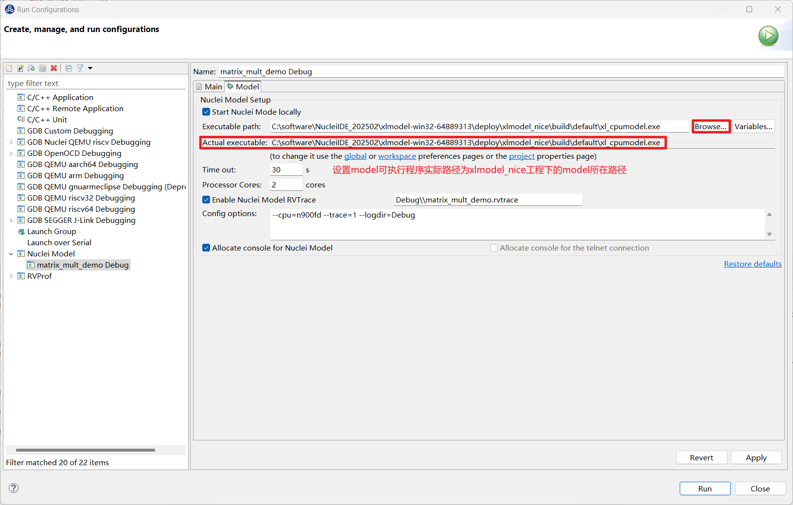
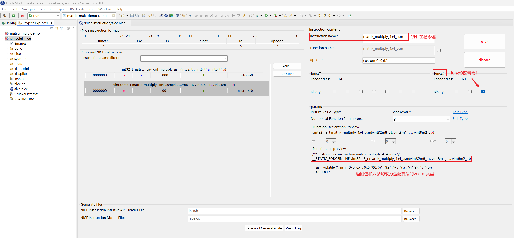
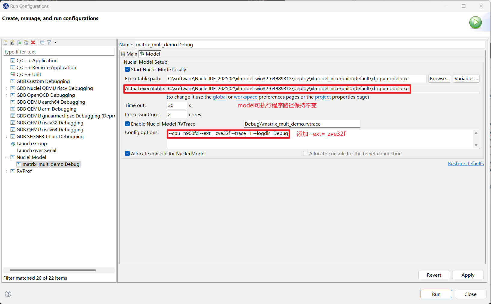
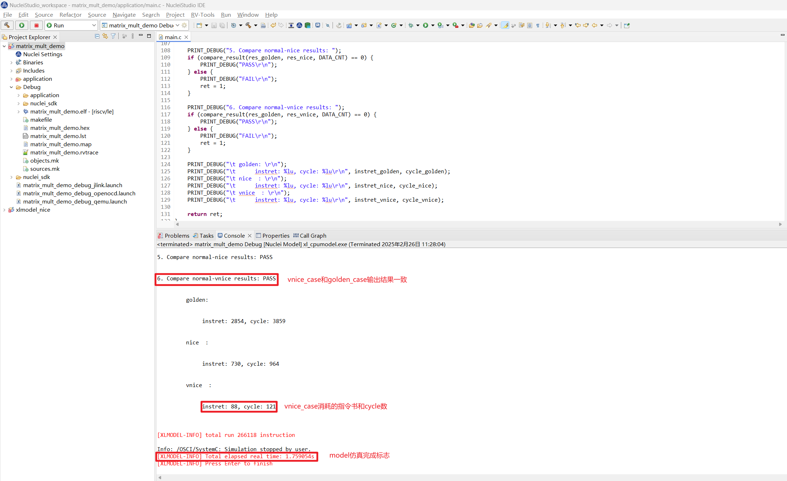

# Nuclei Model结合Nice Wizard快速验证NICE/VNICE指令加速

> Nuclei Model 已支持 Windows/Linux 版本，此文档测试都是基于 Nuclei Studio 的 Windows 版本 (>= 2025.02) 完成的。

## 背景描述

### xlmodel_nice

Nuclei Model 会不断更新提供用户可自定义实现 `NICE/VNICE` 的 `xlmodel_nice` 软件包，用户通过在 `xlmodel_nice/nice/src/nice.cc` 实现指令的具体行为，编译出新的 Nuclei Model 供应用程序配置调用。

### Nuclei NICE Wizard

Nuclei NICE Wizard 是 Nuclei Studio 上提供的 `NICE/VNICE` 指令生成控件，用户配置好自定义指令后，可以自动生成两个文件：

1. `insn.h`: 指令内嵌汇编头文件，用户需要将此文件的指令内嵌汇编添加到应用程序头文件中
2. `nice.cc`: 指令实现文件，用户需要将此文件的指令 decode 框架添加到 `xlmodel_nice/nice/src/nice.cc` 中

### test code

在 AI 与深度学习中常见的批量矩阵运算中，存在需要多次处理小矩阵块的场景，此测试将使用标量的多个 4x4 矩阵的乘法和累加操作的算法函数作为 `golden_case`，然后通过配置 NICE Wizard 生成 `NICE/VNICE` 加速指令，分别添加到测试应用程序和 `xlmodel_nice` 软件包工程中重新编译，最后通过运行 Nuclei Model 查看优化后的算法函数的指令数和 cycle 数，以查看 `NICE/VNICE` 加速效果。

## 解决方案

### 环境准备

> Nuclei Studio IDE 集成的 NICE Wizard 相关功能，需要配合 Nuclei CPU Model - NICE Support (xlmodel_nice) 软件包使用。

**Nuclei Studio**：

- [NucleiStudio 202502 Windows](https://download.nucleisys.com/upload/files/nucleistudio/NucleiStudio_IDE_202502-win64.zip)
- [NucleiStudio 202502 Linux](https://download.nucleisys.com/upload/files/nucleistudio/NucleiStudio_IDE_202502-lin64.tgz)

**xlmodel_nice**：

- [原始`xlmodel_nice`软件包 Windows](https://drive.weixin.qq.com/s?k=ABcAKgdSAFcYbanf6c)
- [原始`xlmodel_nice`软件包 Linux](https://drive.weixin.qq.com/s?k=ABcAKgdSAFczrqzDI1)

### Nuclei Model运行原始程序

**step1：导入 Nuclei SDK 原始工程**

[优化前的工程下载链接](https://drive.weixin.qq.com/s?k=ABcAKgdSAFcbbXAjde)

下载 zip 包后，可以直接导入到 Nuclei Studio 中运行 (导入步骤：`File->Import->Existing Projects into Workspace->Select archive file->选择zip压缩包->Finish`即可)

**step2：编译 Nuclei SDK 原始工程**

编译原始工程，确保编译成功以及在 Debug 下可以找到生成的 elf 文件：

**step3：运行 Nuclei SDK 原始工程**

在使用 Nuclei Model 运行程序时，需要先确定工程 `Nuclei Settings` 中的 `Core` 配置和 `Other extensions` 配置，这些配置需要传递给 Model 使用。当前使用的 `Core` 是 `n900fd`，`Other extensions` 未配置。

Model 仿真程序需要配置 Nuclei Studio 中的 `Nuclei Model` 配置项，步骤如下：

1. 打开 Nuclei Studio 主菜单栏的 `Run` 选项的 `Run Configurations`
2. 选择 `Nuclei Model` 配置项，右键选择 `New Configuration`，会自动生成项目名的 Model 配置页面，launch bar也会同步更新
3. 在右侧 `Main` 选项卡中点击 `Search Project...` 选择编译好的 elf 文件
4. 在右侧 `Model` 选项卡中选择 `Browse` 找到 Nuclei Model 可执行程序默认路径：`NucleiStudio/toolchain/nucleimodel/bin/xl_cpumodel.exe`
5. 在右侧 `Model` 选项卡中的 `Config options` 中完成 model 运行配置： `--cpu=n900fd --trace=1 --logdir=Debug`, `--cpu` 和 `--ext` 需要保持和 `Nuclei Settings` 的 `Core` 和 `Other extensions` 配置一致，`--ext` 为空时不传递此参数，`--trace=1` 表示开启 rvtrace，`--logdir=Debug` 则表示最终生成的 `*.rvtrace` 文件存存放路径为当前工程下的 Debug 目录，然后点击 `Apply` 和 `Run`，model 就开始运行程序了

    

在 Console 中会看到 `Total elapsed time` 说明 model 已经完成仿真了，程序会提取标量矩阵乘算法函数 `golden_case` 的执行指令数和 cycle 数如下：

### NICE指令替换

**step1：编译 xlmodel_nice 软件包**

下载并解压 `xlmodel_nice` zip 包后，可以直接导入到 Nuclei Studio 中运行 (导入步骤：`File->Import->Projects from Folder or Archive->Next->Directory->选择xlmodel_nice文件夹->Finish`即可)

在编译 `xlmodel_nice` 前需先配置好 xlmodel 的编译环境 ([xlmodel_nice 编译环境配置](https://doc.nucleisys.com/nuclei_tools/xlmodel/intro.html#nice-build))，然后编译确保原始软件包可以成功编译生成 model 的可执行程序：

**step2：NICE Wizard生成NICE指令替换**

应用程序的热点函数可以先用 Nuclei Model Profiling 来定位，具体使用可以参考 [通过Profiling展示Nuclei Model NICE/VNICE指令加速](https://nuclei-software.github.io/nuclei-studio/18-demonstrate_NICE_VNICE_acceleration_of_the_Nuclei_Model_through_profiling/)，这里不再赘述了。

此用例的热点函数已知是矩阵乘累加，A矩阵某行 * B矩阵某列计算如下：

~~~c
for (int32_t kk = 0; kk < 4; kk++)
{
    sum += pin1[ii * 4 + kk] * pin2[kk * 4 + jj];
}
~~~

此算法完全可以替换成一条 `NICE` 指令来完成，输入为 sum 值， pin1 地址， pin2 地址，输出为 sum。

接下来用 NICE Wizard 来生成设想的 `NICE` 指令，用户可以在 Nuclei Studio 的 `xlmodel_nice` 工程根目录创建一个 `aicc.nice` 的文件，此文件创建后就会弹出 NICE Wizard 的指令生成窗口，配置生成 `NICE` 指令步骤如下：

1. 选择 `Add` 添加一条 `NICE` 指令，指令格式如左上角 `NICE instruction format` 所示，首先填写 `Instruction name`项为 `matrix_row_col_multiply_asm` 表示矩阵行列乘加操作
2. 依次选择填写 `opcode`、`funct3`、`funct7`
3. `params` 是指令内嵌汇编的返回值和入参配置，构想的 `NICE` 指令返回值为 `int32_t`，入参个数为3个，分别是 `int32_t t`、`int8_t* a`、`int8_t* b`，分别在 `params` 中设置好

    **注意：** 在 入参的 `Edit Type` 设置界面中，是按照 a->b->t 的顺序配置的:

    

4. 在 `Function full preview` 中预览指令内嵌汇编格式是否正确，确保没有问题后点击 `save`，`save` 完成后可以在左侧指令栏中看到生成好的自定义指令了
5. 点击下方 `Save and Generate File`，在 `aicc.nice` 同路径下会生成 `insn.h` 和 `nice.cc`

    

6. 将生成好的 `insn.h` 中的 `NICE` 指令内嵌汇编复制到应用程序的头文件中，将生成好的 `nice.cc` 直接替换 `xlmodel_nice/nice/src/nice.cc`

    

    当然也可以将 `insn.h` 直接生成到应用程序工程路径下引用，这样可以省去每次手动的复制文件内容。

**step3：xlmodel_nice实现NICE指令**

打开 `xlmodel_nice/nice/src/nice.cc` 文件，使用 spike 中定义的宏来实现 `NICE` 指令：`MMU` 宏表示 memory 访问，load memory 使用 `MMU.load_xxx<n>`，store memory 使用 `MMU.store_xxx<n>`，`RD`、`RS1`、`RS2`、`RS3` 宏表示其对应标量寄存器中的值, 写目标寄存器使用 `WRITE_RD`，这些宏的使用可以参考 `nice/inc/decode_macros.h`。

在指令实现完后，将自定义指令额外需要的 cycle 数 n 直接标定：`STATE.mcycle->bump(n);` 即可，这里标定此条 `NICE` 指令额外需要 1 cycle，由于指令默认需要 1 cycle，因此此条 `NICE` 指令需要消耗 2 cycle。

实现的 `NICE` 指令实现和 cycle 标定如下：

重新编译 `xlmodel_nice` 保证编译通过。

**step4：Nuclei Model重新运行程序**

首先需要编写一个带 `NICE` 指令内嵌汇编的算法函数 `nice_case` 方便和 `golden_case` 对比，添加函数输出结果比对，然后重新编译应用程序工程：

因为 model 已经使用 `xlmodel_nice` 重新编译出新的可执行程序了，需要重新配置 Nuclei Studio `Nuclei Model` 配置项中的 model 可执行程序路径为 `xlmodel_nice/build/default/xl_cpumodel.exe`，其余配置不变：

`Apply` 后重新 `Run` 应用程序, 可以发现 `nice_case` 和 `golden_case` 输出结果一致，`nice_case` 的指令数和 cycle 数均大幅下降了，构想的 `NICE` 指令实现正确，并优化了原标量算法。

### VNICE指令替换

**step1：NICE Wizard生成VNICE指令替换**

当使用 `NICE` 指令运算时，每次仅得到的是输出矩阵的一个元素，效率还不够高，如果一次指令操作可以并行处理多个矩阵元素，效率应将进一步提高，很自然会想到使用 Vector 指令来多并行度处理矩阵数据。

构想将完整的 4 * 4 矩阵乘加运算浓缩为一条 Vector 指令，可以使用一条 `VNICE` 指令来实现此行为，入参为 3 个 4 * 4 的输入矩阵，返回值为 4 * 4 的输出矩阵。

双击 `aicc.nice` 再次使用 NICE Wizard 配置构想指令，生成指令的步骤和以上生成 `NICE` 指令相似，不同之处为配置 `Instruction name` 项为 `matrix_multiply_4x4_asm` 表示完成的是 4*4 的两矩阵的乘法，配置 `funct3` 为 1 避免与上条 `NICE` 指令编码相同，为了匹配和 `golden_case` 标量对应的 vector 数据类型的输入输出，设置返回值为 `vin32m8_t`，入参个数为 3，分别是 `vin32m8_t`、`vint8m1_t`、`vint8m2_t`，点击 `save` 后的配置界面如下：

点击下方 `Save and Generate File`，覆盖之前生成的 `insn.h` 和 `nice.cc`，此时在同路径下还会出现 `insn.h.bak` 和 `nice.cc.bak`, 这两个文件是上一次保存的 `insn.h` 和 `nice.cc` 备份文件不会被用到，再次将生成好的 `insn.h` 中的 `NICE` 指令内嵌汇编复制到应用程序的头文件中，将生成好的 `nice.cc` 中的新指令 decode 框架复制到 `xlmodel_nice/nice/src/nice.cc`：

**step2：xlmodel_nice实现VNICE指令**

在 `xlmodel_nice/nice/src/nice.cc` 中实现 `VNICE` 指令，`V_MATRIX_ST` 实现将指令输入的 vector 寄存器 store 到自定义 buffer 中，`V_MATRIX_LD` 实现将指令输出的结果 load 到 RD 寄存器，`V_MATRIX_CALC` 实现两矩阵乘加运算，`VNICE` 指令实现可以参考 spike 中的 vector 指令实现： `xlmodel_nice/xl_spike/include/riscv/v_ext_macros.h`。

标定此条 `VNICE` 指令需要 2 cycle，即实际消耗 3 cycle，实现的 `VNICE` 指令实现和 cycle 标定如下：

再重新编译 `xlmodel_nice` 保证编译通过。

**step3：Nuclei Model重新运行程序**

因为 `VNICE` 指令的输入输出均为 vector 寄存器，需要配置应用程序的 `Nuclei Settings`，使能对应 ARCH 的 vector 扩展，这里针对 `rv32imafdc` 添加 `_zve32f` 扩展：

对应的 `Nuclei Model` 配置项也需要添加 `--ext=_zve32f`使能 model 的 vector 功能，然后 `Apply`：

需要编写一个带 `VNICE` 指令内嵌汇编的算法函数 `vnice_case`，`VNICE` 内嵌汇编需要的输入输出需要写相应的 vector intrinsic API 来构造，然后添加和 `golden_case` 的结果比对，重新编译应用程序工程。

**注意：** 在应用程序头文件中需要添加 `#include <riscv_vector.h>` 以使能 vector intrinsic API

重新 `Run` 应用程序, 可以发现 `vnice_case` 和 `golden_case` 输出结果一致，其指令数和 cycle 数相对 `nice_case` 进一步大幅下降了，构想的 `VNICE` 指令实现正确，并利用了 vector 的高并行度加速了矩阵乘加算法。

## 总结

下表是实现了 `NICE/VNICE` 指令优化算法后的 instret/cycle 数据统计，相较于 `golden_case`, `nice_case` 优化后的性能提高了约 4 倍，`vnice_case` 优化后的性能提高了超过 30 倍。

| instret/cycle               | golden_case         | nice_case                | vnice_case                | golden / nice             | golden / vnice            | nice / vnice              |
|-----------------------------|---------------------|--------------------------|---------------------------|---------------------------|---------------------------|---------------------------|
| instret                     | 2854                | 730                      | 88                        | 3.91                      | 32.43                     | 8.30                      |
| cycle                       | 3859                | 964                      | 121                       | 4.00                      | 31.89                     | 7.97                      |

用户通过研究现有算法的优化策略，就可以将构想快速通过 NICE Wizard 生成相关 `NICE/VNICE` 指令，再通过 Nuclei Studio 导入 `xlmodel_nice` 软件包实现指令，编写应用程序指令优化 case，就可以很快的利用 Nuclei Model 验证算法优化效果，整个测试过程只需使用 Nuclei Studio 就可以完成。

[优化后的工程下载链接](https://drive.weixin.qq.com/s?k=ABcAKgdSAFc0dskAJG)

[优化后的`xlmodel_nice`软件包](https://drive.weixin.qq.com/s?k=ABcAKgdSAFcZ14pFy7)

