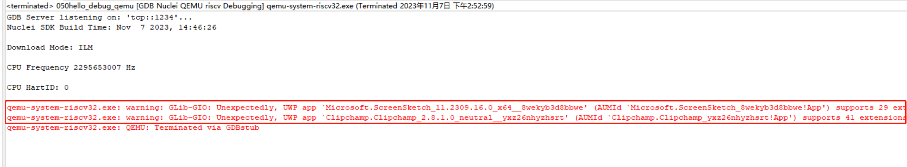

# windows 11下使用Nuclei Studio进行qemu调试程序时报错

## 问题说明

windows 11下使用Nuclei Studio开发时，当使用qemu调试程序时,会有报错如下，是因为在windows 11下缺少相关依赖，但一般不影响qemu的正确使用，可以忽略此错误。

```
qemu-system-riscv32.exe: warning: GLib-GIO: Unexpectedly, UWP app `Microsoft.ScreenSketch_11.2309.16.0_x64__8wekyb3d8bbwe' (AUMId `Microsoft.ScreenSketch_8wekyb3d8bbwe!App') supports 29 extensions but has no verbs
qemu-system-riscv32.exe: warning: GLib-GIO: Unexpectedly, UWP app `Clipchamp.Clipchamp_2.8.1.0_neutral__yxz26nhyzhsrt' (AUMId `Clipchamp.Clipchamp_yxz26nhyzhsrt!App') supports 41 extensions but has no verbs

```




## 解决方案

这个是Windows 10/11上存在的系统库匹配问题，不影响Qemu正常使用，可以忽略。
