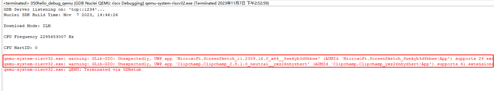

# Error When Debugging Programs with QEMU in Nuclei Studio on Windows 11

## Problem Description

When developing with Nuclei Studio on Windows 11, the following errors may occur when debugging a program with QEMU. This is caused by missing related dependencies on Windows 11, but it generally does not affect the correct use of QEMU, so this error can be ignored.

```
qemu-system-riscv32.exe: warning: GLib-GIO: Unexpectedly, UWP app `Microsoft.ScreenSketch_11.2309.16.0_x64__8wekyb3d8bbwe' (AUMId `Microsoft.ScreenSketch_8wekyb3d8bbwe!App') supports 29 extensions but has no verbs
qemu-system-riscv32.exe: warning: GLib-GIO: Unexpectedly, UWP app `Clipchamp.Clipchamp_2.8.1.0_neutral__yxz26nhyzhsrt' (AUMId `Clipchamp.Clipchamp_yxz26nhyzhsrt!App') supports 41 extensions but has no verbs

```




## Solution

This is a system library matching issue that exists on Windows 10/11. It does not affect the normal use of QEMU and can be ignored.
