# Flash Programming Use Case

To meet users' need to download compiled binary files directly to a hardware development board, Nuclei Studio provides the **Flash Programming** feature. This feature allows users to quickly and conveniently download compiled binary files directly to the hardware development board, greatly improving development and debugging efficiency. Users can complete the binary file download with a single click, simplifying the workflow.

## Solution

### Environment Preparation

**Nuclei Studio**:

Version >= 202412 is required. Version 202502 is provided below.

- [NucleiStudio 202502 Windows](https://download.nucleisys.com/upload/files/nucleistudio/NucleiStudio_IDE_202502-win64.zip)
- [NucleiStudio 202502 Linux](https://download.nucleisys.com/upload/files/nucleistudio/NucleiStudio_IDE_202502-lin64.tgz)

### Flash Programming Demo

**step1: Create a project and program the bit file**

Use version 0.7.1 of sdk-nuclei_sdk to create a u900 helloworld project. Select Simple Helloworld Demo, FLASH download mode, and U900 Core in sequence, then click Finsh.

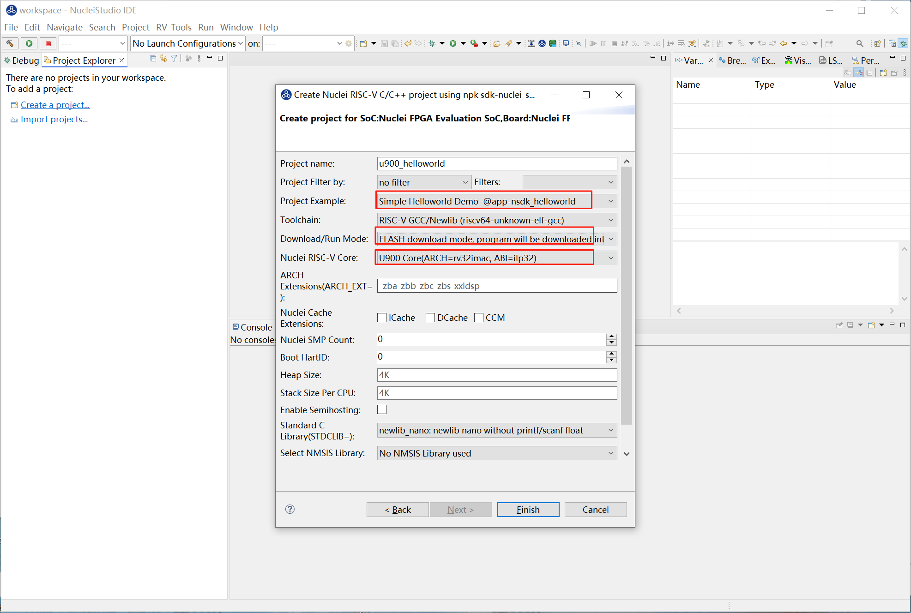

Program the corresponding bit file to the development board. Here we use trace-u900_best_config_ku060_16M_e85631d489_e82e2771f_202409232110_v3.12.0.bit

**step2: Configure and build the original Nuclei SDK project**

Build the original project, making sure the build succeeds and the generated elf file can be found under Debug:

**step3: Configure the Flash Programming tab**

In Launch Configuration, select the corresponding debug option (openocd) and click edit to open the configuration page.

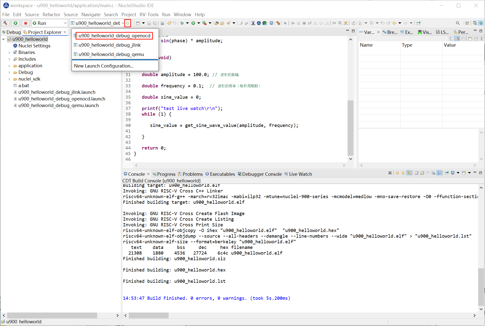

Select the **Flash Programming** tab to enter the configuration page.

Since this is FLASH download mode, the default options verify image and reset and run are sufficient here.

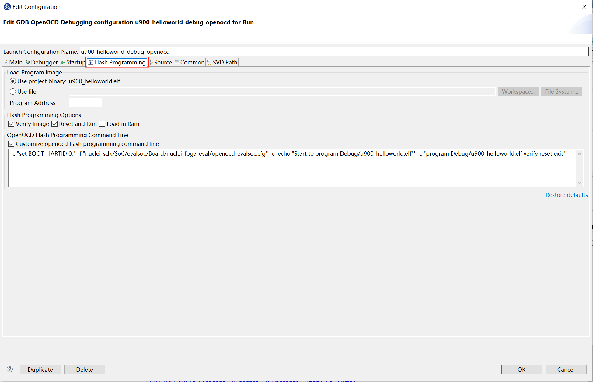

For details of each configuration item, refer to the [Nuclei Development Tool Guide](https://download.nucleisys.com/upload/files/doc/nucleistudio/NucleiStudio_User_Guide.202502.pdf)

**step4: Download**

Select the project and click Flash Programming to download the binary file to the hardware development board.

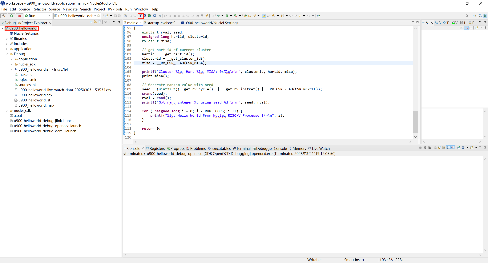

After the download succeeds, users can view the download result in the **Console** to confirm that the binary file has been successfully programmed into the hardware.

~~~
** Programming Started **
Info : Padding image section 1 at 0x200029c4 with 4 bytes
** Programming Finished **
** Verify Started **
Warn : [riscv.cpu] Re-reading memory from addresses 0x20000004 and 0x20000008.
Warn : [riscv.cpu] Re-reading memory from addresses 0x20000010 and 0x20000014.
** Verified OK **
** Resetting Target **
Info : JTAG tap: riscv.cpu tap/device found: 0x10900a6d (mfg: 0x536 (Nuclei System Technology Co Ltd), part: 0x0900, ver: 0x1)
Info : [riscv.cpu] Register fp is dirty!
Info : [riscv.cpu] Register s1 is dirty!
Info : [riscv.cpu] Register a0 is dirty!
Info : [riscv.cpu] Register a1 is dirty!
Info : [riscv.cpu] Discarding values of dirty registers.
shutdown command invoked
~~~

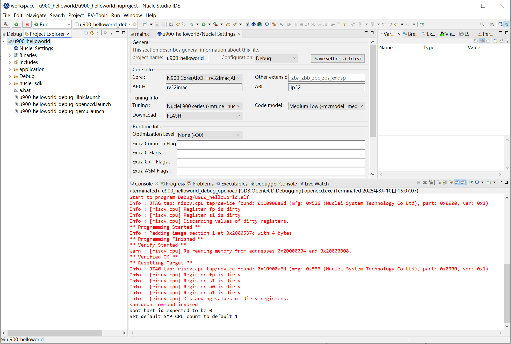

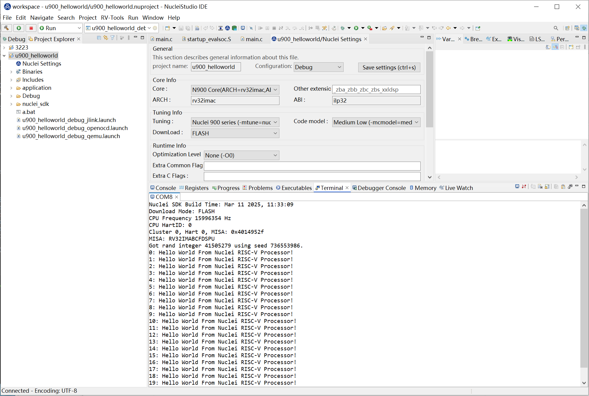

**step5: Differences when downloading to memory**

Nuclei Studio supports multiple download modes: DDR, FLASH, FLASHXIP, ILM, and SRAM.

The FLASH and FLASHXIP modes can be used by following the steps above, while DDR, ILM, and SRAM download to memory, which differs from Flash. The following uses ILM as an example.

Click Nulcei Settings to open the page, select ILM in Download, and save.

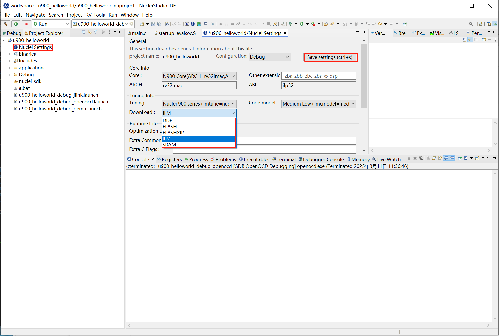

Rebuild the project: clean project -> build project

Then open the corresponding .map file, here u900_helloworld.map, and find the initial load address in it, such as 0x80000000 in the figure below.

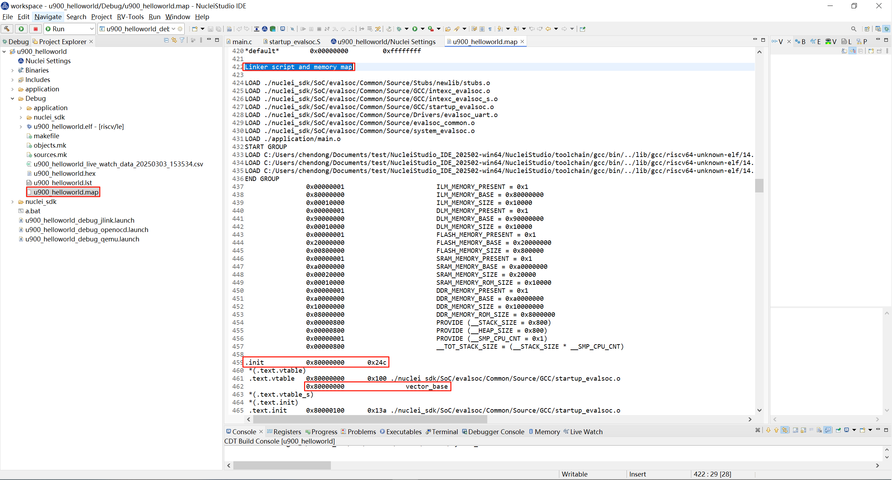

Open the Flash Programming tab. Since the download is to memory, check Load in Ram here. At this point, the load_image command is added to the command line below.

Then enter the address obtained above, 0x80000000, in Program Address, and the command line will include the resume 0x80000000 parameter.

Click OK.

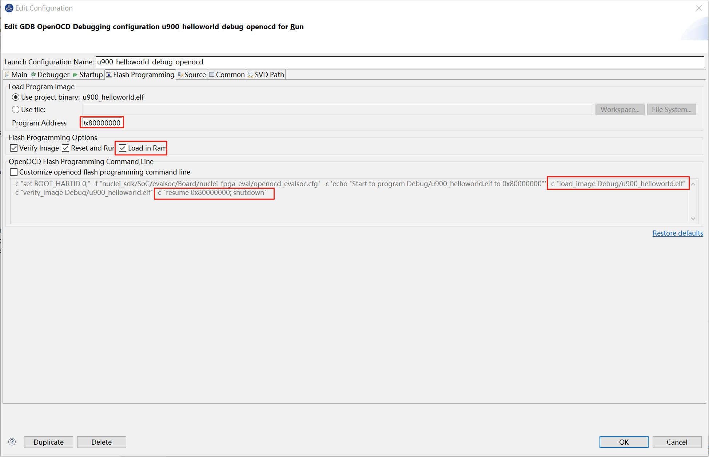

Select the project and click Flash Programming to download. The result is as follows.

~~~
Info : Valid NUSPI on device Nuclei SoC SPI Flash at address 0x20000000 with spictrl regbase at 0x10014000
Info : Nuclei SPI controller version 0xee010102
Info : Found flash device 'win w25q256fv/jv' (ID 0x001940ef)
semihosting is enabled
Start to program Debug/u900_helloworld.elf to 0x80000000
10680 bytes written at address 0x80000000
1344 bytes written at address 0x90000000
downloaded 12024 bytes in 0.263079s (44.634 KiB/s)
verified 12024 bytes in 0.317004s (37.041 KiB/s)
shutdown command invoked
~~~

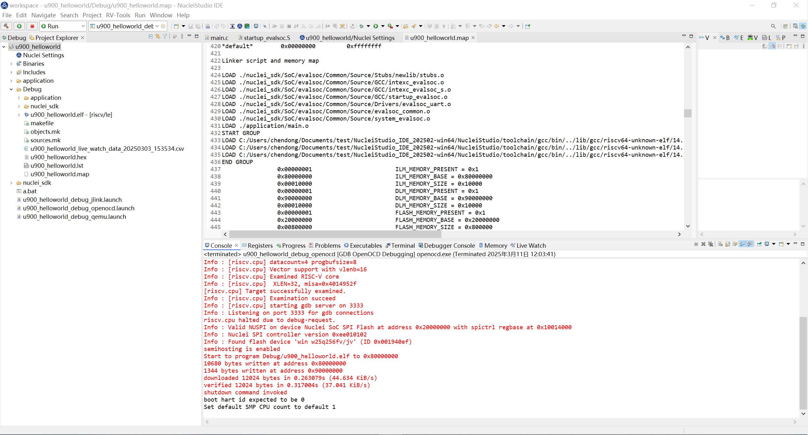

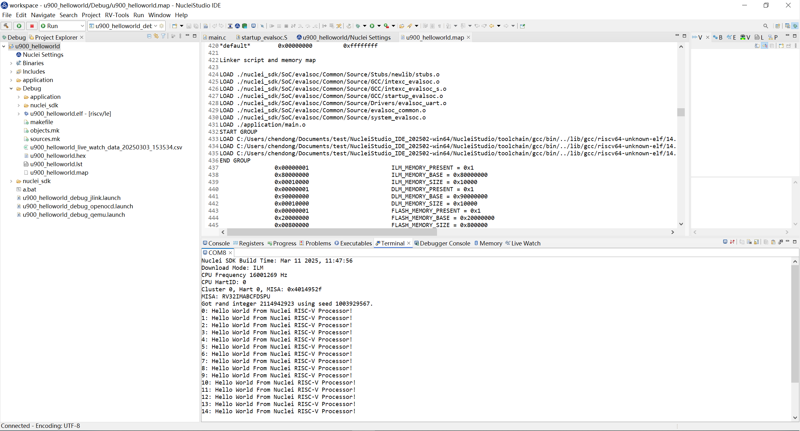

**step6: Possible issues**

1. **Error: checksum mismatch , attempting binary compare**

This error occurs because the flash download and ram download modes were confused. You need to modify the Download mode in nuclei settings.

### Summary

The **Flash Programming** feature provides users with a fast and convenient way to download compiled binary files to a hardware development board. With simple configuration, users can easily adapt to different hardware environments and ensure that binary files are programmed correctly.
