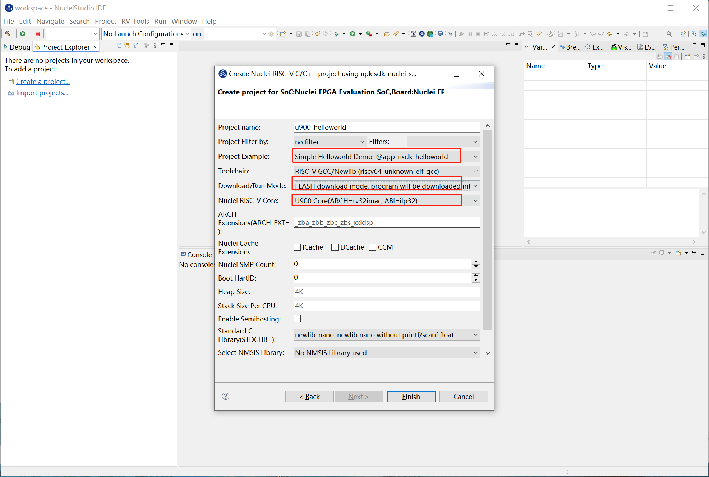

# Flash Programming

为了满足用户将编译好的二进制文件直接下载到硬件开发板的需求，Nuclei Studio 提供了 **Flash Programming** 功能。该功能允许用户快速、便捷地将编译好的二进制文件直接下载到硬件开发板中，极大提升了开发和调试的效率。用户只需点击一次即可完成二进制文件的下载，简化了操作流程。

## 解决方案

### 环境准备

**Nuclei Studio**：

要求版本 >= 202412，下面提供202502版本。

- [NucleiStudio 202502 Windows](https://download.nucleisys.com/upload/files/nucleistudio/NucleiStudio_IDE_202502-win64.zip)
- [NucleiStudio 202502 Linux](https://download.nucleisys.com/upload/files/nucleistudio/NucleiStudio_IDE_202502-lin64.tgz)

### Flash Programming 使用演示

**step1：创建项目，烧写bit**

使用0.7.1版本的sdk-nuclei_sdk创建一个u900的helloworld项目，依次选择Simple Helloworld Demo,FLASH下载模式和U900 Core，点击Finsh。

开发板烧写对应的bit即可，这里我们使用trace-u900_best_config_ku060_16M_e85631d489_e82e2771f_202409232110_v3.12.0.bit

**step2：配置编译 Nuclei SDK 原始工程**

编译原始工程，确保编译成功以及在 Debug 下可以找到生成的 elf 文件：

**step3：配置Flash Programming选项卡**

在Launch Configuration 选中对应调试选项(openocd)，点击edit打开配置页面。

选择 **Flash Programming** 选项卡，进入配置页面。

具体配置项内容可参考[Nuclei Development Tool Guide](https://download.nucleisys.com/upload/files/doc/nucleistudio/NucleiStudio_User_Guide.202502.pdf)

现在这里使用的Flash下载模式，Flash Programming Options就要选中Verify Image和Reset and Run。

如果使用的是下载到内存里，则勾选Load in Ram，并且在Progarm Address中写入起始加载地址，Download命令会带上 resume {Progarm Address}参数。

还有其他参数需要通过GDB执行时，我们将其加入到OpenOCD Flash Programming Command line，这里我们使用默认的参数。

**step4：下载**

鼠标右键项目，选择Flash Programming选项，下载二进制文件到硬件开发板。

下载成功后，用户可以在 **Console** 中看到下载结果，确认二进制文件已成功烧录到硬件中。

### 总结

**Flash Programming** 功能为用户提供了一种快速、便捷的方式将编译好的二进制文件下载到硬件开发板中。通过简单的配置，用户可以轻松适配不同的硬件环境，并确保二进制文件的正确烧录。

