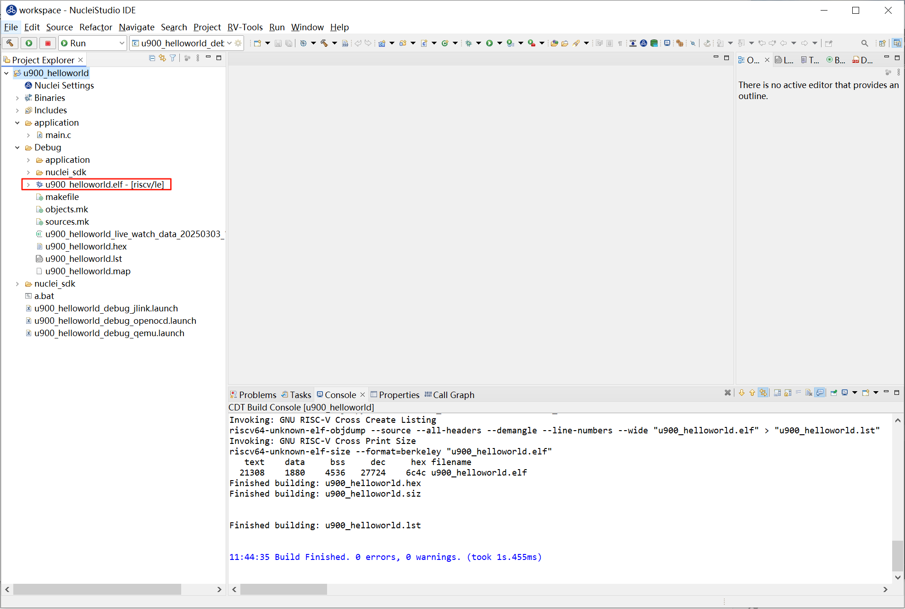
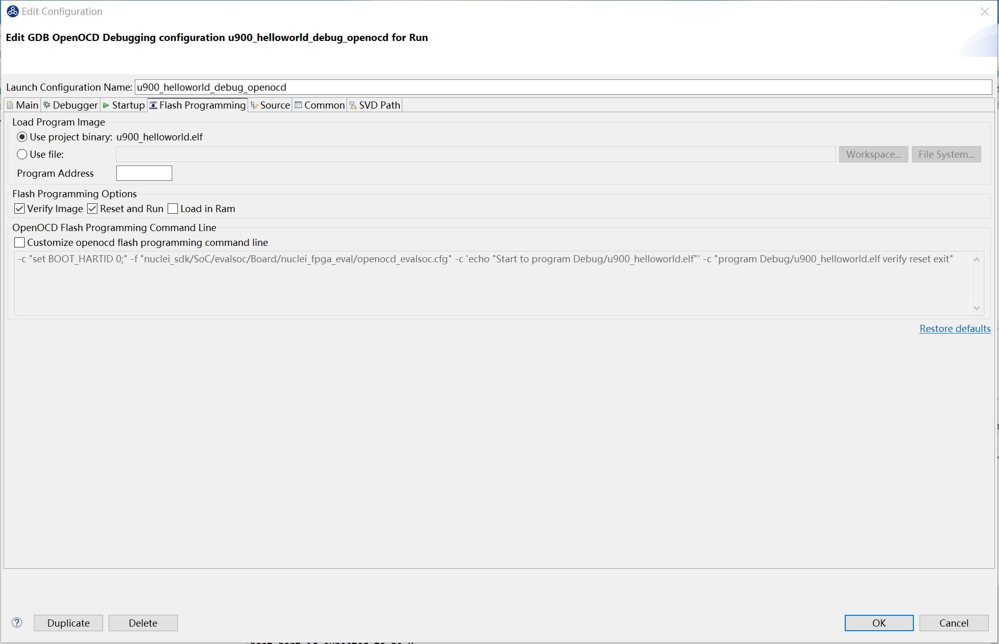
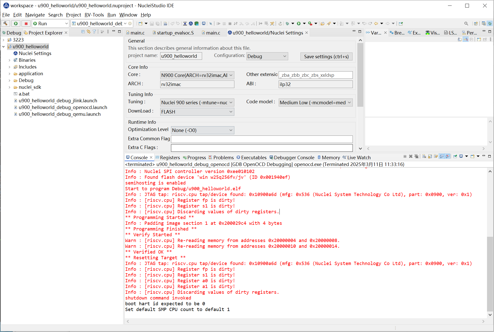
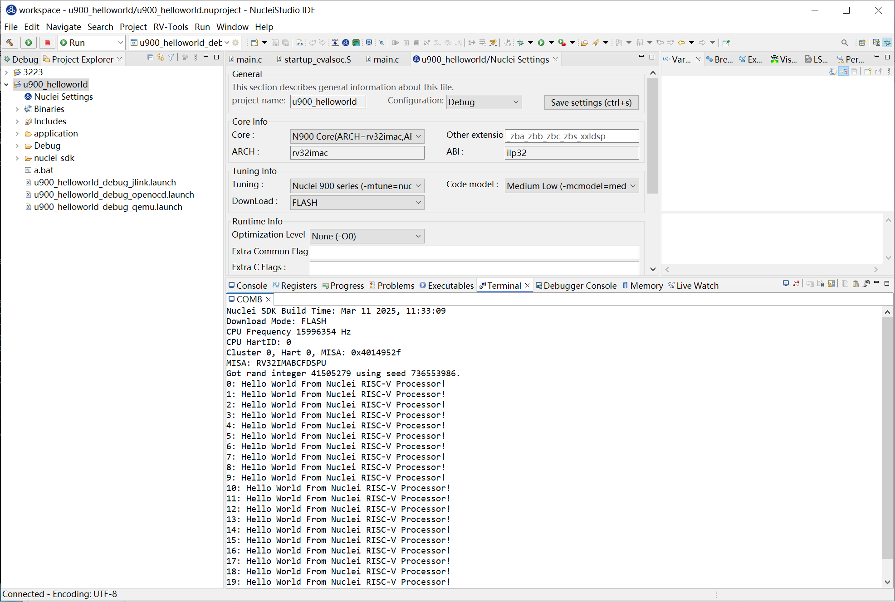
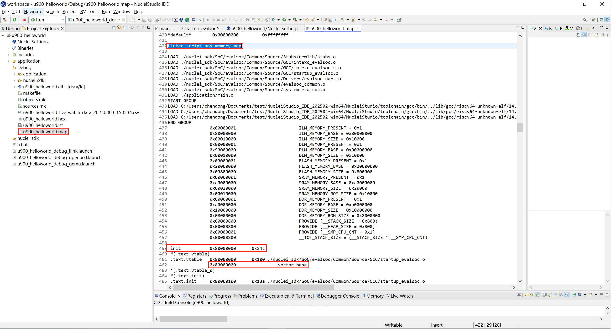
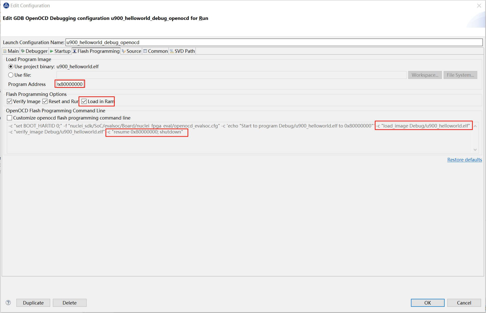
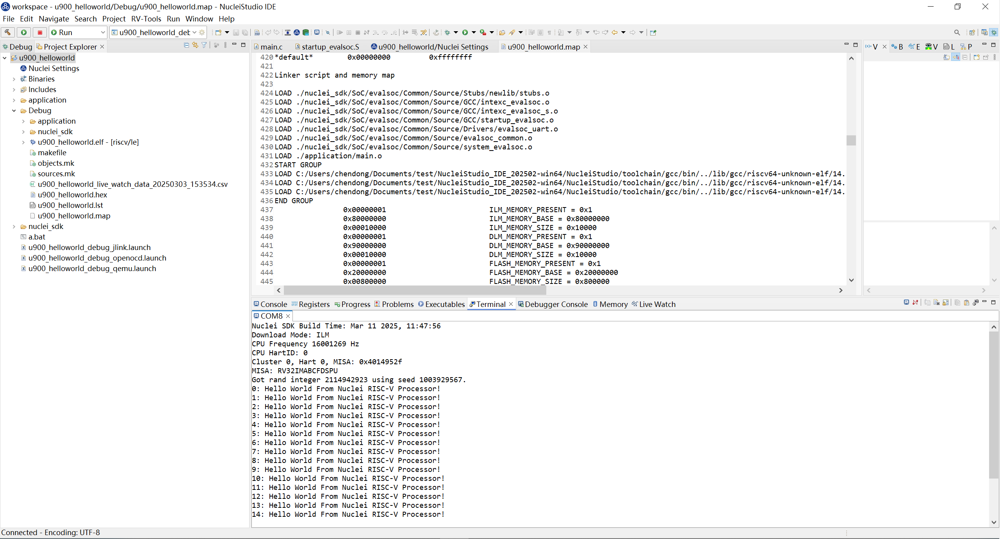

# Flash Programming

为了满足用户将编译好的二进制文件直接下载到硬件开发板的需求，Nuclei Studio 提供了 **Flash Programming** 功能。该功能允许用户快速、便捷地将编译好的二进制文件直接下载到硬件开发板中，极大提升了开发和调试的效率。用户只需点击一次即可完成二进制文件的下载，简化了操作流程。

## 解决方案

### 环境准备

**Nuclei Studio**：

要求版本 >= 202412，下面提供202502版本。

- [NucleiStudio 202502 Windows](https://download.nucleisys.com/upload/files/nucleistudio/NucleiStudio_IDE_202502-win64.zip)
- [NucleiStudio 202502 Linux](https://download.nucleisys.com/upload/files/nucleistudio/NucleiStudio_IDE_202502-lin64.tgz)

### Flash Programming 使用演示

**step1：创建项目，烧写bit**

使用0.7.1版本的sdk-nuclei_sdk创建一个u900的helloworld项目，依次选择Simple Helloworld Demo,FLASH下载模式和U900 Core，点击Finsh。

开发板烧写对应的bit即可，这里我们使用trace-u900_best_config_ku060_16M_e85631d489_e82e2771f_202409232110_v3.12.0.bit

**step2：配置编译 Nuclei SDK 原始工程**

编译原始工程，确保编译成功以及在 Debug 下可以找到生成的 elf 文件：

**step3：配置Flash Programming选项卡**

在Launch Configuration 选中对应调试选项(openocd)，点击edit打开配置页面。

选择 **Flash Programming** 选项卡，进入配置页面。

由于是Flash下载模式，这里默认选择的verify image和reset and run即可。

具体配置项内容可参考[Nuclei Development Tool Guide](https://download.nucleisys.com/upload/files/doc/nucleistudio/NucleiStudio_User_Guide.202502.pdf)

**step4：下载**

选中项目，点击Flash Programming，下载二进制文件到硬件开发板。

下载成功后，用户可以在 **Console** 中看到下载结果，确认二进制文件已成功烧录到硬件中。

~~~
** Programming Started **
Info : Padding image section 1 at 0x200029c4 with 4 bytes
** Programming Finished **
** Verify Started **
Warn : [riscv.cpu] Re-reading memory from addresses 0x20000004 and 0x20000008.
Warn : [riscv.cpu] Re-reading memory from addresses 0x20000010 and 0x20000014.
** Verified OK **
** Resetting Target **
Info : JTAG tap: riscv.cpu tap/device found: 0x10900a6d (mfg: 0x536 (Nuclei System Technology Co Ltd), part: 0x0900, ver: 0x1)
Info : [riscv.cpu] Register fp is dirty!
Info : [riscv.cpu] Register s1 is dirty!
Info : [riscv.cpu] Register a0 is dirty!
Info : [riscv.cpu] Register a1 is dirty!
Info : [riscv.cpu] Discarding values of dirty registers.
shutdown command invoked
~~~

**step5：下载到内存的区别**

Nuclei Studio有DDR、FLASH、FLASHXIP、ILM、SRAM多种下载模式。

FLASH、FLASHXIP模式按上面的步骤使用即可，而DDR、ILM、SRAM是下载到内存中的与Flash有所区别，下面以ILM为例。

点击Nulcei Settings打开页面，在Download中选择ILM并保存。

重新编译项目，clean project -> build project

然后打开对应的.map文件，这里是u900_helloworld.map，在里面找到起始加载地址，如下图的0x80000000

打开Flash Programming选项卡，因为是下载到内存，这里要勾选Load in Ram,此时下面的command line会增加load_image命令，

再在Program Address中填入上面获取到的地址0x80000000,command line会带上 resume 0x80000000参数。

点击OK。

选中项目，点击Flash Programming下载。结果如下。

~~~
Info : Valid NUSPI on device Nuclei SoC SPI Flash at address 0x20000000 with spictrl regbase at 0x10014000
Info : Nuclei SPI controller version 0xee010102
Info : Found flash device 'win w25q256fv/jv' (ID 0x001940ef)
semihosting is enabled
Start to program Debug/u900_helloworld.elf to 0x80000000
10680 bytes written at address 0x80000000
1344 bytes written at address 0x90000000
downloaded 12024 bytes in 0.263079s (44.634 KiB/s)
verified 12024 bytes in 0.317004s (37.041 KiB/s)
shutdown command invoked
~~~

**step6：可能出现的问题**

​	**Error: checksum mismatch , attempting binary compare **

​	出现这个错误是因为flash下载和ram下载搞错了，需要在nuclei settings里面进行修改Download。

### 总结

**Flash Programming** 功能为用户提供了一种快速、便捷的方式将编译好的二进制文件下载到硬件开发板中。通过简单的配置，用户可以轻松适配不同的硬件环境，并确保二进制文件的正确烧录。

