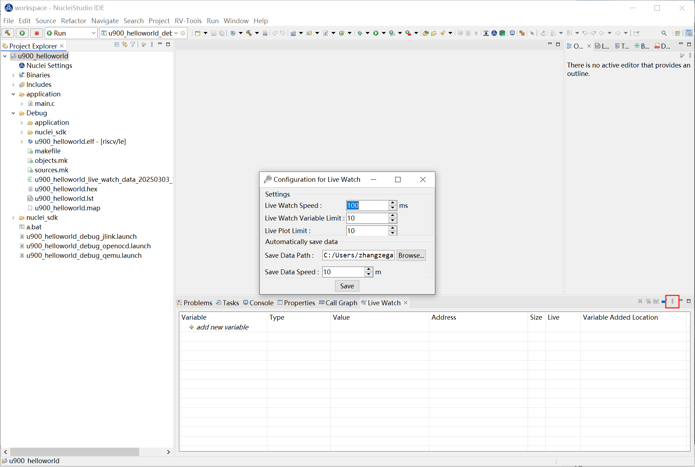
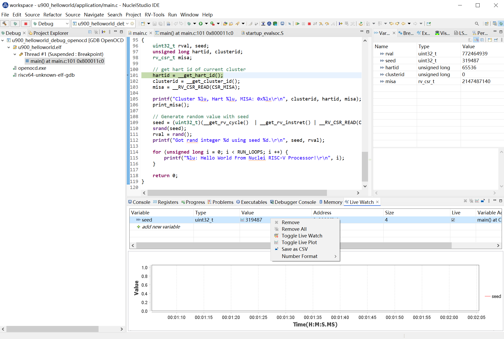
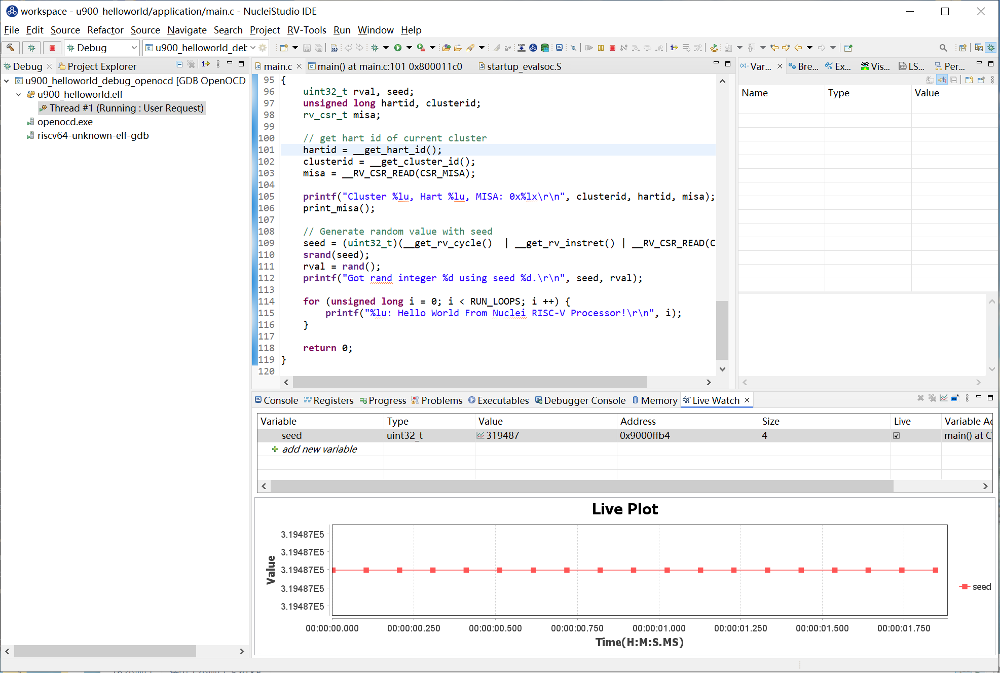
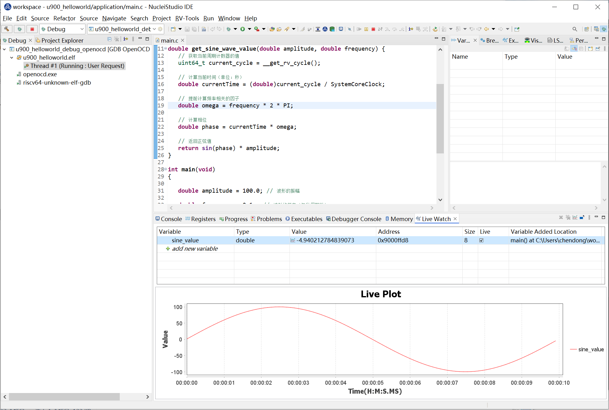
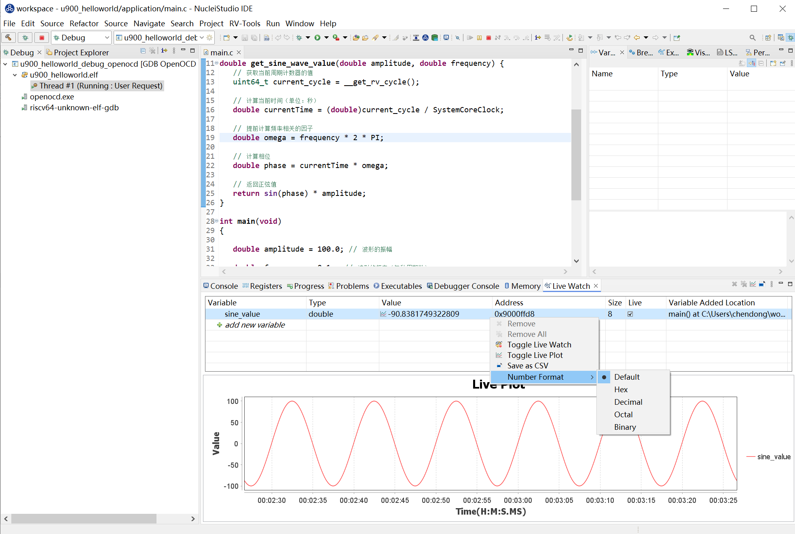
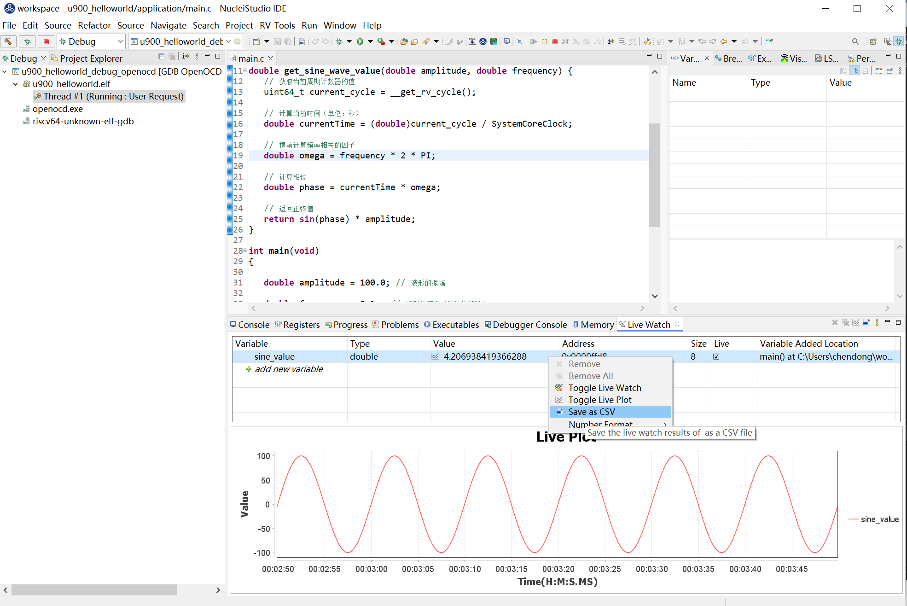
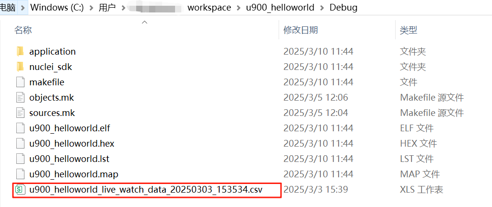
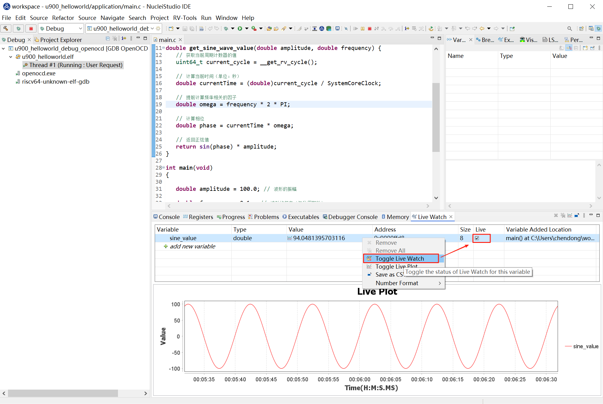

# Live Watch 功能的使用

Live Watch 是一款强大的实时监控工具，专为开发者设计，旨在帮助您更高效地调试和优化代码。通过 Live Watch，您可以即时查看程序运行过程中变量的变化情况，无需打断执行流程或手动添加日志语句。在 Nuclei Studio 2025.02 版中实现了 Live Watch 功能，它支持自动刷新变量值，确保始终看到最新的数据变化。直观的图形化界面，能轻松管理需要监控的变量。

## 背景描述

Live Watch 功能依赖 Nuclei OpenOCD >= 2025.02 版本，并且仅支持 Nuclei CPU 配置了 RISC-V SBA 功能。通过 Live Watch，开发者可以在调试过程中实时监控变量的变化，帮助快速定位问题并优化代码性能。

## 解决方案

### 环境准备

**Nuclei Studio**：

- [NucleiStudio 202502 Windows](https://download.nucleisys.com/upload/files/nucleistudio/NucleiStudio_IDE_202502-win64.zip)
- [NucleiStudio 202502 Linux](https://download.nucleisys.com/upload/files/nucleistudio/NucleiStudio_IDE_202502-lin64.tgz)

**Nuclei OpenOCD**：

- 确保安装的 OpenOCD 版本 >= 2025.02，并且支持 RISC-V SBA 功能。

### Live Watch 使用演示

**step1：导入 Nuclei SDK 原始工程和烧写开发板**

优化前的工程下载链接 [u900_helloworld.zip](u900_helloworld.zip) 

bit文件 [trace-u900_best_config_ku060_16M_e85631d489_e82e2771f_202409232110_v3.12.0.bit](..\Documents\WXWork\1688856563310943\Cache\File\2024-12\trace-u900_best_config_ku060_16M_e85631d489_e82e2771f_202409232110_v3.12.0.bit) 

下载 zip 包后，可以直接导入到 Nuclei Studio 中运行 (导入步骤：`File->Import->Existing Projects into Workspace->Select archive file->选择zip压缩包->Finish`即可)。

给ku060开发板烧写上面的bit文件。

**step2：编译 Nuclei SDK 原始工程**

编译原始工程，确保编译成功以及在 Debug 下可以找到生成的 elf 文件：

**step3：打开 Live Watch 视图**

打开 Live Watch 视图，找到 Live Watch Settings 并根据需要设置相关参数（无可不设置，直接使用默认值）。

通过 Nuclei Studio 菜单 `Window -> Show View -> Live Watch` 可以打开 Live Watch 视图。Live Watch 视图提供了一系列功能菜单，帮助用户更高效地管理和监控变量：

- **Remove**：删除 Live Watch 视图中指定的变量行。
- **Remove All**：清除 Live Watch 视图中所有添加的变量。
- **Show Live Plot**：显示 Live Plot 视图，用于对采样的数据进行实时绘图。

在隐藏的菜单栏中，有两个设置菜单用于配置全局属性：

- **Live Watch Settings**：
  - Live Watch Speed：设定 Live Watch 的采样频率，最快为 100 ms 每次。
  - Live Watch Variable Limit：限制同时采样的变量数量，最多为 10 个。
  - Live Plot Limit：设定 Live Plot 同时绘制的最大样本数，最多同时绘制 10 个样本。
  - Save Data Path：指定 Live Watch 采样的数据自动保存路径，供后续分析使用。
  - Save Data Speed：设定 Live Watch 数据自动保存的频率，默认为每 10 分钟保存一次。
- **Number Format**：Live Watch 视图变量的值的显示方式。

**step4：运行Nuclei SDK原始工程**

Debug运行程序，在Live Watch视图中添加需要查看的变量。

让工程全速运行时，可以看到变量的值，以设定的Live Watch Speed变化，如果想要通过Live Plot查看变量的变化曲线，可以选中该条记录，并点击鼠标右键，在弹出的菜单中选中 ``Toggle Live Plot`` ,Live Plot工具就会弹出，并适应的画出变量的变化曲线。

Live Plot绘制的曲线图如下

在Live Plot中点击鼠标右键弹出菜单，有 ``Suspend``、``Continue`` 两个功能菜单，点击 ``Suspend``，Live Plot会暂停画图。

用户可以通过滚动鼠标放大曲线，放大到一定倍数会显示节点，鼠标移至节点可查看数据详情；点击 ``Continue`` Live Plot会继续绘制曲线。

如果不想查看该变量的变化曲线，可以再次点击 ``Toggle Live Plot`` ，将该变量从Live Plot踢除。

Live Watch视图中的某个变量，点击鼠标右键，可以修改数据显示的格式。

Live Watch视图中的某个变量，点击鼠标右键，将该变量的结果存存为CSV格式文件，方便查阅和使用。

Live Watch也会自动将查询到的数据结果保存到 ``Save Data Path`` 中，用户可以在Save Data Path找到对应的CSV格式的数据文件。

如果不想继续查看该变量的值，也可以选中该条记录，并点击鼠标右键，在弹出的菜单中选中 ``Toggle Live Watch`` ,Live Watch就不再适时查询该变量的值。

### 总结

Live Watch 功能为开发者提供了一个强大的实时监控工具，极大地提升了调试效率和代码优化的能力。通过合理使用 Live Watch，开发者可以更轻松地应对复杂的调试任务，提升开发效率。