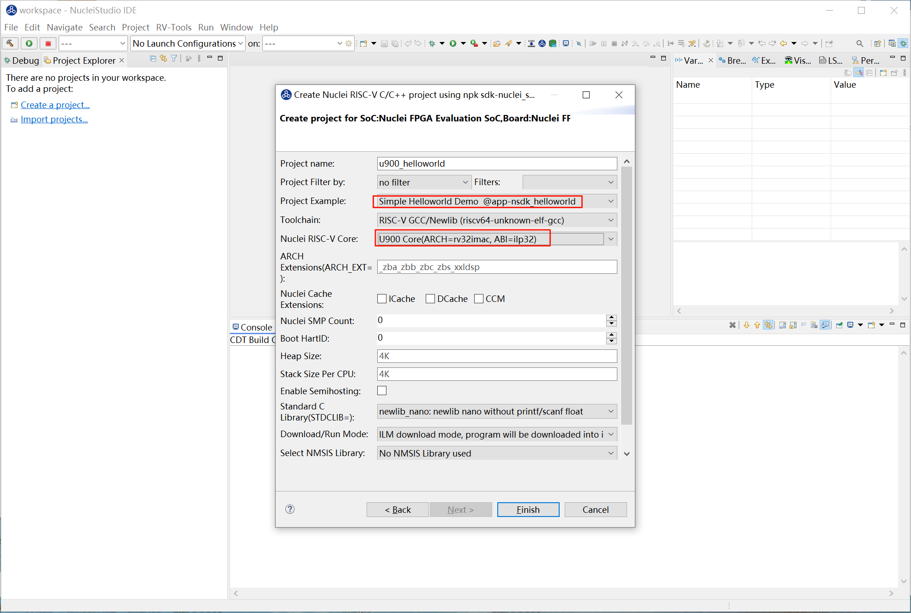
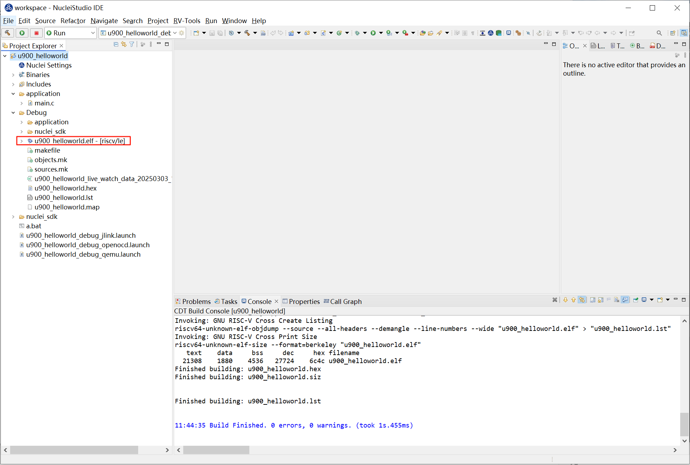
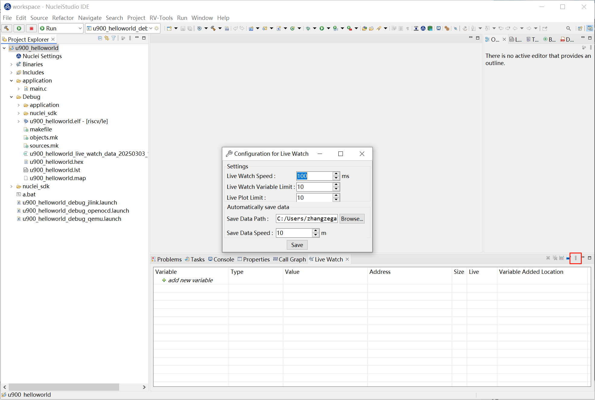
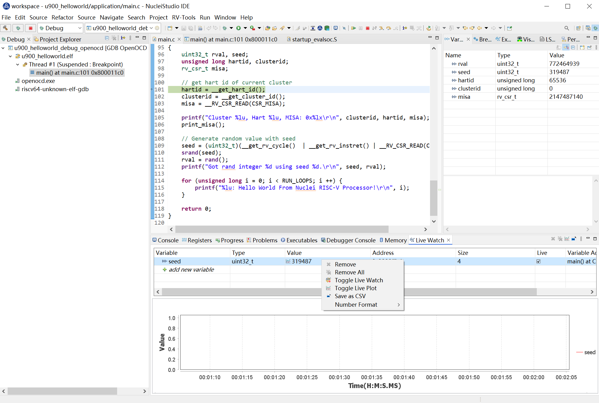
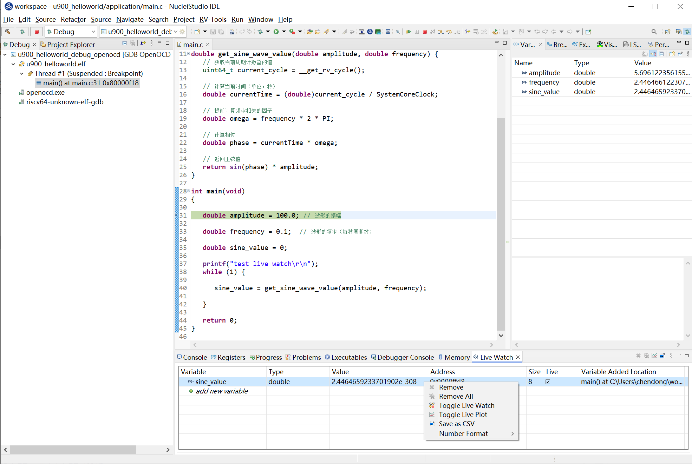
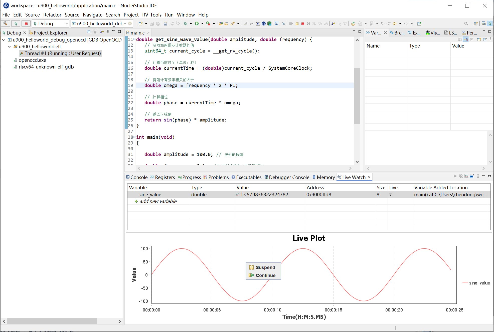
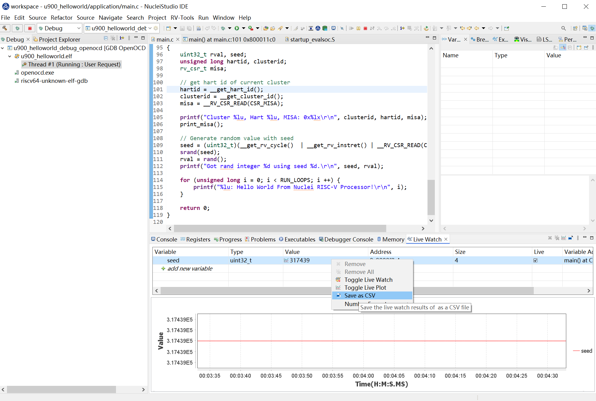
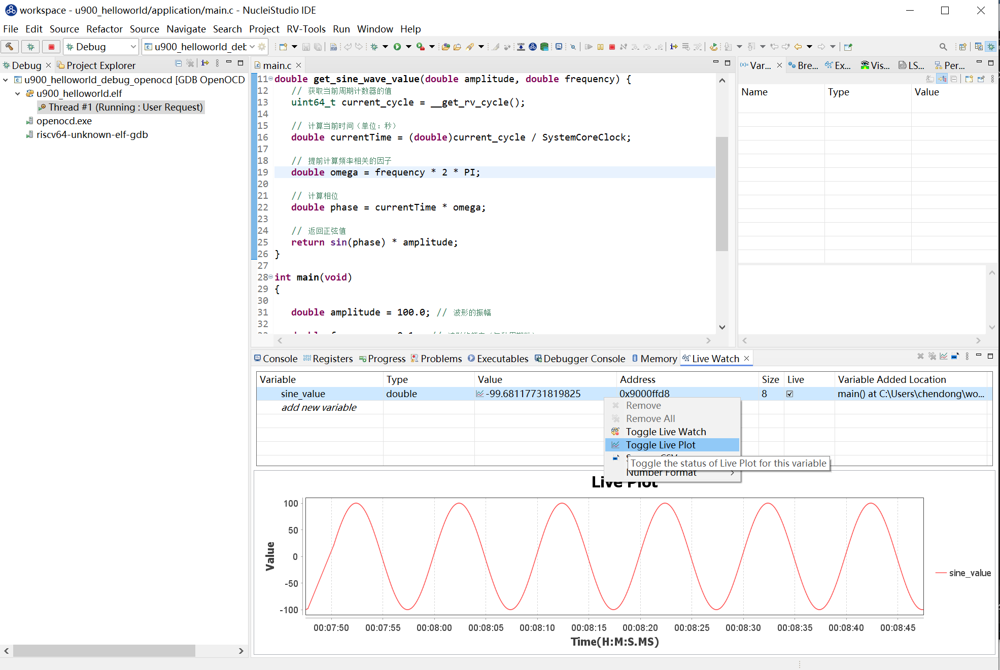
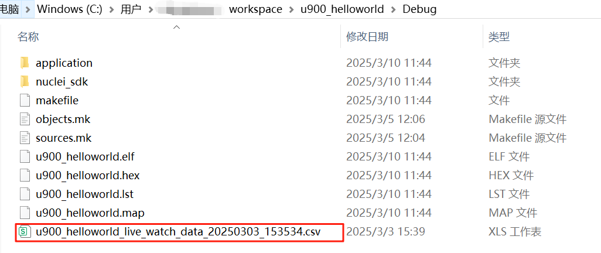

# Using the Live Watch Feature

Live Watch is a powerful real-time monitoring tool designed for developers to help you debug and optimize code more efficiently. With Live Watch, you can instantly observe how variables change while the program is running, without interrupting execution or manually adding log statements. The Live Watch feature is implemented in Nuclei Studio 2025.02. It supports automatic refreshing of variable values, ensuring that you always see the latest data changes. Its intuitive graphical interface makes it easy to manage the variables you want to monitor.

## Background

The Live Watch feature depends on Nuclei OpenOCD version >= 2025.02, and it only supports Nuclei CPUs configured with the RISC-V SBA feature. With Live Watch, developers can monitor variable changes in real time during debugging, helping to quickly locate issues and optimize code performance.

## Solution

### Environment Preparation

**Nuclei Studio**:

- [NucleiStudio 202502 Windows](https://download.nucleisys.com/upload/files/nucleistudio/NucleiStudio_IDE_202502-win64.zip)
- [NucleiStudio 202502 Linux](https://download.nucleisys.com/upload/files/nucleistudio/NucleiStudio_IDE_202502-lin64.tgz)

**Nuclei OpenOCD**:

- Make sure the installed OpenOCD version is >= 2025.02 and that it supports the RISC-V SBA feature.

### Live Watch Usage Demo

**Step 1: Create a project and flash the bitstream**

Use version 0.7.1 of sdk-nuclei_sdk to create a u900 helloworld project. Select Simple Helloworld Demo and U900 Core in turn, then click Finish.

Flash the corresponding bitstream to the development board. Here we use trace-u900_best_config_ku060_16M_e85631d489_e82e2771f_202409232110_v3.12.0.bit

**Step 2: Build the original Nuclei SDK project**

Build the original project and make sure the build succeeds and that the generated elf file can be found under Debug:

**Step 3: Open the Live Watch view**

Open the Live Watch view, find Live Watch Settings, and configure the relevant parameters as needed. Here we simply use the default values.

For configuration details, refer to the figure below or the [Nuclei Development Tool Guide](https://download.nucleisys.com/upload/files/doc/nucleistudio/NucleiStudio_User_Guide.202502.pdf)

**Step 4: Run the original Nuclei SDK project**

Debug and run the program, then add the variable seed you want to observe in the Live Watch view.

If you want to view the variable's change curve through Live Plot, select that record, right-click it, and choose ``Toggle Live Plot`` from the pop-up menu. The Live Plot tool will then pop up.

When the project runs at full speed, you can see the variable's value changing at the configured Live Watch Speed. The curve plotted by Live Plot is shown below.

As more and more data nodes accumulate over time, the data nodes will be hidden. You can right-click Suspend in Live Plot to pause, then scroll the mouse wheel to zoom in on the curve. Once zoomed in to a certain level, the nodes will be displayed, and you can hover the mouse over a node to view its data details. Click ``Continue`` to let Live Plot resume plotting the curve.

Select the seed row and right-click it to save the variable's results as a CSV file for review and use.

Live Watch also automatically saves the queried data results to the ``Save Data Path``. You can find the corresponding CSV data files at the address specified by Save Data Path.

### Summary

The Live Watch feature provides developers with a powerful real-time monitoring tool that greatly improves debugging efficiency and code optimization capabilities. By using Live Watch effectively, developers can handle complex debugging tasks more easily and improve development productivity.
