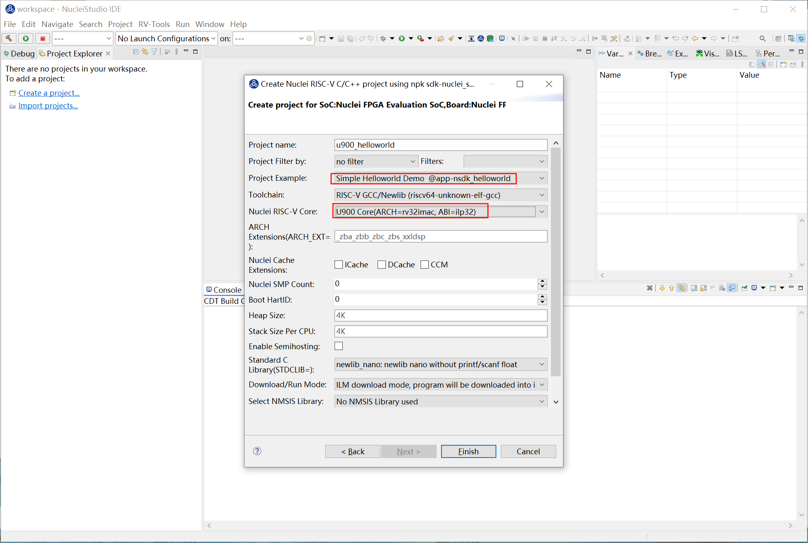
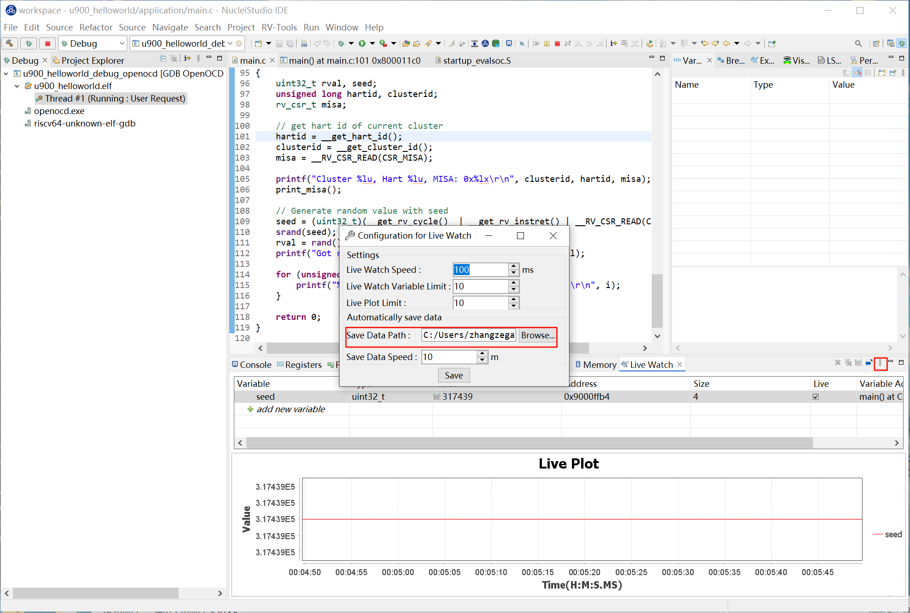

# Live Watch 功能的使用

Live Watch 是一款强大的实时监控工具，专为开发者设计，旨在帮助您更高效地调试和优化代码。通过 Live Watch，您可以即时查看程序运行过程中变量的变化情况，无需打断执行流程或手动添加日志语句。在 Nuclei Studio 2025.02 版中实现了 Live Watch 功能，它支持自动刷新变量值，确保始终看到最新的数据变化。直观的图形化界面，能轻松管理需要监控的变量。

## 背景描述

Live Watch 功能依赖 Nuclei OpenOCD >= 2025.02 版本，并且仅支持 Nuclei CPU 配置了 RISC-V SBA 功能。通过 Live Watch，开发者可以在调试过程中实时监控变量的变化，帮助快速定位问题并优化代码性能。

## 解决方案

### 环境准备

**Nuclei Studio**：

- [NucleiStudio 202502 Windows](https://download.nucleisys.com/upload/files/nucleistudio/NucleiStudio_IDE_202502-win64.zip)
- [NucleiStudio 202502 Linux](https://download.nucleisys.com/upload/files/nucleistudio/NucleiStudio_IDE_202502-lin64.tgz)

**Nuclei OpenOCD**：

- 确保安装的 OpenOCD 版本 >= 2025.02，并且支持 RISC-V SBA 功能。

### Live Watch 使用演示

**step1：创建项目，烧写bit**

使用0.7.1版本的sdk-nuclei_sdk创建一个u900的helloworld项目，依次选择Simple Helloworld Demo和U900 Core，点击Finsh。

开发板烧写对应的bit即可，这里我们使用trace-u900_best_config_ku060_16M_e85631d489_e82e2771f_202409232110_v3.12.0.bit

**step2：编译 Nuclei SDK 原始工程**

编译原始工程，确保编译成功以及在 Debug 下可以找到生成的 elf 文件：

**step3：打开 Live Watch 视图**

打开 Live Watch 视图，找到 Live Watch Settings 并根据需要设置相关参数，这里我们直接使用默认值。

如需配置可参考下图或[Nuclei Development Tool Guide](https://download.nucleisys.com/upload/files/doc/nucleistudio/NucleiStudio_User_Guide.202502.pdf)

**step4：运行Nuclei SDK原始工程**

Debug运行程序，在Live Watch视图中添加需要查看的变量seed。

这里想要通过Live Plot查看变量的变化曲线，选中该条记录，并点击鼠标右键，在弹出的菜单中选中 ``Toggle Live Plot`` ,Live Plot工具就会弹出。

让工程全速运行时，可以看到变量的值，以设定的Live Watch Speed变化，Live Plot绘制的曲线图如下。

当随着时间数据节点越来越多时，届时会隐藏数据节点。用户可以在Live Plot右键点击Suspend暂停，然后通过滚动鼠标放大曲线，放大到一定倍数会显示节点，鼠标移至节点可查看数据详情；点击 ``Continue`` Live Plot则继续绘制曲线。

选中seed行,点击鼠标右键，将该变量的结果存为CSV格式文件，用来查阅和使用。

Live Watch也会自动将查询到的数据结果保存到 ``Save Data Path`` 中，可以在Save Data Path对应地址找到对应的CSV格式的数据文件。

### 总结

Live Watch 功能为开发者提供了一个强大的实时监控工具，极大地提升了调试效率和代码优化的能力。通过合理使用 Live Watch，开发者可以更轻松地应对复杂的调试任务，提升开发效率。