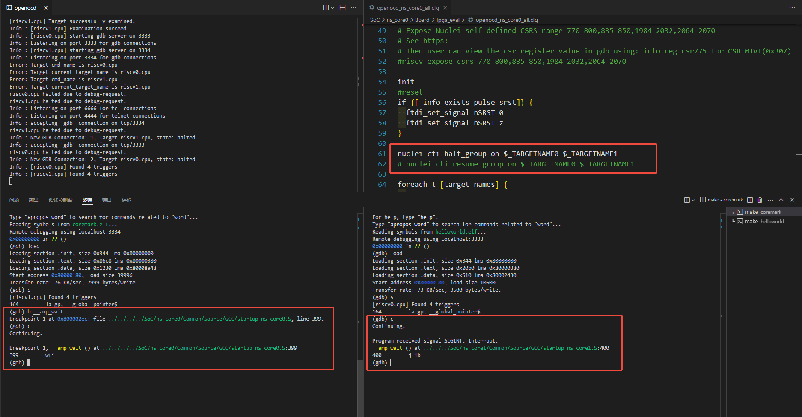
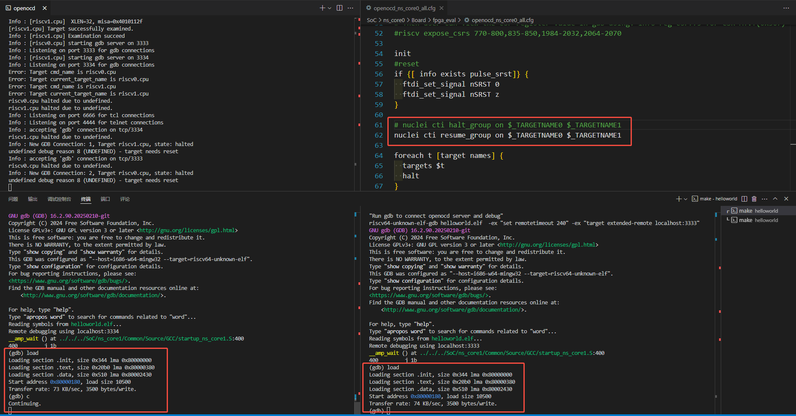
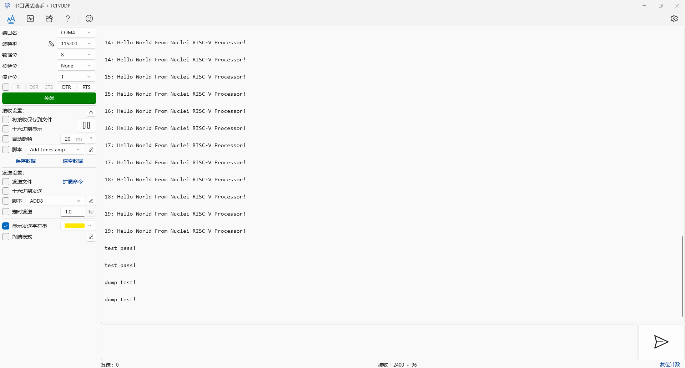
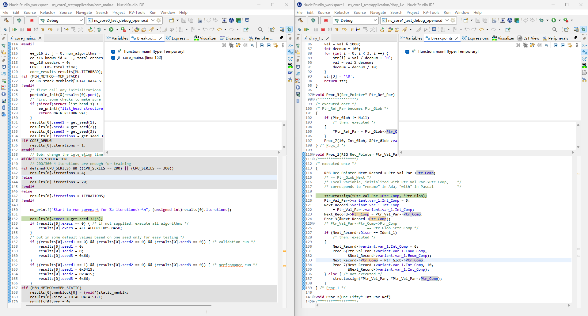
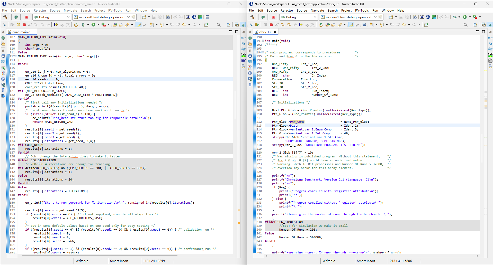
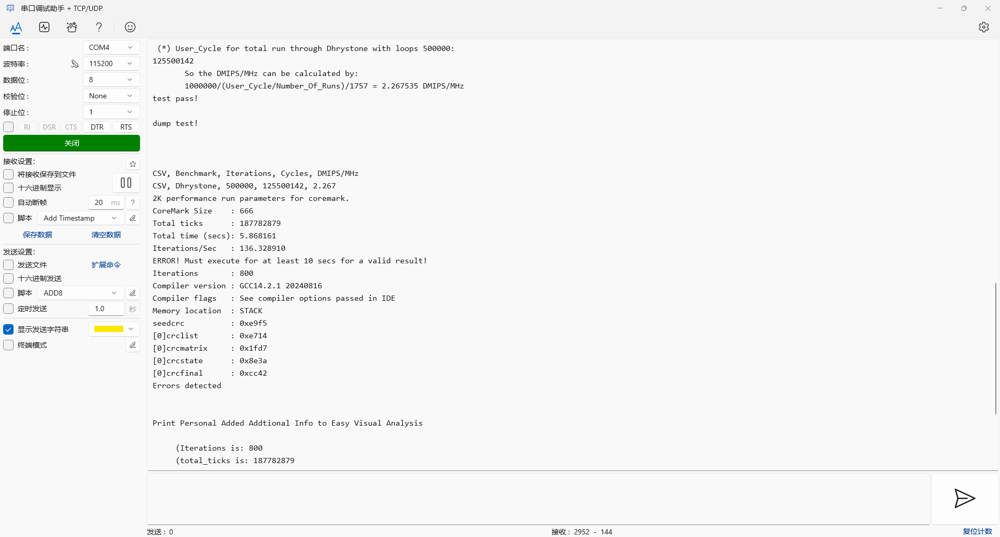

# Guide to Using the Nuclei Cross-Trigger Feature in OpenOCD

## Feature Overview

To meet the need for synchronized halt and resume in AMP multicore debugging, the Nuclei RISC-V CPU implements the cross-trigger feature. OpenOCD has integrated the following two synchronization control features:

1. **Synchronized Halt Group (halt_group)** - When any core in the group halts, all other members automatically halt in sync
2. **Synchronized Resume Group (resume_group)** - When any core in the group resumes execution, all other members automatically resume in sync

Basic command format:

```
# add target to halt_group
nuclei cti halt_group on $_TARGETNAME0 $_TARGETNAME1

# remove target from halt_group
nuclei cti halt_group off $_TARGETNAME0 $_TARGETNAME1

# add target to resume_group
nuclei cti resume_group on $_TARGETNAME0 $_TARGETNAME1

# remove target from resume_group
nuclei cti resume_group off $_TARGETNAME0 $_TARGETNAME1
```

## Configuration File Examples

### 1. Synchronized Halt Group Configuration

```tcl
adapter_khz     1000

interface ftdi
ftdi_vid_pid 0x0403 0x6010
ftdi_oscan1_mode off

transport select jtag

ftdi_layout_init 0x0008 0x001b
ftdi_layout_signal nSRST -oe 0x0020 -data 0x0020
ftdi_layout_signal TCK -data 0x0001
ftdi_layout_signal TDI -data 0x0002
ftdi_layout_signal TDO -input 0x0004
ftdi_layout_signal TMS -data 0x0008
ftdi_layout_signal JTAG_SEL -data 0x0100 -oe 0x0100

set _CHIPNAME0 riscv0
jtag newtap $_CHIPNAME0 cpu -irlen 5 -expected-id 0x10900a6d
set _TARGETNAME0 $_CHIPNAME0.cpu
target create $_TARGETNAME0 riscv -chain-position $_TARGETNAME0 -coreid 0 

set _CHIPNAME1 riscv1
jtag newtap $_CHIPNAME1 cpu -irlen 5 -expected-id 0x10900a6d
set _TARGETNAME1 $_CHIPNAME1.cpu
target create $_TARGETNAME1 riscv -chain-position $_TARGETNAME1 -coreid 0 

init
#reset

if {[ info exists pulse_srst]} {
  ftdi_set_signal nSRST 0
  ftdi_set_signal nSRST z
}

# add targets to the halt group
nuclei cti halt_group on $_TARGETNAME0 $_TARGETNAME1

foreach t [target names] {
  targets $t
  halt
}
```

### 2. Synchronized Resume Group Configuration

```tcl
adapter_khz     1000

interface ftdi
ftdi_vid_pid 0x0403 0x6010
ftdi_oscan1_mode off

transport select jtag

ftdi_layout_init 0x0008 0x001b
ftdi_layout_signal nSRST -oe 0x0020 -data 0x0020
ftdi_layout_signal TCK -data 0x0001
ftdi_layout_signal TDI -data 0x0002
ftdi_layout_signal TDO -input 0x0004
ftdi_layout_signal TMS -data 0x0008
ftdi_layout_signal JTAG_SEL -data 0x0100 -oe 0x0100

set _CHIPNAME0 riscv0
jtag newtap $_CHIPNAME0 cpu -irlen 5 -expected-id 0x10900a6d
set _TARGETNAME0 $_CHIPNAME0.cpu
target create $_TARGETNAME0 riscv -chain-position $_TARGETNAME0 -coreid 0 

set _CHIPNAME1 riscv1
jtag newtap $_CHIPNAME1 cpu -irlen 5 -expected-id 0x10900a6d
set _TARGETNAME1 $_CHIPNAME1.cpu
target create $_TARGETNAME1 riscv -chain-position $_TARGETNAME1 -coreid 0 

init
#reset

if {[ info exists pulse_srst]} {
  ftdi_set_signal nSRST 0
  ftdi_set_signal nSRST z
}

# add target to resume_group
nuclei cti resume_group on $_TARGETNAME0 $_TARGETNAME1

foreach t [target names] {
  targets $t
  halt
}
```

## Command-Line Verification Steps

### 1. Synchronized Halt Group Verification

1. Targets have been added to the `halt_group` in the configuration file
2. Load different firmware onto the two cores
3. Set a breakpoint only in the `__amp_wait()` function of core0
4. Execution flow: resume core1 first, then resume core0
5. Expected result: when core0 hits the breakpoint and halts, core1 halts in sync



### 2. Synchronized Resume Group Verification

1. Targets have been added to the `resume_group` in the configuration file
2. Load the same helloworld firmware onto both cores
3. Send the continue/resume command to core0 only:
4. Expected result: the serial port output shows both cores running simultaneously





## IDE Verification Steps

### 1. Synchronized Halt Group Verification

1. `halt_group` has been configured in the configuration file
2. Load different firmware onto the two cores
3. Set a breakpoint at line 152 of `core_main.c` in core0
4. Operation sequence:
   - Start core1 first
   - Then start core0
5. Expected result: when core0 hits the breakpoint, core1 halts in sync



### 2. Synchronized Resume Group Verification

1. `resume_group` has been configured in the configuration file
2. Load different firmware onto the two cores
3. Start core0 only
4. Expected result: the serial port output shows both cores running simultaneously




