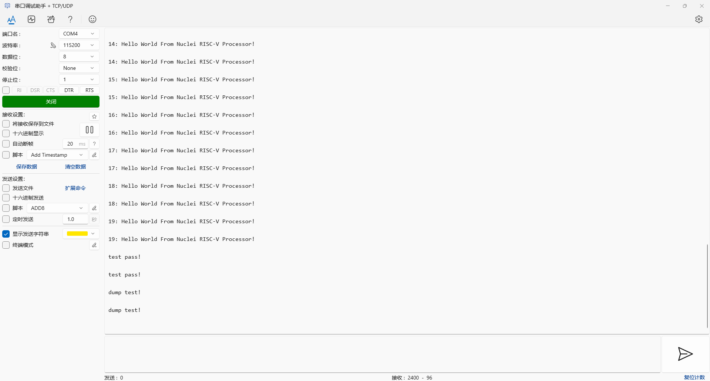
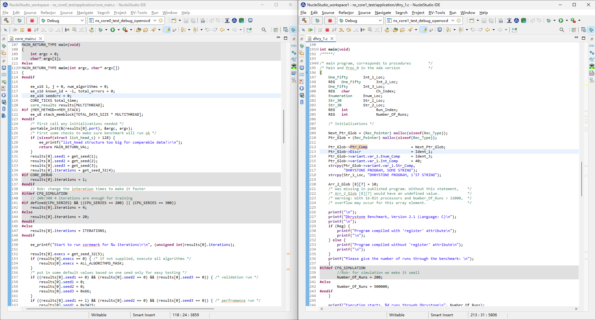

# OpenOCD 中 Nuclei 交叉触发功能使用指南

## 功能概述

为满足 AMP 多核调试中同步暂停(halt)与恢复(resume)的需求，Nuclei RISC-V CPU实现了 cross-trigger 功能，OpenOCD 已集成以下两种同步控制功能：

1. **同步暂停组 (halt_group)** - 组内任一核暂停时，其他成员自动同步暂停
2. **同步恢复组 (resume_group)** - 组内任一核恢复运行时，其他成员自动同步恢复

基本命令格式：

```
# add target to halt_group
nuclei cti halt_group on $_TARGETNAME0 $_TARGETNAME1

# remove target from halt_group
nuclei cti halt_group off $_TARGETNAME0 $_TARGETNAME1

# add target to resume_group
nuclei cti resume_group on $_TARGETNAME0 $_TARGETNAME1

# remove target from resume_group
nuclei cti resume_group off $_TARGETNAME0 $_TARGETNAME1
```

## 配置文件示例

### 1. 同步暂停组配置

```tcl
adapter_khz     1000

interface ftdi
ftdi_vid_pid 0x0403 0x6010
ftdi_oscan1_mode off

transport select jtag

ftdi_layout_init 0x0008 0x001b
ftdi_layout_signal nSRST -oe 0x0020 -data 0x0020
ftdi_layout_signal TCK -data 0x0001
ftdi_layout_signal TDI -data 0x0002
ftdi_layout_signal TDO -input 0x0004
ftdi_layout_signal TMS -data 0x0008
ftdi_layout_signal JTAG_SEL -data 0x0100 -oe 0x0100

set _CHIPNAME0 riscv0
jtag newtap $_CHIPNAME0 cpu -irlen 5 -expected-id 0x10900a6d
set _TARGETNAME0 $_CHIPNAME0.cpu
target create $_TARGETNAME0 riscv -chain-position $_TARGETNAME0 -coreid 0 

set _CHIPNAME1 riscv1
jtag newtap $_CHIPNAME1 cpu -irlen 5 -expected-id 0x10900a6d
set _TARGETNAME1 $_CHIPNAME1.cpu
target create $_TARGETNAME1 riscv -chain-position $_TARGETNAME1 -coreid 0 

init
#reset

if {[ info exists pulse_srst]} {
  ftdi_set_signal nSRST 0
  ftdi_set_signal nSRST z
}

# 添加目标到暂停组
nuclei cti halt_group on $_TARGETNAME0 $_TARGETNAME1

foreach t [target names] {
  targets $t
  halt
}
```

### 2. 同步恢复组配置

```tcl
adapter_khz     1000

interface ftdi
ftdi_vid_pid 0x0403 0x6010
ftdi_oscan1_mode off

transport select jtag

ftdi_layout_init 0x0008 0x001b
ftdi_layout_signal nSRST -oe 0x0020 -data 0x0020
ftdi_layout_signal TCK -data 0x0001
ftdi_layout_signal TDI -data 0x0002
ftdi_layout_signal TDO -input 0x0004
ftdi_layout_signal TMS -data 0x0008
ftdi_layout_signal JTAG_SEL -data 0x0100 -oe 0x0100

set _CHIPNAME0 riscv0
jtag newtap $_CHIPNAME0 cpu -irlen 5 -expected-id 0x10900a6d
set _TARGETNAME0 $_CHIPNAME0.cpu
target create $_TARGETNAME0 riscv -chain-position $_TARGETNAME0 -coreid 0 

set _CHIPNAME1 riscv1
jtag newtap $_CHIPNAME1 cpu -irlen 5 -expected-id 0x10900a6d
set _TARGETNAME1 $_CHIPNAME1.cpu
target create $_TARGETNAME1 riscv -chain-position $_TARGETNAME1 -coreid 0 

init
#reset

if {[ info exists pulse_srst]} {
  ftdi_set_signal nSRST 0
  ftdi_set_signal nSRST z
}

# add target to resume_group
nuclei cti resume_group on $_TARGETNAME0 $_TARGETNAME1

foreach t [target names] {
  targets $t
  halt
}
```

## 命令行验证步骤

### 1. 同步暂停组验证

1. 配置文件中已添加目标到 `halt_group`
2. 为两个核心分别加载不同固件
3. 仅在 core0 的 `__amp_wait()` 函数设置断点
4. 执行流程：先恢复 core1，再恢复 core0
5. 验证结果：当 core0 触发断点暂停时，core1 同步暂停


### 2. 同步恢复组验证

1. 配置文件中已添加目标到 `resume_group`
2. 为两个核心加载相同 helloworld 固件
3. 仅向 core0 发送继续运行命令：
4. 验证结果：串口输出显示两个核心同时运行




## IDE 验证步骤

### 1. 同步暂停组验证

1. 配置文件中已配置 `halt_group`
2. 为两个核心加载不同固件
3. 在 core0 的 `core_main.c` 第 152 行设置断点
4. 操作顺序：
   - 先启动 core1 运行
   - 再启动 core0 运行
5. 验证结果：core0 触发断点时，core1 同步暂停


### 2. 同步恢复组验证

1. 配置文件中已配置 `resume_group`
2. 为两个核心加载不同固件
3. 仅启动 core0 运行
4. 验证结果：串口输出显示两个核心同时运行




