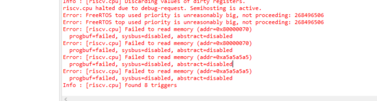
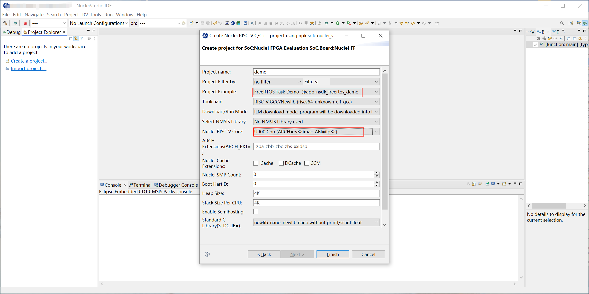
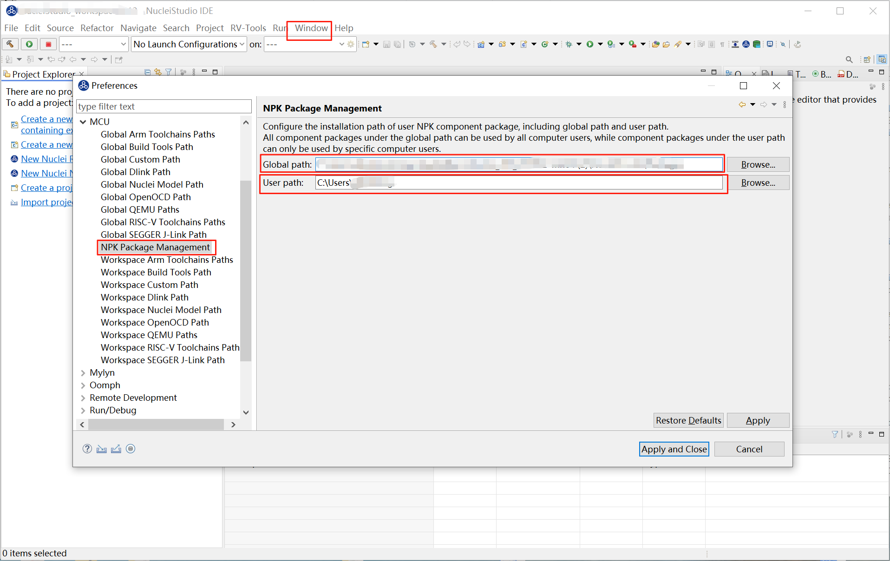
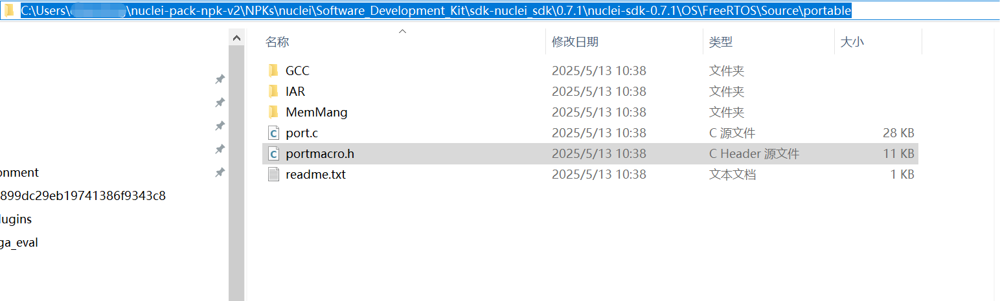
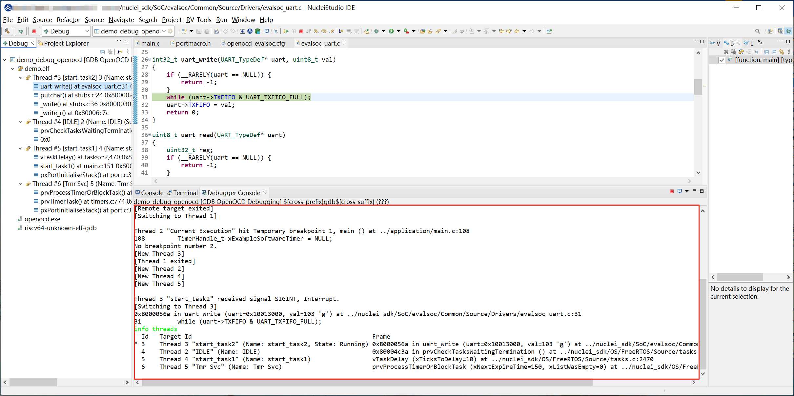

# User Guide for FreeRTOS Debugging Support in OpenOCD

By updating your Nuclei Studio IDE to version 202502 and downloading sdk-nuclei_sdk 0.7.1, together with the modifications described below, you can debug FreeRTOS using OpenOCD.

### Environment Preparation

**Nuclei Studio**:

- [NucleiStudio 202502 Windows](https://download.nucleisys.com/upload/files/nucleistudio/NucleiStudio_IDE_202502-win64.zip)
- [NucleiStudio 202502 Linux](https://download.nucleisys.com/upload/files/nucleistudio/NucleiStudio_IDE_202502-lin64.tgz)

**Nuclei OpenOCD**:

- The OpenOCD bundled with NucleiStudio 202502 is sufficient.

### Usage Steps

**Step 1: Create the Original Project**

Download sdk-nuclei_sdk version 0.7.1 in NucleiStudio IDE.

Create a 900 project, as shown below.

Program the corresponding bitstream to the development board. In this guide, we use u900_best_config_ku060_50M_c1dd7f44af_915aefa97_202504141013_v4.1.0.bit.

**Step 2: Modify the portmacro.h Content**

After the project is created, locate nuclei_sdk\OS\FreeRTOS\Source\portable\portmacro.h and modify the file content as follows:

~~~
typedef uint32_t TickType_t;
#define portMAX_DELAY           ( TickType_t )0xFFFFFFFFUL
/* RISC-V TIMER is 64-bit long */
//typedef uint64_t TickType_t;
//#define portMAX_DELAY           ( TickType_t )0xFFFFFFFFFFFFFFFFULL
~~~

**Step 3: Modify the openocd_evalsoc.cfg Content**

Locate nuclei_sdk/SoC/evalsoc/Board/nuclei_fpga_eval/openocd_evalsoc.cfg and modify line 118:

~~~
target create $_TARGETNAME riscv -chain-position $_TARGETNAME -coreid $BOOTHART -rtos FreeRTOS
~~~

**Step 4: Debug the Project with OpenOCD**

Run the program in Debug mode and open the Debugger Console view.

In the Debugger Console view, type info threads and press Enter.

### Usage Notes

Currently only **FreeRTOS** is supported; **Zephyr**, **ThreadX**, and **UCOSII** are not supported.
