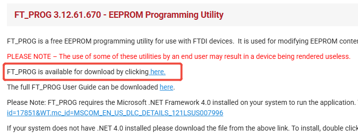
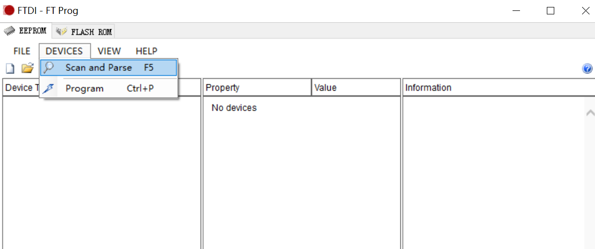
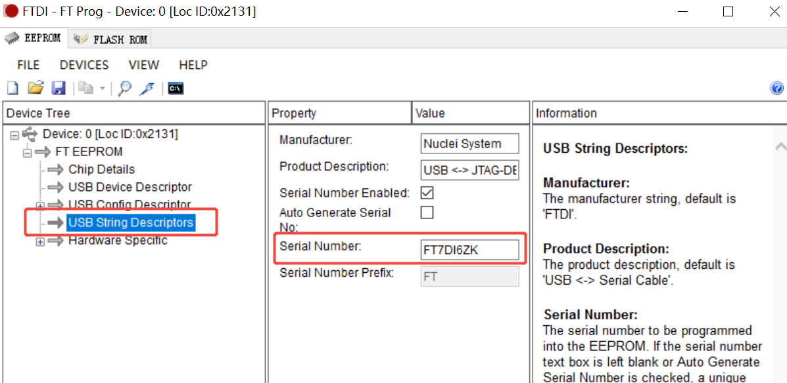
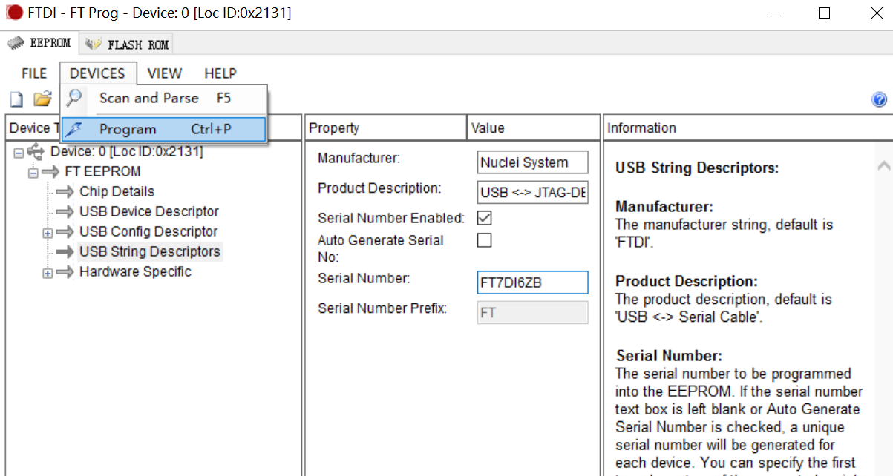
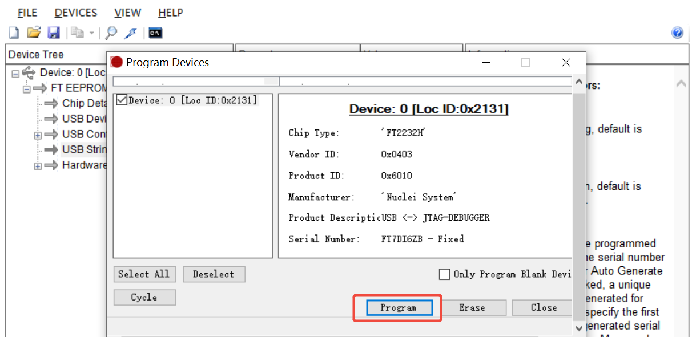
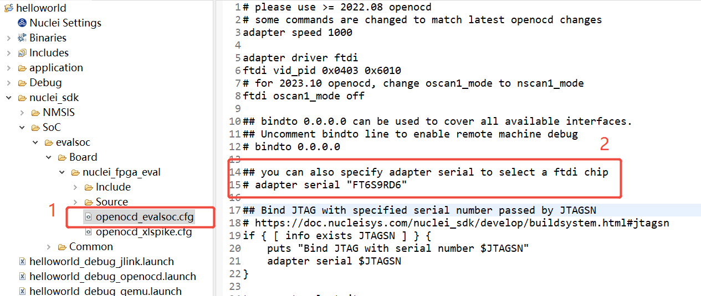

# How to Debug with Multiple Hummingbird Debuggers Simultaneously

## Problem Description

Nuclei System Technology's Hummingbird Debugger uses the [FTDI-FT2232H](https://ftdichip.cn/Products/ICs/FT2232H.html) as its USB interface bridge chip.
When multiple Hummingbird Debuggers are connected at the same time, how can you distinguish between different debuggers? How do you configure OpenOCD to recognize a specific Hummingbird Debugger?

## Solution

The FT2232H provides a configurable Serial Number that can be used to distinguish between different debuggers.

### Download FT_PROG

FT_PROG is a tool for programming the EEPROM inside the FT2232H. It can be used to view and modify the FT2232H's Serial Number.

FT_PROG download page: [https://ftdichip.com/utilities/](https://ftdichip.com/utilities/)

You can find the download link on this page, as shown in the figure below:



After downloading and installing, an FT_Prog tool icon will be created on the desktop.

### View the Serial Number

Using the FT_PROG tool, you can view the FT2232H's Serial Number.

1. **Connect the Hummingbird Debugger** If you cannot distinguish between multiple Hummingbird Debuggers, it is recommended to connect only one Hummingbird Debugger first.
2. **Open the FT_PROG tool** Click the FT_PROG icon to open the tool.
3. **Scan for devices** Click `Scan and Parse` in the `DEVICES` menu to scan for connected Hummingbird Debuggers.

  

4. **View the Serial Number** You can view the Hummingbird Debugger's Serial Number under `Serial Number` in the `USB String Descriptors` section.

  

### Modify the Serial Number

You can modify the Hummingbird Debugger's Serial Number on the same page where you view it.

For example, in the figure below, I changed the original Serial Number `FT7DI6ZK` to `FT7DI6ZB`



Then, using the `Program` option in the `DEVICES` menu, you can write the modified Serial Number into the FT2232H's EEPROM.



**Note**: Multiple Hummingbird Debuggers must be assigned different Serial Numbers to distinguish between them.

### Update the OpenOCD Configuration

When using the Nuclei FPGA Evaluation Board, open the project's OpenOCD configuration file in Nuclei Studio, and you will see the following content:



#### Linux

Modify the `openocd_evalsoc.cfg` file according to the instructions in the red box in the figure:

```
# Note: remove the comment symbol # before adapter serial
adapter serial "<Serial Number>"
```

Replace `<Serial Number>` with the actual Serial Number.

Once modified, the project can be debugged using the Hummingbird Debugger with the specified Serial Number.

#### Windows

**Note**: On Windows, you need to append `A` to the actual Serial Number for the setting to be valid.

For example, if the actual Serial Number is `FT7DI6ZB`, the OpenOCD configuration file needs the following setting:

```
adapter serial "FT7DI6ZBA"
```

## References

- [Nuclei Studio FAQs —— How to select correct FTDI debugger?](https://doc.nucleisys.com/nuclei_sdk/faq.html#how-to-select-correct-ftdi-debugger)
- [FTDI Utilities](https://ftdichip.com/utilities/)
- [User Guide for FTDI FT_PROG Utility](https://www.ftdichip.com/Support/Documents/AppNotes/AN_124_User_Guide_For_FT_PROG.pdf)
