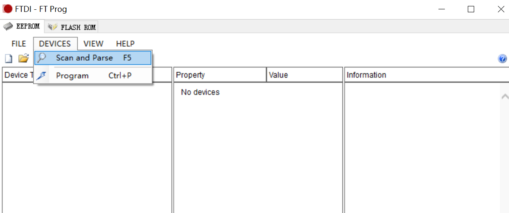
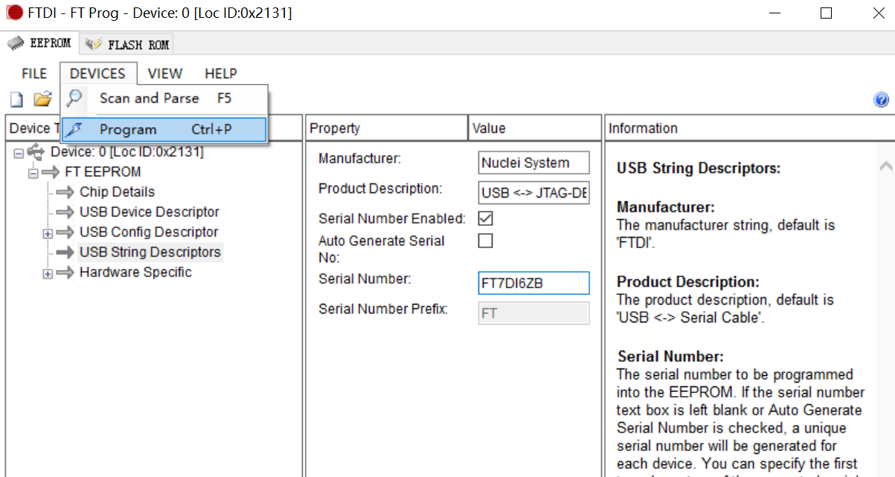
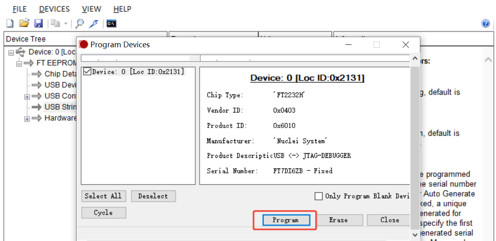

# 如何同时使用多个蜂鸟调试器进行调试

## 问题说明

芯来科技的蜂鸟调试器采用[FTDI-FT2232H](https://ftdichip.cn/Products/ICs/FT2232H.html)作为USB接口转换芯片。
在同时连接多个蜂鸟调试器的情况下，如何区分不同的调试器？如何配置OpenOCD识别指定的蜂鸟调试器？

## 解决方案

FT2322H提供了一个可配置的串号（Serial Number），可用于区分不同的调试器。

### 下载FT_PROG

FT_PROG是一个用于烧写FT2322H片内的EEPROM的工具。可用于查看和修改FT2322H的串号。

FT_PROG下载地址：[https://ftdichip.com/utilities/](https://ftdichip.com/utilities/)

从这个页面中可以找到下载链接，如下图所示：


下载并安装后，会在桌面生成FT_Prog工具的图标。

### 查看串号

使用FT_PROG工具，可以查看FT2322H的串号。

1. **连接蜂鸟调试器** 建议在无法区分多个蜂鸟调试器的情况下，先只连接一个蜂鸟调试器。
2. **打开FT_PROG工具** 点击FT_PROG图标打开工具。
3. **扫描设备** 点击菜单栏`DEVICES`中的`Scan and Parse`，扫描已连接的蜂鸟调试器。

  

4. **查看串号** 通过`USB String Descriptors`中的`Serial Number`可以查看蜂鸟调试器的串号。

  

### 修改串号

在查看串号的页面可以修改蜂鸟调试器的串号。

比如下图中，我将原来的串号`FT7DI6ZK`改成了`FT7DI6ZB`



再通过菜单栏`DEVICES`中的`Program`选项，可以将修改后的串号写入到FT2322H的EEPROM中。



**注意**：多个蜂鸟调试器需要分别设置不同的串号来进行区分。

### 更新OpenOCD配置

在使用Nuclei FPGA Evaluation Board时，打开Nuclei Studio中的工程OpenOCD配置文件，可以看到如下内容：


#### Linux

修改`openocd_evalsoc.cfg`文件，即根据图中红框中的说明进行修改：

```
# 注意要去掉adapter serial前面的注释符号 #
adapter serial "<Serial Number>"
```

其中的`<Serial Number>`需要替换成实际的串号。

修改后的工程即可使用指定串号的蜂鸟调试器进行调试。

#### Windows

**注意**：在Windows系统下，需要在实际的串号后加上`A`才是有效的设置。

例如实际的串号是`FT7DI6ZB`，那么OpenOCD的配置文件需要添加如下设置：

```
adapter serial "FT7DI6ZBA"
```

## 参考资料

- [Nuclei Studio FAQs —— How to select correct FTDI debugger?](https://doc.nucleisys.com/nuclei_sdk/faq.html#how-to-select-correct-ftdi-debugger)
- [FTDI Utilities](https://ftdichip.com/utilities/)
- [User Guide for FTDI FT_PROG Utility](https://www.ftdichip.com/Support/Documents/AppNotes/AN_124_User_Guide_For_FT_PROG.pdf)
