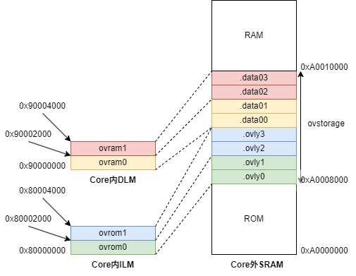

# Using the `OVERLAY` Command in Linker Scripts

## Problem Description

The SRAM inside a CPU Core is fast, small in capacity, and large in area. In embedded systems, this on-Core RAM is very likely unable to hold all functions.
To solve this problem, one approach is to use the `OVERLAY` command in the linker script.
The `OVERLAY` command provided by GNU `ld` allows multiple sections to be "overlaid" on the same memory region. Several sections can share the same runtime
VMA (Virtual Memory Address); at runtime, the loading and unloading of these overlay sections must be managed manually.

So how do you use the `OVERLAY` command in Nuclei Studio IDE? This article provides a sample program demonstrating how to use the `OVERLAY` command.

## Solution

### Sample Program

[demo_overlay](https://drive.weixin.qq.com/s?k=ABcAKgdSAFcp7C3O2T) is a sample project created with
[Nuclei Studio IDE 2025.02](https://www.nucleisys.com/download.php).
It supports both Linux and Windows platforms and demonstrates how to use the `OVERLAY` command in a linker script.

The code in the sample project is essentially the same as the code provided in [Overlay Sample Program](https://sourceware.org/gdb/current/onlinedocs/gdb.html/Overlay-Sample-Program.html).
The main differences are that the test results are printed in the main function, and that the linker script has been modified
according to the address mapping of evalsoc.

``` txt
├── bar.c
├── baz.c
├── foo.c
├── grbx.c
├── overlays.c
├── ovlymgr.c
└── ovlymgr.h
```

The original code can be obtained from [bminor/binutils-gdb/gdb/testsuite/gdb.base](https://github.com/bminor/binutils-gdb/tree/master/gdb/testsuite/gdb.base).

### Overlay Layout



On our evalsoc, if a program cannot fit entirely into the Core's ILM/DLM, the approach shown in the figure above can be adopted:
some sections are dynamically loaded into the ILM/DLM in the form of overlays and executed there.
The LMA (Load Memory Address) of all eight sections `.ovlyx` and `.data0x` is located in the SRAM outside the Core,
but their VMAs are inside the Core, and some of them overlap.

### Writing the Linker Script

In the `MEMORY` command, first define the memory regions you need — for example, the four Core-internal regions `ovrom0`, `ovrom1`,
`ovram0`, `ovram1`, and the Core-external region `ovstorage`. The size of each memory region can be adjusted according to the actual size of the code and data.

``` ld
MEMORY
{
  rom (rxa!w) : ORIGIN = SRAM_MEMORY_BASE,                           LENGTH = SRAM_MEMORY_ROM_SIZE
  ovstorage (rwa) : ORIGIN = SRAM_MEMORY_BASE + SRAM_MEMORY_ROM_SIZE, LENGTH = SRAM_OVLY_STORAGE_SIZE
  ram (wxa!r) : ORIGIN = SRAM_MEMORY_BASE + SRAM_MEMORY_ROM_SIZE + SRAM_OVLY_STORAGE_SIZE,    LENGTH = SRAM_MEMORY_SIZE - SRAM_MEMORY_ROM_SIZE - SRAM_OVLY_STORAGE_SIZE
  ovrom0 (rwx) : ORIGIN = ILM_MEMORY_BASE,   LENGTH = ILM_OVLY_SIZE0
  ovrom1 (rwx) : ORIGIN = ILM_MEMORY_BASE + ILM_OVLY_SIZE0,   LENGTH = ILM_OVLY_SIZE1
  ovram0 (rwx) : ORIGIN = DLM_MEMORY_BASE,   LENGTH = DLM_OVLY_SIZE0
  ovram1 (rwx) : ORIGIN = DLM_MEMORY_BASE + DLM_OVLY_SIZE0,   LENGTH = DLM_OVLY_SIZE1
}
```

The `OVERLAY` command must be placed inside the `SECTIONS` command. For example, the code below places the two sections `.ovly0` and `.ovly1`
into the same VMA address range represented by `ovrom0`, while their LMAs are contiguously located in the address range represented by `ovstorage`.

``` ld
OVERLAY :
{
  .ovly0 { *foo.o(.text .text.*) }
  .ovly1 { *bar.o(.text .text.*) }
} >ovrom0 AT>ovstorage
```

Referring to [Automatic Overlay Debugging](https://sourceware.org/gdb/current/onlinedocs/gdb.html/Automatic-Overlay-Debugging.html#Automatic-Overlay-Debugging),
the following code in the linker script exposes the VMAs, LMAs, and count of the overlay sections to C code through the `_ovly_table` and `_novlys` variables;
the dynamic loading and unloading of sections is then further implemented in `ovlymgr.c`.

``` ld
/* _ovly_table used for gdb debug overlay sections */
_ovly_table = .; 
  _ovly0_entry = .;
LONG(ABSOLUTE(ADDR(.ovly0)));
LONG(SIZEOF(.ovly0));
LONG(LOADADDR(.ovly0));
LONG(0);
...
_novlys = .;
LONG((_novlys - _ovly_table) / 16);
```

### Test Results

Examining the map file generated after compilation, you can see that the corresponding code sections and data sections are all allocated with the expected VMAs and LMAs.
For example, `.ovly0` and `.ovly1` share the same VMA `0x80000000`, while their LMAs are `0xa0008000` and `0xa0008028` respectively.

```txt
.ovly0          0x80000000       0x28 load address 0xa0008000
 *foo.o(.text .text.*)
 .text.foo      0x80000000       0x28 ./application/foo.o
                0x80000000                foo
                [!provide]                        PROVIDE (__load_start_ovly0 = LOADADDR (.ovly0))
                [!provide]                        PROVIDE (__load_stop_ovly0 = (LOADADDR (.ovly0) + SIZEOF (.ovly0)))

.ovly1          0x80000000       0x28 load address 0xa0008028
 *bar.o(.text .text.*)
 .text.bar      0x80000000       0x28 ./application/bar.o
                0x80000000                bar
                [!provide]                        PROVIDE (__load_start_ovly1 = LOADADDR (.ovly1))
                [!provide]                        PROVIDE (__load_stop_ovly1 = (LOADADDR (.ovly1) + SIZEOF (.ovly1)))
```

In the `main` function, `OverlayLoad` is used to switch between different functions, and finally the return values of each function are accumulated to verify the accumulated result.

```c
/* load .text and .data for `foo` */
OverlayLoad (0);
OverlayLoad (4);
a = foo (1);
/* load .text and .data for `bar` */
OverlayLoad (1);
OverlayLoad (5);
b = bar (1);
/* load .text and .data for `baz` */
OverlayLoad (2);
OverlayLoad (6);
c = baz (1);
/* load .text and .data for `grbx` */
OverlayLoad (3);
OverlayLoad (7);
d = grbx (1);

e = a + b + c + d;
if (e != ('f' + 'o' +'o'
  + 'b' + 'a' + 'r'
  + 'b' + 'a' + 'z'
  + 'g' + 'r' + 'b' + 'x')) {
  printf ("Overlay Test FAIL\r\n");
} else {
  printf ("Overlay Test PASS\r\n");
}
```

Testing through QEMU simulation or on an FPGA development board yields the following result, where `Overlay Test PASS` indicates that the result meets expectations.

```txt
Nuclei SDK Build Time: Sep 25 2025, 17:02:19
Download Mode: SRAM
CPU Frequency 16003235 Hz
CPU HartID: 0
Overlay Test PASS
```

### Notes

1. When a data section overlay is about to replace a section, its data must be saved — that is, an "unload" operation is required to save the data into external SRAM;
a code section, on the other hand, is read-only and therefore does not need to be unloaded.
2. In the sample project, neither the ILM nor the DLM goes through the cache, so cache coherency does not need to be considered. However, if the VMA of an overlay section
is located in a cacheable region, cache coherency generally must be taken into account, unless there is hardware-supported snooping between the ICache and DCache.
For more details, refer to the implementation of `ovlymgr.c` in the sample project.

## References

- [How Overlays Work](https://sourceware.org/gdb/current/onlinedocs/gdb.html/How-Overlays-Work.html#How-Overlays-Work)
- [Overlay Commands](https://sourceware.org/gdb/current/onlinedocs/gdb.html/Overlay-Commands.html#Overlay-Commands)
- [Automatic Overlay Debugging](https://sourceware.org/gdb/current/onlinedocs/gdb.html/Automatic-Overlay-Debugging.html#Automatic-Overlay-Debugging)
- [Overlay Sample Program](https://sourceware.org/gdb/current/onlinedocs/gdb.html/Overlay-Sample-Program.html)
