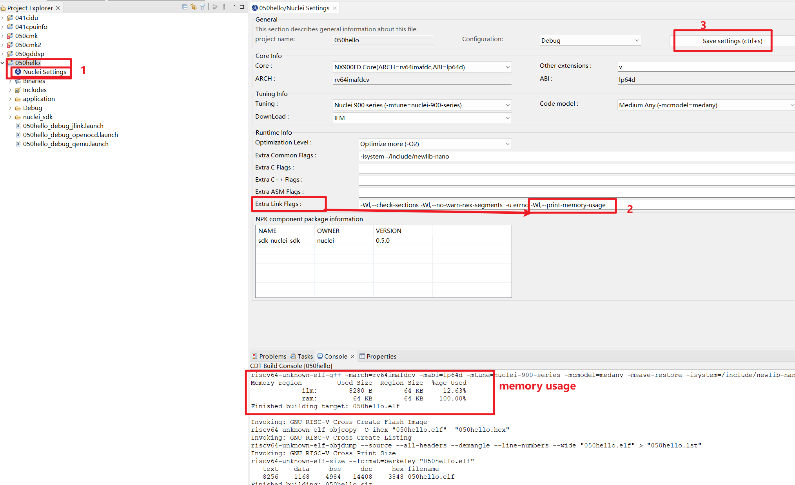

# How to print memory usage in Nuclei Studio

## 问题说明

In order to print memory usage when compile an application, you can do it like this:

Click **Nuclei Settings** in selected project, and pass extra ``-Wl,--print-memory-usage`` in **Extra Link Flags**,
and save settings, and then build this project, you will be able to see memory usage.

~~~shell
Building target: 050hello.elf
Invoking: GNU RISC-V Cross C++ Linker
... ...
Memory region         Used Size  Region Size  %age Used
             ilm:        8280 B        64 KB     12.63%
             ram:         64 KB        64 KB    100.00%
Finished building target: 050hello.elf
~~~

**Why the ram usage here is 100% used?**

For Nuclei SDK or NMSIS template linker script, the stack is placed at the bottom of ram memory, so the ram usage is 100%.

## 解决方案

Add extra link option ``-Wl,--print-memory-usage`` will solve this issue.
