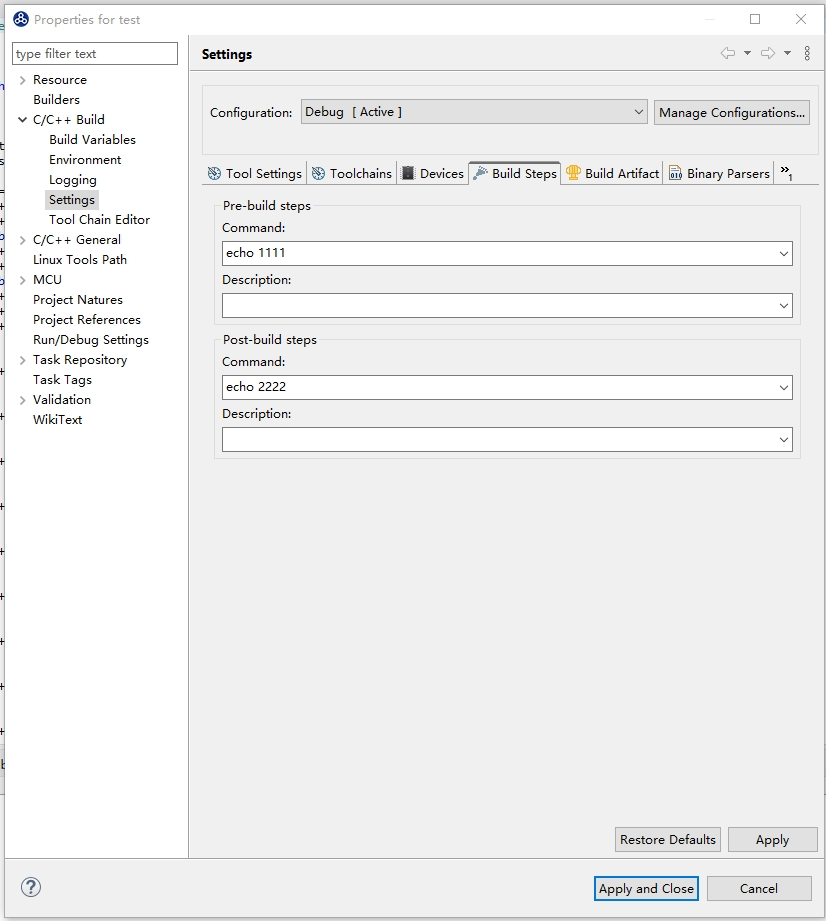
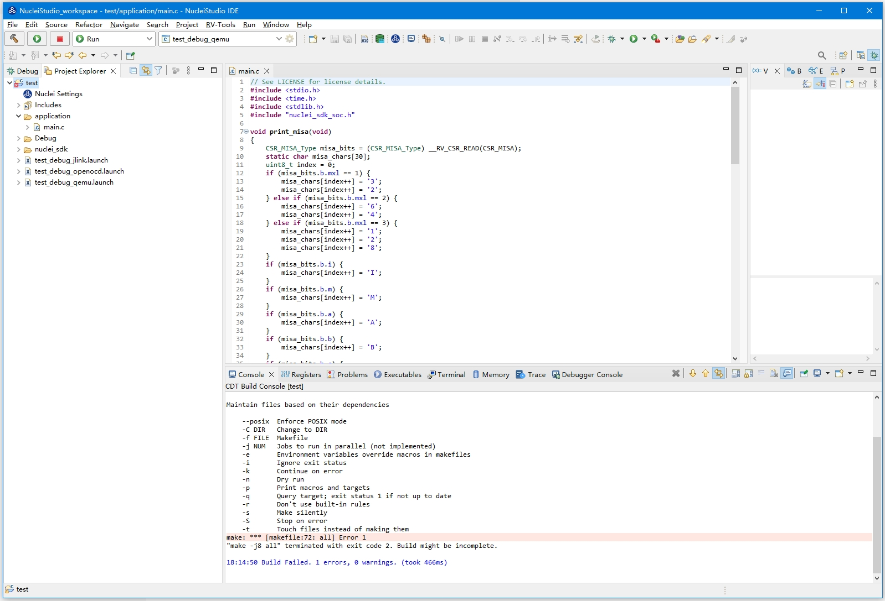

# 在编译工程时，使用了Pre-build Command/Post-build Command时报错

参见 https://github.com/eclipse-embed-cdt/eclipse-plugins/issues/597

在Nuclei Studio 2023.10版本中，如果在工程编译中需要使用到Pre-build Command/Post-build Command, 因Nuclei Studio中集成的build-tools为v4.4.0版本，而上游CDT中在处理Pre-build Command/Post-build Command的方法，在build-tools v4.4.0无法正常使用，所以会出现报错问题。




遇到这种情况，时，可以下载 https://www.nucleisys.com/upload/files/toochain/build-tools/build-tools_202002.zip ，并替换工具链中的build-tools，问题可以得到解决。

```
NucleiStudio\toolchain\build-tools
```
