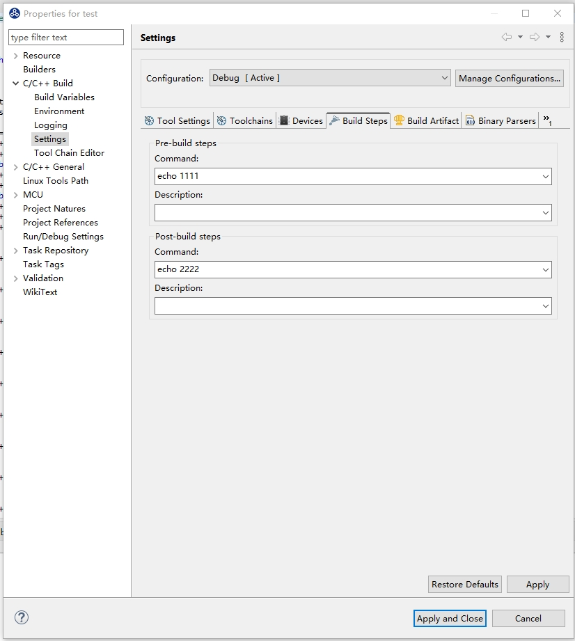
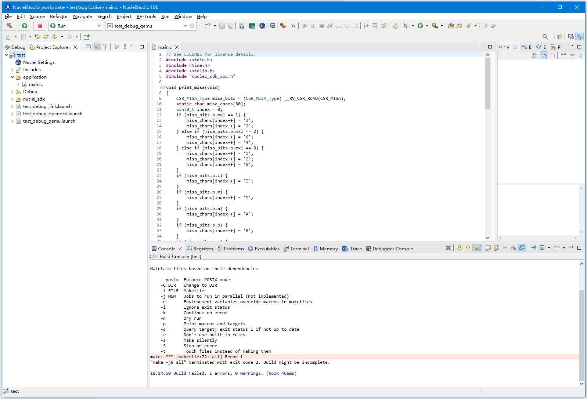

# Errors Occur When Using Pre-build Command/Post-build Command During Project Build

## Problem Description

> This issue is fixed in the corrected 2023.10 version uploaded on Nuclei Studio 2023.10.17. See [this article](7-update_nucleistudio_202310_to_fixed_version.md)

See [eclipse-embed-cdt/eclipse-plugins#597](https://github.com/eclipse-embed-cdt/eclipse-plugins/issues/597)

In Nuclei Studio 2023.10, if the Pre-build Command/Post-build Command is needed during project compilation, an error will occur because the build-tools integrated in Nuclei Studio is version v4.4.0, while the method used by the upstream CDT to handle Pre-build Command/Post-build Command does not work properly with build-tools v4.4.0.





## Solution

When encountering this situation, you can download https://www.nucleisys.com/upload/files/toochain/build-tools/build-tools_202002.zip and replace the build-tools in the toolchain to resolve the issue.

Upgrading to the latest 2024.06 or 2025.02 versions also resolves this problem.

```
NucleiStudio\toolchain\build-tools
```
