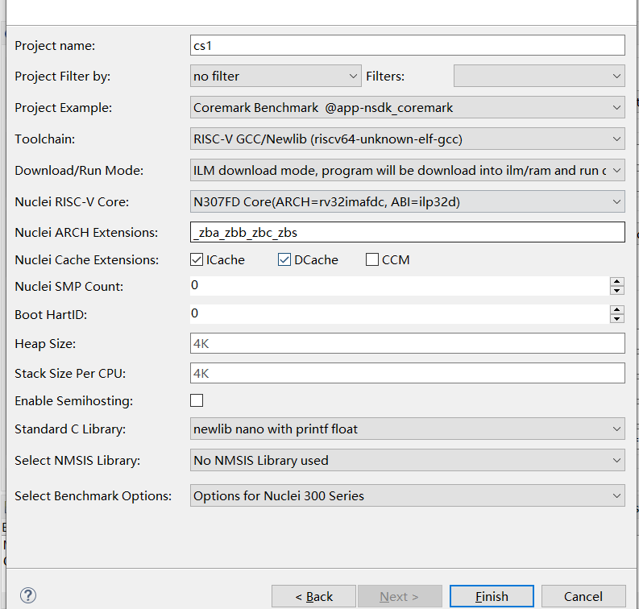

# Upgrading npk.yml to Support Nuclei Studio 2023.10

In Nuclei Studio 2023.10, an important change is the support for GCC 13. Therefore, previously released NPK Packages also need corresponding changes to better work with Nuclei Studio 2023.10. The changes include the following points.

> Note that the new version of npk.yml no longer supports the previous 2022.12 version of the IDE

## Toolchain Upgrade in npk.yml

In NPK, we define buildconfig to customize various parameters used when building a project. Nuclei Studio uses the type field to identify which toolchain is used, such as gcc, clang, etc.,
and uses type->**toolchain_name** & **cross_prefix** to identify the specific distribution within that toolchain. To upgrade an SDK to support GCC 13, comparing the following two examples makes it easy to see that
you only need to modify toolchain_name: **RISC-V GCC/Newlib** and cross_prefix: **riscv64-unknown-elf-**, so that the SDK supports selecting the GCC 13 toolchain when creating a project.

The following is the buildconfig configuration that supports gcc 10 (some parameters are hidden for the sake of example; define the actual parameters according to your situation).

```yaml
## Build Configuration
buildconfig:
  - type: gcc
    description: Nuclei GNU Toolchain
    cross_prefix: riscv-nuclei-elf- # optional
    common_flags: # flags need to be combined together across all packages
    ldflags:
    cflags:
    asmflags:
    cxxflags:
    common_defines:
    prebuild_steps: # could be override by app/bsp type
      command:
      description:
    postbuild_steps: # could be override by app/bsp type
      command:
      description:
```

The following is the **buildconfig** configuration that supports GCC 13 and Clang (some parameters are hidden for the sake of example; define the actual parameters according to your situation).

```yaml
## Build Configuration
buildconfig:
  - type: gcc
    description: Nuclei GNU Toolchain
    # When upgrading to GCC13, make the following two-line changes here
    # And for all npk.yml files, any file containing buildconfig needs to be modified, not limited to ssp/bsp types, but also including bsp/app/mwp/osp/sdk types
    toolchain_name: RISC-V GCC/Newlib
    cross_prefix: riscv64-unknown-elf- # optional
    common_flags: # flags need to be combined together across all packages
    ldflags:
    cflags:
    asmflags:
    cxxflags:
    common_defines:
    prebuild_steps: # could be override by app/bsp type
      command:
      description:
    postbuild_steps: # could be override by app/bsp type
      command:
      description:
  - type: clang
    description: Nuclei LLVM Toolchain
    toolchain_name: RISC-V Clang/Newlib
    cross_prefix: riscv64-unknown-elf- # optional
    common_flags: # flags need to be combined together across all packages
    ldflags:
    cflags:
    asmflags:
    cxxflags:
    common_defines:
    prebuild_steps: # could be override by app/bsp type
      command:
      description:
    postbuild_steps: # could be override by app/bsp type
      command:
      description:
```

## Upgrade of Extensions (ARCHEXT) Beyond the Standard IMAFDC

> The following example uses the npk.yml upgrade of evalsoc in Nuclei SDK 0.5.0, considering only GCC support. If you need to consider CLANG support, please refer to the detailed changes of evalsoc's npk.yml in the SDK

In GCC 13, there are significant changes to the use of RISC-V instruction extensions. For details, see Section 2.1.4 of the Nuclei Studio User Guide and the **ARCH_EXT** description in Nuclei SDK.

- [Nuclei Studio User Guide](https://www.nucleisys.com/upload/files/doc/nucleistudio/Nuclei_Studio_User_Guide.202310.pdf)

- [ARCH_EXT Description](https://doc.nucleisys.com/nuclei_sdk/develop/buildsystem.html#arch-ext)

When upgrading npk.yml, if the SDK uses RISC-V instruction extensions beyond the standard **IMAFDC**, such as **B/P/K/V**, the corresponding configuration also needs to be upgraded.

In NPK, RISC-V instruction extensions are passed to Nuclei Studio in the form of `-march=xxx`. When Nuclei Studio receives the relevant configuration, it stores it and applies it during compilation.
Taking the npk.yml in Nuclei SDK as an example, the value of `-march=` can be obtained through the configuration below. It is easy to see that what relates to RISC-V instruction extensions is the NPK variable **nuclei_archext**.

```yaml
## (Some parameters are hidden for the sake of example; define the actual parameters according to your situation)
## Build Configuration
buildconfig:
  - type: gcc
    description: Nuclei RISC-V GNU Toolchain #must
    cross_prefix: riscv-nuclei-elf- # optional
    common_flags: # flags need to be combined together across all packages
      # The value passed to -march here is concatenated from the two variables nuclei_core.arch and nuclei_archext
      # For example, if nuclei_core.arch is set to rv32imafdc and nuclei_archext is set to _zba_zbb_zbc_zbs_xxldspn1x,
      # then what is passed is -march=rv32imafdc_zba_zbb_zbc_zbs_xxldspn1x
      # If your march is known and fixed, you can directly specify the -march/-mabi options here, without passing them through the configuration field
      - flags: -march=${nuclei_core.arch}$(join(${nuclei_archext},'')) -mabi=${nuclei_core.abi}
    ldflags:
    cflags:
    asmflags:
    cxxflags:
    common_defines:
    prebuild_steps: # could be override by app/bsp type
      command:
      description:
    postbuild_steps: # could be override by app/bsp type
      command:
      description:
```

In the old version of the SDK, nuclei_archext was defined as a `multicheckbox` that users could select by themselves, while in the new version of the SDK, `nuclei_archext` is defined as a `text` input box,
so that users can use RISC-V instruction extensions more flexibly. If in certain projects or scenarios you want to preset some RISC-V instruction extensions, it is recommended to simply give a default value. You can refer to the sample code below.

- Syntax for supporting **Nuclei RISC-V Toolchain 2022.12**

```yaml
  ## In the old version of the SDK, nuclei_archext was defined as a multicheckbox
  ## (Some parameters are hidden for the sake of example; define the actual parameters according to your situation)
  nuclei_archext:
    default_value: []
    type: multicheckbox
    global: true
    description: Nuclei ARCH Extensions
    choices:
      - name: b
        description: Bitmanip Extension
      - name: p
        description: Packed SIMD Extension
      - name: v
        description: Vector Extension
```

- Syntax for supporting **Nuclei RISC-V Toolchain 2023.10**

```yaml
    ## In the new version of the SDK, nuclei_archext is defined as a text input box
    ## Package Configurations
    configuration:
    nuclei_archext:
        default_value: "_zba_zbb_zbc_zbs"
        type: text
        global: true
        # hints and tips are introduced in Nuclei Studio 2023.10
        # used to show tool tips and input hints
        tips: "Possible other ISA extensions, seperated by underscores, like '_zba_zbb_zbc_zbs_xxldspn1x'"
        hints: "_zba_zbb_zbc_zbs_xxldspn1x"
        description: Nuclei ARCH Extensions
```

The final display effect when creating a project is as follows




## libncrt Upgrade

libncrt has also changed somewhat compared to before. Before using libncrt in NPK, both the old and new versions of the SDK define a variable `stdclib` in **conifguration**,
whose value is a dropdown box that allows selecting different values. The difference lies in how `stdclib` is used in `common_flags` or elsewhere after it is obtained.

For some notes about `stdclib`, see [here](https://doc.nucleisys.com/nuclei_sdk/develop/buildsystem.html#stdclib)

```yaml
## Define the stdclib variable
## (Some parameters are hidden for the sake of example; define the actual parameters according to your situation)
## Package Configurations
configuration:
  stdclib:
    default_value: newlib_nano
    type: choice
    global: true
    description: Standard C Library
    choices:
      - name: newlib_full
        description: newlib with full feature
      - name: newlib_fast
        description: newlib nano with printf/scanf float
      - name: newlib_small
        description: newlib nano with printf float
      - name: newlib_nano
        description: newlib nano without printf/scanf float
      - name: libncrt_fast
        description: nuclei c runtime library, optimized for speed
      - name: libncrt_balanced
        description: nuclei c runtime library, balanced, full feature
      - name: libncrt_small
        description: nuclei c runtime library, optimized for size, full feature
      - name: libncrt_nano
        description: nuclei c runtime library, optimized for size, no float support
      - name: libncrt_pico
        description: nuclei c runtime library, optimized for size, no long/long long support
      - name: nostd
        description: no std c library will be used, and don't search the standard system directories for header files
      - name: nospec
        description: no std c library will be used, not pass any --specs options
```

In the new version of the SDK, if `--specs=libncrt_xxx.specs` is used or the linked libraries contain `-lncrt_xxx` (indicating the use of the libncrt C library),
it needs to be changed to `-lncrt_xxx -lfileops_uart -lheapops_basic`. This is also the principle for changing an old SDK into a new SDK that supports GCC 13.

The configuration below shows the npk variable stdclib in the old SDK. When the variable stdclib starts with libncrt, a `--specs=${stdclib}.specs` is defined directly.
According to the principle we mentioned above, this should be changed to setting `-l$(subst(${stdclib},lib,)) -lfileops_uart -lheapops_basic`, so the syntax in the new SDK becomes the configuration below.

```yaml
## Using the stdclib variable in the old SDK
## (Some parameters are hidden for the sake of example; define the actual parameters according to your situation)
## Build Configuration
buildconfig:
  - type: gcc
    description: Nuclei GNU Toolchain
    cross_prefix: riscv-nuclei-elf- # optional
    common_flags: # flags need to be combined together across all packages
      - flags: --specs=${stdclib}.specs
        condition: $( startswith(${stdclib}, "libncrt") )
    ldflags:
    cflags:
    asmflags:
    cxxflags:
    common_defines:
    prebuild_steps: # could be override by app/bsp type
      command:
      description:
    postbuild_steps: # could be override by app/bsp type
      command:
      description:
```

**Changed to**

```yaml
## Using the stdclib variable in the new SDK
## (Some parameters are hidden for the sake of example; define the actual parameters according to your situation)
## Build Configuration
buildconfig:
  - type: gcc
    description: Nuclei GNU Toolchain
    toolchain_name: RISC-V GCC/Newlib
    cross_prefix: riscv64-unknown-elf- # optional
    common_flags: # flags need to be combined together across all packages
      - flags: --specs=${stdclib}.specs
        condition: $( startswith(${stdclib}, "libncrt") )
    ldflags:
      - flags: -l$(subst(${stdclib},lib,)) -lheapops_basic -lfileops_uart
        condition: $( startswith(${stdclib}, "libncrt") )
    cflags:
    asmflags:
    cxxflags:
    common_defines:
    prebuild_steps: # could be override by app/bsp type
      command:
      description:
    postbuild_steps: # could be override by app/bsp type
      command:
      description:

```

## Eliminating Link Warnings

In Nuclei Studio 2023.10, the integrated GCC 13 produces warnings during use. Adding the link option `-Wl,--no-warn-rwx-segments` can hide the warnings.

For details, refer to the following configuration (some parameters are hidden for the sake of example; define the actual parameters according to your situation)

```yaml
## Build Configuration
buildconfig:
  - type: gcc
    description: Nuclei GNU Toolchain
    toolchain_name: RISC-V GCC/Newlib
    cross_prefix: riscv64-unknown-elf- # optional
    common_flags: # flags need to be combined together across all packages
    ldflags:
       # Used to eliminate warnings in the gcc13 linking stage
       - flags: -Wl,--no-warn-rwx-segments
    cflags:
    asmflags:
    cxxflags:
    common_defines:
    prebuild_steps: # could be override by app/bsp type
      command:
      description:
    postbuild_steps: # could be override by app/bsp type
      command:
      description:
```


## Detailed Changes of npk.yml in Nuclei SDK 0.5.0

For the npk.yml changes supporting Nuclei Studio + Nuclei RISC-V Toolchain 2023.10, you can refer to the changes in nuclei-sdk 0.5.0.

- Changes for gd32vf103: `git diff 0.4.1..0.5.0 SoC/gd32vf103/***npk.yml`

- Changes for evalsoc: `git diff 0.4.1..0.5.0 SoC/evalsoc/***npk.yml`

- Changes for NMSIS: `git diff 0.4.1..0.5.0 NMSIS/***npk.yml`

- Changes for application: `git diff 0.4.1..0.5.0 application/***npk.yml`

- Changes for RTOS: `git diff 0.4.1..0.5.0 OS/***npk.yml`

The commands to view the code changes are as follows

~~~shell
git clone https://github.com/Nuclei-Software/nuclei-sdk/
cd nuclei-sdk
git fetch --all 
git diff 0.4.1..0.5.0 SoC/gd32vf103/***npk.yml
git diff 0.4.1..0.5.0 SoC/evalsoc/***npk.yml
git diff 0.4.1..0.5.0 NMSIS/***npk.yml
git diff 0.4.1..0.5.0 application/***npk.yml
git diff 0.4.1..0.5.0 OS/***npk.yml
~~~
