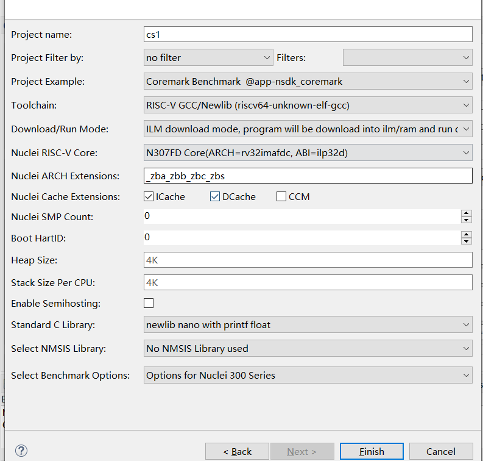

# 升级npk.yml以支持Nuclei Studio 2023.10

在Nuclei Studio 2023.10中，一个重要变更，是支持GCC 13, 所以之前发布的NPK Package也需要做对应的变更，以更好的适用于Nuclei Studio 2023.10，其中有以下几个变更点。

> 需要注意新版的npk.yml 不再支持以前 2022.12版本的IDE

## npk.yml中的工具链升级

在npk中，我们定义了buildconfig来自定义工程build时的各种参数，Nuclei Studio通过type标识使用的是那一种toolchain，如gcc、clang等，
通过 type->**toolchain_name** & **cross_prefix** 来标识使用的toolchain里面具体的那个发行版本。升级SDK以支持GCC 13，对比以下两个例子不难看出，
只需要修改 toolchain_name: **RISC-V GCC/Newlib** 和 cross_prefix: **riscv64-unknown-elf-** ，就可以使SDK支持在创建工程时，可以选择GCC 13工具链。

以下内容是支持gcc 10 的buildconfig配置（为了方便举例，隐藏了部分参数，具体参数根据实际情况定义）。

```yaml
## Build Configuration
buildconfig:
  - type: gcc
    description: Nuclei GNU Toolchain
    cross_prefix: riscv-nuclei-elf- # optional
    common_flags: # flags need to be combined together across all packages
    ldflags:
    cflags:
    asmflags:
    cxxflags:
    common_defines:
    prebuild_steps: # could be override by app/bsp type
      command:
      description:
    postbuild_steps: # could be override by app/bsp type
      command:
      description:
```

下以内容，是支持GCC 13和Clang的**buildconfig**配置（为了方便举例，隐藏了部分参数，具体参数根据实际情况定义）。

```yaml
## Build Configuration
buildconfig:
  - type: gcc
    description: Nuclei GNU Toolchain
    # 升级到 GCC13时，这里进行如下两行的改变
    # 且针对所有npk.yml的文件只要包含buildconfig的都需要进行修改，不仅仅限于ssp/bsp类型，还包括bsp/app/mwp/osp/sdk类型
    toolchain_name: RISC-V GCC/Newlib
    cross_prefix: riscv64-unknown-elf- # optional
    common_flags: # flags need to be combined together across all packages
    ldflags:
    cflags:
    asmflags:
    cxxflags:
    common_defines:
    prebuild_steps: # could be override by app/bsp type
      command:
      description:
    postbuild_steps: # could be override by app/bsp type
      command:
      description:
  - type: clang
    description: Nuclei LLVM Toolchain
    toolchain_name: RISC-V Clang/Newlib
    cross_prefix: riscv64-unknown-elf- # optional
    common_flags: # flags need to be combined together across all packages
    ldflags:
    cflags:
    asmflags:
    cxxflags:
    common_defines:
    prebuild_steps: # could be override by app/bsp type
      command:
      description:
    postbuild_steps: # could be override by app/bsp type
      command:
      description:
```

## 除标准的IMAFDC之外的扩展(ARCHEXT)的升级

> 以下示例以Nuclei SDK 0.5.0的evalsoc的npk.yml升级举例， 仅考虑GCC的支持，如果需要考虑CLANG的支持，请参见 SDK中evalsoc的npk.yml的详细变更

在GCC 13中，对RISC-V 指令扩展使用有了很大的变更，具体内容可以查看Nuclei Studio用户手册2.1.4章内容和Nuclei SDK中**ARCH_EXT**说明。

- [Nuclei Studio用户手册](https://www.nucleisys.com/upload/files/doc/nucleistudio/Nuclei_Studio_User_Guide.202310.pdf)

- [ARCH_EXT说明](https://doc.nucleisys.com/nuclei_sdk/develop/buildsystem.html#arch-ext)

升级npk.yml时，如果SDK中使用到了RISC-V 除了标准的**IMAFDC**之外指令扩展，例如**B/P/K/V**， 也需要升级对应的配置。

在NPK中，RISC-V 指令扩展以是`-march=xxx`的方式传递给Nuclei Studio，Nuclei Studio接收到相关配置，就会存储并应用到编译的过程中。
以Nuclei SDK中的npk.yml为例，通过下面这段配置我们就可以得到`-march=`的值，不难看出与RISC-V指令扩展相关的是NPK中的变量**nuclei_archext**。

```yaml
## （为了方便举例，隐藏了部分参数，具体参数根据实际情况定义）
## Build Configuration
buildconfig:
  - type: gcc
    description: Nuclei RISC-V GNU Toolchain #must
    cross_prefix: riscv-nuclei-elf- # optional
    common_flags: # flags need to be combined together across all packages
      # 这里 -march 传递的值 就是 nuclei_core.arch 和 nuclei_archext 两个变量拼接而来
      # 例如 nuclei_core.arch设置为rv32imafdc, nuclei_archext设置为 _zba_zbb_zbc_zbs_xxldspn1x,
      # 那么 传递的就是 -march=rv32imafdc_zba_zbb_zbc_zbs_xxldspn1x
      # 如果你的 march是已知和确定的，这里直接就可以给定 -march/-mabi的选项，无需通过 configuration字段来进行传递
      - flags: -march=${nuclei_core.arch}$(join(${nuclei_archext},'')) -mabi=${nuclei_core.abi}
    ldflags:
    cflags:
    asmflags:
    cxxflags:
    common_defines:
    prebuild_steps: # could be override by app/bsp type
      command:
      description:
    postbuild_steps: # could be override by app/bsp type
      command:
      description:
```

在旧版的SDK中，nuclei_archext定义的是一个`multicheckbox`，用户可以自己选择，而在新版的SDK中`nuclei_archext`定义的是一个`text`输入框，
这样用户可以更灵活的使用RISC-V 指令扩展，如果在某些工程或场景下，想要预设一些RISC-V 指令扩展，建议给一个默认值就可以了，可以参考下代的示例代码。

- 用于支持**Nuclei RISC-V Toolchain 2022.12**的写法

```yaml
  ## 旧版的SDK中，nuclei_archext定义的是一个multicheckbox
  ##（为了方便举例，隐藏了部分参数，具体参数根据实际情况定义）
  nuclei_archext:
    default_value: []
    type: multicheckbox
    global: true
    description: Nuclei ARCH Extensions
    choices:
      - name: b
        description: Bitmanip Extension
      - name: p
        description: Packed SIMD Extension
      - name: v
        description: Vector Extension
```

- 用于支持**Nuclei RISC-V Toolchain 2023.10**的写法

```yaml
    ## 新版的SDK中nuclei_archext定义的是一个text输入框
    ## Package Configurations
    configuration:
    nuclei_archext:
        default_value: "_zba_zbb_zbc_zbs"
        type: text
        global: true
        # hints and tips are introduced in Nuclei Studio 2023.10
        # used to show tool tips and input hints
        tips: "Possible other ISA extensions, seperated by underscores, like '_zba_zbb_zbc_zbs_xxldspn1x'"
        hints: "_zba_zbb_zbc_zbs_xxldspn1x"
        description: Nuclei ARCH Extensions
```

最终显示创建项目的时候显示效果如下




## libncrt的升级

libncrt较之前也有了些许变化，在NPK中使用libncrt之前，新旧版SDK中都是一样的在**conifguration**中定义了一个变量`stdclib`，
它的值是一个下拉框，可以选择不同的值。不同点是在得到`stdclib`后，在`common_flags`或者其它地方使用`stdclib`时略有不同。

关于`stdclib`的一些说明，可以参见 [这里](https://doc.nucleisys.com/nuclei_sdk/develop/buildsystem.html#stdclib)

```yaml
## 定义stdclib变量
##（为了方便举例，隐藏了部分参数，具体参数根据实际情况定义）
## Package Configurations
configuration:
  stdclib:
    default_value: newlib_nano
    type: choice
    global: true
    description: Standard C Library
    choices:
      - name: newlib_full
        description: newlib with full feature
      - name: newlib_fast
        description: newlib nano with printf/scanf float
      - name: newlib_small
        description: newlib nano with printf float
      - name: newlib_nano
        description: newlib nano without printf/scanf float
      - name: libncrt_fast
        description: nuclei c runtime library, optimized for speed
      - name: libncrt_balanced
        description: nuclei c runtime library, balanced, full feature
      - name: libncrt_small
        description: nuclei c runtime library, optimized for size, full feature
      - name: libncrt_nano
        description: nuclei c runtime library, optimized for size, no float support
      - name: libncrt_pico
        description: nuclei c runtime library, optimized for size, no long/long long support
      - name: nostd
        description: no std c library will be used, and don't search the standard system directories for header files
      - name: nospec
        description: no std c library will be used, not pass any --specs options
```

在新版的SDK中，如果使用`--specs=libncrt_xxx.specs` 或者链接库里面包含 `-lncrt_xxx` （表示采用libncrt c库），
则需变更为 `-lncrt_xxx -lfileops_uart -lheapops_basic`，这也是旧SDK变更为支持GCC 13的新SDK的原则。

下面配置为在旧版SDK中的npk变量stdclib,当变量stdclib以libncrt开头时，会直接定义一个`--specs=${stdclib}.specs`，
按照上面我们说的原则，这里应该变成设置`-l$(subst(${stdclib},lib,)) -lfileops_uart -lheapops_basic`，所以在新版SDK中的写法就变成了下面的配置方式。

```yaml
## 在旧版SDK中使用stdclib变量
##（为了方便举例，隐藏了部分参数，具体参数根据实际情况定义）
## Build Configuration
buildconfig:
  - type: gcc
    description: Nuclei GNU Toolchain
    cross_prefix: riscv-nuclei-elf- # optional
    common_flags: # flags need to be combined together across all packages
      - flags: --specs=${stdclib}.specs
        condition: $( startswith(${stdclib}, "libncrt") )
    ldflags:
    cflags:
    asmflags:
    cxxflags:
    common_defines:
    prebuild_steps: # could be override by app/bsp type
      command:
      description:
    postbuild_steps: # could be override by app/bsp type
      command:
      description:
```

**转变为**

```yaml
## 在新版SDK中使用stdclib变量
##（为了方便举例，隐藏了部分参数，具体参数根据实际情况定义）
## Build Configuration
buildconfig:
  - type: gcc
    description: Nuclei GNU Toolchain
    toolchain_name: RISC-V GCC/Newlib
    cross_prefix: riscv64-unknown-elf- # optional
    common_flags: # flags need to be combined together across all packages
      - flags: --specs=${stdclib}.specs
        condition: $( startswith(${stdclib}, "libncrt") )
    ldflags:
      - flags: -l$(subst(${stdclib},lib,)) -lheapops_basic -lfileops_uart
        condition: $( startswith(${stdclib}, "libncrt") )
    cflags:
    asmflags:
    cxxflags:
    common_defines:
    prebuild_steps: # could be override by app/bsp type
      command:
      description:
    postbuild_steps: # could be override by app/bsp type
      command:
      description:

```

## Link Warning的消除

在Nuclei Studio 2023.10中集成的GCC 13,在使用过程中会有warning，链接选项增加一个`-Wl,--no-warn-rwx-segments`可以隐藏warning。

具体可以参考以下配置（为了方便举例，隐藏了部分参数，具体参数根据实际情况定义）

```yaml
## Build Configuration
buildconfig:
  - type: gcc
    description: Nuclei GNU Toolchain
    toolchain_name: RISC-V GCC/Newlib
    cross_prefix: riscv64-unknown-elf- # optional
    common_flags: # flags need to be combined together across all packages
    ldflags:
       # 用于消除gcc13链接阶段的warning
       - flags: -Wl,--no-warn-rwx-segments
    cflags:
    asmflags:
    cxxflags:
    common_defines:
    prebuild_steps: # could be override by app/bsp type
      command:
      description:
    postbuild_steps: # could be override by app/bsp type
      command:
      description:
```


## 关于Nuclei SDK 0.5.0 npk.yml 详细变更

关于支持Nuclei Studio + Nuclei RISC-V Toolchain 2023.10的npk.yml变更，可以参考nuclei-sdk 0.5.0的变更。

- gd32vf103的变化 `git diff 0.4.1..0.5.0 SoC/gd32vf103/***npk.yml`

- evalsoc的变化: `git diff 0.4.1..0.5.0 SoC/evalsoc/***npk.yml`

- NMSIS的变化: `git diff 0.4.1..0.5.0 NMSIS/***npk.yml`

- application的变化: `git diff 0.4.1..0.5.0 application/***npk.yml`

- RTOS的变化: `git diff 0.4.1..0.5.0 OS/***npk.yml`

执行查看代码变更命令方法如下

~~~shell
git clone https://github.com/Nuclei-Software/nuclei-sdk/
cd nuclei-sdk
git fetch --all 
git diff 0.4.1..0.5.0 SoC/gd32vf103/***npk.yml
git diff 0.4.1..0.5.0 SoC/evalsoc/***npk.yml
git diff 0.4.1..0.5.0 NMSIS/***npk.yml
git diff 0.4.1..0.5.0 application/***npk.yml
git diff 0.4.1..0.5.0 OS/***npk.yml
~~~
