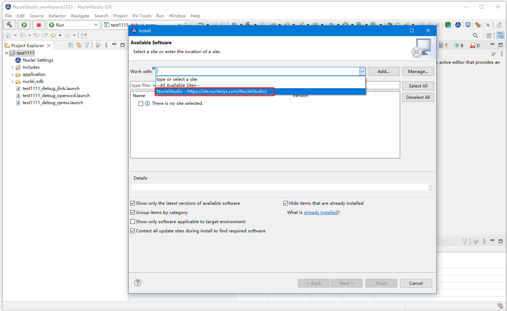
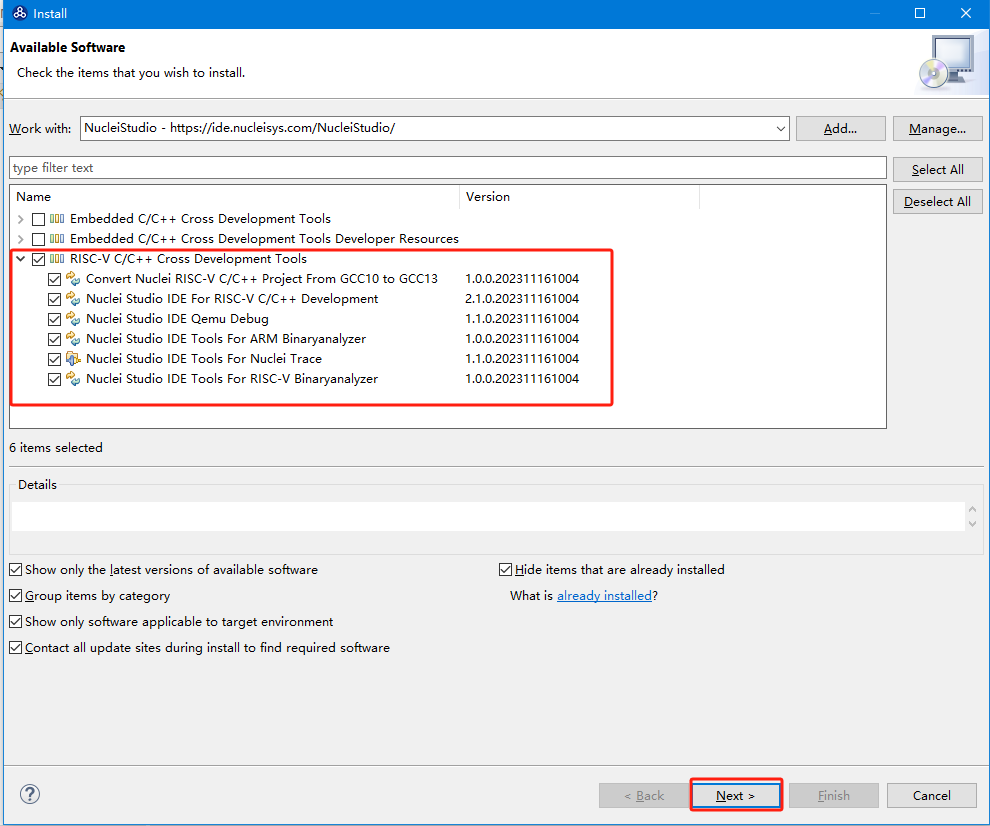
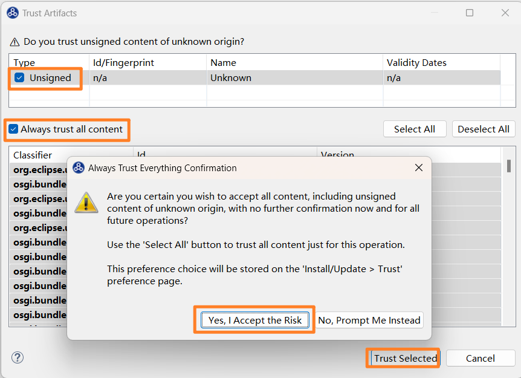

# Updating Nuclei Studio 2023.10 to the Latest Fixed Version

> The Nuclei Studio 2023.10 version uploaded on **2023.11.06** had some issues. We have fixed them and replaced the online 2023.10 version at **2023.11.17 13:30**.

## Problem Description

The **Nuclei Studio 2023.10** version released on **November 6, 2023** contained some issues that affected the user experience:

* [The busybox in build tools had a problem, causing compilation failures when make is used with pre- and post-build steps](https://github.com/Nuclei-Software/nuclei-studio/issues/6)
* [Corner cases in Nuclei Settings may fail in certain scenarios](https://github.com/Nuclei-Software/nuclei-studio/issues/3)
* [The way Nuclei Settings is opened affects how other files in the project are opened](https://github.com/Nuclei-Software/nuclei-studio/issues/11)
* [When using the V extension in QEMU, the RVV length was not passed in](https://github.com/Nuclei-Software/nuclei-studio/issues/12)
* [Fixed an issue where a project with the same name could be created when opening a brand-new workspace and creating a new project; reopening the workspace resolves this problem](https://github.com/Nuclei-Software/nuclei-studio/issues/13)

**We made the following changes to fix the issues above:**

* Modified and released Nuclei Studio Plugins 2.1.0, uploaded to the plugin update site
* Modified and released Windows build-tools 1.2, replacing the online Windows Build Tools 2023.10
* Released a new Nuclei Studio 2023.10, replacing the online Nuclei Studio 2023.10

## How to Upgrade Nuclei Studio 2023.10 to the Latest Version

If your Nuclei Studio 2023.10 was downloaded before **November 18, 2023**, the issues described above may affect your user experience.
You can either upgrade manually or download our latest release from the official website.

### Upgrading Nuclei Studio 2023.10 Downloaded Before November 18, 2023

If you downloaded Nuclei Studio 2023.10 before November 18, 2023, you can update your Nuclei Studio 2023.10 to the latest version in the following ways.

**1. Upgrade Nuclei Studio Plugins**

In the Nuclei Studio menu, go to **Help->Install New Software**, then in the Install dialog's `Work with`
field, select `NucleiStudio - https://ide.nucleisys.com/NucleiStudio/`. All plugins pending update will be listed below.

In the plugin list that pops up, select the plugins to upgrade. We select `RISC-V C/C++ Cross Development Tools`, then click Next.

During the upgrade, when Nuclei Studio asks about Trust Artifacts, proceed as shown in the figure below: select Trust Selected. Once the upgrade is complete, Nuclei Studio will restart. At this point, the Nuclei Studio Plugins upgrade is finished.

    
**2. Upgrade build-tools**

> The Linux version does not require this step; you only need to make sure the `make` tool is installed on your system.

Download `build-tools-1.2` and replace the contents of `NucleiStudio\toolchain\build-tools` in Nuclei Studio 2023.10.

For details on this part, refer to [Errors when using Pre-build Command/Post-build Command during project compilation](https://github.com/Nuclei-Software/nuclei-studio/blob/main/4-use_pre_build_or_post_build.md).

- [Download build-tools-1.2](https://www.nucleisys.com/upload/files/toochain/build-tools/win32-buildtools-1.2.zip)

With these two steps, the upgrade of Nuclei Studio 2023.10 is complete.
    
### Downloading the Latest Version from the Official Website

If you do not want to perform a manual upgrade, you can download the latest Nuclei Studio 2023.10 directly from our website.

- [Download Windows version](https://www.nucleisys.com/upload/files/nucleistudio/NucleiStudio_IDE_202310-win64.zip)
- [Download Linux version](https://www.nucleisys.com/upload/files/nucleistudio/NucleiStudio_IDE_202310-lin64.tgz)

## References

- [Nuclei Studio FAQs](https://www.rvmcu.com/nucleistudio-faq.html)
- [Continuously updated supplementary documentation for Nuclei Studio/Tools](https://github.com/Nuclei-Software/nuclei-studio)
- [Nuclei Studio Issues](https://github.com/Nuclei-Software/nuclei-studio/issues)
